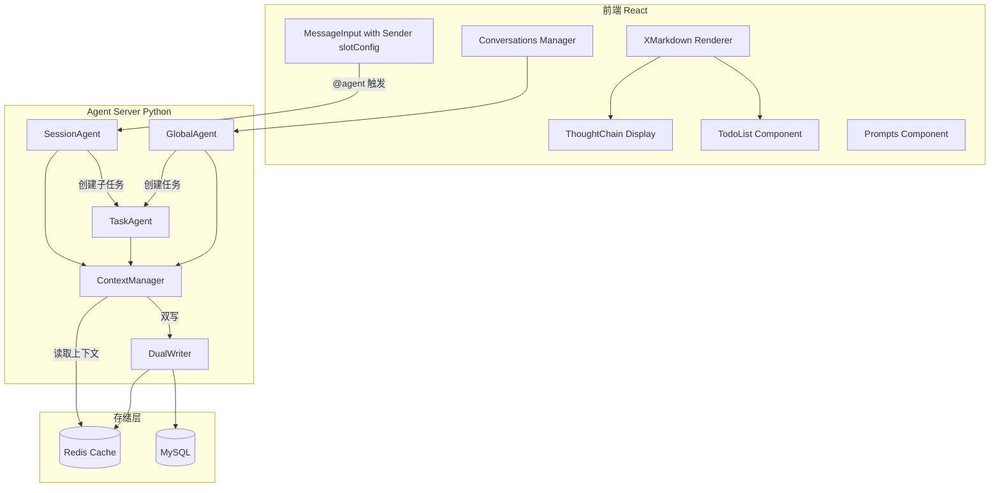
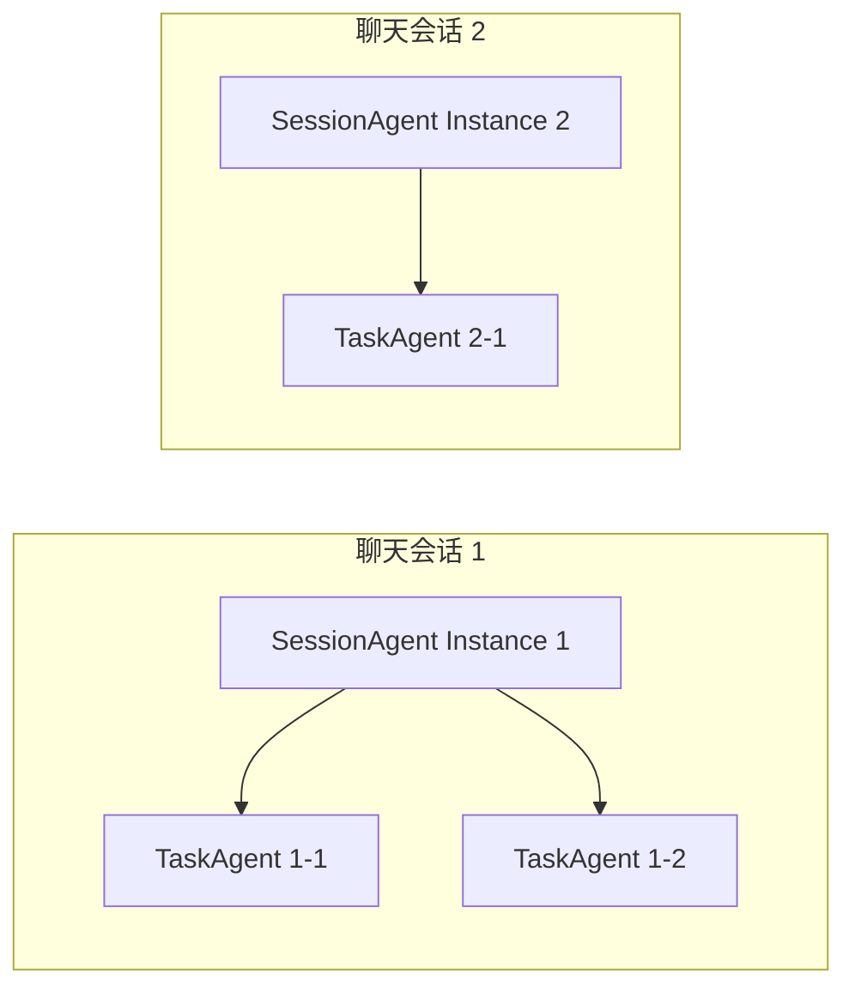

# Agent 系统全面重构计划

## 架构概览




---

## 一、数据模型设计

### 1.1 数据库表结构变更

**user 表**：添加 `is_agent` 字段

```sql
ALTER TABLE user ADD COLUMN is_agent TINYINT DEFAULT 0;
ALTER TABLE user ADD COLUMN agent_model VARCHAR(64) DEFAULT NULL;
```

**message 表**：content 字段支持 JSON 格式的 Agent 消息

Agent 消息 JSON 结构设计：

```json
{
  "type": "agent_response",
  "format": "xmarkdown",
  "content": "...",
  "metadata": {
    "model": "o4-mini",
    "thinking": "...",
    "tool_calls": [...],
    "references": [...],
    "todos": [...]
  }
}
```

**新增 agent_conversation 表**：Global Agent 会话持久化

```sql
CREATE TABLE agent_conversation (
  id BIGINT UNSIGNED PRIMARY KEY AUTO_INCREMENT,
  conversation_id VARCHAR(64) NOT NULL,
  user_id VARCHAR(64) NOT NULL,
  title VARCHAR(256) NOT NULL,
  created_at TIMESTAMP DEFAULT CURRENT_TIMESTAMP,
  updated_at TIMESTAMP DEFAULT CURRENT_TIMESTAMP ON UPDATE CURRENT_TIMESTAMP,
  UNIQUE INDEX (conversation_id),
  INDEX (user_id)
);

CREATE TABLE agent_conversation_message (
  id BIGINT UNSIGNED PRIMARY KEY AUTO_INCREMENT,
  conversation_id VARCHAR(64) NOT NULL,
  message_id VARCHAR(64) NOT NULL,
  role ENUM('user', 'assistant') NOT NULL,
  content TEXT NOT NULL,
  metadata JSON,
  created_at TIMESTAMP DEFAULT CURRENT_TIMESTAMP,
  INDEX (conversation_id),
  INDEX (message_id)
);
```

**新增 agent_task 表**：任务持久化

```sql
CREATE TABLE agent_task (
  id BIGINT UNSIGNED PRIMARY KEY AUTO_INCREMENT,
  task_id VARCHAR(64) NOT NULL,
  user_id VARCHAR(64) NOT NULL,
  chat_session_id VARCHAR(64),
  task_type ENUM('session', 'task', 'global') NOT NULL,
  status ENUM('pending', 'running', 'completed', 'failed', 'cancelled') NOT NULL,
  input TEXT,
  result TEXT,
  todos JSON,
  events JSON,
  created_at TIMESTAMP DEFAULT CURRENT_TIMESTAMP,
  updated_at TIMESTAMP DEFAULT CURRENT_TIMESTAMP ON UPDATE CURRENT_TIMESTAMP,
  UNIQUE INDEX (task_id),
  INDEX (user_id),
  INDEX (chat_session_id)
);
```

### 1.2 Redis 缓存数据结构


| 键模式                                | 数据类型 | 用途                | TTL |
| ---------------------------------- | ---- | ----------------- | --- |
| `agent:context:{chat_session_id}`  | List | 聊天上下文缓存           | 24h |
| `agent:task:{task_id}`             | Hash | 任务状态缓存            | 2h  |
| `agent:task:events:{task_id}`      | List | 任务事件历史            | 2h  |
| `agent:global:{user_id}:{conv_id}` | List | Global Agent 会话消息 | 24h |


---

## 二、后端重构

### 2.1 Session Agent 重构

**文件**: `[session_agent.py](ChatSystem-Backend/8.Agent_Server/src/chat_agents/session_agent.py)`

1. **Agent 作为实际用户**
  - 创建 `AgentUserService` 类，管理 Agent 用户的创建和查询
  - 预定义的 Agent 用户（o4-mini, gpt-oss-120b）在系统启动时自动创建到 user 表
  - Agent 发送的消息存储到 message 表，发送者为 Agent 用户 ID
2. **上下文管理（无 function_tool）**
  - 创建 `ContextManager` 类，负责读取和管理聊天上下文
  - 优先从 Redis 读取上下文，miss 时从 MySQL 加载并写入 Redis
  - 上下文格式化为 LLM 可理解的格式（包含用户信息、消息类型等）
3. **双写机制**
  - 创建 `DualWriter` 类，实现 Redis + MySQL 的双写
  - 写入策略：先写 Redis（快速响应），异步写 MySQL（持久化）
  - 失败处理：MySQL 写入失败时，加入重试队列
4. **消息格式设计**
  - Agent 输出的消息以 JSON 格式存储
  - 包含：type, format, content, metadata（thinking, tool_calls, references, todos）
  - 支持流式输出中间状态的保存

### 2.2 Task Agent 重构

**文件**: `[task_agent.py](ChatSystem-Backend/8.Agent_Server/src/chat_agents/task_agent.py)`

1. **移除直接用户交互**
  - 删除任务输入的用户交互接口
  - Task 只能由 Session Agent 或 Global Agent 创建
2. **Todo 管理增强**
  - Todo 状态实时更新到 Redis
  - 任务完成时，Todo 持久化到 MySQL
  - SSE 事件：`todo_added`, `todo_status`, `todo_progress`
3. **ThoughtChain 数据结构**
  - 每个推理步骤作为一个 ThoughtChain 节点
  - 节点类型：reasoning, tool_call, tool_output, result
  - 支持嵌套结构（tool_call 内部可包含多个步骤）

### 2.3 Global Agent 重构

**文件**: `[global_agent.py](ChatSystem-Backend/8.Agent_Server/src/chat_agents/global_agent.py)`

1. **会话管理**
  - 使用 `agent_conversation` 表存储会话列表
  - 使用 `agent_conversation_message` 表存储会话消息
  - API：`GET /agent/conversations`, `POST /agent/conversations`, `DELETE /agent/conversations/{id}`
2. **会话持久化**
  - 新消息立即写入 Redis 缓存
  - 异步写入 MySQL 持久化
  - 会话标题自动生成（基于首条消息）

### 2.4 新增模块

**ContextManager** (`src/runtime/context_manager.py`)

```python
class ContextManager:
    async def get_context(chat_session_id: str, limit: int = 50) -> List[Message]
    async def add_message(chat_session_id: str, message: Message)
    async def invalidate_cache(chat_session_id: str)
```

**DualWriter** (`src/runtime/dual_writer.py`)

```python
class DualWriter:
    async def write_message(message: AgentMessage, write_redis: bool = True, write_mysql: bool = True)
    async def write_task(task: AgentTask)
    async def write_todo(task_id: str, todo: Todo)
```

**AgentUserService** (`src/services/agent_user_service.py`)

```python
class AgentUserService:
    async def ensure_agent_users()  # 确保 Agent 用户存在
    async def get_agent_user(model_name: str) -> User
    async def list_agent_users() -> List[User]
```

---

## 三、前端重构

### 3.1 MessageInput 重构

**文件**: `[MessageInput.jsx](ChatSystem-Frontend-React/src/components/MessageInput.jsx)`

使用 Ant Design X 的 Sender 组件 + slotConfig：

```jsx
import { Sender } from '@ant-design/x';

const slotConfig = [
  { type: 'text', value: '' },
  { type: 'tag', key: 'agent', props: { label: '@', value: '' } },
  // 动态添加 agent 选择
];

<Sender
  slotConfig={slotConfig}
  onSubmit={handleSubmit}
  placeholder="输入消息，使用 @ 触发 Agent"
/>
```

### 3.2 消息渲染组件

**文件**: 新增 `AgentMessageRenderer.jsx`

使用 XMarkdown 渲染 Agent 消息：

```jsx
import XMarkdown from '@ant-design/x-markdown';
import { Mermaid, Think } from '@ant-design/x';

// 自定义组件映射
const components = {
  code: ({ className, children }) => {
    if (className === 'language-mermaid') {
      return <Mermaid>{children}</Mermaid>;
    }
    return <code>{children}</code>;
  },
  think: ThinkComponent,
  reference: ReferenceComponent,
};

<XMarkdown components={components}>
  {content}
</XMarkdown>
```

### 3.3 TaskSidebar 重构

**文件**: `[TaskSidebar.jsx](ChatSystem-Frontend-React/src/components/agent/TaskSidebar.jsx)`

1. **移除用户交互**
  - 删除 MiniChat 输入区域
  - 删除快捷操作按钮
  - 保留任务列表展示
2. **任务卡片增强**
  - 显示 ThoughtChain 概览
  - 显示 Todo 进度条

### 3.4 TaskDetailPanel 重构

**文件**: `[TaskDetailPanel.jsx](ChatSystem-Frontend-React/src/components/agent/TaskDetailPanel.jsx)`

使用 ThoughtChain 组件展示任务执行流程：

```jsx
import { ThoughtChain, Think } from '@ant-design/x';

<ThoughtChain items={thoughtChainItems} line="dashed" />
```

ThoughtChain 节点结构：

```javascript
const items = [
  {
    key: 'reasoning_1',
    title: 'Reasoning',
    description: 'Analyzing the request...',
    icon: <BulbOutlined />,
    content: <Think>{reasoningContent}</Think>
  },
  {
    key: 'tool_call_1',
    title: 'Tool Call: web_search',
    icon: <CodeOutlined />,
    status: 'success',
    content: <ToolCallDetail />
  }
];
```

### 3.5 TodoList 组件

**文件**: 新增 `TodoListPanel.jsx`

参考用户提供的 UI 原型：

```jsx
import { Progress, Checkbox } from 'antd';

<Card title="Task Progress">
  <Progress percent={progress} size="small" />
  {todos.map(todo => (
    <div key={todo.id}>
      <Checkbox checked={todo.status === 'completed'} disabled>
        <span style={{ textDecoration: todo.status === 'completed' ? 'line-through' : 'none' }}>
          {todo.content}
        </span>
      </Checkbox>
    </div>
  ))}
</Card>
```

### 3.6 GlobalAgentChat 重构

**文件**: `[GlobalAgentChat.jsx](ChatSystem-Frontend-React/src/components/agent/GlobalAgentChat.jsx)`

1. **使用 Conversations 组件**

```jsx
import { Conversations, Bubble, Sender } from '@ant-design/x';

<Flex>
  <Conversations
    items={conversations}
    activeKey={activeConversationId}
    onActiveChange={switchConversation}
  />
  <Flex vertical>
    <Bubble.List items={messages} />
    <Sender onSubmit={handleSubmit} />
  </Flex>
</Flex>
```

1. **添加 Prompts 组件**

```jsx
import { Prompts } from '@ant-design/x';

const promptItems = [
  { key: '1', icon: <BulbOutlined />, label: '总结对话', description: '帮我总结当前对话' },
  { key: '2', icon: <SearchOutlined />, label: '搜索信息', description: '在网上搜索相关信息' },
  // ...
];

<Prompts items={promptItems} onItemClick={handlePromptClick} />
```

---

## 四、会话隔离设计

### 4.1 Session Agent 隔离

- 每个聊天会话（chat_session_id）对应独立的上下文
- Redis 缓存按 chat_session_id 隔离
- Task Agent 通过 chat_session_id 关联到特定会话




### 4.2 Global Agent 隔离

- 每个用户有独立的 Global Agent 会话列表
- 会话按 user_id + conversation_id 隔离

---

## 五、SSE 事件流设计

### 5.1 事件类型扩展


| 事件类型            | 数据结构                       | 说明                    |
| --------------- | -------------------------- | --------------------- |
| `message`       | `{content, delta, format}` | 消息内容（支持 xmarkdown 格式） |
| `thinking`      | `{content, delta}`         | 思考过程                  |
| `tool_call`     | `{name, args, id}`         | 工具调用开始                |
| `tool_output`   | `{id, output, status}`     | 工具输出                  |
| `todo_added`    | `{id, content, status}`    | 添加 Todo               |
| `todo_status`   | `{id, status, progress}`   | Todo 状态更新             |
| `thought_chain` | `{items}`                  | ThoughtChain 更新       |
| `reference`     | `{id, source, content}`    | 引用来源                  |


### 5.2 事件持久化

- 所有 SSE 事件写入 Redis（`agent:task:events:{task_id}`）
- 任务完成后，事件历史持久化到 MySQL（`agent_task.events`）
- 支持断线重连和历史回放

---

## 六、提示词工程

### 6.1 Session Agent 系统提示词

```markdown
你是聊天会话中的 AI 助手。请遵循以下规则：

1. 输出格式：使用 Markdown 格式，支持代码块、列表、表格等
2. 思考过程：使用 <think>...</think> 标签包裹你的思考过程
3. 引用来源：使用 [来源名称](URL) 格式添加引用
4. Mermaid 图表：使用 ```mermaid 代码块绘制图表
5. 复杂任务：创建后台任务（create_task）来处理
```

### 6.2 引用格式示例

```markdown
根据 [OpenAI 文档](https://platform.openai.com/docs) 的说明...

<think>
我需要先搜索相关信息，然后综合分析...
</think>

以下是分析结果：
```

---

## 七、实施步骤

详见下方 Todo 列表。