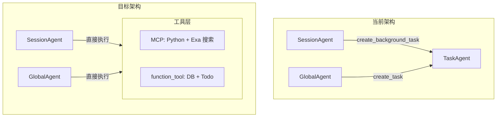

# Agent 架构简化与前端重设计计划

## 一、架构变更概览




---

## 二、后端：移除 TaskAgent

### 2.1 删除文件

- [task_agent.py](ChatSystem-Backend/8.Agent_Server/src/chat_agents/task_agent.py) - 完整删除

### 2.2 修改 chat_agents 模块

**[chat_agents/init.py](ChatSystem-Backend/8.Agent_Server/src/chat_agents/__init__.py)**

- 移除 `task_agent` 相关导入与导出

**[session_agent.py](ChatSystem-Backend/8.Agent_Server/src/chat_agents/session_agent.py)**

- 移除 `create_background_task` 工具及其实现 `_run_background_task`
- 从 `create_session_agents` 的 `tools` 列表中移除 `create_background_task`
- 添加 `add_todos`, `update_todo`, `list_todos`（来自 todo_tools）到 SessionAgent 工具集
- 更新系统提示词：删除「创建后台任务」相关描述，改为「使用 add_todos 规划步骤」

**[global_agent.py](ChatSystem-Backend/8.Agent_Server/src/chat_agents/global_agent.py)**

- 移除 `create_global_task` / `create_task` 工具及 `_pending_global_tasks` 逻辑
- 移除流结束后的 `_run_global_child_task` 调用
- 添加 `add_todos`, `update_todo`, `list_todos` 到 GlobalAgent 工具集
- 更新系统提示词：删除「创建 Task」描述

### 2.3 修改路由与任务管理

**[routers/tasks.py](ChatSystem-Backend/8.Agent_Server/src/routers/tasks.py)**

- 移除 `run_task_agent` 导入
- `execute_task` 中移除 `TaskType.TASK` 分支
- `CreateTaskRequest.task_type` 仅允许 `session` 或 `global`，默认 `session`
- 文档注释中移除 task 类型说明

**[runtime/task_worker.py](ChatSystem-Backend/8.Agent_Server/src/runtime/task_worker.py)**

- `TaskType` 枚举移除 `TASK`，仅保留 `SESSION` 和 `GLOBAL`

---

## 三、Tools 目录整理与 MCP 服务检查

**说明**：`mcp-servers` 此前为 gpt-oss 的 harmony 格式定制，但 OpenRouter 等提供商已自行解析 harmony 格式，此处无需再做解析。需检查并清理 [tools](ChatSystem-Backend/8.Agent_Server/src/tools) 目录，**只保留 MCP 实现的 python_tool 和 web_search 工具**，供任意 OpenRouter 模型调用；业务函数统一使用 `@function_tool` 装饰器。此部分为 Step 1 的一部分。

### 3.1 当前重复结构


| 路径                                | 用途                                      | 决策                             |
| --------------------------------- | --------------------------------------- | ------------------------------ |
| `tools/browser_tools.py`          | Exa API 实现，被 sdk_tools 使用               | 保留，fallback 实现                 |
| `tools/python_tools.py`           | Docker 执行，被 sdk_tools 使用                | 保留，fallback 实现                 |
| `tools/tool_impl/simple_browser/` | openai_harmony 风格，MCP browser_server 使用 | **保留**，MCP 专用                  |
| `tools/tool_impl/python_docker/`  | PythonTool 类，MCP python_server 使用       | **保留**，MCP 专用                  |
| `tools/simple_browser/`           | 桥接 tool_impl                            | **保留**，供 MCP browser_server 导入 |
| `tools/python_docker/`            | 桥接 tool_impl                            | **保留**，供 MCP python_server 导入  |


### 3.2 目标结构

```
tools/
├── __init__.py
├── db_tools.py          # @function_tool: get_chat_history, get_session_members, get_user_info, search_messages, get_user_sessions
├── todo_tools.py        # @function_tool: add_todos, update_todo, list_todos
├── sdk_tools.py         # 重构：仅保留 python_execute_with_approval（调用 python_tools），移除 web_*
├── mcp_tools.py         # MCP 配置与 get_mcp_tool
├── browser_tools.py     # 底层：BrowserTools, ExaBackend（fallback 使用）
├── python_tools.py      # 底层：PythonExecutor, execute_python（fallback 使用）
├── tool_executor.py     # 简化：移除 TOOL_DEFINITIONS 手写 JSON，get_tool_definitions 从 sdk_tools + db_tools + mcp 推导
├── tool_impl/           # 保留：MCP 专用实现
│   ├── simple_browser/  # MCP browser_server 使用
│   └── python_docker/   # MCP python_server 使用
├── simple_browser/      # 保留：桥接 tool_impl
├── python_docker/       # 保留：桥接 tool_impl
└── mcp-servers/         # MCP 服务器（browser, python）
    ├── browser_server.py  # 使用 tools.simple_browser（tool_impl）
    └── python_server.py   # 使用 tools.python_docker（tool_impl）
```

### 3.3 工具分配策略


| 工具类型                                                                                     | 实现方式           | 说明                                                      |
| ---------------------------------------------------------------------------------------- | -------------- | ------------------------------------------------------- |
| **web_search**                                                                           | MCP (browser)  | 只保留 MCP 实现，供任意 OpenRouter 模型调用；fallback 用 browser_tools |
| **python_execute**                                                                       | MCP (python)   | 只保留 MCP 实现，供任意 OpenRouter 模型调用；fallback 用 python_tools  |
| get_chat_history, get_session_members, get_user_info, search_messages, get_user_sessions | @function_tool | 业务函数，db_tools                                           |
| add_todos, update_todo, list_todos                                                       | @function_tool | 业务函数，todo_tools                                         |


### 3.4 MCP 服务检查与清理

**检查 [mcp-servers**](ChatSystem-Backend/8.Agent_Server/src/tools/mcp-servers)：

- **背景**：browser_server、python_server 此前为 gpt-oss harmony 格式定制（openai_harmony、Message/TextContent 等）。OpenRouter 等提供商已自行解析，此处无需再做 harmony 解析。
- **清理**：移除 harmony 相关解析逻辑，简化为纯文本输入/输出，供任意 OpenRouter 模型调用。
- **保留工具**：仅保留 MCP 实现的 `python_tool`（execute_python）和 `web_search`（search）。browser_server 的 open/find 可合并或精简，以 web_search 为核心。
- **清理文件**：`reference-system-prompt.py`、`build-system-prompt.py` 等 harmony 相关脚本可移除或归档。

### 3.5 具体操作

1. **移除 tool_executor 中的 TOOL_DEFINITIONS**：`get_tool_definitions()` 改为从 `sdk_tools.ALL_TOOLS`、`db_tools.DB_TOOLS`、`mcp_tools` 等动态收集工具名列表（仅用于 /agent/status 展示）
2. **保留 tool_impl**：`tool_impl/simple_browser`、`tool_impl/python_docker` 及桥接层均保留
3. **MCP 简化**：python_server、browser_server 去掉 openai_harmony 依赖，改为 plain text in/out

---

## 四、数据库表调整

### 4.1 变更脚本（在 MySQL Docker 容器中执行）

**[sql/init_agent_tables.sql](ChatSystem-Backend/8.Agent_Server/sql/init_agent_tables.sql)** 或新建 `sql/migrate_remove_task_type.sql`：

```sql
-- 1. 修改 agent_task 的 task_type 枚举，移除 'task'
ALTER TABLE agent_task MODIFY COLUMN task_type ENUM('session', 'global') NOT NULL;

-- 2. 将现有 task 类型记录迁移为 session（或根据 chat_session_id 判断）
UPDATE agent_task SET task_type = 'session' WHERE task_type = 'task';

-- 3. 若 agent_todo、agent_thought_chain 有外键约束，需确保 task_id 仍有效
-- 无需删除表，仅修改枚举
```

### 4.2 可选简化

- `agent_task_event`：若仅 TaskAgent 大量使用，可评估是否保留；SessionAgent/GlobalAgent 也会产生事件，建议保留
- `agent_todo`、`agent_thought_chain`：继续关联 `task_id`，task 现仅为 session/global 类型

---

## 五、前端重设计

### 5.1 布局目标（参考图一）

- **AGENT TASKS**：Todolist（复选框 + 进度条）
- **REASONING & EXECUTION**：思维链 + 工具调用链（流式输出）
- 触发方式：点击 Agent 消息中的「正在思考 >」在右侧弹出面板
- 面板可关闭；横向布局时（图二）可置于输入框下方

### 5.2 数据流（重中之重：流式响应）

思维链与工具调用的流式输出是核心体验。SessionAgent/GlobalAgent 必须通过 `sse_bus.publish` 实时发送：

- `reasoning_delta`：推理内容增量（流式）
- `thought_chain`、`thought_chain_update`：思维链节点创建与更新
- `tool_call`、`tool_args_delta`：工具调用开始及参数流式
- `tool_output`：工具执行结果
- `todo_added`、`todo_status`、`todo_progress`：Todo 列表变更

需在 SessionAgent/GlobalAgent 的 Hooks 中完整实现与 TaskAgent 同等的流式发布逻辑，确保前端能逐字/逐节点实时渲染。

### 5.3 前端组件变更


| 组件                                       | 变更                                                                                                                                                   |
| ---------------------------------------- | ---------------------------------------------------------------------------------------------------------------------------------------------------- |
| **TaskSidebar**                          | 移除或重命名；不再作为常驻右侧任务列表                                                                                                                                  |
| **新组件：ReasoningPanel**                   | 包含 Todolist + 思维链 + 工具调用链，参考 [ExecutionStream.js](ChatSystem-Backend/8.Agent_Server/examples/shipmentPlanning/frontend/src/ExecutionStream.js) 的列表展示 |
| **MessageBubble / AgentMessageRenderer** | 在 Assistant 消息中增加「正在思考 >」可点击区域，点击后打开 ReasoningPanel                                                                                                  |
| **布局**                                   | 面板以 Drawer/Modal 或可折叠侧栏形式展示；支持横向布局（输入框下方）                                                                                                            |


### 5.4 复用 shipmentPlanning 设计

- **ExecutionStream**：消息格式 `{ type: 'assistant'|'tool_call'|'tool_response'|'status'|'error', ... }`
- 适配器：将 `thoughtChain` 节点映射为上述格式，例如：
  - `node_type=reasoning` → `type: 'assistant'`
  - `node_type=tool_call` → `type: 'tool_call'`（含 function_name, arguments）
  - `thought_chain_update` 中 content → `type: 'tool_response'`
- 使用 Ant Design 组件替代 MUI，保持与现有前端一致

### 5.5 AgentContext 调整

- 移除 `task_created`、`task_callback`、`subscribeChildTask` 等 TaskAgent 相关逻辑
- 任务仅限 session/global，`thoughtChain`、`todos` 直接挂在对应 task 上
- 新增 `openReasoningPanel(taskId)`、`closeReasoningPanel()` 等状态

---

## 六、实施步骤

### Step 1：清除旧残留

- 删除 `task_agent.py`，移除 chat_agents、routers、runtime 中所有 TaskAgent 引用
- 移除 session_agent 的 `create_background_task`，global_agent 的 `create_global_task` 及子任务逻辑
- **检查并清理 tools 目录**：移除 tool_executor 手写 JSON schema；检查并清理 mcp-servers，去掉 harmony 格式解析（OpenRouter 自行解析），只保留 MCP 实现的 python_tool 和 web_search 供任意 OpenRouter 模型调用；业务函数用 @function_tool 装饰器；保留 tool_impl 及桥接层
- 数据库：执行 SQL 迁移，移除 `task_type='task'` 枚举值
- 前端：移除 TaskSidebar、task_created/task_callback 等 TaskAgent 相关逻辑

### Step 2：构建新的设计

**重中之重：思维链与工具调用的流式响应**

- **后端**：确保 SessionAgent、GlobalAgent 的 Hooks 完整发布 `thought_chain`、`thought_chain_update`、`tool_call`、`tool_output`、`todo_added`、`todo_status`、`todo_progress` 等 SSE 事件，支持 reasoning_delta、tool_args_delta 等流式增量
- **前端**：新建 ReasoningPanel（Todolist + 思维链 + 工具调用链），以流式列表形式实时渲染；在 Agent 消息中增加「正在思考 >」可点击入口，点击后弹出可关闭面板；支持横向布局（输入框下方）
- **接口测试**：开发过程中严格用 JS 或 curl 对接口形状进行测试，验证 SSE 事件格式、字段类型、编码等，防止前端解析失败等低级错误；积极调试直至前端能正常使用接口

---

## 七、待确认问题

1. **Todo 工具**：SessionAgent 和 GlobalAgent 是否都需要 add_todos/update_todo/list_todos？图一中的 AGENT TASKS 表明需要，计划中已加入。
2. **MCP 部署**：browser 和 python 的 MCP 服务器是否已部署？若未部署，需保留 browser_tools/python_tools 作为 fallback。

