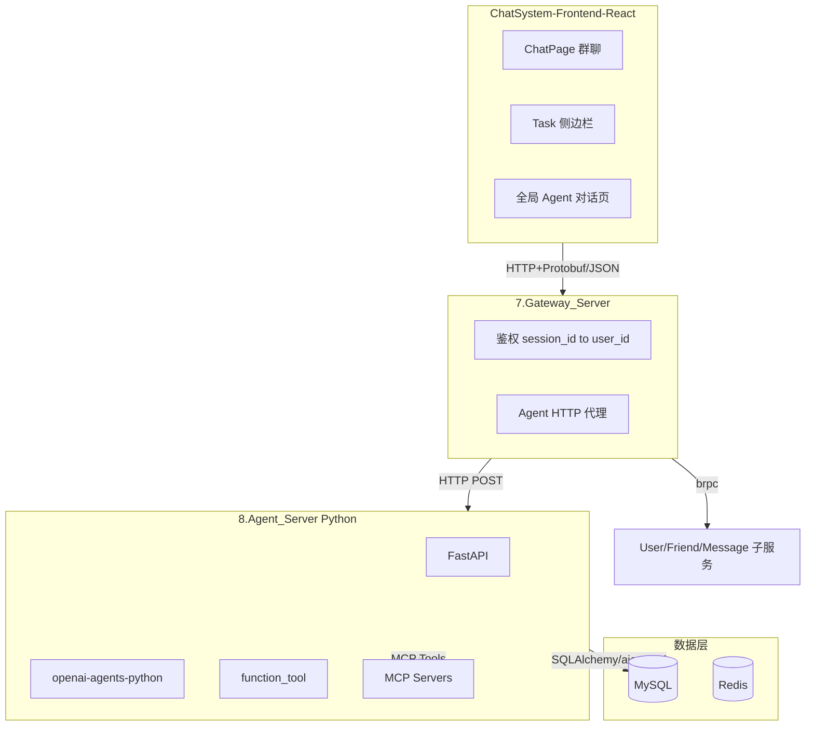

# ChatSystem Agent 体系设计方案

## 一、架构总览




**核心原则**：网关完成鉴权后，将 `user_id` 注入请求头转发给 Agent_Server；Agent 工具通过注入的 `user_id` 直接访问数据库（仅限该用户可见数据）。

---

## 二、Agent_Server 子服务设计

### 2.1 技术栈

- **框架**：FastAPI
- **Agent SDK**：[openai-agents-python-main](ChatSystem-Backend/8.Agent_Server/examples/openai-agents-python-main)
- **数据库**：aiomysql / SQLAlchemy 异步，直连 MySQL（与 C++ 服务共享 `chen_im` 库）
- **通信**：网关通过 HTTP 调用 Agent_Server（JSON 请求体，便于兼容）

### 2.2 目录结构建议

```
ChatSystem-Backend/8.Agent_Server/
├── main.py                 # FastAPI 入口
├── config.py               # 配置（DB、OpenAI、MCP URL）
├── auth.py                 # 从 X-User-Id 等 Header 解析身份
├── agents/
│   ├── session_agent.py    # 群聊 Task Agent（绑定 chat_session_id）
│   ├── global_agent.py    # 全局 Agent（绑定 user_id）
│   └── tools/
│       ├── chat_tools.py   # 会话消息、总结、搜索
│       ├── todo_tools.py   # add_todo, set_todo_status（参考 5_todos.py）
│       └── mcp_bridge.py   # MCP 工具桥接
├── routers/
│   ├── task.py             # POST /tasks, GET /events (SSE)
│   └── chat.py             # 全局 Agent 对话
├── models/                 # SQLAlchemy 模型（task 表等）
└── db.py                   # 数据库连接
```

### 2.3 核心 API 设计


| 接口              | 方法   | 说明                                                        |
| --------------- | ---- | --------------------------------------------------------- |
| `/agent/tasks`  | POST | 创建 Task（群聊或全局），返回 `task_id`                               |
| `/agent/events` | GET  | SSE 单路推送，事件类型：`task.created`, `task.updated`, `task.done` |
| `/agent/chat`   | POST | 全局 Agent 单轮对话（可选，若用 SSE 则合并到 tasks）                       |


**SSE 事件格式**（参考 [5_todos.py](ChatSystem-Backend/8.Agent_Server/examples/12-agentic-tool-calling/5_todos.py)）：

```
event: task.created
data: {"task": {"id": "xxx"}}

event: task.updated
data: {"task_id": "xxx", "event": {"type": "todo.added", "todo": {...}}}
data: {"task_id": "xxx", "event": <raw_response_event>}
data: {"task_id": "xxx", "status": "done"}
```

### 2.4 工具函数设计（function_tool + RunContextWrapper）

**群聊 Task 上下文**（`RunContextWrapper[TaskContext]`）：

- `chat_session_id`, `user_id`, `task_id`, `todos`

**全局 Agent 上下文**：

- `user_id`, `task_id`, `todos`

**预设工具**（参考 [server_agents.py](ChatSystem-Backend/8.Agent_Server/examples/12-agentic-tool-calling/server_agents.py)）：


| 工具名                            | 作用                        | 数据来源                                  |
| ------------------------------ | ------------------------- | ------------------------------------- |
| `get_session_messages`         | 获取某会话消息列表                 | MySQL message 表                       |
| `get_user_sessions`            | 获取用户所有会话                  | chat_session + chat_session_member    |
| `summarize_messages`           | 对消息做摘要（内部调用 LLM）          | 传入 message 列表                         |
| `web_search`                   | 上网搜索核实内容                  | MCP 或 requests                        |
| `add_todo` / `set_todo_status` | 实时更新 Task 进度              | RunContextWrapper.todos + SSE publish |
| `create_task`                  | 创建子 Task（Deep Research 等） | 内部调用 POST /tasks                      |


### 2.5 MCP 集成

- 使用 `MCPServerStreamableHttp` 或 `MCPServerSse` 连接 MCP 服务
- 可选：自建 MCP Server 暴露 `get_session_messages` 等，供 Agent 通过 MCP 调用
- 建议：优先用 `function_tool` 直连 DB，MCP 用于 web_search、filesystem 等外部能力

---

## 三、网关集成

### 3.1 新增 Agent 路由

在 [gateway_server.hpp](ChatSystem-Backend/7.Gateway_Server/source/gateway_server.hpp) 中增加 HTTP 代理：

- 路径：`/service/agent/*`（如 `/service/agent/tasks`, `/service/agent/events`）
- 鉴权：从请求体或 Header 解析 `session_id`，调用 `_redis_session->get_uid(ssid)` 获取 `user_id`
- 转发：HTTP POST/GET 到 Agent_Server，附加 Header `X-User-Id: {user_id}`，`X-Session-Id: {session_id}`

### 3.2 请求体透传

- 若前端用 JSON：网关解析 JSON，校验 `session_id`，注入 `user_id` 后转发
- 若保持 Protobuf：需为 Agent 单独定义 JSON 接口，与现有 Protobuf 并存

**建议**：Agent 相关接口统一用 JSON，网关对 `/service/agent/*` 做特殊处理（解析 JSON 鉴权后转发）。

---

## 四、数据库扩展

### 4.1 新增 `task` 表

```sql
CREATE TABLE `task` (
  `id` BIGINT UNSIGNED NOT NULL PRIMARY KEY AUTO_INCREMENT,
  `task_id` varchar(64) NOT NULL,
  `user_id` varchar(64) NOT NULL,
  `chat_session_id` varchar(64) NULL,           -- 群聊 Task 非空，全局 Task 为空
  `task_type` varchar(32) NOT NULL,              -- preset_summary, preset_search, custom, deep_research
  `status` varchar(16) NOT NULL DEFAULT 'running', -- running, done, failed
  `create_time` TIMESTAMP DEFAULT CURRENT_TIMESTAMP,
  UNIQUE KEY `task_id_i` (`task_id`),
  INDEX `user_id_i` (`user_id`),
  INDEX `chat_session_id_i` (`chat_session_id`)
) ENGINE=InnoDB;
```

### 4.2 扩展 `message` 表与 proto

在 [message.sql](ChatSystem-Backend/SQL_Code/message.sql) 中新增消息类型：

```sql
-- message_type 扩展：AGENT_STREAM = 4
-- STRING=0, IMAGE=1, FILE=2, SPEECH=3, AGENT_STREAM=4
```

在 [base.proto](ChatSystem-Backend/APIs/base.proto) 中：

```protobuf
enum MessageType {
  STRING = 0;
  IMAGE = 1;
  FILE = 2;
  SPEECH = 3;
  AGENT_STREAM = 4;  // Agent 流式消息
}

message AgentStreamMessageInfo {
  string task_id = 1;
  string content = 2;        // 最终完整 markdown
  string stream_state = 3;  // streaming | done
  repeated AgentTodoItem todos = 4;
}
message AgentTodoItem {
  string id = 1;
  string text = 2;
  string status = 3;  // idle, running, done
}
```

**存储策略**：

- 流式过程中：可先写一条 `AGENT_STREAM`，`content` 增量追加或存 JSON 数组
- 完成后：更新 `content` 为完整 markdown，`stream_state=done`

---

## 五、前端设计

### 5.1 侧边栏与路由

- 在 [Sidebar.jsx](ChatSystem-Frontend-React/src/components/Sidebar.jsx) 增加 Tab：`tasks`（或 `agent`）
- 点击后展示 **Task 面板**（右侧或主区域）：
  - 当前会话的预设 Task 按钮（总结、搜索核实、关键词解惑）
  - 当前会话的 Task 列表（进行中/已完成）
  - 入口：进入「全局 Agent 对话」页

### 5.2 预设 Task 与触发

- **预设 Task**：总结全文、对选中消息上网搜索、关键词解惑
- **触发方式**：
  1. 用户点击侧边栏预设按钮 → 调用 `POST /service/agent/tasks`，传入 `chat_session_id`、`task_type`、`selected_message_ids`（可选）
  2. 群内 Agent Robot：通过 `@Agent 总结一下` 等指令，由消息路由识别后创建 Task

### 5.3 全局 Agent 对话页

- 新页面：`/agent` 或集成在 ChatPage 的 `tasks` Tab 下
- 功能：与 Agent 对话、创建自定义 Task、Deep Research
- 工具可见：用户所有会话、消息（通过 `get_user_sessions`、`get_session_messages`）

### 5.4 SSE 消费与 UI

- 使用 `EventSource` 或 `fetch` + ReadableStream 订阅 `/service/agent/events`
- 根据 `task_id` 将事件分发到对应 Task 组件
- 事件类型：
  - `raw_response_event` → 流式文本，用 Markdown 渲染
  - `todo.added` / `todo.status` → 更新 Todo 列表
  - `status: done` → 标记完成

### 5.5 Markdown 与组件库

- 安装：`npm install @ant-design/x @ant-design/x-markdown --save`
- 使用 [Ant Design X Markdown](https://x.ant.design/x-markdowns/components-sources-cn)：
  - `Think`：模型思考过程
  - `Sources`：工具调用来源
  - `CodeHighlighter`、`Mermaid`、`DataChart` 等
- 与现有 [MessageArea.jsx](ChatSystem-Frontend-React/src/components/MessageArea.jsx) 兼容：对 `message_type === 4` 使用 XMarkdown 渲染，保留图片、文件等原有展示

### 5.6 群聊内 Agent 消息展示

- Agent 回复作为一条「Agent 消息」插入消息列表
- `sender` 为系统/Agent 虚拟用户
- `message_type=4` 时，用 XMarkdown 渲染 `content`，支持流式更新（WebSocket 或 SSE 推送增量）

---

## 六、Context Engineering

### 6.1 用户对话上下文 → Agent

- **群聊 Task**：将 `chat_session_id` 下最近 N 条消息转为 `items` 传入 `Runner.run_streamed`
- **选中消息**：`selected_message_ids` 过滤后只传入选中消息
- **全局 Agent**：可选传入用户最近会话摘要或全部会话列表

### 6.2 消息格式（OpenAI Items）

```python
items = [
    {"role": "user", "content": [{"type": "text", "text": "请总结以上聊天内容"}]},
    # 或包含多轮历史
]
```

### 6.3 流式消息持久化

- 方案 A：流式结束后写一条 `AGENT_STREAM` 消息
- 方案 B：流式过程中写临时记录，结束后合并为一条
- 推荐：流式仅推 SSE，结束后通过 `new_message` 接口写入一条完整 Agent 消息，便于历史回放

---

## 七、实施步骤建议

1. **Phase 1 - Agent_Server 基础**
  - 搭建 FastAPI 项目，集成 openai-agents-python
  - 实现 `POST /tasks`、`GET /events`（SSE），参考 5_todos 的队列与 worker
  - 实现 `add_todo`、`set_todo_status` 工具
2. **Phase 2 - 网关代理与鉴权**
  - 网关增加 `/service/agent/*` 路由，鉴权后转发并注入 `X-User-Id`
  - 前端通过现有 `sessionId` 调用 Agent 接口
3. **Phase 3 - 聊天工具与 DB**
  - 实现 `get_session_messages`、`get_user_sessions` 等工具，直连 MySQL
  - 创建 `task` 表，Task 与 DB 持久化
4. **Phase 4 - 前端 Task 面板**
  - 侧边栏 Task Tab，预设 Task 按钮
  - SSE 订阅与 Task 列表/详情展示
  - 集成 @ant-design/x-markdown
5. **Phase 5 - 消息类型扩展**
  - 扩展 `message_type`、proto、message 表
  - Agent 消息写入与 MessageArea 渲染兼容
6. **Phase 6 - 全局 Agent 与 MCP**
  - 全局 Agent 对话页
  - MCP 集成（web_search 等）
  - Deep Research 长程 Task

---

## 八、关键文件索引


| 模块       | 文件                                                                                                                                                                                                   |
| -------- | ---------------------------------------------------------------------------------------------------------------------------------------------------------------------------------------------------- |
| Agent 示例 | [5_todos.py](ChatSystem-Backend/8.Agent_Server/examples/12-agentic-tool-calling/5_todos.py), [server_agents.py](ChatSystem-Backend/8.Agent_Server/examples/12-agentic-tool-calling/server_agents.py) |
| MCP 示例   | [manager_example/app.py](ChatSystem-Backend/8.Agent_Server/examples/openai-agents-python-main/examples/mcp/manager_example/app.py)                                                                   |
| SSE 工具   | [utils.py encode_sse](ChatSystem-Backend/8.Agent_Server/examples/12-agentic-tool-calling/utils.py)                                                                                                   |
| 网关鉴权     | [gateway_server.hpp](ChatSystem-Backend/7.Gateway_Server/source/gateway_server.hpp)                                                                                                                  |
| 消息表      | [message.sql](ChatSystem-Backend/SQL_Code/message.sql), [base.proto](ChatSystem-Backend/APIs/base.proto)                                                                                             |
| 前端消息     | [MessageArea.jsx](ChatSystem-Frontend-React/src/components/MessageArea.jsx), [Sidebar.jsx](ChatSystem-Frontend-React/src/components/Sidebar.jsx)                                                     |


