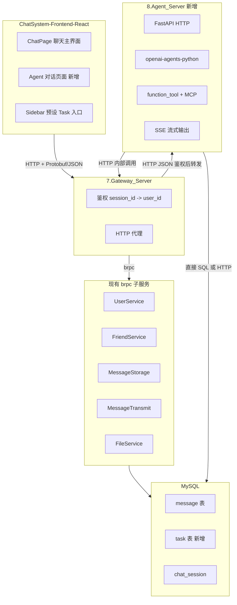

# ChatSystem Agent 体系实施计划

## 一、架构总览




**核心原则**：网关完成鉴权后，将 Agent 相关请求以 HTTP/JSON 转发至 Agent_Server；Agent_Server 通过 HTTP 调用网关暴露的接口（或内部服务）访问聊天数据，保证权限一致性。

---

## 二、数据层设计

### 2.1 消息类型扩展

在 [message.sql](ChatSystem-Backend/SQL_Code/message.sql) 和 [base.proto](ChatSystem-Backend/APIs/base.proto) 中新增：


| 类型               | 值   | 说明                                   |
| ---------------- | --- | ------------------------------------ |
| STRING           | 0   | 现有                                   |
| IMAGE            | 1   | 现有                                   |
| FILE             | 2   | 现有                                   |
| SPEECH           | 3   | 现有                                   |
| **AGENT_STREAM** | 4   | 新增：Agent 流式消息，支持 Markdown、工具调用链、思考过程 |


**AGENT_STREAM 消息的 content 结构（JSON）**：

```json
{
  "task_id": "xxx",
  "streaming": true,
  "chunks": [],           // 流式累积的文本
  "tool_calls": [],       // 工具调用记录
  "sources": [],          // 来源引用（@ant-design/x Sources）
  "think_summary": "",    // 思考过程摘要
  "mermaid": ""           // 可选 Mermaid 图表
}
```

- 流式过程中：可先插入一条 `content` 为空的 AGENT_STREAM 消息，通过 SSE 推送增量，前端实时渲染
- 流式结束后：将完整 JSON 写回 `content`，便于历史回放

### 2.2 Task 表（新建）

文件：`ChatSystem-Backend/SQL_Code/task.sql`

```sql
CREATE TABLE `task` (
  `id` BIGINT UNSIGNED NOT NULL PRIMARY KEY AUTO_INCREMENT,
  `task_id` varchar(64) NOT NULL,
  `chat_session_id` varchar(64) NULL,      -- 群聊 Task 有值，全局 Agent 对话为 NULL
  `user_id` varchar(64) NOT NULL,
  `task_type` varchar(32) NOT NULL,        -- preset: summarize, search, deep_research; custom: 用户自定义
  `status` varchar(16) NOT NULL,            -- running, done, failed, cancelled
  `input_summary` varchar(256) NULL,        -- 用户输入摘要
  `created_at` TIMESTAMP DEFAULT CURRENT_TIMESTAMP,
  `updated_at` TIMESTAMP NULL
);
CREATE UNIQUE INDEX `task_id_i` ON `task` (`task_id`);
CREATE INDEX `chat_session_id_i` ON `task` (`chat_session_id`);
CREATE INDEX `user_id_i` ON `task` (`user_id`);
```

---

## 三、Agent_Server 服务设计

### 3.1 技术栈与目录

- **框架**：FastAPI
- **Agent SDK**：openai-agents-python（[8.Agent_Server/examples/openai-agents-python-main](ChatSystem-Backend/8.Agent_Server/examples/openai-agents-python-main)）
- **参考实现**：[12-agentic-tool-calling](ChatSystem-Backend/8.Agent_Server/examples/12-agentic-tool-calling)（SSE、RunContextWrapper、todo 工具）

建议目录结构：

```
ChatSystem-Backend/8.Agent_Server/
├── src/
│   ├── main.py              # FastAPI 入口
│   ├── agents/
│   │   ├── session_agent.py  # 群聊 Task Agent（绑定 chat_session_id）
│   │   └── global_agent.py  # 全局 Agent 对话
│   ├── tools/
│   │   ├── chat_tools.py     # 读消息、总结、搜索等
│   │   ├── todo_tools.py     # add_todo, set_todo_status（参考 5_todos.py）
│   │   └── mcp_bridge.py     # MCP 工具封装
│   ├── sse/
│   │   └── event_bus.py      # 全局 SSE 事件队列
│   └── gateway_client.py    # 调用网关 HTTP 接口（带 session_id）
├── requirements.txt
└── Dockerfile
```

### 3.2 工具函数设计（function_tool）

**群聊 Task 工具**（需 `RunContextWrapper[TaskContext]`，含 `chat_session_id`, `user_id`）：


| 工具名                            | 说明           | 实现方式                                                                                           |
| ------------------------------ | ------------ | ---------------------------------------------------------------------------------------------- |
| `read_session_messages`        | 读取当前会话消息     | 调用网关 `/service/message_storage/get_history`                                                    |
| `summarize_chat`               | 总结聊天内容       | 基于 read 结果 + LLM                                                                               |
| `search_web`                   | 上网搜索核实       | MCP 或 function_tool 调用搜索 API                                                                   |
| `add_todo` / `set_todo_status` | 实时更新 Task 进度 | 参考 [5_todos.py](ChatSystem-Backend/8.Agent_Server/examples/12-agentic-tool-calling/5_todos.py) |


**全局 Agent 工具**（需 `user_id`，可跨会话）：


| 工具名                     | 说明                          |
| ----------------------- | --------------------------- |
| `list_user_sessions`    | 列出用户所有会话                    |
| `read_session_messages` | 读取指定 session_id 的消息         |
| `create_task`           | 创建自定义 Task（如 deep research） |


**鉴权传递**：网关转发请求时在 Header 中携带 `X-Session-Id`、`X-User-Id`，Agent_Server 调用网关时回传，确保数据访问受控。

### 3.3 MCP 集成

- 使用 `MCPServerStdio` 或 `MCPServerSse` 连接 MCP 服务（如搜索、文件系统）
- 将 MCP 工具通过 `agent.mcp_servers` 或 `HostedMCPTool` 注册到 Agent
- 参考：[openai-agents-python/docs/zh/mcp.md](ChatSystem-Backend/8.Agent_Server/examples/openai-agents-python-main/docs/zh/mcp.md)

### 3.4 SSE 接口设计

**创建 Task（群聊）**：

```
POST /api/agent/tasks/session
Body: { "chat_session_id", "task_type", "input" }
Response: { "task_id" }
```

**创建 Task（全局 Agent）**：

```
POST /api/agent/tasks/global
Body: { "input", "previous_response_id?" }
Response: { "task_id" }
```

**SSE 订阅**：

```
GET /api/agent/events?task_id=xxx
Event: task.created | task.updated | task.done
Data: { task_id, event: { type, ... } }
```

- `task.updated` 的 `event` 可包含：`raw_response_event`（流式 token）、`todo.added`、`todo.status` 等
- 参考 [5_todos.py](ChatSystem-Backend/8.Agent_Server/examples/12-agentic-tool-calling/5_todos.py) 的 `encode_sse` 与 `publish`

---

## 四、网关扩展

### 4.1 新增路由

在 [gateway_server.hpp](ChatSystem-Backend/7.Gateway_Server/source/gateway_server.hpp) 中增加 Agent 相关路由（需鉴权）：


| 路径                              | 说明                                 |
| ------------------------------- | ---------------------------------- |
| `POST /api/agent/tasks/session` | 创建群聊 Task，转发至 Agent_Server         |
| `POST /api/agent/tasks/global`  | 创建全局 Agent Task                    |
| `GET /api/agent/events`         | SSE 流，需支持 query `task_id` 或全局 feed |


**鉴权**：从请求 Header 或 Body 中解析 `session_id`，用 Redis 查 `user_id`，通过则转发至 Agent_Server，并在转发请求中附带 `X-User-Id`、`X-Session-Id`。

### 4.2 与 Agent_Server 通信

- 使用 httplib 或 libcurl 向 Agent_Server 发起 HTTP 请求
- 协议：JSON
- Agent_Server 地址通过配置（如 `agent_server_url`）指定

---

## 五、前端设计

### 5.1 路由与布局

- **Sidebar**：在 [Sidebar.jsx](ChatSystem-Frontend-React/src/components/Sidebar.jsx) 的 `navItems` 中新增 `{ id: 'agent', icon: 'agent', label: 'Agent' }`
- **ChatPage**：当 `activeTab === 'agent'` 时，渲染 `AgentPage` 组件（新建），替代当前的 SessionList + MessageArea
- **群聊 Task 入口**：在 [MessageArea.jsx](ChatSystem-Frontend-React/src/components/MessageArea.jsx) 头部右侧增加「Task」按钮，点击展开预设 Task 面板（总结、搜索选中消息、Deep Research 等）

### 5.2 Agent 对话页面（AgentPage）

- 类似 ChatPage 的聊天界面，但消息来自 Agent
- 支持流式渲染、工具调用链、思考过程
- 使用 `@ant-design/x` 的 XMarkdown 组件：
  - `Think`：思考过程
  - `Sources`：来源引用
  - `CodeHighlighter`：代码高亮
  - `Mermaid`：图表
- 安装：`npm install @ant-design/x --save`

### 5.3 消息渲染兼容

在 [MessageArea.jsx](ChatSystem-Frontend-React/src/components/MessageArea.jsx) 的 `renderMessageContent` 中增加：

```javascript
case 4: // AGENT_STREAM
  return <AgentStreamMessage content={content} />;
```

`AgentStreamMessage` 内部使用 XMarkdown，根据 `content` 的 `chunks`、`tool_calls`、`sources` 等渲染，并兼容图片、图表。

### 5.4 SSE 消费

- 使用 `EventSource` 或 `fetch` + ReadableStream 消费 `/api/agent/events`
- 根据 `task_id` 过滤事件，更新对应 Task 的 UI（进度、todo、流式文本）
- 参考 [12-agentic-tool-calling](ChatSystem-Backend/8.Agent_Server/examples/12-agentic-tool-calling) 前端（如有）或自实现

---

## 六、Context Engineering

### 6.1 用户对话上下文注入

- **群聊 Task**：将 `read_session_messages` 的结果格式化为 `user/assistant` 对话列表，作为 Agent 的 `input` 或附加 context
- **选中消息**：用户勾选的消息 ID 列表通过 `input` 传入，工具可只读取这些消息
- **全局 Agent**：根据用户问题，通过 `list_user_sessions` + `read_session_messages` 按需加载会话内容，控制 token 用量

### 6.2 流式消息持久化

- 流式过程中：可先写入 `message` 表，`content` 为空或部分 JSON，通过 SSE 推送到前端
- 流式结束：将完整 `content` 更新到该条消息
- 前端历史拉取：对 `message_type=4` 的 `content` 做 JSON 解析，用 XMarkdown 渲染

---

## 七、预设 Task 类型


| task_type          | 说明          | 触发方式          |
| ------------------ | ----------- | ------------- |
| `summarize`        | 总结聊天全文      | 侧边栏预设按钮       |
| `search_selected`  | 对选中消息上网搜索核实 | 选中消息后点击       |
| `keyword_research` | 对关键词进行调研    | 侧边栏预设按钮       |
| `deep_research`    | 长程深度研究      | 全局 Agent 页面创建 |
| `custom`           | 用户自定义       | 全局 Agent 页面   |


---

## 八、实施顺序建议

1. **数据层**：扩展 message_type、新增 task 表、proto 定义
2. **Agent_Server 基础**：FastAPI 服务、gateway_client、基础 session_agent + 1～2 个工具
3. **SSE 与 Task 流程**：创建 Task、worker、SSE 推送（参考 5_todos）
4. **网关扩展**：鉴权、转发 Agent 请求
5. **前端 Agent 页面**：Sidebar 入口、AgentPage、XMarkdown 集成
6. **群聊 Task 入口**：MessageArea 的 Task 面板、预设 Task 触发
7. **MCP 与更多工具**：搜索、文件等 MCP 集成
8. **AGENT_STREAM 消息**：完整流式消息的存储与历史渲染

---

## 九、关键文件清单


| 模块    | 文件                                                                                                                                                                                                                                                     |
| ----- | ------------------------------------------------------------------------------------------------------------------------------------------------------------------------------------------------------------------------------------------------------ |
| 数据    | [message.sql](ChatSystem-Backend/SQL_Code/message.sql), [init_all.sql](ChatSystem-Backend/SQL_Code/init_all.sql), task.sql（新建）, [base.proto](ChatSystem-Backend/APIs/base.proto)                                                                       |
| Agent | 8.Agent_Server/src/*（新建）                                                                                                                                                                                                                               |
| 网关    | [gateway_server.hpp](ChatSystem-Backend/7.Gateway_Server/source/gateway_server.hpp), gateway_server.cc                                                                                                                                                 |
| 前端    | [Sidebar.jsx](ChatSystem-Frontend-React/src/components/Sidebar.jsx), [ChatPage.jsx](ChatSystem-Frontend-React/src/pages/ChatPage.jsx), [MessageArea.jsx](ChatSystem-Frontend-React/src/components/MessageArea.jsx), AgentPage.jsx（新建）, agentApi.js（新建） |


