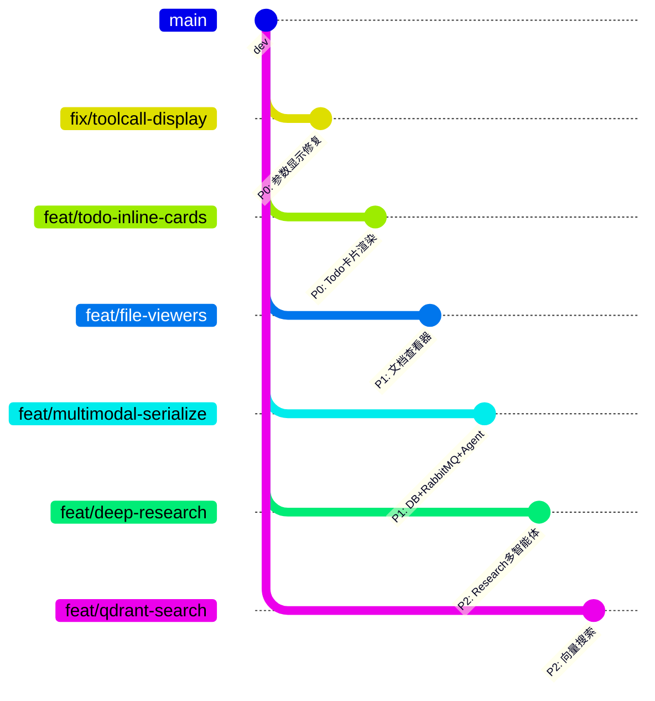
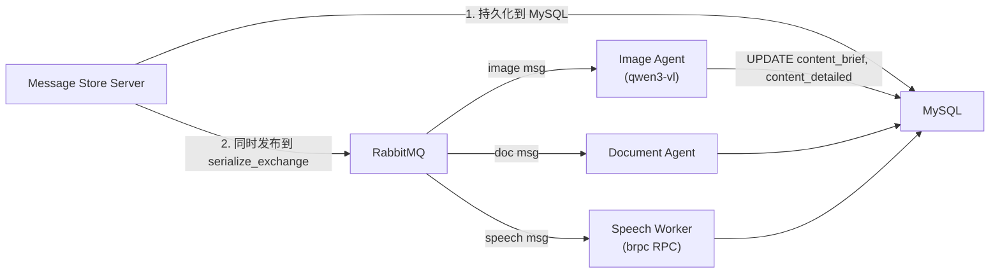
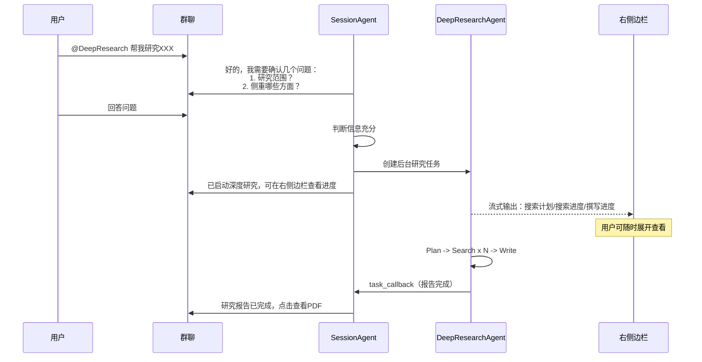

# 多模态序列化、语义搜索与多智能体架构方案（v2）

---

## 零、Git 分支策略

以 `dev` 为基础，拆分 6 条并行开发分支：




- `**fix/toolcall-display**` — P0，独立，1-2 天
  - 后端 `content_builder.py` 不动，前端 `StreamingMarkdown.jsx` 中 `ToolEventBlock` 增强参数解析和 JSON 格式化
  - 触及文件：前端 `StreamingMarkdown.jsx`
- `**feat/todo-inline-cards**` — P0，独立，1-2 天
  - 后端 todo 工具返回约定 JSON 格式，前端按格式渲染 Checklist 卡片
  - 触及文件：后端 `todo_tools.py`，前端 `StreamingMarkdown.jsx`
- `**feat/file-viewers**` — P1，独立，2-3 天
  - 前端集成 PDF / Office 文档查看/预览组件
  - 触及文件：前端新增组件 + `MessageArea.jsx` 文件消息渲染改造
- `**feat/multimodal-serialize**` — P1，最大分支，5-7 天
  - DB Schema 变更，C++ Message Store 发布 RabbitMQ，Python Agent 消费并行序列化，Context Manager 改造
  - 触及文件：ODB `message.hxx`、C++ Message Store、Agent Server 多个新增/修改文件
- `**feat/deep-research**` — P2，独立，5-7 天
  - Deep Research 多智能体后端、右侧边栏 UI、PDF 报告生成
  - 触及文件：后端 `research_agent.py` 新增，前端 `TaskSidebar` 改造
- `**feat/qdrant-search**` — P2，依赖 `feat/multimodal-serialize` 合入后再开发，3-4 天
  - Qdrant 基础设施、向量化索引、语义搜索 function_tool
  - 触及文件：`docker-compose.yaml`、Agent Server 新增 `qdrant_client.py`、`search_tools.py`

合并顺序建议：`fix/toolcall-display` -> `feat/todo-inline-cards` -> `feat/file-viewers` -> `feat/multimodal-serialize` -> `feat/qdrant-search` -> `feat/deep-research`

---

## 一、`fix/toolcall-display` — Function Call 参数显示修复

### 1.1 问题根因

`content_builder.py` 的 `start_tool_call(tool.name, "")` 以空参数开始标签，随后 `append_tool_args(delta)` 将参数 JSON 片段追加到标签的 **inner content** 而非 `arguments` 属性。最终存储形式：

```
<tool-call name="web_search" arguments=''>{"query":"xxx"}</tool-call>
```

前端正则 `arguments='([^']*)'` 匹配到空串，但 `parseXMarkdown` 已做 `args + inner` 合并（line 205），所以参数内容实际存在于 `event.arguments` 中——只是没有被格式化展示。

### 1.2 修复方案（方案 B）

**不改后端**，仅改前端 `ToolEventBlock`：

1. 对 `event.arguments` 尝试 JSON.parse + 格式化缩进显示
2. 若为 `python_execute` 工具，提取 `code` 字段渲染为语法高亮代码块
3. 其他工具的参数渲染为 key-value 表格或格式化 JSON

---

## 二、`feat/todo-inline-cards` — Todo List 内联卡片

### 2.1 设计理念

不用 SSE 实时推送，简化为**约定返回 JSON 格式**：todo 工具的 `<tool-result>` 内容返回结构化 JSON，前端识别后渲染为卡片。

### 2.2 后端约定格式

修改 `todo_tools.py` 中三个工具的返回值为 JSON：

```json
// add_todos 返回
{
  "type": "todo_list",
  "title": "Agent Todos",
  "todos": [
    {"id": "todo_xxx", "text": "搜索相关资料", "status": "idle"},
    {"id": "todo_yyy", "text": "分析搜索结果", "status": "idle"}
  ],
  "progress": {"completed": 0, "total": 2, "percent": 0}
}

// update_todo 返回
{
  "type": "todo_update",
  "title": "Agent Todos",
  "todos": [
    {"id": "todo_xxx", "text": "搜索相关资料", "status": "completed"},
    {"id": "todo_yyy", "text": "分析搜索结果", "status": "running"}
  ],
  "progress": {"completed": 1, "total": 2, "percent": 50}
}

// list_todos 返回：同 todo_list 格式
```

### 2.3 前端渲染

在 `StreamingMarkdown.jsx` 的 `ToolEventBlock` 中：

- 检测 `event.name` 为 `add_todos` / `update_todo` / `list_todos`
- 解析 `event.result.content` 为 JSON
- 渲染为参考图片中的 **Agent Todos 卡片**：标题 + 进度条 + Checklist（completed 项带蓝色勾 + 删除线，idle 为空框，running 为旋转图标）
- 支持深色/浅色主题

---

## 三、`feat/file-viewers` — 文档查看器

### 3.1 技术选型

- **PDF**：`@embedpdf/react-pdf-viewer`（轻量，PDFium WebAssembly 引擎，支持缩放/搜索/翻页）
- **Office 三件套**：`react-file-viewer`（纯前端，基于 mammoth/xlsx/pptx.js）或 `@cyntler/react-doc-viewer`
- 轻量优先，不依赖 Microsoft 在线服务

### 3.2 实现

- 新建 `src/components/FilePreview/` 目录，按文件类型分 viewer
- 改造 `MessageArea.jsx` 中 FILE 类型消息的渲染：点击文件卡片弹出预览 Modal
- 支持格式：PDF、docx、xlsx、pptx、图片（已有）
- 不支持的格式 fallback 到下载

---

## 四、`feat/multimodal-serialize` — 多模态序列化

### 4.1 Redis 缓存现状说明

`context_manager.py` **已启用** Redis 缓存，逻辑在 `get_context()` 第 121 行：先 `lrange` 尝试读 Redis，命中则直接返回。未命中时从 MySQL 加载并回填 Redis。日志看不到是因为：

- 缓存命中时打的是 `logger.debug` 级别（第 124 行）
- 首次 miss 时打的也是 `logger.debug`（第 131 行）
- 若日志级别设为 INFO，这些都不会显示

建议：在 `.env` 中临时设置 `DEBUG=true`，或将关键路径日志提升为 `logger.info`。

### 4.2 RabbitMQ 并行架构设计

**关于"为何持久化后再序列化而非并行"**——你的反馈完全正确。改为**并行**：




Message Store Server 在收到非文本消息时，**同时**执行持久化和发布序列化任务到 RabbitMQ，两者并行。序列化 Agent 完成后 UPDATE 回 MySQL。即使序列化失败，原始消息已安全持久化，后续可重试。

### 4.3 DB Schema 变更

```sql
ALTER TABLE message
  ADD COLUMN content_brief TEXT NULL COMMENT '高度概括摘要，2-3句话或目录',
  ADD COLUMN content_detailed TEXT NULL COMMENT '详细纯文本内容';
```

- **语音消息**：仅 `content_detailed`（转录全文）
- **图片消息**：`content_brief`（场景/主体描述 2-3 句）+ `content_detailed`（含 OCR 文字、细节）
- **文件消息**：`content_brief`（**高度概括的目录或摘要，2-3 句话**）+ `content_detailed`（结构化提取内容）

ODB 模型 `message.hxx` 增加对应字段，重新生成 schema。

### 4.4 语音序列化 — 正确的 RPC 调用方式

**不走 Gateway HTTP 接口**，而是 Agent Server 作为 brpc 客户端直接调用 Speech Server 的 RPC 服务：

- Python 通过 etcd 服务发现获取 Speech Server 实例地址
- 使用 `grpcio` + protobuf 编译的 Python stub 调用 `SpeechService.SpeechRecognition` RPC
- brpc 支持 gRPC 协议（`h2:grpc`），Python 侧用标准 gRPC client 即可互通
- 需要从 `speech_recognition.proto` 生成 Python 代码（`grpc_tools.protoc`）

```python
# 生成 Python stub
python -m grpc_tools.protoc -I../../APIs \
    --python_out=./src/workers/proto \
    --grpc_python_out=./src/workers/proto \
    speech_recognition.proto
```

### 4.5 图片/文档序列化 Agent

详见原方案 1.3，不变。content_brief 按场景定制：

- 图片：场景、主体、动作的 2-3 句概括
- PDF/Word：文档主题 + 核心结论的结构化摘要
- PPT：演示主题 + 各页核心要点的目录
- Excel：表格主题 + 数据维度 + 关键统计

### 4.6 Context Manager 改造

同原方案 1.4，从 MySQL 查询时增加 `content_brief`/`content_detailed`，`to_llm_format()` 优先使用它们。

---

## 五、`feat/qdrant-search` — 语义搜索（依赖 serialize 分支）

同原方案第二节，不变。在 serialize 分支合入 dev 后再开发。

---

## 六、`feat/deep-research` — Deep Research 多智能体

### 6.1 用户交互流程




### 6.2 "前台问问题 -> 后台执行 -> 前台交付"机制

1. **SessionAgent** 收到 `@DeepResearch` 触发词后，不立即创建后台任务，而是先在聊天中**向用户搜集必要信息**（研究范围、侧重点、深度要求等）
2. 当 SessionAgent 判断信息充分后，调用 `create_deep_research(topic, context)` function_tool
3. 该工具创建一个后台 `asyncio.Task`，分配 `task_id`，将流式输出定向到 SSE channel `task:{task_id}`
4. SessionAgent 在聊天中发送提示："已启动深度研究任务，可在右侧边栏查看进度"
5. 研究完成后，后台任务通过 `dual_writer` 向聊天 session 发送一条文件消息（PDF 报告）

### 6.3 右侧边栏 — 后台任务面板

改造现有 `TaskSidebar`：

- 顶部按钮显示正在运行的后台任务数量（badge）
- 点击展开面板，展示所有活跃/已完成任务的卡片
- 每张卡片可折叠/展开，内含：Todo Checklist + 流式日志
- Deep Research 卡片额外显示：搜索计划条数、已完成搜索数、撰写状态

### 6.4 后端实现

新建 `src/chat_agents/research_agent.py`，参考 `research_bot/manager.py`：

- **PlannerAgent** -> **SearchAgent x N（并行）** -> **WriterAgent**
- 通过 SSE 发布 todo/progress 事件到 `task:{task_id}` channel
- WriterAgent 使用 structured output `ReportData`（summary + markdown_report + follow_up_questions）
- 使用 `weasyprint` 将 Markdown 转 PDF，上传到 File Server

---

## 七、涉及文件汇总

`**fix/toolcall-display` 分支：**

- 前端 `StreamingMarkdown.jsx` — `ToolEventBlock` 参数格式化

`**feat/todo-inline-cards` 分支：**

- 后端 `todo_tools.py` — 返回 JSON 格式
- 前端 `StreamingMarkdown.jsx` — 新增 `TodoCardBlock` 渲染组件

`**feat/file-viewers` 分支：**

- 前端新增 `src/components/FilePreview/` — PDF/Office viewer 组件
- 前端 `MessageArea.jsx` — 文件消息点击预览

`**feat/multimodal-serialize` 分支：**

- C++ `ODB/message.hxx` + `SQL_Code/message.sql` — Schema 变更
- C++ Message Store Server — 并行发布 RabbitMQ
- Python `src/workers/serialize_worker.py` — RabbitMQ 消费者
- Python `src/chat_agents/image_agent.py` — 图片序列化
- Python `src/chat_agents/document_agent.py` — 文档序列化
- Python `src/workers/speech_worker.py` — 语音转录（gRPC 调 Speech Server）
- Python `src/runtime/context_manager.py` — 读取 brief/detailed
- Python `src/config.py` — RabbitMQ 配置
- Python `src/main.py` — 启动 worker
- `docker-compose.yaml` — 如需新增服务

`**feat/qdrant-search` 分支：**

- `docker-compose.yaml` — Qdrant 服务
- Python `src/runtime/qdrant_client.py`
- Python `src/tools/search_tools.py`
- Python `src/config.py` — Qdrant 配置

`**feat/deep-research` 分支：**

- Python `src/chat_agents/research_agent.py` — 多智能体
- Python `session_agent.py` — 增加 research tool
- 前端 `TaskSidebar.jsx` — 后台任务面板改造
- 前端可能新增 `BackgroundTaskPanel.jsx`

