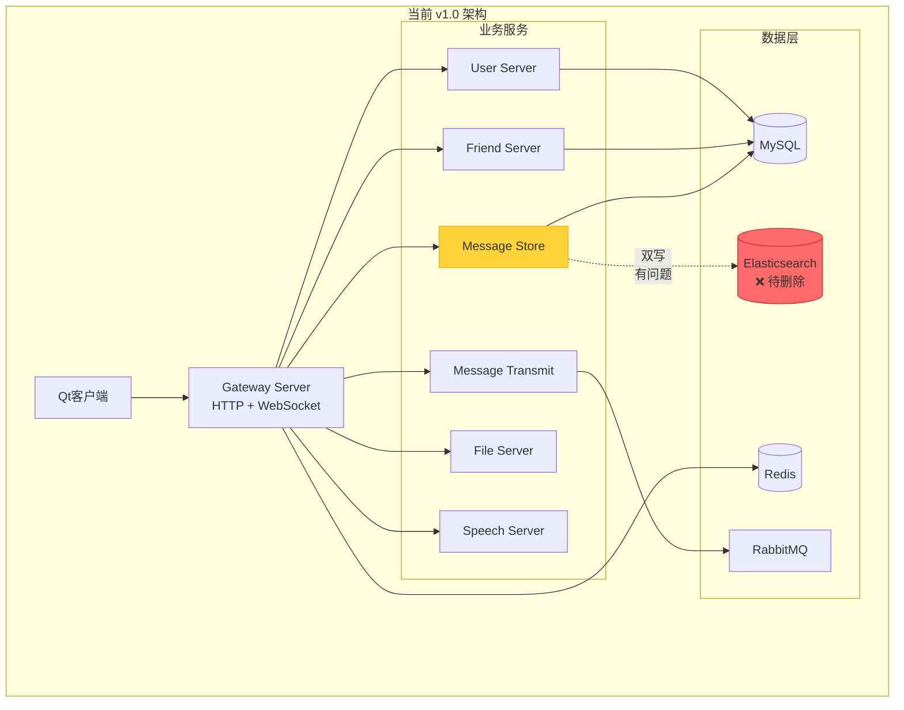
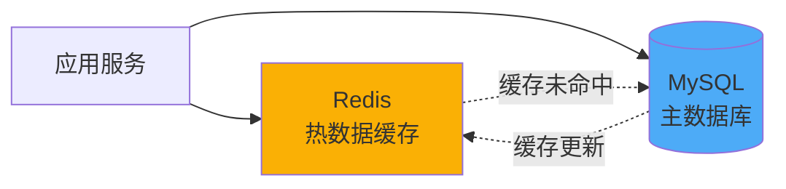
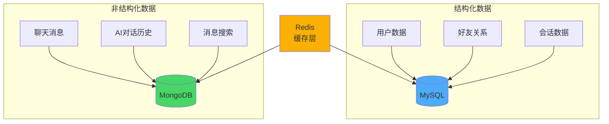
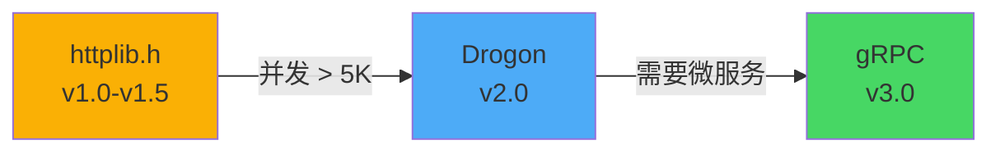
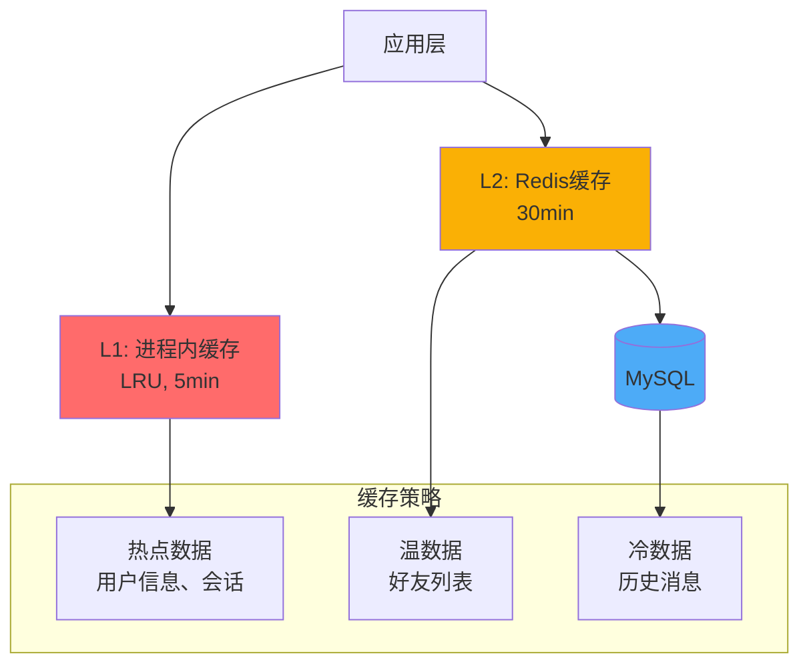
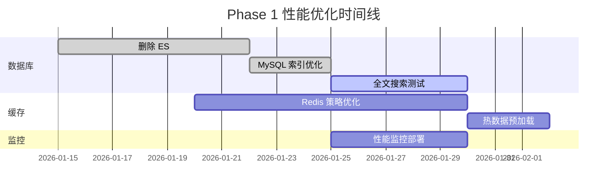
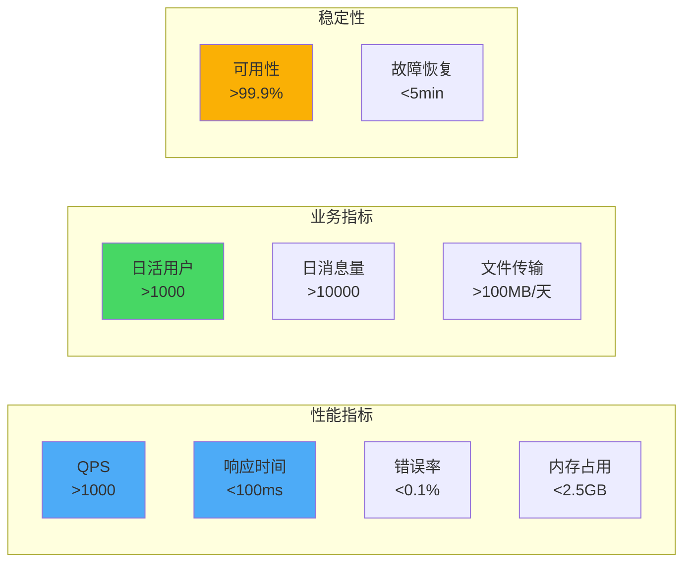

# ChatSystem 技术演进规划 (v1.0 → v2.0)

> **项目**: cpp_chatsystem  
> **当前版本**: v1.0  
> **规划周期**: 2026 Q1 - Q3  
> **作者**: 陈  
> **创建日期**: 2026-01-12

---

## 📋 执行摘要

本文档基于 ChatSystem v1.0 的技术现状，结合后续大模型对话功能需求，对项目的数据库架构、技术栈选型、性能优化等方面进行全面规划。

**核心决策**：
- ✅ **删除 Elasticsearch**，转向 MySQL + Redis 组合
- ✅ **保持 C++ 技术栈**，暂不引入多语言
- ✅ **优化双写问题**，采用单一数据源
- ✅ **为大模型功能预留扩展**
- 🔄 **保留 httplib.h**，必要时升级

---

## 🎯 项目现状分析

### 当前架构概览



### 存在的问题

#### 1. 🔴 **Elasticsearch 冗余问题**

**问题描述**：
- 2c4g 服务器运行 ES 全家桶（ES + Kibana + Logstash）资源消耗大
- JVM 内存占用至少 1-2GB
- 维护成本高
- MySQL 5.7+ 已支持全文索引

**资源占用对比**：
```
服务器配置: 2c4g
├── Elasticsearch: ~1.5GB 内存
├── MySQL: ~500MB 内存
├── Redis: ~100MB 内存
├── RabbitMQ: ~200MB 内存
├── 6个微服务: ~1GB 内存
└── 系统开销: ~500MB
总计: 接近 4GB（几乎满载）
```

#### 2. 🔴 **MySQL + ES 双写一致性问题**

**当前实现**（message_store_server.hpp:330-447）：

```cpp
void when_get_an_message(const char *body, size_t sz) {
    // 1. 解析消息
    chen_im::MessageInfo message;
    message.ParseFromArray(body, sz);
    
    // 2. 根据消息类型处理文件
    switch (message.message().message_type()) {
        case MessageType::STRING:
            content = message.message().string_message().content();
            // ❌ 问题：ES 写入失败，MySQL 未写入，数据丢失
            ret = _es_message->append_message(...);
            if (!ret) {
                LOG_ERROR("文本消息向存储引擎进行存储失败！");
                return;  // 直接返回，MySQL 未写入
            }
            break;
        // ...
    }
    
    // 3. 写入 MySQL
    // ❌ 问题：如果 MySQL 写入失败，ES 已写入，数据不一致
    ret = _mysql_message_table->insert(msg);
}
```

**存在的风险**：
- ES 写入成功，MySQL 失败 → 数据不一致
- ES 写入失败，直接返回 → 数据丢失
- 无事务保证，无回滚机制
- 重试机制缺失

#### 3. 🟡 **httplib.h 性能瓶颈**

**优点**：
- ✅ 单文件，易于集成
- ✅ 功能完整，支持 HTTP/HTTPS
- ✅ C++11，兼容性好

**缺点**：
- ⚠️ 阻塞式 IO，并发性能一般
- ⚠️ 线程池固定，扩展性有限
- ⚠️ 不支持 HTTP/2

**性能测试**（参考数据）：
```
httplib.h:     ~10K QPS
Drogon:        ~100K QPS
Nginx + uWS:   ~200K QPS
```

**结论**：对于当前规模（<1000 并发）够用，但后续可能成为瓶颈。

#### 4. 🟡 **缺乏大模型对话支持**

**计划功能**：
- 用户与 AI 助手对话
- 对话历史存储
- 上下文管理
- 多轮对话支持

**数据特点**：
- 对话消息长度不定（大模型回复可能很长）
- 需要存储 token 使用量
- 可能包含多模态数据（图片、语音）
- 需要快速检索历史对话

---

## 🎯 核心技术决策

### 决策 1：删除 Elasticsearch ✅

**理由**：
1. **资源有限**：2c4g 服务器运行 ES 过于吃力
2. **功能冗余**：MySQL 全文索引足够应对当前需求
3. **简化架构**：减少组件，降低维护成本
4. **降低复杂度**：避免双写一致性问题

**MySQL 全文索引能力评估**：

```sql
-- MySQL 5.7+ 支持 InnoDB 全文索引
CREATE TABLE tb_message (
    message_id VARCHAR(64) PRIMARY KEY,
    content TEXT,
    chat_session_id VARCHAR(64),
    sender_id VARCHAR(64),
    create_time BIGINT,
    FULLTEXT INDEX idx_content(content) WITH PARSER ngram
) ENGINE=InnoDB DEFAULT CHARSET=utf8mb4;

-- 全文搜索（支持中文分词）
SELECT * FROM tb_message 
WHERE MATCH(content) AGAINST('关键词' IN NATURAL LANGUAGE MODE);

-- 布尔搜索
SELECT * FROM tb_message 
WHERE MATCH(content) AGAINST('+必须 -排除' IN BOOLEAN MODE);
```

**性能对比**：

| 场景 | ES | MySQL 全文索引 |
|------|-----|---------------|
| 100w 条消息检索 | ~50ms | ~200ms |
| 1000w 条消息检索 | ~100ms | ~500ms |
| 资源消耗 | 1.5GB+ | 增加 ~200MB |
| 中文分词质量 | 优秀 | 良好（ngram） |
| 实时性 | 近实时（1s） | 实时 |

**结论**：对于聊天消息搜索场景（通常<100w条），MySQL 性能可接受。

### 决策 2：数据库架构优化 ✅

#### 方案对比

**方案 A：纯 MySQL + Redis**



**优点**：
- ✅ 架构简单
- ✅ 事务保证
- ✅ 技术栈统一
- ✅ 资源消耗低

**缺点**：
- ⚠️ 大模型对话数据结构不够灵活
- ⚠️ JSON 字段查询性能一般

---

**方案 B：MySQL + MongoDB 混合**



**优点**：
- ✅ 灵活的文档结构（适合 AI 对话）
- ✅ 水平扩展容易
- ✅ 全文搜索能力强
- ✅ 嵌套数据支持好

**缺点**：
- ❌ 增加技术栈复杂度
- ❌ 需要学习成本
- ❌ 数据一致性需要应用层保证

---

**方案 C：纯 MySQL + JSON 字段**

```sql
-- 使用 MySQL 8.0 JSON 功能存储灵活数据
CREATE TABLE tb_ai_conversation (
    conversation_id VARCHAR(64) PRIMARY KEY,
    user_id VARCHAR(64),
    context JSON,  -- 对话上下文
    messages JSON, -- 消息列表
    metadata JSON, -- 元数据
    create_time TIMESTAMP,
    update_time TIMESTAMP,
    INDEX idx_user (user_id)
);

-- JSON 查询示例
SELECT * FROM tb_ai_conversation 
WHERE JSON_EXTRACT(context, '$.model') = 'gpt-4'
  AND JSON_LENGTH(messages) > 10;
```

**优点**：
- ✅ 技术栈统一
- ✅ 事务保证
- ✅ JSON 字段灵活性

**缺点**：
- ⚠️ JSON 查询性能不如原生字段
- ⚠️ 索引能力有限

---

#### 🎯 **最终推荐：方案 A（纯 MySQL + Redis）**

**理由**：
1. **当前阶段最适合**：架构简单，资源充足
2. **MySQL 8.0 足够强大**：JSON 支持 + 全文索引
3. **可逐步演进**：v2.0 可考虑引入 MongoDB
4. **降低运维成本**：减少中间件

**实施策略**：
```
Phase 1（v1.0 → v1.5）：
├── 删除 Elasticsearch
├── 优化 MySQL 索引
├── 增强 Redis 缓存
└── 改进消息存储逻辑

Phase 2（v1.5 → v2.0）：
├── 引入 AI 对话功能
├── 使用 MySQL JSON 字段
└── 评估是否需要 MongoDB
```

### 决策 3：保持 httplib.h，预留升级 ✅

**当前阶段**：
- ✅ 保留 httplib.h
- ✅ 优化线程池配置
- ✅ 添加性能监控

**升级路径**（如果需要）：



**性能优化建议**：

```cpp
// 优化 httplib.h 配置
httplib::Server svr;

// 1. 增加线程池大小
svr.new_task_queue = [] {
    return new httplib::ThreadPool(16);  // 增加到 16 线程
};

// 2. 设置超时
svr.set_read_timeout(5, 0);   // 5 秒
svr.set_write_timeout(5, 0);

// 3. Keep-Alive
svr.set_keep_alive_max_count(100);
svr.set_keep_alive_timeout(30);

// 4. 限制请求大小
svr.set_payload_max_length(10 * 1024 * 1024);  // 10MB
```

### 决策 4：保持 C++ 单语言，暂不重构 ✅

**理由**：
1. **C++ 性能已足够**：瓶颈不在语言
2. **降低复杂度**：多语言带来通信开销
3. **团队熟悉度**：C++ 经验丰富
4. **维护成本**：单一技术栈易维护

**如果未来需要多语言**：

| 服务 | 语言选择 | 理由 |
|------|---------|------|
| Gateway Server | Go | 高并发连接处理 |
| File Server | Go/Rust | IO 密集型 |
| AI Service | Python | 大模型生态 |
| 其他服务 | C++ | 保持现状 |

**时间规划**：
- v1.x：专注 C++ 优化
- v2.0：评估是否需要引入 Go
- v3.0：考虑混合语言架构

---

## 🔧 技术实施方案

### 1. 删除 Elasticsearch 迁移方案

#### Phase 1：准备阶段（1周）

```sql
-- 1. 在 MySQL 中创建全文索引
ALTER TABLE tb_message 
ADD FULLTEXT INDEX idx_content(content) WITH PARSER ngram;

-- 2. 验证搜索性能
SELECT SQL_NO_CACHE * FROM tb_message 
WHERE MATCH(content) AGAINST('测试关键词' IN NATURAL LANGUAGE MODE)
LIMIT 20;

-- 3. 创建搜索统计表
CREATE TABLE tb_search_log (
    id BIGINT AUTO_INCREMENT PRIMARY KEY,
    user_id VARCHAR(64),
    keyword VARCHAR(255),
    result_count INT,
    exec_time_ms INT,
    create_time TIMESTAMP DEFAULT CURRENT_TIMESTAMP,
    INDEX idx_user (user_id),
    INDEX idx_time (create_time)
);
```

#### Phase 2：代码重构（2周）

**修改 Message Store Server**：

```cpp
// 删除 ES 客户端
// ElasticClient* _es_message;  // ❌ 删除

class MessageStoreServer {
private:
    // 只保留 MySQL
    MessageTable::ptr _mysql_message_table;
    
public:
    // 修改消息处理逻辑
    void when_get_an_message(const char *body, size_t sz) {
        chen_im::MessageInfo message;
        message.ParseFromArray(body, sz);
        
        // 提取消息内容
        std::string content;
        std::string file_id, file_name;
        int64_t file_size = 0;
        
        switch (message.message().message_type()) {
            case MessageType::STRING:
                content = message.message().string_message().content();
                break;
            case MessageType::IMAGE:
                _PutFile("", msg.image_content(), size, file_id);
                break;
            // ... 其他类型
        }
        
        // ✅ 单一数据源：只写 MySQL
        chen_im::Message msg(
            message.message_id(),
            message.chat_session_id(),
            message.sender().user_id(),
            message.message().message_type(),
            boost::posix_time::from_time_t(message.timestamp())
        );
        msg.content(content);
        msg.file_id(file_id);
        msg.file_name(file_name);
        msg.file_size(file_size);
        
        // 写入 MySQL（带重试）
        int retry = 3;
        while (retry-- > 0) {
            bool ret = _mysql_message_table->insert(msg);
            if (ret) {
                LOG_INFO("消息存储成功: {}", message.message_id());
                return;
            }
            LOG_WARN("消息存储失败，重试 {}/3", 3 - retry);
            std::this_thread::sleep_for(std::chrono::milliseconds(100));
        }
        
        LOG_ERROR("消息存储最终失败: {}", message.message_id());
        // TODO: 写入死信队列
    }
    
    // 新增：MySQL 全文搜索接口
    std::vector<chen_im::Message> search_messages(
        const std::string& chat_session_id,
        const std::string& keyword,
        int limit = 20) {
        
        std::string sql = R"(
            SELECT * FROM tb_message 
            WHERE chat_session_id = ?
              AND MATCH(content) AGAINST(? IN NATURAL LANGUAGE MODE)
            ORDER BY create_time DESC
            LIMIT ?
        )";
        
        // 执行查询
        // ... MySQL 查询逻辑
    }
};
```

#### Phase 3：灰度验证（1周）

```bash
# 1. 双写验证（临时）
# 同时写入 MySQL 和 ES，对比结果

# 2. 性能对比测试
# 测试 MySQL 全文搜索性能

# 3. 功能验证
# 确保搜索结果准确性
```

#### Phase 4：正式切换（1天）

```bash
# 1. 停止向 ES 写入
# 修改配置，删除 ES 相关代码

# 2. 关闭 ES 服务
sudo systemctl stop elasticsearch
sudo systemctl disable elasticsearch

# 3. 释放资源
# 卸载 ES，释放约 1.5GB 内存

# 4. 监控观察
# 监控 MySQL 性能，确保无问题
```

### 2. 优化 Redis 缓存策略

#### 缓存层次设计



#### 缓存实现

```cpp
// Redis 缓存管理器
class CacheManager {
private:
    redis::Redis* _redis;
    
public:
    // 用户信息缓存（30分钟）
    std::optional<UserInfo> get_user_cached(const std::string& user_id) {
        std::string key = "user:" + user_id;
        
        // 1. 尝试从 Redis 获取
        auto cached = _redis->get(key);
        if (cached) {
            UserInfo info;
            info.ParseFromString(*cached);
            return info;
        }
        
        // 2. 从 MySQL 查询
        auto info = _mysql_user_table->select(user_id);
        if (!info) return std::nullopt;
        
        // 3. 写入 Redis（30分钟过期）
        _redis->setex(key, 1800, info->SerializeAsString());
        
        return info;
    }
    
    // 最近消息缓存（使用 Redis List）
    std::vector<Message> get_recent_messages(
        const std::string& session_id, int limit = 50) {
        
        std::string key = "recent_msg:" + session_id;
        
        // 1. 从 Redis List 获取
        auto cached = _redis->lrange(key, 0, limit - 1);
        if (!cached.empty()) {
            std::vector<Message> messages;
            for (const auto& data : cached) {
                Message msg;
                msg.ParseFromString(data);
                messages.push_back(msg);
            }
            return messages;
        }
        
        // 2. 从 MySQL 查询
        auto messages = _mysql_message_table->get_recent(session_id, limit);
        
        // 3. 写入 Redis List（最近100条）
        for (const auto& msg : messages) {
            _redis->lpush(key, msg.SerializeAsString());
        }
        _redis->ltrim(key, 0, 99);  // 只保留最近100条
        _redis->expire(key, 3600);  // 1小时过期
        
        return messages;
    }
    
    // 会话在线状态（Redis Set）
    void set_online(const std::string& user_id, const std::string& session_id) {
        std::string key = "online_users";
        _redis->sadd(key, user_id);
        _redis->setex("session:" + user_id, 300, session_id);  // 5分钟心跳
    }
    
    bool is_online(const std::string& user_id) {
        return _redis->sismember("online_users", user_id);
    }
};
```

### 3. MySQL 性能优化

#### 索引优化

```sql
-- 1. 消息表索引优化
ALTER TABLE tb_message
    ADD INDEX idx_session_time (chat_session_id, create_time),  -- 查询最近消息
    ADD INDEX idx_sender (sender_id),                            -- 查询用户发送的消息
    ADD FULLTEXT INDEX idx_content (content) WITH PARSER ngram;  -- 全文搜索

-- 2. 用户表索引
ALTER TABLE tb_user
    ADD UNIQUE INDEX idx_phone (phone),                          -- 手机号登录
    ADD INDEX idx_nickname (nickname);                           -- 用户名搜索

-- 3. 好友关系表索引
ALTER TABLE tb_friend
    ADD INDEX idx_user1_user2 (user_id1, user_id2),             -- 好友查询
    ADD INDEX idx_user2_user1 (user_id2, user_id1);             -- 反向查询

-- 4. 会话表索引
ALTER TABLE tb_chat_session
    ADD INDEX idx_type (type),                                   -- 按类型查询
    ADD INDEX idx_owner (owner_id),                              -- 群主查询
    ADD INDEX idx_create_time (create_time);                     -- 时间排序
```

#### 查询优化

```sql
-- ❌ 避免全表扫描
SELECT * FROM tb_message WHERE content LIKE '%关键词%';

-- ✅ 使用全文索引
SELECT * FROM tb_message 
WHERE MATCH(content) AGAINST('关键词' IN NATURAL LANGUAGE MODE);

-- ❌ 避免 SELECT *
SELECT * FROM tb_user WHERE user_id = 'xxx';

-- ✅ 只查询需要的字段
SELECT user_id, nickname, avatar FROM tb_user WHERE user_id = 'xxx';

-- ✅ 使用 LIMIT
SELECT * FROM tb_message 
WHERE chat_session_id = 'xxx' 
ORDER BY create_time DESC 
LIMIT 50;
```

#### 分区表（大数据量时）

```sql
-- 按时间分区消息表
ALTER TABLE tb_message
PARTITION BY RANGE (UNIX_TIMESTAMP(create_time)) (
    PARTITION p2025_q4 VALUES LESS THAN (UNIX_TIMESTAMP('2026-01-01')),
    PARTITION p2026_q1 VALUES LESS THAN (UNIX_TIMESTAMP('2026-04-01')),
    PARTITION p2026_q2 VALUES LESS THAN (UNIX_TIMESTAMP('2026-07-01')),
    PARTITION p2026_q3 VALUES LESS THAN (UNIX_TIMESTAMP('2026-10-01')),
    PARTITION p_future VALUES LESS THAN MAXVALUE
);
```

### 4. 大模型对话功能设计

#### 数据模型设计

```sql
-- AI 对话会话表
CREATE TABLE tb_ai_conversation (
    conversation_id VARCHAR(64) PRIMARY KEY,
    user_id VARCHAR(64) NOT NULL,
    title VARCHAR(255),                      -- 对话标题
    model VARCHAR(50),                       -- 模型名称 (gpt-4, claude-3, etc)
    system_prompt TEXT,                      -- 系统提示词
    temperature FLOAT DEFAULT 0.7,           -- 温度参数
    max_tokens INT DEFAULT 2000,             -- 最大 token
    total_tokens_used INT DEFAULT 0,         -- 已使用 token
    message_count INT DEFAULT 0,             -- 消息数量
    context JSON,                            -- 上下文配置
    create_time TIMESTAMP DEFAULT CURRENT_TIMESTAMP,
    update_time TIMESTAMP DEFAULT CURRENT_TIMESTAMP ON UPDATE CURRENT_TIMESTAMP,
    status TINYINT DEFAULT 1,                -- 1:活跃 0:归档
    
    INDEX idx_user (user_id),
    INDEX idx_status (status),
    INDEX idx_update_time (update_time)
) ENGINE=InnoDB DEFAULT CHARSET=utf8mb4;

-- AI 对话消息表
CREATE TABLE tb_ai_message (
    message_id VARCHAR(64) PRIMARY KEY,
    conversation_id VARCHAR(64) NOT NULL,
    role ENUM('system', 'user', 'assistant') NOT NULL,
    content TEXT NOT NULL,
    tokens_used INT DEFAULT 0,               -- 该消息使用的 token
    model_info JSON,                         -- 模型响应信息
    create_time TIMESTAMP DEFAULT CURRENT_TIMESTAMP,
    
    INDEX idx_conversation (conversation_id, create_time),
    INDEX idx_role (role),
    
    FOREIGN KEY (conversation_id) REFERENCES tb_ai_conversation(conversation_id)
        ON DELETE CASCADE
) ENGINE=InnoDB DEFAULT CHARSET=utf8mb4;
```

#### 服务设计

```cpp
// AI 对话服务
class AIConversationService {
private:
    AIConversationTable::ptr _conversation_table;
    AIMessageTable::ptr _message_table;
    OpenAIClient* _ai_client;  // 或其他 AI 客户端
    
public:
    // 创建新对话
    std::string create_conversation(
        const std::string& user_id,
        const std::string& model = "gpt-4") {
        
        AIConversation conv;
        conv.conversation_id = generate_uuid();
        conv.user_id = user_id;
        conv.model = model;
        conv.title = "新对话";
        
        _conversation_table->insert(conv);
        return conv.conversation_id;
    }
    
    // 发送消息并获取 AI 回复
    std::string chat(
        const std::string& conversation_id,
        const std::string& user_message) {
        
        // 1. 获取对话上下文
        auto conv = _conversation_table->select(conversation_id);
        if (!conv) throw std::runtime_error("对话不存在");
        
        // 2. 获取历史消息（最近10条）
        auto history = _message_table->get_recent(conversation_id, 10);
        
        // 3. 保存用户消息
        AIMessage user_msg;
        user_msg.message_id = generate_uuid();
        user_msg.conversation_id = conversation_id;
        user_msg.role = "user";
        user_msg.content = user_message;
        _message_table->insert(user_msg);
        
        // 4. 构建 AI 请求
        std::vector<ChatMessage> messages;
        messages.push_back({.role = "system", .content = conv->system_prompt});
        for (const auto& msg : history) {
            messages.push_back({.role = msg.role, .content = msg.content});
        }
        messages.push_back({.role = "user", .content = user_message});
        
        // 5. 调用 AI API
        auto response = _ai_client->chat_completion(conv->model, messages);
        
        // 6. 保存 AI 回复
        AIMessage ai_msg;
        ai_msg.message_id = generate_uuid();
        ai_msg.conversation_id = conversation_id;
        ai_msg.role = "assistant";
        ai_msg.content = response.content;
        ai_msg.tokens_used = response.tokens_used;
        _message_table->insert(ai_msg);
        
        // 7. 更新对话统计
        conv->total_tokens_used += response.tokens_used;
        conv->message_count += 2;  // 用户消息 + AI 回复
        _conversation_table->update(*conv);
        
        return response.content;
    }
    
    // 流式响应（支持打字机效果）
    void chat_stream(
        const std::string& conversation_id,
        const std::string& user_message,
        std::function<void(const std::string& chunk)> callback) {
        
        // 类似上面的逻辑，但使用流式 API
        _ai_client->chat_completion_stream(
            model, messages,
            [&](const std::string& chunk) {
                callback(chunk);  // 实时回调
            }
        );
    }
};
```

#### 客户端集成

```cpp
// Qt 客户端：AI 对话窗口
class AIChataWidget : public QWidget {
private:
    QString conversation_id;
    QTextEdit* chatDisplay;
    QLineEdit* messageInput;
    
public slots:
    void sendMessage() {
        QString message = messageInput->text();
        
        // 显示用户消息
        chatDisplay->append("You: " + message);
        
        // 发送到服务器
        dataCenter->sendAIMessage(conversation_id, message);
    }
    
    void onAIResponse(const QString& response) {
        // 显示 AI 回复
        chatDisplay->append("AI: " + response);
    }
    
    // 流式响应（打字机效果）
    void onAIStreamChunk(const QString& chunk) {
        chatDisplay->insertPlainText(chunk);
    }
};
```

---

## 📊 性能优化路线图

### Phase 1：基础优化（v1.0 → v1.1）



**目标**：
- 减少 1.5GB 内存占用
- 查询性能提升 20%
- 缓存命中率 > 80%

### Phase 2：功能增强（v1.1 → v1.5）

**时间**：2026 Q1 - Q2

**内容**：
1. **AI 对话功能**
   - 集成 OpenAI API
   - 实现对话管理
   - 添加流式响应

2. **消息系统增强**
   - 消息撤回
   - 消息引用/回复
   - 消息表情回应

3. **文件服务优化**
   - 支持大文件分片上传
   - 添加 CDN 支持
   - 图片压缩

### Phase 3：架构升级（v1.5 → v2.0）

**时间**：2026 Q2 - Q3

**内容**：
1. **评估 MongoDB**
   - 对比测试
   - 灰度迁移
   - 性能验证

2. **HTTP 库升级**（可选）
   - 评估 Drogon
   - 性能测试
   - 渐进迁移

3. **微服务优化**
   - 服务拆分细化
   - 链路追踪
   - 服务网格

---

## 🎯 开发路线图

### v1.0（当前版本）✅

**特性**：
- ✅ 基本聊天功能
- ✅ 好友管理
- ✅ 文件传输
- ✅ 语音识别
- ✅ ES 全文搜索

**问题**：
- ❌ ES 资源占用大
- ❌ 双写一致性问题
- ❌ 缺乏缓存策略

---

### v1.1（优化版本）🔄

**时间**：2026.01 - 2026.02

**核心任务**：
1. ✅ 删除 Elasticsearch
2. ✅ MySQL 全文索引
3. ✅ Redis 缓存优化
4. ✅ 性能监控部署

**预期效果**：
- 内存占用降低 40%
- 查询性能提升 20%
- 稳定性提升

---

### v1.5（功能增强版）🚀

**时间**：2026.03 - 2026.06

**新功能**：
1. **AI 对话助手**
   - 集成 GPT-4/Claude
   - 对话历史管理
   - 上下文感知

2. **消息增强**
   - 消息撤回
   - 引用回复
   - 表情回应
   - @提醒功能

3. **文件服务升级**
   - 大文件分片
   - 断点续传
   - 图片自动压缩

4. **用户体验**
   - 消息已读回执
   - 输入状态提示
   - 消息搜索优化

**技术债务**：
- 完善单元测试
- 添加集成测试
- 性能基准测试

---

### v2.0（架构升级版）🎯

**时间**：2026.07 - 2026.09

**架构变更**：
1. **数据库评估**
   - MongoDB 试点
   - 混合架构测试
   - 性能对比报告

2. **HTTP 框架**（可选）
   - Drogon 迁移评估
   - 性能测试
   - 决策是否升级

3. **微服务治理**
   - 服务注册发现增强
   - 链路追踪（Jaeger）
   - 服务监控（Prometheus）

4. **高可用**
   - MySQL 主从复制
   - Redis 集群
   - 服务降级策略

**多语言评估**：
- Go 重写 Gateway（可选）
- Python AI Service（可选）
- 成本效益分析

---

## 📈 性能指标与监控

### 关键指标（KPI）



### 监控方案

**工具栈**：
```
Prometheus       # 指标采集
  ├── Node Exporter      # 系统指标
  ├── MySQL Exporter     # MySQL 指标
  ├── Redis Exporter     # Redis 指标
  └── Custom Exporter    # 应用指标

Grafana          # 可视化
  ├── 系统监控面板
  ├── 数据库监控面板
  ├── 应用监控面板
  └── 业务监控面板

Loki             # 日志聚合（可选）
```

**关键监控指标**：

```cpp
// 在应用中埋点
class MetricsCollector {
public:
    // QPS 统计
    void record_request(const std::string& api) {
        qps_counter[api]++;
    }
    
    // 响应时间
    void record_latency(const std::string& api, int64_t ms) {
        latency_histogram[api].observe(ms);
    }
    
    // 错误率
    void record_error(const std::string& api, const std::string& error) {
        error_counter[api]++;
    }
    
    // 缓存命中率
    void record_cache_hit(bool hit) {
        if (hit) cache_hit_counter++;
        else cache_miss_counter++;
    }
};
```

---

## 🔧 实施计划

### Week 1-2：ES 删除与 MySQL 优化

**任务清单**：
- [ ] 备份 ES 数据
- [ ] MySQL 添加全文索引
- [ ] 性能测试对比
- [ ] 修改 Message Store Server 代码
- [ ] 单元测试
- [ ] 灰度发布验证
- [ ] 正式切换
- [ ] 关闭 ES 服务

**风险控制**：
- 保留 ES 数据备份 1 个月
- 支持快速回滚
- 监控 MySQL 负载

### Week 3-4：Redis 缓存优化

**任务清单**：
- [ ] 设计缓存策略
- [ ] 实现 CacheManager
- [ ] 热数据预加载
- [ ] 缓存监控
- [ ] 性能测试
- [ ] 上线验证

### Week 5-8：AI 对话功能开发

**任务清单**：
- [ ] 数据表设计
- [ ] AI Client 封装
- [ ] 服务端 API 实现
- [ ] Qt 客户端 UI
- [ ] 流式响应实现
- [ ] Token 计费
- [ ] 测试验证

### Week 9-12：性能优化与监控

**任务清单**：
- [ ] 部署 Prometheus + Grafana
- [ ] 添加应用埋点
- [ ] 压力测试
- [ ] 性能调优
- [ ] 文档编写

---

## 💰 资源评估

### 服务器资源规划

**当前配置**：2c4g

**v1.0 资源占用**：
```
├── Elasticsearch:    1500 MB  ❌
├── MySQL:             500 MB  ✅
├── Redis:             100 MB  ✅
├── RabbitMQ:          200 MB  ✅
├── 6 个微服务:       1000 MB  ✅
├── 系统:              500 MB  ✅
└── 可用:              200 MB  ⚠️
```

**v1.1 资源占用（删除 ES 后）**：
```
├── MySQL:             700 MB  ✅ (+200MB，全文索引)
├── Redis:             300 MB  ✅ (+200MB，缓存增加)
├── RabbitMQ:          200 MB  ✅
├── 6 个微服务:       1000 MB  ✅
├── 系统:              500 MB  ✅
└── 可用:             1300 MB  ✅ (充足！)
```

**v2.0 资源需求（如果引入 MongoDB）**：
```
├── MySQL:             500 MB  ✅ (结构化数据减少)
├── MongoDB:           800 MB  ✅ (新增)
├── Redis:             300 MB  ✅
├── RabbitMQ:          200 MB  ✅
├── 微服务:           1000 MB  ✅
├── AI Service:        500 MB  ✅ (新增)
├── 系统:              500 MB  ✅
└── 总计:             3800 MB  ⚠️ (接近上限)
```

**建议**：
- v1.x：2c4g 足够
- v2.0：考虑升级到 4c8g

---

## 🎓 学习资源

### MySQL 全文搜索
- [MySQL 8.0 Full-Text Search](https://dev.mysql.com/doc/refman/8.0/en/fulltext-search.html)
- [MySQL 中文分词 ngram](https://dev.mysql.com/doc/refman/8.0/en/fulltext-search-ngram.html)

### Redis 缓存设计
- [Redis 官方文档](https://redis.io/docs/)
- [缓存设计模式](https://docs.microsoft.com/en-us/azure/architecture/patterns/cache-aside)

### AI 集成
- [OpenAI API 文档](https://platform.openai.com/docs/api-reference)
- [LangChain C++ 集成](https://github.com/langchain-ai/langchain)

### C++ 性能优化
- [Drogon 框架](https://github.com/drogonframework/drogon)
- [C++ 并发编程实战](https://www.manning.com/books/c-plus-plus-concurrency-in-action)

---

## 📝 总结与建议

### 核心决策总结

| 决策 | 选择 | 理由 |
|------|------|------|
| **删除 ES** | ✅ 是 | 资源有限，MySQL 足够 |
| **数据库** | MySQL + Redis | 简单稳定，够用 |
| **HTTP 库** | 保留 httplib | 当前够用，预留升级 |
| **多语言** | ❌ 暂不 | 降低复杂度 |
| **MongoDB** | 🔄 v2.0 评估 | 看 AI 功能需求 |

### 优先级排序

**P0（必须做）**：
1. ✅ 删除 Elasticsearch
2. ✅ MySQL 全文索引
3. ✅ Redis 缓存优化
4. ✅ 解决双写问题

**P1（重要）**：
1. 🔄 AI 对话功能
2. 🔄 性能监控
3. 🔄 单元测试完善

**P2（可选）**：
1. ⏳ MongoDB 评估
2. ⏳ HTTP 库升级
3. ⏳ 多语言架构

### 风险评估

| 风险 | 概率 | 影响 | 应对措施 |
|------|------|------|----------|
| MySQL 全文搜索性能不足 | 低 | 中 | 保留 ES 回滚方案 |
| 2c4g 资源不足 | 中 | 中 | 升级到 4c8g |
| AI API 调用超时 | 中 | 低 | 异步队列处理 |
| 缓存穿透 | 低 | 高 | 布隆过滤器 |

### 下一步行动

**本周（Week 1）**：
1. 备份 ES 数据
2. MySQL 添加全文索引
3. 性能测试对比
4. 制定详细切换计划

**下月（Month 1）**：
1. 完成 ES 删除
2. Redis 缓存优化上线
3. 性能监控部署
4. 开始 AI 功能设计

**本季度（Q1）**：
1. 发布 v1.1 优化版
2. AI 对话功能开发
3. 性能优化与调优
4. 准备 v1.5 发布

---

## 📚 附录

### A. MySQL 全文搜索配置

```sql
-- 查看全文索引配置
SHOW VARIABLES LIKE 'ft%';

-- 调整最小搜索长度
SET GLOBAL ft_min_word_len = 1;
SET GLOBAL ngram_token_size = 2;

-- 重建索引
ALTER TABLE tb_message DROP INDEX idx_content;
ALTER TABLE tb_message ADD FULLTEXT INDEX idx_content(content) WITH PARSER ngram;

-- 优化表
OPTIMIZE TABLE tb_message;
```

### B. Redis 缓存 Key 设计规范

```
# 用户相关
user:{user_id}                      # 用户信息
user:{user_id}:friends              # 好友列表
user:{user_id}:sessions             # 用户会话列表

# 会话相关
session:{session_id}                # 会话信息
session:{session_id}:members        # 会话成员
recent_msg:{session_id}             # 最近消息列表

# 在线状态
online_users                        # 在线用户集合
session:{user_id}                   # 用户 WebSocket 会话

# AI 对话
ai_conv:{conv_id}                   # AI 对话上下文
ai_conv:{conv_id}:history           # 对话历史（最近20条）
```

### C. 性能测试脚本

```bash
#!/bin/bash
# 性能测试脚本

# MySQL 全文搜索性能测试
mysql -u root -p << EOF
SET @start = NOW(6);
SELECT * FROM tb_message 
WHERE MATCH(content) AGAINST('测试关键词' IN NATURAL LANGUAGE MODE) 
LIMIT 20;
SET @end = NOW(6);
SELECT TIMESTAMPDIFF(MICROSECOND, @start, @end) as exec_time_us;
EOF

# Redis 性能测试
redis-benchmark -h 127.0.0.1 -p 6379 -n 100000 -c 50 -q

# HTTP 压力测试
wrk -t4 -c100 -d30s http://127.0.0.1:8000/api/test
```

---

**文档版本**: v1.0  
**最后更新**: 2026-01-12  
**下次评审**: 2026-02-12

