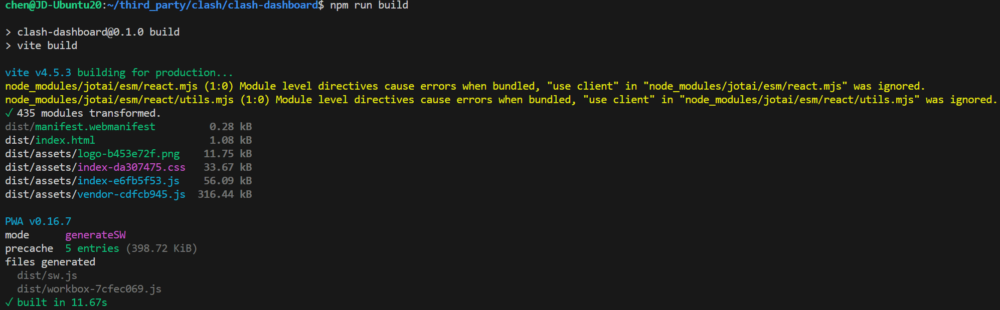
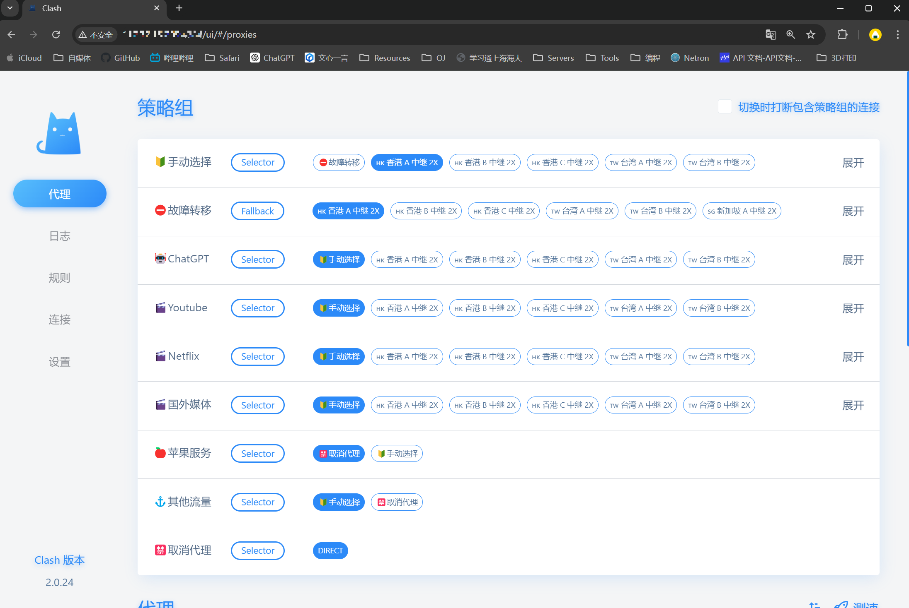
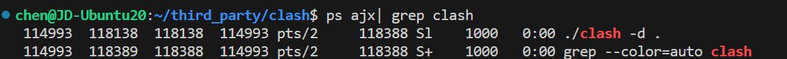

# 一、配置clash
首先下载一个clash的安装包解压到服务器上：
```bash
# 用电脑下
https://github.com/doreamon-design/clash/releases
```

可以在服务器上解压，最好把clash的所有文件放在一个目录里
```bash
# 解压
tar -xzvf 文件名.tar.gz -C /path/to/destination

# 压缩
tar -czvf 压缩后的文件名.tar.gz 要压缩的目录
```

进入clash的目录，运行clash，但是由于无法访问外网，clash报错如下：
```bash
chen@JD-Ubuntu20:~/third_party/clash$ ./clash -d ~/.config/clash/
INFO[0000] Can't find MMDB, start download              
FATA[0030] Initial configuration directory error: can't initial MMDB: can't download MMDB: Get "https://cdn.jsdelivr.net/gh/Dreamacro/maxmind-geoip@release/Country.mmdb": dial tcp 8.7.198.46:443: i/o timeout 
```

那就下载一个mmdb，链接[https://gitee.com/dnqbob/sp_engine/blob/SPcn-01-02-20/GeoLite2-Country.mmdb.gz]()，放在刚才的目录里：
```bash
^Cchen@JD-Ubuntu20:~/third_party/clash$ ll
total 19516
drwxrwxr-x 4 chen chen     4096 Sep  2 13:11 ./
drwxrwxr-x 6 chen chen     4096 Sep  1 21:31 ../
-rw-rw-r-- 1 chen chen    16384 Sep  2 12:19 cache.db
-rwxr-xr-x 1 chen chen 12673024 Nov  5  2023 clash*
drwxrwxr-x 5 chen chen     4096 Sep  2 13:11 clash-dashboard/
-rw-r--r-- 1 chen chen    65327 Sep  2 13:14 config.yaml
-rw-r--r-- 1 chen chen  7168530 Sep  2 12:19 Country.mmdb
drwxrwxr-x 2 chen chen     4096 Sep  2 12:37 GeoLite2-Country.mmdb/
-rw-r--r-- 1 chen chen    35149 Nov  5  2023 LICENSE
-rw-r--r-- 1 chen chen     2630 Nov  5  2023 README.md
```

再运行：
```bash
./clash -d .
```

应该会自己生成一个config.yaml，打开这个文件配置一下vpn供应商给你的clash配置，配置里面可以设置以下内容：

```yaml
port: 7890
socks-port: 7891
redir-port: 7892
allow-lan: false
mode: rule
log-level: silent
external-ui: ./clash-dashboard      # 支持dashboard
external-controller: '0.0.0.0:4384' # 支持外部配置，端口可以自己设
secret: ''  # 密码
```


# 二、配置clash-dashboard

```bash
git clone https://github.com/chmod777john/clash-dashboard.git
```

克隆了 `clash-dashboard` 仓库后，你需要进行一些配置和部署工作，才能在本地运行这个管理界面。下面是详细的步骤：

### 1. **安装依赖**

进入你克隆的 `clash-dashboard` 目录，然后安装所需的依赖项：

```bash
cd clash-dashboard
npm install
```

如果你还没有安装 Node.js 和 npm（Node.js 包管理器），你需要先安装它们。你可以通过以下命令安装：

```bash
# 在 Ubuntu 上安装 Node.js 和 npm
sudo apt update
sudo apt install nodejs npm
```

### 2. **构建项目**

安装依赖项之后，你需要构建项目，这会生成用于部署的静态文件：

```bash
npm run build
```



这个命令会在项目的 `dist` 目录下生成构建后的静态文件。

### 3. **配置 Clash**

你需要将生成的静态文件部署到 Clash 的本地服务中。在 Clash 的配置文件（通常是 `config.yaml`）中，配置 `external-ui` 指向构建后的文件路径。

假设你构建的 `clash-dashboard` 项目在 `/home/chen/clash-dashboard` 目录下，那么你可以在 `config.yaml` 中添加或修改如下配置：

```yaml
external-ui: /home/chen/clash-dashboard/dist
```

### 4. **重新启动 Clash**

更新配置文件后，重启 Clash 使配置生效

### 5. **访问 Dashboard**

完成以上步骤后，你可以通过浏览器访问 Clash Dashboard。默认情况下，你可以在浏览器中访问：

```
http://127.0.0.1:9090/ui
```

如果 Clash 配置了不同的端口或者在远程服务器上，你需要使用对应的 IP 地址和端口。

### 6. **检查 Dashboard**

确保 Dashboard 正常工作，能够连接到你的 Clash 服务并进行管理操作。



如果遇到问题，查看 Clash 的日志或者浏览器控制台中的错误信息，可以帮助你诊断和解决问题。

通过这些步骤，你应该可以成功配置并访问 Clash Dashboard，从而更方便地管理和监控你的 Clash 实例。

# 三、clash的日志

Clash 有以下几个挡位的日志等级（Log Levels），可以用于控制日志输出的详细程度：

1. **Silent**：不输出任何日志信息。
2. **Error**：仅输出错误日志信息。
3. **Warning**：输出错误和警告日志信息。
4. **Info**：输出错误、警告和普通信息日志（默认等级）。
5. **Debug**：输出所有日志信息，包括调试信息。

你可以在 Clash 的配置文件（`config.yaml`）中设置日志等级，来控制日志输出的详细程度。例如：

```yaml
log-level: info
```

根据需要，可以将 `log-level` 设置为 `silent`、`error`、`warning`、`info` 或 `debug` 之一。


# 四、clash守护进程化
要让 Clash 从命令行启动并守护进程化，而不使用 `systemctl`，可以按照以下步骤进行操作：

### 1. 启动 Clash
你可以使用 `nohup` 或 `&` 来启动 Clash 并让它在后台运行。例如：

```bash
nohup ./clash -d . > ./clash.log 2>&1 &
```

**解释：**

1. **`nohup`**：
   - 该命令使 Clash 即使在退出终端（如关闭终端会话）后仍继续运行。`nohup` 表示 "no hang up"，即防止程序因为终端关闭而停止运行。

2. **`clash -d /path/to/clash/config/dir`**：
   - 这部分命令启动 Clash，并通过 `-d` 参数指定 Clash 配置文件的目录。`/path/to/clash/config/dir` 是你需要替换为实际配置文件路径的占位符。

3. **`> clash.log 2>&1`**：
   - 这部分将标准输出 (`stdout`) 和标准错误 (`stderr`) 重定向到 `clash.log` 文件。
   - `>`：重定向符号，将 `stdout`（即正常的输出信息）重定向到 `clash.log` 文件。
   - `2>&1`：将 `stderr`（即错误信息输出）重定向到 `stdout`，这样错误信息也会被保存到 `clash.log` 中。

4. **`&`**：
   - 将 Clash 进程放到后台运行，这样你可以继续在终端中执行其他命令。


或者：

```bash
./clash -d . > clash.log 2>&1 &
```


**解释：**

1. **`clash -d /path/to/clash/config/dir`**：
   - 与第一个命令相同，启动 Clash，并指定配置文件的目录。

2. **`> clash.log 2>&1`**：
   - 与第一个命令相同，将 `stdout` 和 `stderr` 重定向到 `clash.log` 文件。

3. **`&`**：
   - 与第一个命令相同，将 Clash 进程放到后台运行。

**主要区别：**
- 第一个命令使用了 `nohup`，使得 Clash 在终端关闭后仍然保持运行。第二个命令则没有使用 `nohup`，如果你关闭终端会话，进程可能会停止。


### 2. 确保进程保持运行
通过上述方法，Clash 将以后台守护进程的形式运行。如果你关闭了终端，使用 `nohup`、`screen` 或 `tmux` 启动的 Clash 进程依然会继续运行。

### 3. 检查 Clash 进程
你可以通过以下命令检查 Clash 是否正在运行：

```bash
ps aux | grep clash
```



这将显示当前正在运行的 Clash 进程。