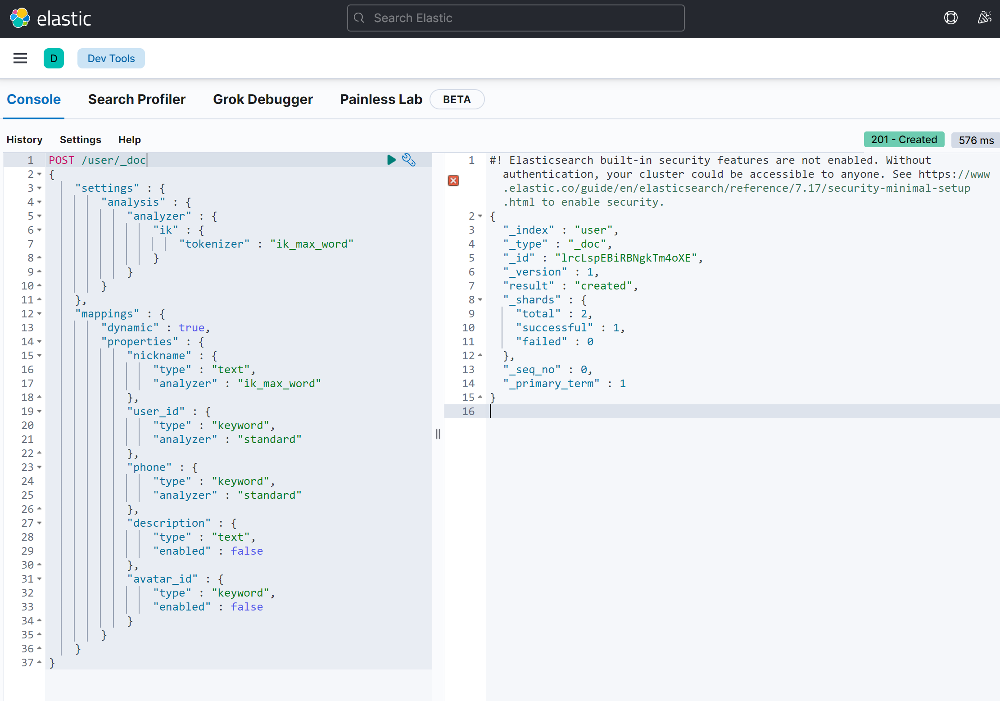

# 1. gflags安装及使用

## 1.1 gflags介绍

gflags 是 Google 开发的一个开源库，用于 C++ 应用程序中命令行参数的声明、定义和解析。gflags 库提供了一种简单的方式来添加、解析和文档化命令行标志（flags），使得程序可以根据不同的运行时配置进行调整。

它具有如下几个特点：

- **易于使用**：gflags 提供了一套简单直观的 API 来定义和解析命令行标志，使得开发者可以轻松地为应用程序添加新的参数。
- **自动帮助和文档**：gflags 可以自动生成每个标志的帮助信息和文档，这有助于用户理解如何使用程序及其参数。
- **类型安全**：gflags 支持多种数据类型的标志，包括布尔值、整数、字符串等，并且提供了类型检查和转换。
- **多平台支持**：gflags 可以在多种操作系统上使用，包括 Windows、Linux 和 macOS。
- **可扩展性**：gflags 允许开发者自定义标志的注册和解析逻辑，提供了强大的扩展性。

官方文档：[gflags Documentation](https://gflags.github.io/gflags/)

代码仓库：[gflags GitHub](https://github.com/gflags/gflags.git)

## 1.2 gflags安装

### 1.2.1 直接命令安装

```bash
sudo apt-get install libgflags-dev
```

### 1.2.2 源码安装

```bash
# 下载源码
git clone https://github.com/gflags/gflags.git
# 切换目录
cd gflags/
mkdir build 
cd build/
# 生成 Makefile
cmake ..
# 编译代码
make
# 安装
make install
```

至此，gflags 安装完毕。

## 1.3 gflags使用

### 1.3.1 包含头文件

使用 gflags 库来定义/解析命令行参数必须包含如下头文件：

```cpp
#include <gflags/gflags.h>
```

### 1.3.2 定义参数

利用 gflags 提供的宏定义来定义参数。该宏的 3 个参数分别为命令行参数名，参数默认值，参数的帮助信息。

```cpp
DEFINE_bool(reuse_addr, true, "是否开始网络地址重用选项");
DEFINE_int32(log_level, 1, "日志等级：1-DEBUG, 2-WARN, 3-ERROR");
DEFINE_string(log_file, "stdout", "日志输出位置设置，默认为标准输出");
```

gflags 支持定义多种类型的宏函数：

- `DEFINE_bool`
- `DEFINE_int32`
- `DEFINE_int64`
- `DEFINE_uint64`
- `DEFINE_double`
- `DEFINE_string`

### 1.3.3 访问参数

我们可以在程序中通过 `FLAGS_name` 像正常变量一样访问标志参数。例如：

```cpp
std::cout << "日志等级: " << FLAGS_log_level << std::endl;
```

### 1.3.4 不同文件访问参数

如果需要在另外一个文件中访问当前文件的参数，可以使用宏 `DECLARE_bool(name)` 来声明引入这个参数。

例如：

```cpp
DECLARE_bool(reuse_addr);
```

### 1.3.5 初始化所有参数

定义好参数后，需要在 `main` 函数中调用以下函数来解析命令行传入的参数：

```cpp
google::ParseCommandLineFlags(&argc, &argv, true);
```

- `argc` 和 `argv` 是 `main` 的入口参数。
- 第三个参数 `remove_flags` 若为 `true`，则 `ParseCommandLineFlags` 会从 `argv` 中移除标识及其参数，减少 `argc` 的值。

### 1.3.6 运行参数设置

gflags 提供了多种命令行设置参数的方式。

>设置 `string` 和 `int` 类型参数

```bash
exec --log_file="./main.log"
exec -log_file="./main.log"
exec --log_file "./main.log"
exec -log_file "./main.log"
```

>设置 `bool` 类型参数

```bash
exec --reuse_addr            # 为true
exec --noreuse_addr          # 为true
exec --reuse_addr=true
exec --reuse_addr=false
```

### 1.3.7 配置文件的使用

配置文件可以标准化程序的运行参数配置。配置文件中的选项名称必须与代码中定义的选项名称一致。

示例配置文件内容：

```txt
-reuse_addr=true
-log_level=3
-log_file=./log/main.log
```

### 1.3.8 特殊参数标识

gflags 还提供了几个特殊的标识：

- `--help`：显示所有标识的帮助信息。
- `--helpshort`：只显示当前执行文件里的标志。
- `--helpxml`：以 XML 方式打印，方便处理。
- `--version`：打印版本信息。
- `--flagfile`：从文件中读取命令行参数。

## 1.4 入门案例

### 1.4.1 样例编写

编写样例代码：`main.cc`

```cpp
#include <gflags/gflags.h>
#include <iostream>

DEFINE_bool(reuse_addr, true, "是否开始网络地址重用选项");
DEFINE_int32(log_level, 1, "日志等级：1-DEBUG, 2-WARN, 3-ERROR");
DEFINE_string(log_file, "stdout", "日志输出位置设置，默认为标准输出");

int main(int argc, char* argv[])
{
    google::ParseCommandLineFlags(&argc, &argv, true);
    std::cout << "reuse: " << FLAGS_reuse_addr << std::endl;
    std::cout << "日志等级: " << FLAGS_log_level << std::endl;
    std::cout << "日志输出位置: " << FLAGS_log_file << std::endl;
    return 0;
}
```

### 1.4.2 样例运行

>运行代码 1

```bash
./main --help
```

输出:

```bash
Flags from main.cc:
    -log_file (日志输出位置设置，默认为标准输出) type: string default: "stdout"
    -log_level (日志等级：1-DEBUG, 2-WARN, 3-ERROR) type: int32 default: 1
    -reuse_addr (是否开始网络地址重用选项) type: bool default: true
```

>运行代码 2

```bash
./main
```

输出:

```bash
reuse: true
日志等级: 1
日志输出位置: stdout
```

>运行代码 3

```bash
./main --log_level=2 -- --log_file=./log
```

输出:

```bash
reuse: true
日志等级: 2
日志输出位置: stdout
```

>运行代码 4

```bash
./main -flagfile=./main.conf
```

输出:

```bash
reuse: true
日志等级: 3
日志输出位置: ./log/main.log
```


# 2. gtest框架安装与使用

## 2.1 安装

### 2.1.1 命令安装

```bash
sudo apt-get install libgtest-dev
```

## 2.2 介绍

GTest 是一个跨平台的 C++单元测试框架，由 Google 公司发布。gtest 旨在为编写 C++单元测试提供便利，支持在多种平台上使用。它提供了丰富的断言、致命和非致命判断、参数化测试等所需的宏，以及全局测试和单元测试组件。

### 2.2.1 头文件包含

要使用 gtest 框架，需要在代码中包含如下头文件：

```cpp
#include <gtest/gtest.h>
```

### 2.2.2 框架初始化接口

在 `main` 函数中初始化 gtest：

```cpp
testing::InitGoogleTest(&argc, argv);
```

### 2.2.3 调用测试样例

调用所有测试样例并运行：

```cpp
RUN_ALL_TESTS();
```

## 2.3 TEST宏

### 2.3.1 TEST宏

用于创建一个简单测试，定义一个测试函数，可以在该函数中使用任何 C++ 代码并利用框架提供的断言进行检查。

```cpp
TEST(测试名称, 测试样例名称)
```

### 2.3.2 TEST_F宏

适用于多个测试场景需要相同的数据配置时使用，例如相同的数据测不同的行为。

```cpp
TEST_F(test_fixture, test_name)
```

## 2.4 断言宏

GTest 中的断言宏可以分为两类：

- **ASSERT_ 系列**：如果当前点检测失败则退出当前函数。
- **EXPECT_ 系列**：如果当前点检测失败则继续往下执行。

### 2.4.1 常用断言宏

```cpp
// bool 值检查
ASSERT_TRUE(参数);  // 期待结果为 true
ASSERT_FALSE(参数);  // 期待结果为 false

// 数值型数据检查
ASSERT_EQ(参数1, 参数2);  // 相等检查
ASSERT_NE(参数1, 参数2);  // 不等检查
ASSERT_LT(参数1, 参数2);  // 小于检查
ASSERT_GT(参数1, 参数2);  // 大于检查
ASSERT_LE(参数1, 参数2);  // 小于等于检查
ASSERT_GE(参数1, 参数2);  // 大于等于检查
```

## 2.5 样例

以下是一个简单的 gtest 使用示例：

```cpp
#include<iostream>
#include<gtest/gtest.h>

int abs(int x)
{
    return x > 0 ? x : -x;
}

TEST(abs_test, test1)
{
    ASSERT_TRUE(abs(1) == 1);
    ASSERT_TRUE(abs(-1) == 1);
    ASSERT_FALSE(abs(-2) == -2);
    ASSERT_EQ(abs(1), abs(-1));
    ASSERT_NE(abs(-1), 0);
    ASSERT_LT(abs(-1), 2);
    ASSERT_GT(abs(-1), 0);
    ASSERT_LE(abs(-1), 2);
    ASSERT_GE(abs(-1), 0);
}

int main(int argc, char* argv[])
{
    testing::InitGoogleTest(&argc, argv);
    return RUN_ALL_TESTS();
}
```

编写 Makefile：

```makefile
main : main.cc
    g++ -std=c++17 $^ -o $@ -lgtest
```

运行代码：

```bash
./main
```

输出：

```bash
[==========] Running 1 test from 1 test case.
[----------] Global test environment set-up.
[----------] 1 test from abs_test
[ RUN      ] abs_test.test1
[       OK ] abs_test.test1 (0 ms)
[----------] 1 test from abs_test (0 ms total)
[----------] Global test environment tear-down
[==========] 1 test from 1 test case ran. (0 ms total)
[  PASSED  ] 1 test.
```

## 2.6 事件机制

GTest 中的事件机制是指在测试前和测试后提供给用户自行添加操作的机制，它允许同一测试套件下的测试用例共享数据。

### 2.6.1 全局事件

全局事件是针对整个测试程序的事件机制。需要创建一个类继承 `testing::Environment`，并实现 `SetUp` 和 `TearDown` 函数。

```cpp
#include <iostream>
#include <gtest/gtest.h>

std::unordered_map<std::string, std::string> dict;

class HashTestEnv : public testing::Environment {
    public:
        virtual void SetUp() override {
            std::cout << "测试前:提前准备数据!!\n";
            dict.insert(std::make_pair("Hello", "你好"));
            dict.insert(std::make_pair("hello", "你好"));
            dict.insert(std::make_pair("雷吼", "你好"));
        }
        virtual void TearDown() override {
            std::cout << "测试结束后:清理数据!!\n";
            dict.clear();
        }
};

TEST(hash_case_test, find_test) {
    auto it = dict.find("hello");
    ASSERT_NE(it, dict.end());
}

TEST(hash_case_test, size_test) {
    ASSERT_GT(dict.size(), 0);
}

int main(int argc, char *argv[])
{
    testing::AddGlobalTestEnvironment(new HashTestEnv);
    testing::InitGoogleTest(&argc, argv);
    return RUN_ALL_TESTS();
}
```

运行结果：

```bash
./event
[==========] Running 2 tests from 1 test case.
[----------] Global test environment set-up.
测试前:提前准备数据!!
[----------] 2 tests from hash_case_test
[ RUN      ] hash_case_test.find_test
[       OK ] hash_case_test.find_test (0 ms)
[ RUN      ] hash_case_test.size_test
[       OK ] hash_case_test.size_test (0 ms)
[----------] 2 tests from hash_case_test (0 ms total)
[----------] Global test environment tear-down
测试结束后:清理数据!!
[==========] 2 tests from 1 test case ran. (0 ms total)
[  PASSED  ] 2 tests.
```

### 2.6.2 TestSuite事件

TestSuite事件是针对一个测试套件的事件机制。需要创建一个类继承 `testing::Test`，并实现 `SetUpTestCase` 和 `TearDownTestCase` 函数。

```cpp
#include <iostream>
#include <gtest/gtest.h>

class HashTestEnv1 : public testing::Test {
    public:
        static void SetUpTestCase() {
            std::cout << "环境 1 第一个 TEST 之前调用\n";
        }
        static void TearDownTestCase() {
            std::cout << "环境 1 最后一个 TEST 之后调用\n";
        }
    public:
        std::unordered_map<std::string, std::string> dict;
};

TEST_F(HashTestEnv1, insert_test) {
    std::cout << "环境 1,中间 insert 测试\n";
    dict.insert(std::make_pair("Hello", "你好"));
    dict.insert(std::make_pair("hello", "你好"));
    dict.insert(std::make_pair("雷吼", "你好"));
    auto it = dict.find("hello");
    ASSERT_NE(it, dict.end());
}

TEST_F(HashTestEnv1, sizeof) {
    std::cout << "环境 1,中间 size 测试\n";
    ASSERT_GT(dict.size(), 0);
}

int main(int argc, char *argv[])
{
    testing::InitGoogleTest(&argc, argv);
    return RUN_ALL_TESTS();
}
```

运行结果：

```bash
./event
[==========] Running 2 tests from 1 test case.
[----------] Global test environment set-up.
[----------] 2 tests from HashTestEnv1
环境 1 第一个 TEST 之前调用
[ RUN      ] HashTestEnv1.insert_test
环境 1,中间 insert 测试
[       OK ] HashTestEnv1.insert_test (0 ms)
[ RUN      ] HashTestEnv1.sizeof
环境 1,中间 size 测试
event.cpp:81: Failure
Expected: (dict.size()) > (0), actual: 0 vs 0
[  FAILED  ] HashTestEnv1.sizeof (0 ms)
环境 1 最后一个 TEST 之后调用
[----------] 2 tests from HashTestEnv1 (0 ms total)
[==========] 2 tests from 1 test case ran. (1 ms total)
[  PASSED  ] 1 test.
[  FAILED  ] 1 test.
```

### 2.6.3 TestCase事件

TestCase事件是针对每一个测试用例的事件机制。需要在环境类中实现 `SetUp` 和 `TearDown` 函数。

```cpp
class HashTestEnv2 : public testing::Test {
    public:
        static void SetUpTestCase() {
            std::cout << "环境 2 第一个 TEST 之前被调用,进行总体环境配置\n";
        }
        static void TearDownTestCase() {
            std::cout << "环境 2 最后一个 TEST 

之后被调用,进行总体环境清理\n";
        }
        virtual void SetUp() override {
            std::cout << "环境 2 测试前:提前准备数据!!\n";
            dict.insert(std::make_pair("bye", "再见"));
            dict.insert(std::make_pair("see you", "再见"));
        }
        virtual void TearDown() override {
            std::cout << "环境 2 测试结束后:清理数据!!\n";
            dict.clear();
        }
    public:
        std::unordered_map<std::string, std::string> dict;
};

TEST_F(HashTestEnv2, insert_test) {
    std::cout << "环境 2,中间测试\n";
    dict.insert(std::make_pair("hello", "你好"));
    ASSERT_EQ(dict.size(), 3);
}

TEST_F(HashTestEnv2, size_test) {
    std::cout << "环境 2,中间 size 测试\n";
    auto it = dict.find("hello");
    ASSERT_EQ(it, dict.end());
    ASSERT_EQ(dict.size(), 2);
}

int main(int argc, char *argv[])
{
    testing::InitGoogleTest(&argc, argv);
    RUN_ALL_TESTS();
    return 0;
}
```

运行结果：

```bash
./event
[==========] Running 2 tests from 1 test case.
[----------] Global test environment set-up.
[----------] 2 tests from HashTestEnv2
环境 2 第一个 TEST 之前被调用,进行总体环境配置
[ RUN      ] HashTestEnv2.insert_test
环境 2 测试前:提前准备数据!!
环境 2,中间测试
环境 2 测试结束后:清理数据!!
[       OK ] HashTestEnv2.insert_test (1 ms)
[ RUN      ] HashTestEnv2.size_test
环境 2 测试前:提前准备数据!!
环境 2,中间 size 测试
环境 2 测试结束后:清理数据!!
[       OK ] HashTestEnv2.size_test (0 ms)
环境 2 最后一个 TEST 之后被调用,进行总体环境清理
[==========] 2 tests from HashTestEnv2 (1 ms total)
[==========] 2 tests from 1 test case ran. (1 ms total)
[  PASSED  ] 2 tests.
```


# 3. spdlog 日志组件的安装及使用

## 3.1 介绍

Spdlog 是一个高性能、超快速、零配置的 C++ 日志库，它旨在提供简洁的 API 和丰富的功能，同时保持高性能的日志记录。Spdlog 支持多种输出目标、格式化选项、线程安全以及异步日志记录。

### 3.1.1 特点

- **高性能**：spdlog 专为速度而设计，即使在高负载情况下也能保持良好的性能。
- **零配置**：无需复杂的配置，只需包含头文件即可在项目中使用。
- **异步日志**：支持异步日志记录，减少对主线程的影响。
- **格式化**：支持自定义日志消息的格式化，包括时间戳、线程 ID、日志级别等。
- **多平台**：跨平台兼容，支持 Windows、Linux、macOS 等操作系统。
- **丰富的 API**：提供丰富的日志级别和操作符重载，方便记录各种类型的日志。

GitHub 链接：[spdlog GitHub](https://github.com/gabime/spdlog)

## 3.2 安装

### 3.2.1 命令安装

```bash
sudo apt-get install libspdlog-dev
```

### 3.2.2 源码安装

```bash
git clone https://github.com/gabime/spdlog.git
cd spdlog/
mkdir build && cd build
cmake -DCMAKE_INSTALL_PREFIX=/usr ..
make && sudo make install
```

## 3.3 使用

### 3.3.1 包含头文件

在你的 C++ 源文件中包含 spdlog 的头文件：

```cpp
#include <spdlog/spdlog.h>
```

### 3.3.2 日志输出等级枚举

Spdlog 提供了多个日志级别：

```cpp
namespace level {
    enum level_enum : int {
        trace = SPDLOG_LEVEL_TRACE,
        debug = SPDLOG_LEVEL_DEBUG,
        info = SPDLOG_LEVEL_INFO,
        warn = SPDLOG_LEVEL_WARN,
        err = SPDLOG_LEVEL_ERROR,
        critical = SPDLOG_LEVEL_CRITICAL,
        off = SPDLOG_LEVEL_OFF,
        n_levels
    };
}
```

### 3.3.3 日志输出格式自定义

可以自定义日志消息的格式：

```cpp
logger->set_pattern("%Y-%m-%d %H:%M:%S [%t] [%-7l] %v");
```


#### 时间相关占位符


- %Y - 年（Year），格式为四位数字（如 2024）。
- %m - 月（Month），格式为两位数字（如 08）。
- %d - 日（Day），格式为两位数字（如 26）。
- %H - 小时（24-hour format），格式为两位数字（如 14 表示下午2点）。
- %I - 小时（12-hour format），格式为两位数字（如 02 表示下午2点）。
- %M - 分钟（Minute），格式为两位数字（如 45 表示45分钟）。
- %S - 秒（Second），格式为两位数字（如 07 表示7秒）。
- %e - 毫秒（Milliseconds），格式为三位数字（如 123 表示123毫秒）。
- %f - 微秒（Microseconds），格式为六位数字（如 123456 表示123456微秒）。
- %F - 纳秒（Nanoseconds），格式为九位数字（如 123456789 表示123456789纳秒）。
- %T - ISO 8601格式的时间（等价于%H:%M:%S）。

#### 日志信息相关占位符
- %t - 线程 ID（Thread ID），通常用于多线程环境下区分日志来源。
- %L - 日志级别缩写（如 I 表示INFO, D 表示DEBUG, E 表示ERROR）。
- %l - 日志级别全称（如 INFO, DEBUG, ERROR）。
- %n - 日志器名称（Logger's name），即创建日志器时指定的名称。
- %v - 日志内容（Log message text），即实际的日志信息。
- %P - 进程ID（Process ID），显示当前进程的ID。

#### 文件和行号相关占位符
- %s - 当前日志语句的文件名（Filename），只包含文件名，不包含路径。
- %g - 完整文件路径（Full filepath），包含文件的完整路径。
- %# - 当前日志语句的行号（Line number）。
- %! - 当前日志语句所在的函数名（Function name）。

#### 其他常用占位符
- %^ - 开启文本颜色（Start color range），配合 %$ 使用，用于强制启用颜色输出。
- %$ - 关闭文本颜色（End color range），配合 %^ 使用，用于关闭颜色输出。
- %% - 百分号符号（Literal % character），用于在日志输出中显示 % 字符。

#### 格式控制符
- %p - 调用日志的函数的指针值（在某些平台上可能无效或返回 0）。
- %E - 错误码（Error code）或状态信息（在使用异常处理的上下文中可能有效）。

### 3.3.4 日志记录器类

创建一个基本的日志记录器，并设置日志级别和输出模式：

```cpp
namespace spdlog {
class logger {
    logger(std::string name);
    logger(std::string name, sink_ptr single_sink);
    logger(std::string name, sinks_init_list sinks);
    void set_level(level::level_enum log_level);
    void set_formatter(std::unique_ptr<formatter> f);
    template<typename... Args>
    void trace(fmt::format_string<Args...> fmt, Args &&...args);
    template<typename... Args>
    void debug(fmt::format_string<Args...> fmt, Args &&...args);
    template<typename... Args>
    void info(fmt::format_string<Args...> fmt, Args &&...args);
    template<typename... Args>
    void warn(fmt::format_string<Args...> fmt, Args &&...args);
    template<typename... Args>
    void error(fmt::format_string<Args...> fmt, Args &&...args);
    template<typename... Args>
    void critical(fmt::format_string<Args...> fmt, Args &&...args);

    void flush();  // 刷新日志
    void flush_on(level::level_enum log_level);  // 设置立即刷新等级
};
}
```

### 3.3.5 异步日志记录类

为了异步记录日志，可以使用 `spdlog::async_logger`：

```cpp
class async_logger final : public logger {
    async_logger(std::string logger_name, sinks_init_list sinks_list, std::weak_ptr<details::thread_pool> tp, async_overflow_policy overflow_policy = async_overflow_policy::block);
    async_logger(std::string logger_name, sink_ptr single_sink, std::weak_ptr<details::thread_pool> tp, async_overflow_policy overflow_policy = async_overflow_policy::block);

    // 线程池类
    class SPDLOG_API thread_pool {
        thread_pool(size_t q_max_items, size_t threads_n, std::function<void()> on_thread_start, std::function<void()> on_thread_stop);
        thread_pool(size_t q_max_items, size_t threads_n, std::function<void()> on_thread_start);
        thread_pool(size_t q_max_items, size_t threads_n);
    };
};

auto async_logger = spdlog::async_logger_mt("async_logger", "logs/async_log.txt");
async_logger->info("This is an asynchronous info message");
```

### 3.3.6 日志记录器工厂类

Spdlog 提供了多种日志记录器的创建方式：

```cpp
// 创建一个彩色输出到标准输出的日志记录器
template<typename Factory = spdlog::synchronous_factory>
std::shared_ptr<logger> stdout_color_mt(const std::string &logger_name, color_mode mode = color_mode::automatic);

// 指定文件
template<typename Factory = spdlog::synchronous_factory>
std::shared_ptr<logger> basic_logger_mt(const std::string &logger_name, const filename_t &filename, bool truncate = false);
```

### 3.3.7 日志落地类

Spdlog 支持将日志落地到多种形式的存储介质，如文件、网络、数据库等：

```cpp
namespace spdlog {
namespace sinks {
    sink_ptr rotating_file_sink(filename_t base_filename, std::size_t max_size, std::size_t max_files, bool rotate_on_open = false);

    sink_ptr basic_file_sink(const filename_t &filename, bool truncate = false);

    // 更多 sink 类型
    // * _st：单线程版本，不用加锁，效率更高。
    // * _mt：多线程版本，用于多线程程序是线程安全的。
}
}
```

### 3.3.8 全局接口

Spdlog 提供了一些全局接口来管理日志行为：

```cpp
// 输出等级设置接口
void set_level(level::level_enum log_level);

// 日志刷新策略-每隔 N 秒刷新一次
void flush_every(std::chrono::seconds interval);

// 日志刷新策略-触发指定等级立即刷新
void flush_on(level::level_enum log_level);
```

### 3.3.9 记录日志

使用日志记录器记录不同级别的日志：

```cpp
logger->trace("This is a trace message");
logger->debug("This is a debug message");
logger->info("This is an info message");
logger->warn("This is a warning message");
logger->error("This is an error message");
logger->critical("This is a critical message");
```

### 3.3.10 使用样例

```cpp
#include <spdlog/spdlog.h>
#include <spdlog/sinks/stdout_color_sinks.h>
#include <spdlog/sinks/basic_file_sink.h>
#include <spdlog/async.h>

void multi_sink_example() {
    auto console_sink = std::make_shared<spdlog::sinks::stdout_color_sink_mt>();
    console_sink->set_level(spdlog::level::warn);
    console_sink->set_pattern("[multi_sink_example] [%^%l%$] %v");

    auto file_sink = std::make_shared<spdlog::sinks::basic_file_sink_mt>("logs/multisink.txt", true);
    file_sink->set_level(spdlog::level::trace);

    spdlog::logger logger("multi_sink", {console_sink, file_sink});
    logger.set_level(spdlog::level::debug);
    logger.set_pattern("%Y-%m-%d %H:%M:%S [%l] %v");
    logger.warn("this should appear in both console and file");
    logger.info("this message should not appear in the console, only in the file");
}

void async_example() {
    spdlog::init_thread_pool(32768, 1);
    auto async_logger = spdlog::basic_logger_mt<spdlog::async_factory>("async_file_logger", "logs/async_log.txt");
    async_logger->set_pattern("%Y-%m-%d %H:%M:%S [%l] %v");
    for (int i = 1; i < 101; ++i) {
        async_logger->info("Async message #{} {}", i, "hello");
    }
}

int main() {
    async_example();
    return 0;
}
```

编写 Makefile：

```makefile
main : main.cc
    g++ -std=c++17 $^ -o $@ -lspdlog -lfmt
```

### 3.3.11 二次封装

1. 由于 spdlog 的日志输出对文件名和行号并不是很友好
2. 且使用默认日志器每次进行单例获取效率较低
3. 封装出一个初始化接口，便于使用：
    - 调试模式输出到标准输出
    - 否则输出到文件中

因此可以进行二次封装，简化使用：
1. 封装出一个全局的接口，用户就行日志器的创建和初始化
2. 对日志输出的接口，进行宏的封装，加入文件名和行号的输出

```cpp
#include <spdlog/spdlog.h>
#include <spdlog/sinks/stdout_color_sinks.h>
#include <spdlog/sinks/basic_file_sink.h>
#include <spdlog/async.h>
#include <iostream>
#include <memory>
#include <string>
#include <string_view>

// 全局的日志器
std::shared_ptr<spdlog::logger> g_default_logger;

/// @brief 初始化日志器
/// @param mode 运行模式：true-发布模式，false-调试模式
/// @param file_name 发布模式下，如果输出到文件，输出到的文件名
/// @param level 发布模式下的日志等级和刷新时机
void init_logger(bool mode, const std::string &file_name, int log_level)
{
    if(mode == false) {
        // 如果是调试模式，则创建标准输出的同步日志器，输出等级为最低
        // 1. 创建同步日志器
        g_default_logger = spdlog::stdout_color_mt("global_sync_logger", spdlog::color_mode::automatic);

        // 2. 设置等级(刷新阈值)
        g_default_logger->set_level(spdlog::level::level_enum::trace);

        // 3. 刷新时机
        g_default_logger->flush_on(spdlog::level::level_enum::trace);
    } else {
        // 如果是发布模式，则创建文件输出的异步日志器，输出等级依参数而定
        // 1. 创建异步日志器
        g_default_logger = spdlog::basic_logger_mt("global_async_logger", file_name, false);

        // 2. 设置等级(刷新阈值)
        g_default_logger->set_level(static_cast<spdlog::level::level_enum>(log_level));

        // 3. 刷新时机
        g_default_logger->flush_on(static_cast<spdlog::level::level_enum>(log_level));
    }

    // 4. 设置格式 [日志器名称][时间][线程ID][日志等级全称]
    g_default_logger->set_pattern("[%n][%H:%M:%S][%t][%^%-8l%$]%v");
}

// [文件名:行号]
#define LOG_TRACE(format, ...)    g_default_logger->trace(   std::string("[{:>10s}:{:<4d}] ") + format , __FILE__, __LINE__, ##__VA_ARGS__)
#define LOG_DEBUG(format, ...)    g_default_logger->debug(   std::string("[{:>10s}:{:<4d}] ") + format , __FILE__, __LINE__, ##__VA_ARGS__)
#define LOG_INFO(format, ...)     g_default_logger->info(    std::string("[{:>10s}:{:<4d}] ") + format , __FILE__, __LINE__, ##__VA_ARGS__)
#define LOG_WARN(format, ...)     g_default_logger->warn(    std::string("[{:>10s}:{:<4d}] ") + format , __FILE__, __LINE__, ##__VA_ARGS__)
#define LOG_ERROR(format, ...)    g_default_logger->error(   std::string("[{:>10s}:{:<4d}] ") + format , __FILE__, __LINE__, ##__VA_ARGS__)
#define LOG_CRITICAL(format, ...) g_default_logger->critical(std::string("[{:>10s}:{:<4d}] ") + format , __FILE__, __LINE__, ##__VA_ARGS__)
```

## 3.4 spdlog与glog组件对比

### 3.4.1 glog

Glog 是由 Google 开发的一个开源 C++ 日志库，提供了丰富的日志功能，包括多种日志级别、条件日志记录、日志文件管理、信号处理、自定义日志格式等。Glog 默认情况下是同步记录日志的，每次写日志操作都会阻塞直到日志数据被写入磁盘。

### 3.4.2 性能对比

根据性能测试，glog 在同步调用的场景下的性能较 spdlog 慢。在一台低配的服务器上，glog 处理十万笔日志数据耗时 1.027 秒，而 spdlog 仅耗时 0.135 秒。此外，spdlog 还支持异步日志记录，其异步模式的耗时为 0.158 秒。

### 3.4.3 对比总结

- **性能**：spdlog 在同步调用场景下的性能优于 glog。
- **异步日志**：spdlog 支持异步日志记录，适用于高负载应用程序。
- **易用性**：spdlog 集成和配置简单，而 glog 可能需要额外的编译和配置步骤。
- **功能**：glog 提供了条件日志记录和信号处理等功能，在某些场景下更为适用。
- **使用场景**：glog 适用于功能需求较多但对性能要求不高的场景；spdlog 适合需要高性能日志记录和异步日志能力的应用程序。

## 3.5 总结

Spdlog 是一个功能强大且易于使用的 C++ 日志库，它提供了丰富的功能和高性能的日志记录能力。通过简单的 API，开发者可以快速地在项目中实现日志记录，保持代码的清晰和可维护性。无论是在开发阶段还是生产环境中，spdlog 都能提供稳定和高效的日志服务。


# 4. etcd的安装与使用

## 4.1 介绍

Etcd 是一个由 Golang 编写的分布式、高可用的一致性键值存储系统，通常用于配置共享和服务发现。它使用 Raft 一致性算法来保持集群数据的一致性，客户端可以通过长连接的 `watch` 功能，及时收到数据变化的通知。相较于 Zookeeper，etcd 更加轻量化。


## 4.2 安装Etcd

### 4.2.1 安装Etcd

在Linux系统上安装Etcd的基本步骤如下：

```bash
sudo apt-get install etcd
```

### 4.2.2 启动Etcd服务

```bash
sudo systemctl start etcd
```

### 4.2.3 设置Etcd开机自启

```bash
sudo systemctl enable etcd
```
### 4.2.4 检查套接字


## 4.3 节点配置

对于单节点集群，可以无需进行配置，etcd 的默认配置即可使用。默认情况下，集群节点的通信端口为2380，客户端访问端口为2379。

如果需要修改，可以配置 `/etc/default/etcd` 文件：

```bash
# etcd 配置文件

# 节点名称，建议使用服务器的hostname或者唯一标识符，以确保在集群中唯一
ETCD_NAME="etcd-node-1"

# 数据存储目录，etcd的数据将存储在这里
ETCD_DATA_DIR="/var/lib/etcd/default.etcd"

# 监听来自其他etcd节点的peer通信URL
# 这里绑定到服务器的内网IP，也可以用公网
ETCD_LISTEN_PEER_URLS="http://117.72.15.209:2380"

# 监听来自客户端请求的URL
# 绑定到0.0.0.0以允许通过内网和公网访问，如果只允许内网访问，可以改为内网IP
ETCD_LISTEN_CLIENT_URLS="http://0.0.0.0:2379"

# 集群内部节点的URL，用于相互通信
ETCD_INITIAL_ADVERTISE_PEER_URLS="http://117.72.15.209:2380"

# 对外公告的客户端访问URL
# 这里绑定到公网IP，以允许外部客户端访问
ETCD_ADVERTISE_CLIENT_URLS="http://117.72.15.209:2379"

# 初始集群配置，后续扩展时，可以在此添加新节点
# 使用`name=http://peer-url`的格式定义集群中的各个节点
# ETCD_INITIAL_CLUSTER="etcd-node-1=http://xxx:2380"

# 初始集群状态
# 设置为 "new" 表示这是一个新的集群；如果添加新节点到现有集群，请将新节点的值设置为 "existing"
# ETCD_INITIAL_CLUSTER_STATE="new"

# 集群标识符，用于唯一标识一个集群
# ETCD_INITIAL_CLUSTER_TOKEN="etcd-cluster-token"

# 快照文件的最大数量，超过数量将自动删除旧的快照文件
ETCD_MAX_SNAPSHOTS="5"

# wal文件的最大数量，超过数量将自动删除旧的wal文件
ETCD_MAX_WALS="5"

# 是否启用v2 API，建议关闭以使用v3 API
ETCD_ENABLE_V2="false"

# 启用日志调试级别，生产环境建议关闭
ETCD_DEBUG="false"
```

## 4.4 运行验证

在安装和配置完etcd后，可以通过以下命令进行验证：

```bash
etcdctl put mykey "this is awesome"
etcdctl get mykey
```

如果在运行 `etcdctl` 时遇到如下错误：

```bash
No help topic for 'put'
```

可以通过设置环境变量来解决：

```bash
export ETCDCTL_API=3
```

然后重新加载配置文件并测试：

```bash
source ~/.bashrc
etcdctl put mykey "this is awesome"
etcdctl get mykey
```

## 4.5 搭建服务注册发现中心

使用 Etcd 作为服务注册发现中心，主要涉及以下几个操作：

1. **服务注册**：服务启动时，向 Etcd 注册自己的地址和端口。
2. **服务发现**：客户端通过 Etcd 获取服务的地址和端口，用于远程调用。
3. **健康检查**：服务定期向 Etcd 发送心跳，以维持其注册信息的有效性。


Etcd 采用 Golang 编写，v3 版本通信采用 gRPC API（即HTTP2+protobuf）。官方仅维护了 Go 语言版本的 client 库，对于 C/C++ 语言需要使用非官方的 `etcd-cpp-apiv3` 库。

### 4.5.1 etcd-cpp-apiv3

`etcd-cpp-apiv3` 是一个 etcd 的 C++ 客户端 API，依赖于 `mipsasm`, `boost`, `protobuf`, `gRPC`, `cpprestsdk` 等库。

GitHub地址：[etcd-cpp-apiv3](https://github.com/etcd-cpp-apiv3/etcd-cpp-apiv3)

### 4.5.2 依赖安装

在使用 `etcd-cpp-apiv3` 之前，需要安装以下依赖：

```bash
sudo apt-get install libssl1.1=1.1.1f-1ubuntu2.23
sudo apt-get install libboost-all-dev libssl-dev
sudo apt-get install libprotobuf-dev protobuf-compiler-grpc
sudo apt-get install libgrpc-dev libgrpc++-dev  
sudo apt-get install libcpprest-dev
```

### 4.5.3 API框架安装

安装 `etcd-cpp-apiv3`：

```bash
git clone https://github.com/etcd-cpp-apiv3/etcd-cpp-apiv3.git
cd etcd-cpp-apiv3
mkdir build && cd build
cmake .. -DCMAKE_INSTALL_PREFIX=/usr
cmake .. -DCMAKE_INSTALL_PREFIX=/usr -DCPPREST_INCLUDE_DIR=/usr/include -DCPPREST_LIB=/usr/lib/x86_64-linux-gnu/libcpprest.so
make -j$(nproc) && sudo make install
```

## 4.6 客户端类与接口介绍

`etcd-cpp-apiv3` 提供了丰富的客户端类与接口，用于实现与 etcd 的交互操作。

```cpp
namespace etcd {
    class Value {
        bool is_dir();  // 判断是否是一个目录
        std::string const& key();  // 键值对的 key 值
        std::string const& as_string();  // 键值对的 val 值
        int64_t lease();  // 用于创建租约的响应中，返回租约 ID
    }

    class Event {
        enum class EventType {
            PUT,  // 键值对新增或数据发生改变
            DELETE_,  // 键值对被删除
            INVALID,
        };
        enum EventType event_type();
        const Value& kv();
        const Value& prev_kv();
    }

    class Response {
        bool is_ok();
        std::string const& error_message();
        Value const& value();  // 当前的数值或者一个请求的处理结果
        Value const& prev_value();  // 之前的数值
        std::vector<Event> const& events();  // 触发的事件
    }

    class KeepAlive {
        KeepAlive(Client const& client, int ttl, int64_t lease_id = 0);
        int64_t Lease();  // 返回租约 ID
        void Cancel();  // 停止保活动作
    }

    class Client {
        Client(std::string const& etcd_url, std::string const& load_balancer = "round_robin");
        pplx::task<Response> put(std::string const& key, std::string const& value);  // 新增一个键值对
        pplx::task<Response> put(std::string const& key, std::string const& value, const int64_t leaseId);  // 新增带有租约的键值对
        pplx::task<Response> ls(std::string const& key);  // 获取一个指定 key 目录下的数据列表
        pplx::task<Response> leasegrant(int ttl);  // 创建并获取一个存活 ttl 时间的租约
        pplx::task<std::shared_ptr<KeepAlive>> leasekeepalive(int ttl);  // 获取一个租约保活对象
        pplx::task<Response> leaserevoke(int64_t lease_id);  // 撤销一个指定的租约
        pplx::task<Response> lock(std::string const& key);  // 数据锁
    }

    class Watcher {
        Watcher(Client const& client, std::string const& key, std::function<void(Response)> callback, bool recursive = false);
        bool Wait();  // 阻塞等待，直到监控任务被停止
        bool Cancel();  // 取消监控
    }
}
```

## 4.7 使用样例

### 4.7.1 服务注册示例（put.cc）

```cpp
#include <etcd/Client.hpp>
// #include <etcd/SyncClient.hpp  
#include <etcd/KeepAlive.hpp>  
#include <etcd/Value.hpp>  
#include <etcd/Watcher.hpp>

#include <thread>

#include <gtest/gtest.h>


int main(int argc, char* argv[])
{
    // 这个url是etcd服务器接收client请求的url
    std::string etcd_host_url = "http://127.0.0.1:2379";
    // 实例化一个etcd客户端
    etcd::Client client(etcd_host_url);
    // 获取一个租约保活对象，伴随着创建一个指定时长的租约
    auto keep_alive = client.leasekeepalive(3).get();
    // 获取租约ID
    auto lease_id = keep_alive->Lease();
    // 向etcd新增数据，有租约
    auto resp = client.put("/service/user", "127.0.0.1:8080", lease_id).get();
    if(resp.is_ok() == false)
    {
        std::cout << "新增数据失败：" << resp.error_message() << std::endl;
        return -1;
    }

    // 向etcd新增数据，没有租约
    resp = client.put("/service/friend", "127.0.0.1:9090", lease_id).get();
    if(resp.is_ok() == false)
    {
        std::cout << "新增数据失败：" << resp.error_message() << std::endl;
        return -1;
    }

    // 等待10秒钟
    std::this_thread::sleep_for(std::chrono::seconds(10));
    // 手动停止租约的心跳机制
    keep_alive.reset(); // 销毁KeepAlive对象，停止心跳
    std::cout << "已经停止续租..." << std::endl;

    std::this_thread::sleep_for(std::chrono::seconds(10));
    std::cout << "退出..." << std::endl;
    return 0;
}
```

### 4.7.2 服务发现示例（get.cc）

```cpp
#include <etcd/Client.hpp>
// #include <etcd/SyncClient.hpp  
#include <etcd/KeepAlive.hpp>  
#include <etcd/Value.hpp>  
#include <etcd/Watcher.hpp>

#include <thread>
#include <functional>

#include <gtest/gtest.h>


// std::function<void(etcd::Response)> callback

void callback(const etcd::Response &resp)
{
    if(resp.is_ok() == false)
    {
        std::cout << "收到一个错误的事件通知：" << resp.error_message() << std::endl;
        return;
    }
    for(const auto& ev : resp.events())
    {
        if(ev.event_type() == etcd::Event::EventType::PUT) {
            std::cout << "数据发生了改变：" << std::endl;
            std::cout << "当前的值：" << ev.kv().key() << " : " << ev.kv().as_string() << std::endl;
            std::cout << "原来的值：" << ev.prev_kv().key() << " : " << ev.prev_kv().as_string() << std::endl;
        } else if(ev.event_type() == etcd::Event::EventType::DELETE_) {
            std::cout << "数据被删除：" << std::endl;
            std::cout << "当前的值：" << ev.kv().key() << " : " << ev.kv().as_string() << std::endl;
            std::cout << "原来的值：" << ev.prev_kv().key() << " : " << ev.prev_kv().as_string() << std::endl;
        }
    }
}


int main(int argc, char* argv[])
{
    std::string etcd_host_url = "http://127.0.0.1:2379";

    etcd::Client client(etcd_host_url);

    // 获取一个键值对
    auto resp = client.ls("/service").get();
    if(resp.is_ok() == false)
    {
        std::cout << "获取键值对数据失败" << resp.error_message() << std::endl;
        return -1;
    }

    size_t sz = resp.keys().size();
    for(int i = 0; i < sz; i++)
    {
        std::cout << resp.value(i).as_string() << "->可以提供：" << resp.key(i) << " 服务\n";
    }

    // 实例化一个键值对监控对象
    auto watcher = etcd::Watcher(client, "/service", callback, true); // true表示监控service下的所有key
    watcher.Wait();
    return 0;
}
```

### 4.7.3 Makefile

```makefile
all: put get
put: put.cc
	g++ -std=c++17 $^ -o $@ -lpthread -letcd-cpp-api -lcpprest
get: get.cc
	g++ -std=c++17 $^ -o $@ -lpthread -letcd-cpp-api -lcpprest

.PHONY:clean
clean:
	rm -f put get
```

## 4.8 封装服务发现与注册功能

在服务的注册与发现中，主要基于 etcd 所提供的可以设置有效时间的键值对存储来实现。

### 4.8.1 服务注册

服务注册的主要逻辑是在 etcd 服务器上存储一个租期为 ns 的保活键值对，表示所能提供指定服务的节点主机，例如：

`<key, val> -- </service/user/instance-1, 127.0.0.1:9000>`

服务注册封装：
```cpp
#pragma once
#include <etcd/Client.hpp>
#include <etcd/Response.hpp>
#include <etcd/KeepAlive.hpp>  
#include <etcd/Value.hpp>  
#include <etcd/Watcher.hpp>

#include <thread>
#include <functional>

#include "./logger.hpp"

// 服务注册客户端类，本质上是在放数据
class Registry
{
private:
    std::shared_ptr<etcd::Client> _client; // etcd的客户端对象
    std::shared_ptr<etcd::KeepAlive> _keep_alive; // 一个租约的保活对象
    int64_t _lease_id; // 保活对象的租约ID
public:
    Registry(const string &host_url)
        :_client(make_shared<etcd::Client>(host_url))
        ,_keep_alive(_client->leasekeepalive(3).get()) // 它的创建伴随着创建一个指定时长的租约（3s）
        ,_lease_id(_keep_alive->Lease())
    {}

    // 注册kv，返回bool值表示是否成功
    bool registry(const std::string &key, const std::string &val)
    {
        auto resp = _client->put(key, val, _lease_id).get();
        if(resp.is_ok() == false)
        {
            LOG_ERROR("注册数据失败：{}", resp.error_message());
            return false;
        }
        return true;
    }

    ~Registry()
    {
        _keep_alive->Cancel(); // 取消租约
    }
};
```


### 4.8.2 服务发现

服务发现的过程包括：

- **初次发现**：通过 `ls` 命令获取所有提供指定服务的实例信息。
- **动态监控**：通过 `watcher` 对关心的服务进行监控，当有新的服务上线或服务下线时，收到通知进行节点管理。

服务发现封装：
```cpp

// 服务发现客户端类，本质上是在获取数据
class Discovery
{
    using NotifyCallback = std::function<void(std::string_view, std::string_view)>;
private:
    std::shared_ptr<etcd::Client> _client;
    std::shared_ptr<etcd::Watcher> _watcher;
    NotifyCallback _put_cb;
    NotifyCallback _del_cb;

private:
    // std::function<void(etcd::Response)> callback
    void callback(const etcd::Response &resp)
    {
        if(resp.is_ok() == false)
        {
            LOG_ERROR("收到一个错误的事件通知：{}", resp.error_message());
            return;
        }
        for(const auto& ev : resp.events())
        {
            if(ev.event_type() == etcd::Event::EventType::PUT) {
                if(_put_cb) _put_cb(ev.kv().key(), ev.kv().as_string());
                // LOG_DEBUG("新增业务节点：{} -> {}", ev.kv().key(), ev.kv().as_string());
            } else if(ev.event_type() == etcd::Event::EventType::DELETE_) {
                if(_del_cb) _del_cb(ev.prev_kv().key(), ev.prev_kv().as_string()); // 看的是被删除的kv，因此用prev_kv
                // LOG_DEBUG("业务节点下线：{} -> {}", ev.kv().key(), ev.kv().as_string());
            }
        }
    }

public:
    Discovery(const std::string &host_url, 
    const std::string &base_dir, 
    const NotifyCallback &put_cb, 
    const NotifyCallback &del_cb)
        :_client(std::make_shared<etcd::Client>(host_url))
        ,_watcher(std::make_shared<etcd::Watcher>(*_client, base_dir, 
                  std::bind(&Discovery::callback, this, std::placeholders::_1), true))
        ,_put_cb(put_cb)
        ,_del_cb(del_cb)
    {
        // 1. 先拉取服务（服务发现）
        auto resp = _client->ls("/service").get();
        if(resp.is_ok() == false)
        {
            LOG_ERROR("获取服务信息数据失败：{}", resp.error_message());
            abort();
        }

        // 2. 打印服务列表
        LOG_DEBUG("拉取服务列表：");
        size_t sz = resp.keys().size();
        for(int i = 0; i < sz; i++)
        {
            LOG_DEBUG(" {} 可以提供 {} 服务", resp.value(i).as_string(), resp.key(i));
            if(_put_cb) _put_cb(resp.key(i), resp.value(i).as_string());
        }
        LOG_DEBUG("服务列表打印完毕");
        
        // 3. 然后进行事件监控
        // _watcher->Wait();
    }

    ~Discovery() { }
};
```
### 4.8.3 封装思想

通过封装 etcd 的操作，可以简化服务注册和发现的逻辑，向外提供以下接口：

- 服务注册接口：向 etcd 添加 `<服务-主机地址>` 的数据。
- 服务发现接口：获取当前所有能提供服务的信息。
- 设置服务上线处理的回调接口。
- 设置服务下线处理的回调接口。

测试：


# 5. brpc安装及使用

brpc是一个远程过程调用框架，是用c++语言编写的工业级RPC框架，常用于搜索、存储、机器学习、广告、推荐等高性能系统。

什么是RPC？以加法为例：


你可以使用它：
- 搭建能在一个端口支持多协议的服务, 或访问各种服务：
  - restful http/https, h2/gRPC。使用brpc的http实现比libcurl方便多了。从其他语言通过HTTP/h2+json访问基于protobuf的协议.
  - redis和memcached, 线程安全，比官方client更方便。
  - rtmp/flv/hls, 可用于搭建流媒体服务.
  - 支持thrift , 线程安全，比官方client更方便
  - 各种百度内使用的协议: baidu_std, streaming_rpc, hulu_pbrpc, sofa_pbrpc, nova_pbrpc,public_pbrpc, ubrpc和使用nshead的各种协议.
  - 基于工业级的RAFT算法实现搭建高可用分布式系统，已在braft开源。
- Server能同步或异步处理请求。
- Client支持同步、异步、半同步，或使用组合channels简化复杂的分库或并发访问。
- 通过http界面调试服务, 使用cpu, heap, contention profilers.
- 获得更好的延时和吞吐.
- 把你组织中使用的协议快速地加入brpc，或定制各类组件, 包括命名服务(dns, zk, etcd), 负载均衡(rr, random, consistent hashing)

## 对比其他rpc框架
| 框架   | 开发者         | 语言支持                       | 序列化方案          | HTTP协议支持 | 文档是否完善 | 服务端支持 |
|--------|----------------|--------------------------------|---------------------|--------------|--------------|------------|
| brpc   | 百度           | C++, Java, Python              | Protobuf, JSON      | 是           | 是           | 是         |
| gRPC   | Google         | C++, Java, Python, Go, etc.    | Protobuf            | 是           | 是           | 是         |
| Thrift | Apache         | C++, Java, Python, Go, etc.    | Thrift Binary       | 否           | 是           | 是         |
| Dubbo  | Apache         | Java, C++, Python, etc.        | Hessian, JSON, etc. | 是           | 是           | 是         |
| Tars   | 腾讯           | C++, Java, Node.js, PHP, etc.  | Tars                | 否           | 是           | 是         |
| ZeroC ICE | ZeroC Inc.  | C++, Java, Python, etc.        | ICE, Protobuf       | 否           | 是           | 是         |
| Armeria| Line Corporation| Java                           | Protobuf, Thrift, JSON| 是         | 是           | 是         |


## 5.1 安装

### 5.1.1 先安装依赖

```bash
dev@dev-host:~/workspace$ sudo apt-get install -y git g++ make libssl-dev libprotobuf-dev libprotoc-dev protobuf-compiler libleveldb-dev 
```

### 5.1.2 安装 brpc

```bash
dev@dev-host:~/workspace$ git clone https://github.com/apache/brpc.git 
dev@dev-host:~/workspace$ cd brpc/ 
dev@dev-host:~/workspace/brpc$ mkdir build && cd build 
dev@dev-host:~/workspace/brpc/build$ cmake - DCMAKE_INSTALL_PREFIX=/usr .. && cmake --build . -j6 
dev@dev-host:~/workspace/brpc/build$ make && sudo make install  
```

## 5.2 类与接口介绍

### 5.2.1 日志输出类与接口

包含头文件： `#include <butil/logging.h>`

日志输出这里，本质上我们其实用不着 brpc 的日志输出，因此在这里主要介绍如何关闭日志输出。

```cpp
C++ 
namespace logging { 
enum LoggingDestination { 
    LOG_TO_NONE = 0 
}; 
struct BUTIL_EXPORT LoggingSettings { 
    LoggingSettings(); 
    LoggingDestination logging_dest; // 设置为LOG_TO_NONE就不会打印日志了
}; 
bool InitLogging(const LoggingSettings& settings); 
}
```

### 5.2.2 protobuf类与接口

```cpp
C++ 
namespace google { 
namespace protobuf { 
    class PROTOBUF_EXPORT Closure { 
    public: 
        Closure() {} 
        virtual ~Closure(); 
        virtual void Run() = 0; 
    }; 
    inline Closure* NewCallback(void (*function)()); 
    class PROTOBUF_EXPORT RpcController { 
        bool Failed(); 
        std::string ErrorText() ; 
    }; 
} 
} 
```

### 5.2.3 服务端类与接口

这里只介绍主要用到的成员与接口。

```cpp
C++ 
namespace brpc { 
struct ServerOptions { 
    //无数据传输，则指定时间后关闭连接 
    int idle_timeout_sec; // Default: -1 (disabled) 
    int num_threads; // Default: #cpu-cores 
    //.... 
} 

enum ServiceOwnership { 
    //添加服务失败时，服务器将负责删除服务对象 
    SERVER_OWNS_SERVICE, 
    //添加服务失败时，服务器也不会删除服务对象 
    SERVER_DOESNT_OWN_SERVICE 
}; 
class Server { 
    int AddService(google::protobuf::Service* service, 
                   ServiceOwnership ownership); 
    int Start(int port, const ServerOptions* opt); 
    int Stop(int closewait_ms/*not used anymore*/); 
    int Join(); 
    //休眠直到 ctrl+c 按下，或者 stop 和 join 服务器 
    void RunUntilAskedToQuit(); 
} 
class ClosureGuard { 
    explicit ClosureGuard(google::protobuf::Closure* done); 
    ~ClosureGuard() { if (_done) _done->Run(); } 
} 
class HttpHeader { 
    void set_content_type(const std::string& type); 
    const std::string* GetHeader(const std::string& key); 
    void SetHeader(const std::string& key,  
        const std::string& value); 
    const URI& uri() const { return _uri; } 
    HttpMethod method() const { return _method; } 
    void set_method(const HttpMethod method); 
    int status_code(); 
    void set_status_code(int status_code); 
} 
class Controller : public google::protobuf::RpcController { 
    void set_timeout_ms(int64_t timeout_ms); 
    void set_max_retry(int max_retry); 
    google::protobuf::Message* response(); 
    HttpHeader& http_response(); 
    HttpHeader& http_request(); 
    bool Failed(); 
    std::string ErrorText(); 

    using AfterRpcRespFnType = std::function< 
        void(Controller* cntl, 
        const google::protobuf::Message* req, 
        const google::protobuf::Message* res)>; 
    void set_after_rpc_resp_fn(AfterRpcRespFnType&& fn); 
} 
```

### 5.2.4 客户端类与接口

```cpp
C++ 
namespace brpc { 
struct ChannelOptions { 
    //请求连接超时时间 
    int32_t connect_timeout_ms;// Default: 200 (milliseconds) 
    //rpc 请求超时时间 
    int32_t timeout_ms;// Default: 500 (milliseconds) 
    //最大重试次数 
    int max_retry;// Default: 3 
    //序列化协议类型  options.protocol = "baidu_std"; 
    AdaptiveProtocolType protocol; 
    //.... 
} 
class Channel : public ChannelBase { 
    //初始化接口，成功返回 0； 
    int Init(const char* server_addr_and_port,  
        const ChannelOptions* options);
}
```


## 5.3 使用

Rpc调用实现样例：
服务端：
1. 创建rpc服务子类继承pb中的EchoService服务类，并实现内部的业务接口逻辑
2. 创建rpc服务器类，搭建服务器
3. 向服务器类中添加rpc子服务对象--告诉服务器收到什么请求用哪个接口处理
4. 启动服务器

客户端：
1. 创建网络通信信道
2. 实例化pb中的EchoService_Stub类对象
3. 发起rpc请求，获取响应进行处理


### 5.3.1 同步调用

同步调用是指客户端会阻塞收到 server 端的响应或发生错误。

下面我们以 Echo（输出 hello world）方法为例, 来讲解基础的同步 RPC 请求是如何实现的。

#### 创建 proto 文件 - main.proto

```protobuf
syntax="proto3"; 
package example; 
 
option cc_generic_services = true; 
 
// 定义 Echo 方法请求参数结构 
message EchoRequest { 
    string message = 1; 
}; 
 
// 定义 Echo 方法响应参数结构 
message EchoResponse { 
    string message = 1; 
}; 
 
// 定义 RPC 远端方法 
service EchoService { 
    rpc Echo(EchoRequest) returns (EchoResponse); 
}; 
```

#### 创建服务端源码 - brpc_server.cpp

```cpp
#include <brpc/server.h>
#include <butil/logging.h>
#include "./main.pb.h"

// 1. 创建子类，继承于EchoService创建一个子类，并实现rpc调用
class EchoServiceImpl : public example::EchoService 
{
private:
    /* data */
public:
    virtual void Echo(::google::protobuf::RpcController* controller,
                       const ::example::EchoRequest* request,
                       ::example::EchoResponse* response,
                       ::google::protobuf::Closure* done)
    {
        // 把Closure指针管理起来
        brpc::ClosureGuard closure_guard(done);

        // 处理业务
        std::cout << "处理业务中..." << std::endl;
        std::cout << "收到消息：" << request->message() << std::endl;
        std::string ret = request->message() + "，这是响应!";
        response->set_message(ret);

        // done->Run(); 不需要显式run了，因为closureguard析构的时候自动run了
        // ~ClosureGuard() {
        // if (_done) {
        //     _done->Run();
        // }
    }
    EchoServiceImpl() {}
    ~EchoServiceImpl() {}
};


int main(int argc, char *argv[])
{
    // 关闭brpc的日志输出
    logging::LoggingSettings settings;
    settings.logging_dest = logging::LoggingDestination::LOG_TO_NONE;
    logging::InitLogging(settings);

    // 2. 构造服务器对象
    brpc::Server server;
    // 3. 向服务器对象中，新增EchoService服务
    EchoServiceImpl echo_service;
    int ret = server.AddService(&echo_service, brpc::ServiceOwnership::SERVER_DOESNT_OWN_SERVICE); // service是局部变量，不需要被server占有
    if(ret == -1) {
        std::cerr << "添加服务失败" << std::endl;
        return -1;
    }
    brpc::ServerOptions options;
    options.idle_timeout_sec = -1; // 连接空闲超时事件，超时后连接被关闭
    options.num_threads = 1; // io线程数量

    // 4. 启动服务 
    ret = server.Start(8787, &options);
    if(ret == -1) {
        std::cerr << "服务启动失败" << std::endl;
        return -1;
    }

    // 5.等待运行结束
    server.RunUntilAskedToQuit();
    return 0;
}
```

#### 创建客户端源码 - client.cpp

```cpp
// #include <brpc/channel.h>
// #include <brpc/server.h>
// #include <thread>
// #include "./main.pb.h"

// void callback(brpc::Controller *ctrl, 
//             ::example::EchoResponse *response)
// {
//     std::cout << "收到响应：" << response->message() << std::endl;
//     delete ctrl;
//     delete response;
// }

// int main(int argc, char *argv[])
// {
//     // 1. 构造一个channel，用于连接服务器
//     brpc::Channel channel;
//     brpc::ChannelOptions options;
//     options.connect_timeout_ms = -1; // -1 means wait indefinitely.
//     options.max_retry = 3; // 请求重试次数
//     options.protocol = "baidu_std";

//     int ret = channel.Init("127.0.0.1:8787", &options);
//     if (ret == -1) {
//         std::cout << "初始化信道失败" << std::endl;
//     }
//     // 2. 构造一个echoservice，用于进行rpc调用
//     example::EchoService_Stub stub(&channel);

//     // // 3. 进行rpc调用(同步调用)
//     // example::EchoRequest req;
//     // req.set_message("hello server, I'm clinet.");

//     // brpc::Controller *ctrl = new brpc::Controller();
//     // example::EchoResponse *resp = new example::EchoResponse();

//     // stub.Echo(ctrl, &req, resp, nullptr); // 这是真正的调用
//     // if (ctrl->Failed() == true) {
//     //     std::cout << "rpc调用失败：" << ctrl->ErrorText() << std::endl;
//     //     return -1;
//     // }
//     // std::cout << "收到响应：" << resp->message() << std::endl;

//     // delete ctrl;
//     // delete resp;

//     // 4. 进行rpc调用(异步调用)
//     example::EchoRequest req;
//     req.set_message("hello server, I'm clinet.");

//     brpc::Controller *ctrl = new brpc::Controller();
//     example::EchoResponse *resp = new example::EchoResponse();
//     google::protobuf::Closure *closure = google::protobuf::NewCallback(callback, ctrl, resp);
//     stub.Echo(ctrl, &req, resp, closure); // 这是真正的调用
//     if (ctrl->Failed() == true) {
//         std::cout << "rpc调用失败：" << ctrl->ErrorText() << std::endl;
//         return -1;
//     }
//     std::cout << "异步调用完成" << std::endl;
//     std::this_thread::sleep_for(std::chrono::seconds(10));
//     return 0;
// }


#include <gtest/gtest.h>
#include <brpc/channel.h>
#include <brpc/server.h>
#include <thread>
#include "./main.pb.h"

// 模拟的回调函数
void test_callback(brpc::Controller *ctrl, ::example::EchoResponse *response) {
    if (ctrl->Failed()) {
        std::cout << "异步rpc调用失败：" << ctrl->ErrorText() << std::endl;
    } else {
        std::cout << "收到异步响应：" << response->message() << std::endl;
    }

    delete ctrl;
    delete response;
}

// 同步调用的测试
TEST(EchoServiceTest, SyncCall) {
    // 1. 构造一个channel，用于连接服务器
    brpc::Channel channel;
    brpc::ChannelOptions options;
    options.connect_timeout_ms = -1;
    options.max_retry = 3;
    options.protocol = "baidu_std";

    int ret = channel.Init("127.0.0.1:8787", &options);
    ASSERT_EQ(ret, 0) << "初始化信道失败";

    // 2. 构造一个echoservice，用于进行rpc调用
    example::EchoService_Stub stub(&channel);

    // 3. 进行rpc调用(同步调用)
    example::EchoRequest req;
    req.set_message("hello server, I'm client.");

    brpc::Controller ctrl;
    example::EchoResponse resp;

    stub.Echo(&ctrl, &req, &resp, nullptr); // 这是真正的调用

    if (ctrl.Failed()) {
        std::cout << "rpc调用失败：" << ctrl.ErrorText() << std::endl;
    }
    ASSERT_FALSE(ctrl.Failed()) << "同步rpc调用失败";

    std::cout << "收到同步响应：" << resp.message() << std::endl;
}

// 异步调用的测试
TEST(EchoServiceTest, AsyncCall) {
    // 1. 构造一个channel，用于连接服务器
    brpc::Channel channel;
    brpc::ChannelOptions options;
    options.connect_timeout_ms = -1;
    options.max_retry = 3;
    options.protocol = "baidu_std";

    int ret = channel.Init("127.0.0.1:8787", &options);
    ASSERT_EQ(ret, 0) << "初始化信道失败";

    // 2. 构造一个echoservice，用于进行rpc调用
    example::EchoService_Stub stub(&channel);

    // 4. 进行rpc调用(异步调用)
    example::EchoRequest req;
    req.set_message("hello server, I'm client.");

    brpc::Controller *ctrl = new brpc::Controller();
    example::EchoResponse *resp = new example::EchoResponse();
    bool callback_triggered = false;

    google::protobuf::Closure *closure = google::protobuf::NewCallback(test_callback, ctrl, resp);
    stub.Echo(ctrl, &req, resp, closure); // 这是真正的调用

    std::this_thread::sleep_for(std::chrono::seconds(1)); // 等待回调执行

}

int main(int argc, char **argv) {
    ::testing::InitGoogleTest(&argc, argv);
    return RUN_ALL_TESTS();
}

```

#### 编写 Makefile

参考 example 的例子，修改一下 BRPC_PATH 即可。

```makefile
all: brpc_server brpc_client 
brpc_server: brpc_server.cc main.pb.cc 
    g++ -std=c++17 $^ -o $@ -lbrpc -lleveldb -lgflags -lssl -lcrypto -lprotobuf 
brpc_client: brpc_client.cc main.pb.cc 
    g++ -std=c++17 $^ -o $@ -lbrpc -lleveldb -lgflags -lssl -lcrypto -lprotobuf 
%.pb.cc : %.proto 
    protoc --cpp_out ./ $<  
```


### 5.3.2 异步调用

异步调用是指客户端注册一个响应处理回调函数， 当调用一个 RPC 接口时立即返回，不会阻塞等待响应，当 server 端返回响应时会调用传入的回调函数处理响应。

具体的做法：给 CallMethod 传递一个额外的回调对象 done，CallMethod 在发出request 后就结束了，而不是在 RPC 结束后。当 server 端返回 response 或发生错误（包括超时）时，done->Run()会被调用。对 RPC 的后续处理应该写在 done->Run()里，而不是 CallMethod 后。由于 CallMethod 结束不意味着 RPC 结束，response/controller 仍可能被框架及 done->Run()使用，它们一般得创建在堆上，并在 done->Run()中删除。如果提前删除了它们，那当 done->Run()被调用时，将访问到无效内存。

下面是异步调用的伪代码：

```cpp
C++ 
static void OnRPCDone(MyResponse* response, brpc::Controller* cntl) {     
    // unique_ptr 会帮助我们在 return 时自动删掉 response/cntl，

防止忘记。gcc 3.4 下的 unique_ptr 是模拟版本。 
    std::unique_ptr<MyResponse> response_guard(response);     
    std::unique_ptr<brpc::Controller> cntl_guard(cntl);     
    if (cntl->Failed()) {         
        // RPC 失败了. response 里的值是未定义的，勿用。 
    } else {         
        // RPC 成功了，response 里有我们想要的数据。开始 RPC 的后续处理。     
    }     
    // NewCallback 产生的 Closure 会在 Run 结束后删除自己，不用我们做。 
}  
 
MyResponse* response = new MyResponse; 
brpc::Controller* cntl = new brpc::Controller; 
MyService_Stub stub(&channel);  
MyRequest request;  // 不用 new request 
request.set_foo(...);cntl->set_timeout_ms(...); 
stub.some_method(cntl, &request, response, brpc::NewCallback(OnRPCDone, response, cntl)); 
```


## 5.4 sofa-brpc

暂无详细内容，文档未进一步描述。

## 5.5 srpc

### 5.5.1 安装 SRPC

```shell
git clone --recursive https://github.com/sogou/srpc.git 
cd srpc 
make 
make install 
```

### 5.5.2 编译示例

```shell
cd tutorial 
make  
```

## 5.6 封装思想

brpc的二次封装：
- brpc本质上来说是进行rpc调用的，但是向谁调用什么服务得管理起来
- 搭配etcd实现的注册中心管理原因：通过注册中心，能够获知谁能提供什么服务，进而能够连接它发起这个服务调用。
- 封装brpc和etcd的思想：
  1. 主要是将网络通信的信道管理起来，将不同服务节点主机的通信信道管理起来
  2. 封装的是服务节点信道，而不是rpc调用。
- 如何封装：
  1. 封装特定服务的信道管理类：因为一种服务可能会由多个节点提供，每个节点都应该有自己的channel；建立起服务与信道的映射关系，这种关系是一对多的，采用RR轮转策略实现负载均衡式的服务获取
  2. 总体的服务信道管理类：将多个服务的信道管理对象一并管理起来


RPC 调用这里的封装，因为不同的服务调用使用的是不同的 Stub，这个封装起来的意义不大，因此我们只需要封装通信所需的 Channel 管理即可，这样当需要进行什么样的服务调用的时候，只需要通过服务名称获取对应的 channel，然后实例化 Stub 进行调用即可。


### 5.6.1 封装 Channel 的管理

每个不同的服务可能都会有多个主机提供服务，因此一个服务可能会对应多个 Channel，需要将其管理起来，并提供获取指定服务 channel 的接口。

- 进行 RPC 调用时，获取 channel，目前以 RR 轮转的策略选择 channel。

- 提供服务声明的接口：因为在整个系统中，提供的服务有很多，但是当前可能并不一定会用到所有的服务，因此通过声明来告诉模块哪些服务是自己关心的，需要建立连接管理起来，没有添加声明的服务即使上线也不需要进行连接的建立。

- 提供服务上线时的处理接口，也就是新增一个指定服务的 channel。

- 提供服务下线时的处理接口，也就是删除指定服务下的指定 channel。

封装channel.hpp
```cpp
#pragma once
#include <brpc/channel.h>
#include <string>
#include <vector>

#include "./logger.hpp"

// 信道管理对象
// 1. 把一种服务的所有提供该服务的信道管理起来，因为提供同一种服务的主机可能有很多(目前只设计一对多)
// 一个ChannelManager对象管理一种服务，但是管理多个信道，而信道和一个套接字是对应的
class ChannelManager
{
public:
    using ChannelPtr = std::shared_ptr<brpc::Channel>;
private:
    std::mutex _mutex;                 // 保证增删查改的线程安全
    int32_t _index;                    // 当前轮转的下标计数器
    std::string _service_name;         // 服务名称
    std::vector<ChannelPtr> _channels; // 所有的信道的集合
    std::unordered_map<std::string, ChannelPtr> _host_to_channle; // 存放主机名称到channel智能指针的映射
public:
    ChannelManager(const std::string &name) 
        :_service_name(name), _index(0)
    {}
    ~ChannelManager() {}

    /// @brief  上线一个服务节点后，调用append新增对应信道
    /// @param host 主机+端口号，例如："127.0.0.1:8787"
    void append_host(const std::string &host)
    {
        // 1. 构造一个channel，用于连接服务器
        ChannelPtr channel = std::make_shared<brpc::Channel>();
        brpc::ChannelOptions options;
        options.connect_timeout_ms = -1;
        options.max_retry = 3;
        options.protocol = "baidu_std";

        int ret = channel->Init(host.c_str(), &options);
        if (ret == -1) {
            LOG_ERROR("初始化{}-{}的信道失败！", _service_name, host);
        }

        // 插入操作，加锁
        std::unique_lock<std::mutex> _lock(_mutex);
        _host_to_channle.insert(std::make_pair(host, channel));
        _channels.push_back(channel);
    }
    // 下线一个服务节点后，调用remove删除对应信道
    void remove_host(const std::string &host)
    {
        // 删除操作，加锁
        std::unique_lock<std::mutex> _lock(_mutex);
        auto hash_iter = _host_to_channle.find(host);
        if (hash_iter == _host_to_channle.end()) {
            LOG_WARN("没有找到信道{}-{}，无法删除信道", _service_name, host);
        }

        for (auto vector_iter = _channels.begin(); vector_iter != _channels.end(); vector_iter++)
        {
            if (*vector_iter == hash_iter->second) {
                _channels.erase(vector_iter);
                _host_to_channle.erase(hash_iter);
                break;
            }
        }
    }

    // 获取信道的智能指针，以便调用服务
    ChannelPtr get()
    {
        std::unique_lock<std::mutex> lock(_mutex);
        if (_channels.size() == 0) {
            return nullptr;
        }
        std::size_t i = _index++ %_channels.size();
        return _channels[i];
    }
};


// 2. 把各种服务管理起来
class ServiceManager
{
public:
    using Ptr = std::shared_ptr<ServiceManager>;
private:
    std::mutex _mutex;
    std::unordered_set<std::string> _concern; // 关心的服务
    std::unordered_map<std::string, std::shared_ptr<ChannelManager>> _services; // <服务名称, 该服务的信道管理对象>

    std::string get_service_name(const std::string &service_instance)
    {
        auto pos = service_instance.find_last_of('/');
        if(pos == std::string::npos) {
            return service_instance;
        }
        return service_instance.substr(0, pos);
    }
public:
    ServiceManager() {}
    ~ServiceManager() {}

    // 声明需要关心上下线的服务，不关心的服务不会被管理起来
    void concern(const std::string &service_name)
    {
        std::unique_lock<std::mutex> _lock(_mutex);
        _concern.insert(service_name);
    }

    // 某个服务的某个节点上线的时候被etcd回调的接口，如果这个服务被设置为“关心”，则会被管理起来
    void when_service_online(const std::string &service_instance_name, const std::string &host)
    {
        std::string service_name = get_service_name(service_instance_name);
        std::shared_ptr<ChannelManager> s;
        {        
            std::unique_lock<std::mutex> _lock(_mutex);

            auto cit = _concern.find(service_name);
            if (cit == _concern.end()) {
                LOG_DEBUG("节点 {}-{} 上线了，但是服务管理对象并不关心它！", service_name, host);
                return;
            }

            // 先获取管理对象，没有则创建新的管理对象
            auto sit = _services.find(service_name);
            if (sit == _services.end()) {// 没有则创建新的管理对象
                s = std::make_shared<ChannelManager>(service_name);
                _services.insert({service_name, s});
            } else {
                s = sit->second;    
            } 
        }

        if(!s) {
            LOG_ERROR("新增 {} 信道管理对象失败！", service_name);
        }

        // 往管理对象中添加该节点
        s->append_host(host); // 添加主机操作的线程安全已经由servicechannel类保证了
    }


    // 某个服务的某个节点下线的时候被etcd回调的接口，如果这个服务被设置为“关心”，则会被管理起来
    void when_service_offline(const std::string &service_instance_name, const std::string &host)
    {
        std::string service_name = get_service_name(service_instance_name);
        std::shared_ptr<ChannelManager> s;
        {        
            std::unique_lock<std::mutex> _lock(_mutex);
            auto sit = _services.find(service_name);
            if (sit == _services.end()) {
                LOG_WARN("删除 {}-{} 信道时，没有找到它的信道管理对象", service_name, host);
            }
            s = sit->second;
        }
        s->remove_host(host);
    }

    // 获取指定服务的原生brpc的channel的智能指针
    ChannelManager::ChannelPtr get(const std::string &service_name)
    {
        std::unique_lock<std::mutex> _lock(_mutex);
        auto sit = _services.find(service_name);
        if (sit == _services.end()) {
            LOG_ERROR("当前没有能够提供 {} 服务的节点！", service_name);
            return nullptr;
        }
        return sit->second->get();
    }
};
```


重写discovery
```cpp
// 关心想关心的服务，调用rpc服务，是rpc的客户端
#include "../Common/etcd.hpp"
#include "../Common/logger.hpp"
#include "../Common/channel.hpp"
#include "main.pb.h"
#include <gflags/gflags.h>
#include <functional>

// log
DEFINE_bool(run_mode, false, "程序的运行模式，false：调试，true：发布");
DEFINE_string(log_file, "", "发布模式下，用于指定日志的输出文件名");
DEFINE_int32(log_level, spdlog::level::level_enum::trace, "发布模式下，日志等级和刷新时机");

// etcd
DEFINE_string(etcd_host, "http://127.0.0.1:2379", "服务注册中心地址");
DEFINE_string(base_service, "/service", "服务监控根目录");
DEFINE_string(service_to_call, "/service/echo", "服务监控根目录");


int main(int argc, char *argv[])
{
    google::ParseCommandLineFlags(&argc, &argv, true);
    init_logger(FLAGS_run_mode, FLAGS_log_file, FLAGS_log_level);

    // 1. 先构造Rpc信道管理对象，并关心echo服务
    auto service_manager = std::make_shared<ServiceManager>();
    service_manager->concern(FLAGS_service_to_call);

    // 2. 构造服务发现对象, 先定义新增和删除时的回调
    auto put_cb = std::bind(&ServiceManager::when_service_online, service_manager.get(), std::placeholders::_1, std::placeholders::_2);
    auto del_cb = std::bind(&ServiceManager::when_service_offline, service_manager.get(), std::placeholders::_1, std::placeholders::_2);
    std::shared_ptr<Discovery> dclient = std::make_shared<Discovery>(FLAGS_etcd_host, FLAGS_base_service, put_cb, del_cb);
    
    while(true) {
        std::this_thread::sleep_for(std::chrono::seconds(1));
        // 3. 通过Rpc信道管理对象，获取提供Echo服务的信道
        auto channel = service_manager->get(FLAGS_service_to_call);
        if (!channel) {
            LOG_ERROR("获取信道失败，retry...");
            continue;
        }

        // 4. 发起Echo方法的rpc调用(同步调用)
        example::EchoService_Stub stub(channel.get());

        example::EchoRequest req;
        req.set_message("hello server, I'm client.");

        brpc::Controller ctrl;
        example::EchoResponse resp;
        stub.Echo(&ctrl, &req, &resp, nullptr); // 这是真正的调用

        if (ctrl.Failed()) 
        {
            LOG_DEBUG("调用rpc服务 {} 失败，原因：{}", FLAGS_service_to_call, ctrl.ErrorText());
        } 
        else 
        {
            LOG_DEBUG("收到同步响应：{}", resp.message());
        }
    }
    
    std::this_thread::sleep_for(std::chrono::seconds(600));
    return 0;
}
```

重写registry

```cpp

// 启动一个brpc服务器并注册rpc调用逻辑
// 不仅注册了服务，还提供了服务
#include "../Common/etcd.hpp"
#include "../Common/logger.hpp"
#include "main.pb.h"
#include <gflags/gflags.h>
#include <brpc/server.h>
#include <butil/logging.h>
#include <thread>

// log
DEFINE_bool(run_mode, false, "程序的运行模式，false：调试，true：发布");
DEFINE_string(log_file, "", "发布模式下，用于指定日志的输出文件名");
DEFINE_int32(log_level, spdlog::level::level_enum::trace, "发布模式下，日志等级和刷新时机");

// etcd
DEFINE_string(etcd_host, "http://127.0.0.1:2379", "服务注册中心地址");
DEFINE_string(base_service, "/service", "服务监控根目录");
DEFINE_string(instance_name, "/echo/instance_1", "当前实例名称");

// 开放的端口理应一致
DEFINE_string(access_host, "127.0.0.1:7777", "当前实例的外部访问地址(对外宣告的)");
DEFINE_uint32(listen_port, 7777, "Rpc服务器监听端口(实际开放的)");


// 创建子类，继承于EchoService创建一个子类，并实现rpc调用
class EchoServiceImpl : public example::EchoService 
{
private:
    /* data */
public:
    virtual void Echo(::google::protobuf::RpcController* controller,
                       const ::example::EchoRequest* request,
                       ::example::EchoResponse* response,
                       ::google::protobuf::Closure* done)
    {
        // 把Closure指针管理起来
        brpc::ClosureGuard closure_guard(done);

        // 处理业务
        std::cout << "处理业务中..." << std::endl;
        std::cout << "收到消息：" << request->message() << std::endl;
        std::string ret = request->message() + "，这是响应!";
        response->set_message(ret);

        // done->Run(); 不需要显式run了，因为closureguard析构的时候自动run了
    }
    EchoServiceImpl() {}
    ~EchoServiceImpl() {}
};


int main(int argc, char *argv[])
{
    google::ParseCommandLineFlags(&argc, &argv, true);
    init_logger(FLAGS_run_mode, FLAGS_log_file, FLAGS_log_level);

    //服务端改造思想
    //1.构造Echo服务
    //2.搭建Rpc服务器
    //3.运行Rpc服务
    //4.注册服务


    // 1. 关闭brpc的日志输出
    logging::LoggingSettings settings;
    settings.logging_dest = logging::LoggingDestination::LOG_TO_NONE;
    logging::InitLogging(settings);

    // 2. 构造服务器对象
    brpc::Server server;

    // 3. 向brpc服务器对象中，新增EchoService服务
    EchoServiceImpl echo_service;
    int ret = server.AddService(&echo_service, brpc::ServiceOwnership::SERVER_DOESNT_OWN_SERVICE); // service是局部变量，不需要被server占有
    if(ret == -1) {
        std::cerr << "添加服务失败" << std::endl;
        return -1;
    }
    brpc::ServerOptions options;
    options.idle_timeout_sec = -1; // 连接空闲超时事件，超时后连接被关闭
    options.num_threads = 1; // io线程数量

    // 4. 启动brpc服务器
    ret = server.Start(FLAGS_listen_port, &options);
    if(ret == -1) {
        std::cerr << "服务启动失败" << std::endl;
        return -1;
    }

    // 5. 向etcd注册键值对 <服务名称:url>
    std::shared_ptr<Registry> rclient = std::make_shared<Registry>(FLAGS_etcd_host);
    rclient->registry(FLAGS_base_service + FLAGS_instance_name, FLAGS_access_host);

    // 6. 等待运行结束
    server.RunUntilAskedToQuit();

    // std::this_thread::sleep_for(std::chrono::seconds(600));
    return 0;
}
```


# 6. ES安装及使用

## 6.1 ES介绍

**Elasticsearch**，简称**ES**，是一个开源分布式搜索引擎，具有以下特点：
- **分布式**：支持集群模式，零配置，自动发现节点。
- **自动分片**：索引数据自动分片，支持副本机制。
- **RESTful接口**：使用RESTful风格的接口，操作简便。
- **多数据源支持**：可以从多种数据源中获取数据。
- **自动负载均衡**：自动分配搜索请求负载，保证查询效率。

**Elasticsearch** 是**面向文档**（document oriented）的，可以存储整个对象或文档，并为每个文档建立索引，使之可搜索。

严格地说，Elasticsearch 是一种数据库，但它并不属于传统意义上的关系型数据库 (RDBMS)。Elasticsearch 是一种 **分布式搜索引擎** 和 **数据分析引擎**，同时也是一种 **NoSQL** 数据库。

更具体地说，Elasticsearch 属于以下几类数据库：

1. **NoSQL数据库**：Elasticsearch 是一种 NoSQL 数据库，因为它不依赖于关系数据模型，没有固定的模式，可以存储和查询结构化和非结构化的数据。

2. **文档型数据库**：在 Elasticsearch 中，数据以 JSON 文档的形式存储，每个文档都有一个唯一的ID，可以包含嵌套的结构，这使得它与其他文档数据库（如 MongoDB）有一定的相似性。

3. **分布式数据库**：Elasticsearch 天生支持分布式架构，数据可以分片存储在多个节点上，提供了高可用性和水平扩展的能力。

4. **搜索引擎**：Elasticsearch 的核心功能是提供强大的全文搜索能力，这也是它最主要的应用场景之一。它基于 Apache Lucene 构建，提供了快速的文本搜索、复杂的查询以及强大的分析功能。

因此，虽然 Elasticsearch 是一种数据库，但它更专注于搜索和分析功能，与传统的关系型数据库有显著的不同。

### ES与RDBMS的相似之处
Elasticsearch (ES) 与关系型数据库管理系统 (RDBMS) 中的概念有许多相似之处。以下是一些关键概念及其类比，并以表格形式展示它们的对应关系。

| Elasticsearch (ES) | RDBMS             | 描述                                           |
|---------------------|-------------------|------------------------------------------------|
| 索引 (Index)        | 数据库 (Database) | 在 ES 中，索引相当于 RDBMS 中的数据库。每个索引包含多个文档，类似于数据库中的表。 |
| 类型 (Type)         | 表 (Table)        | 在 ES 6.x 之前，一个索引可以有多个类型，相当于一个数据库中的多个表。ES 6.x 以后，ES 不再推荐使用类型，每个索引通常对应一个数据模型。 |
| 文档 (Document)     | 行 (Row)          | 文档是 JSON 格式的单个记录，相当于 RDBMS 中的一行数据。 |
| 字段 (Field)        | 列 (Column)       | 文档中的字段类似于 RDBMS 中的列，每个字段包含一个具体的数据值。 |
| 映射 (Mapping)      | 模式 (Schema)     | 映射定义了文档中的字段及其数据类型，相当于 RDBMS 中的表结构或模式。 |
| 分片 (Shard)        | 分区 (Partition)  | 分片是索引的基本单元，一个索引可以有多个分片，每个分片存储部分数据。相当于 RDBMS 中的数据分区。 |
| 副本 (Replica)      | 备份 (Backup)     | 副本是分片的拷贝，用于容错和提高查询性能，相当于 RDBMS 中的数据备份。 |
| 查询 (Query)        | 查询 (Query)      | ES 中的查询类似于 RDBMS 中的 SQL 查询，用于检索数据。 |


## 6.2 ES安装

1. **添加仓库秘钥**
    ```bash
    wget -qO - https://artifacts.elastic.co/GPG-KEY-elasticsearch | sudo apt-key add -
    ```

2. **添加镜像源仓库**
    ```bash
    echo "deb https://artifacts.elastic.co/packages/7.x/apt stable main" | sudo tee /etc/apt/sources.list.d/elasticsearch.list
    ```

3. **更新软件包列表**
    ```bash
    sudo apt update
    ```

4. **安装 Elasticsearch**
    ```bash
    sudo apt-get install elasticsearch=7.17.21
    ```

5. **启动 Elasticsearch**
    ```bash
    sudo systemctl start elasticsearch
    ```

6. **安装 IK 分词器插件**
    ```bash
    sudo /usr/share/elasticsearch/bin/elasticsearch-plugin install https://get.infini.cloud/elasticsearch/analysis-ik/7.17.21
    ```

## 6.3 问题解决

### 6.3.1 apt-key 警告

执行`apt-key`命令时可能会收到警告：
- 解决方案：将密钥保存到 `/etc/apt/trusted.gpg.d/` 目录下。

### 6.3.2 启动 ES 报错

调整虚拟内存大小：
```bash
sysctl -w vm.max_map_count=262144
```

### 6.3.3 增加虚拟机内存配置

编辑 `/etc/elasticsearch/jvm.options` 文件，添加以下内容：
```bash
# 2G服务器
-Xms512m
-Xmx512m

# 4G服务器
-Xms1g
-Xmx1g
```

### 6.3.4 验证 ES 是否安装成功
使用以下命令：
```bash
curl -X GET "http://localhost:9200/"
```

输出：
```
{
  "name" : "JD-Ubuntu20",
  "cluster_name" : "elasticsearch",
  "cluster_uuid" : "Jl1z6RbETVeWTHFttLSvpQ",
  "version" : {
    "number" : "7.17.21",
    "build_flavor" : "default",
    "build_type" : "deb",
    "build_hash" : "d38e4b028f4a9784bb74de339ac1b877e2dbea6f",
    "build_date" : "2024-04-26T04:36:26.745220156Z",
    "build_snapshot" : false,
    "lucene_version" : "8.11.3",
    "minimum_wire_compatibility_version" : "6.8.0",
    "minimum_index_compatibility_version" : "6.0.0-beta1"
  },
  "tagline" : "You Know, for Search"
}
```

### 6.3.5 设置外网访问

编辑 `/etc/elasticsearch/elasticsearch.yml` 文件，添加以下配置：
```bash
# 配置集群名称
cluster.name: "my-cluster"

# 配置节点名称
node.name: "node-1"

# 设置数据路径
path.data: /var/lib/elasticsearch

# 设置日志路径
path.logs: /var/log/elasticsearch

# 允许从任何IP访问
network.host: 0.0.0.0

# 设置Elasticsearch监听的HTTP端口
http.port: 9200

# 启动时用于发现节点的列表
discovery.seed_hosts: ["127.0.0.1"]
```

## 6.4 安装 Kibana

1. **安装 Kibana**
    ```bash
    sudo apt install kibana
    ```

2. **配置 Kibana**
    编辑 `/etc/kibana/kibana.yml`，设置 Elasticsearch 的服务地址，例如：
    ```bash
    elasticsearch.hosts: ["http://127.0.0.1:9200"]
    server.host: "0.0.0.0"
    server.port: 5601
    ```

3. **启动 Kibana**
    ```bash
    sudo systemctl start kibana
    ```

4. **设置开机自启（可选）**
    ```bash
    sudo systemctl enable kibana
    ```

5. **验证安装**
    ```bash
    sudo systemctl status kibana
    ```

## 6.5 ES核心概念

### 6.5.1 索引（Index）
- 一个索引是具有相似特征的文档的集合。

### 6.5.2 类型（Type）
- 一个索引中可以定义多种类型，每种类型代表一类具有相同字段的文档。

### 6.5.3 字段（Field）
- 字段相当于数据表的字段，用于对文档数据分类标识。

### 6.5.4 映射（mapping）
- 映射用于定义字段的数据类型、分析器、索引选项等。

### 6.5.5 文档（document）
- 文档是一个可被索引的基本信息单元，使用JSON格式表示。

## 6.6 Kibana访问 ES 进行测试

1. **创建索引库**
    ```json
    POST /user/_doc # restful请求：post请求方法，user索引，_doc类型
    {
        "settings" : {
            "analysis" : {
                "analyzer" : { # 中文分词器
                    "ik" : {
                        "tokenizer" : "ik_max_word" # 分词粒度描述，max是以最大力度分词
                    }
                }
            }
        },
        "mappings" : {
            "dynamic" : true,
            "properties" : {
                "nickname" : { # 昵称
                    "type" : "text", # 文本类型
                    "analyzer" : "ik_max_word" # 使用中文分词器
                },
                "user_id" : {
                    "type" : "keyword",
                    "analyzer" : "standard"
                },
                "phone" : {
                    "type" : "keyword",
                    "analyzer" : "standard"
                },
                "description" : {
                    "type" : "text",
                    "enabled" : false # 仅作存储，不作搜做
                },
                "avatar_id" : {
                    "type" : "keyword",
                    "enabled" : false # 仅作存储，不作搜索
                }
            }
        }
    }
    ```



2. **新增数据**
    ```c++
    POST /user/_doc/_bulk
    {"index":{"_id":"1"}}
    {"user_id" : "USER4b862aaa-2df8654a-7eb4bb65-e3507f66","nickname" : "昵称 1","phone" : "手机号 1","description" : "签名 1","avatar_id" : "头像 1"}
    {"index":{"_id":"2"}}
    {"user_id" : "USER14eeeaa5-442771b9-0262e455-e4663d1d","nickname" : "昵称 2","phone" : "手机号 2","description" : "签名 2","avatar_id" : "头像 2"}
    ```

3. **查看并搜索数据**
    ```c++
    GET /user/_doc/_search?pretty
    {
        "query" : {
            "bool" : {
                "must_not" : [
                    {
                        "terms" : {
                            "user_id.keyword" : [
                                "USER4b862aaa-2df8654a-7eb4bb65-e3507f66",
                                "USER14eeeaa5-442771b9-0262e455-e4663d1d"
                            ]
                        }
                    }
                ],
                "should" : [
                    {
                        "match" : {
                            "user_id" : "昵称"
                        }
                    },
                    {
                        "match" : {
                            "nickname" : "昵称"
                        }
                    },
                    {
                        "match" : {
                            "phone" : "昵称"
                        }
                    }
                ]
            }
        }
    }
    ```

4. **删除索引**
    ```c++
    DELETE /user
    ```

## 6.7 ES客户端的安装

1. **克隆代码**
    ```bash
    git clone https://github.com/seznam/elasticlient
    ```

2. **切换目录**
    ```bash
    cd elasticlient
    ```

3. **更新子模块**
    ```bash
    git submodule update --init --recursive
    ```

4. **编译代码**
    ```bash
    mkdir build
    cd build
    cmake ..
    make
    ```

5. **安装**
    ```bash
    make install
    ```

6. **解决编译问题**
    - 安装 `MicroHTTPD` 库：
        ```bash
        sudo apt-get install libmicrohttpd-dev
        ```

    - 手动安装子模块：
        ```bash
        cd ../external/googletest/
        mkdir cmake && cd cmake/
        cmake -DCMAKE_INSTALL_PREFIX=/usr ..
        make && sudo make install
        ```

7. **运行测试用例**
    ```bash
    sudo make test
    ```
    

## 6.8 ES客户端接口介绍

### 6.8.1 搜索接口
```c++
cpr::Response search(const std::string &indexName, 
                     const std::string &docType, 
                     const std::string &body, 
                     const std::string &routing = std::string());
```

### 6.8.2 获取文档接口
```c++
cpr::Response get(const std::string &indexName, 
                  const std::string &docType, 
                  const std::string &id = std::string(), 
                  const std::string &routing = std::string());
```

### 6.8.3 索引新文档接口
```c++
cpr::Response index(const std::string &indexName, 
                    const std::string &docType, 
                    const std::string &id, 
                    const std::string &body, 
                    const std::string &routing = std::string());
```

### 6.8.4 删除文档接口
```c++
cpr::Response remove(const std::string &indexName, 
                     const std::string &docType,
                     const std::string &id,
                     const std::string &routing = std::string());
```

## 6.9 入门案例

使用客户端 API 获取通过 Kibana 添加的数据。

```c++
#include <string> 
#include <vector> 
#include <iostream> 
#include <cpr/response.h> 
#include <elasticlient/client.h> 

int main() { 
    try { 
        elasticlient::Client client({"http://192.168.65.138:9200/"});  
        
        // 检索文档 
        std::string search_body = R"({"query": { "match_all": {} } })"; 

        cpr::Response retrievedDocument = client.search("user", "_doc", search_body); 
        std::cout << retrievedDocument.status_code << std::endl; 
        std::cout << retrievedDocument.text << std::endl; 
    } catch(std::exception &e) { 
        std::cout << e.what() << std::endl; 
    } 

    return 0; 
}
```
ES客户端API使用注意：
1. 地址后边不要忘了相对根目录：`http://127.0.0.1:9200/`
2. ES客户端API使用，要进行异常捕捉，否则操作失败会导致程序异常退出


### 6.9.1 编译链接
```c++
main : main.cc 
    g++ -std=c++17 $^ -o $@ -lelasticlient -lcpr -ljsoncpp
```

### 6.9.2 动态库路径
```bash
export LD_LIBRARY_PATH=/usr/local/lib:$LD_LIBRARY_PATH
```

## 6.10 ES客户端 API二次封装思想

封装客户端 API 主要是为了简化用户操作，将索引的 JSON 正文构造、查询搜索正文的构造封装起来，使用户不必关心具体的 JSON 数据格式。

### 6.10.1 封装内容

索引创建，数据新增，数据查询，数据删除

- **索引构造过程**
    - 字段类型：`type : text / keyword`
    - 是否索引：`enable : true / false`
    - 分词器类型：`analyzer : ik_max_word / standard`
 
- **新增文档构造过程**
    - 直接添加字段和值。

- **文档搜索构造过程**
    - 关注条件匹配方式（`match` 还是 `term/terms`）。
    - 过滤条件字段。

封装思想：
封装的过程是对 `Json::Value` 对象的组织过程，较为简单。


# 7. cpp-httplib 安装与使用

## 7.1 介绍

C++ HTTP 库（cpp-httplib）是一个轻量级的 C++ HTTP 客户端/服务器库，提供了简单的 API 用于创建 HTTP 服务器和客户端。该库支持同步和异步操作，适合多种应用场景。

### 7.1.1 cpp-httplib 的特点

- **轻量级**：只需一个头文件即可使用，无需依赖外部库。
- **跨平台**：支持 Windows、Linux、macOS 等多个操作系统。
- **同步与异步**：支持同步和异步操作，灵活选择使用场景。
- **HTTP/1.1 支持**：实现了 HTTP/1.1 协议，包括持久连接和管道化。
- **Multipart form-data 支持**：支持文件上传等操作。
- **SSL/TLS 支持**：通过 OpenSSL 或 mbedTLS，支持 HTTPS 和 WSS 协议。
- **简单易用**：API 设计简洁，适合初学者和有经验的开发者。
- **高性能**：轻量级但性能良好，适合多种应用场景。

## 7.2 安装

### 7.2.1 安装步骤

使用 Git 克隆 cpp-httplib 库：

```bash
git clone https://github.com/yhirose/cpp-httplib.git
```

cpp-httplib 是一个头文件库，不需要进行复杂的安装操作，下载后可以直接包含头文件使用。

## 7.3 类与接口

cpp-httplib 提供了用于客户端和服务器端的丰富接口，以下是一些常用类和函数：

```cpp
namespace httplib {

struct Request {
  std::string method;   // 请求方法
  std::string path;     // 请求路径
  Headers headers;      // 请求头部信息
  std::string body;     // 请求主体
  Params params;        // 请求参数
};

struct Response {
  std::string version;  // HTTP 版本
  int status = -1;      // 响应状态码
  std::string reason;   // 响应原因短语
  Headers headers;      // 响应头部信息
  std::string body;     // 响应主体

  void set_content(const std::string &s, const std::string &content_type);  // 设置响应内容
  void set_header(const std::string &key, const std::string &val);          // 设置响应头部信息
};

class Server {
    using Handler = std::function<void(const Request &, Response &)>;
    
    Server &Get(const std::string &pattern, Handler handler);      // GET 请求处理
    Server &Post(const std::string &pattern, Handler handler);     // POST 请求处理
    Server &Put(const std::string &pattern, Handler handler);      // PUT 请求处理
    Server &Delete(const std::string &pattern, Handler handler);   // DELETE 请求处理
    
    bool listen(const std::string &host, int port);                // 启动服务器
};

class Client {
    explicit Client(const std::string &host, int port);  // 创建客户端，指定服务器地址和端口
    
    Result Get(const std::string &path, const Headers &headers);   // 发送 GET 请求
    Result Post(const std::string &path, const std::string &body, const std::string &content_type);   // 发送 POST 请求
    Result Put(const std::string &path, const std::string &body, const std::string &content_type);    // 发送 PUT 请求
    Result Delete(const std::string &path, const std::string &body, const std::string &content_type); // 发送 DELETE 请求
};
}
```

## 7.4 使用示例

以下是一个使用 cpp-httplib 创建简单 HTTP 服务器的示例代码：

```cpp
#include "cpp-httplib/httplib.h"

class HelloServer {
public:
    HelloServer(int port) : _port(port) {
        _server.Get("/hi", std::bind(&HelloServer::HelloWorld, this, std::placeholders::_1, std::placeholders::_2));
    }

    void run() {
        _server.listen("0.0.0.0", _port);  // 启动服务器，监听指定端口
    }

public:
    void HelloWorld(const httplib::Request &req, httplib::Response &rsp) {
        std::string body = "<h1>HelloWorld</h1>";
        rsp.set_content(body, "text/html");  // 设置响应内容和类型
        rsp.status = 200;  // 设置 HTTP 响应状态码
    }

private:
    int _port;
    httplib::Server _server;  // 定义服务器对象
};

int main() {
    HelloServer server(8080);  // 创建服务器，监听 8080 端口
    server.run();  // 启动服务器
    return 0;
}
```

### 7.4.1 编译与运行

编译该程序需要使用 `g++` 编译器，并启用 C++17 标准：

```bash
g++ -std=c++17 main.cc -o main -pthread
```

编译完成后，运行该程序，服务器将会在 8080 端口监听 HTTP 请求。可以通过浏览器访问 `http://localhost:8080/hi`，查看服务器返回的 HTML 内容。

## 7.5 总结

cpp-httplib 是一个轻量级、简单易用的 C++ HTTP 客户端/服务器库，适合构建轻量级的 HTTP 应用程序。它支持多种操作系统和 HTTP 协议的功能，使其成为开发 C++ 网络应用程序的强大工具。


# 8. websocketpp使用

## 8.1 安装

**步骤：**

- 安装依赖库
  ```bash
  sudo apt-get install libboost-dev libboost-system-dev libwebsocketpp-dev
  ```
- 验证安装成功
  ```bash
  ls /usr/include/websocketpp/
  ```

## 8.2 介绍与使用

### 8.2.1 Websocket协议介绍

- WebSocket 是从 HTML5 开始支持的一种网页端和服务端保持**长连接**的消息推送机制。
- 传统的 web 程序都是属于 "一问一答" 的形式，服务器是被动的，无法主动给客户端响应。
- WebSocket 更接近于 TCP 这种级别的通信方式，客户端或服务器都可以主动发送数据。

**原理解析：**

- WebSocket 协议本质上是一个基于 TCP 的协议。
- 为了建立一个 WebSocket 连接，客户端浏览器首先要向服务器发起一个 HTTP 请求，通过附加头信息完成握手和协议升级的过程。


具体协议升级的过程如下：


**报文格式重点字段：**


- **FIN:** 表示末尾帧。
- **RSV1~3:** 保留字段，若未启用扩展则应置 1。
- **opcode:** 标志当前数据帧的类型。
- **mask:** 表示 Payload 数据是否被编码，仅客户端发送给服务端的消息需要设置。
- **Payload length:** 数据载荷的长度，单位是字节，可能为 7 位、7+16 位、7+64 位。
- **Mask-Key:** 当 mask 为 1 时存在，长度为 4 字节，用于解码 Payload 数据。
- **Payload data:** 报文携带的载荷数据。

### 8.2.2 Websocketpp介绍

- WebSocketpp 是一个跨平台的开源（BSD 许可证）头部专用 C++库，实现了 RFC6455 和 RFC7692 协议。
- 主要特性包括：
  - 事件驱动的接口
  - 支持 HTTP/HTTPS、WS/WSS、IPv6
  - 灵活的依赖管理
  - 可移植性：Posix/Windows、32/64bit、Intel/ARM
  - 线程安全
- 支持 HTTP 和 WebSocket 两种网络协议，适用于项目中搭建 HTTP 和 WebSocket 服务器。

**常用资源：**

- [Github](https://github.com/zaphoyd/websocketpp)
- [用户手册](http://docs.websocketpp.org/)
- [官网](http://www.zaphoyd.com/websocketpp)

### 8.2.3 websocketpp常用接口介绍

**部分接口定义：**

- **设置日志打印等级：**
  ```cpp
  void set_access_channels(log::level channels);
  void clear_access_channels(log::level channels);
  ```
- **设置回调函数：**
  ```cpp
  void set_open_handler(open_handler h);
  void set_close_handler(close_handler h);
  void set_message_handler(message_handler h);
  void set_http_handler(http_handler h);
  ```
- **发送数据接口：**
  ```cpp
  void send(connection_hdl hdl, std::string& payload, frame::opcode::value op);
  void send(connection_hdl hdl, void* payload, size_t len, frame::opcode::value op);
  ```
- **关闭连接接口：**
  ```cpp
  void close(connection_hdl hdl, close::status::value code, std::string& reason);
  ```
- **获取连接对应的 connection_ptr：**
  ```cpp
  connection_ptr get_con_from_hdl(connection_hdl hdl);
  ```
- **初始化 asio 框架：**
  ```cpp
  void init_asio();
  ```
- **设置是否启用地址重用：**
  ```cpp
  void set_reuse_addr(bool value);
  ```
- **设置绑定监听端口：**
  ```cpp
  void listen(uint16_t port);
  ```
- **启动服务器：**
  ```cpp
  std::size_t run();
  ```
- **定时器接口：**
  ```cpp
  timer_ptr set_timer(long duration, timer_handler callback);
  ```

## 8.3 Websocketpp使用

### 8.3.1 Simple http/websocket服务器

**代码示例：**

```cpp
#include <iostream>
#include <websocketpp/config/asio_no_tls.hpp>
#include <websocketpp/server.hpp>

using namespace std;

typedef websocketpp::server<websocketpp::config::asio> websocketsvr;
typedef websocketsvr::message_ptr message_ptr;

using websocketpp::lib::placeholders::_1;
using websocketpp::lib::placeholders::_2;
using websocketpp::lib::bind;

// websocket 连接成功的回调函数
void OnOpen(websocketsvr *server,websocketpp::connection_hdl hdl){
    cout<<"连接成功"<<endl;
}

// websocket 连接关闭的回调函数
void OnClose(websocketsvr *server,websocketpp::connection_hdl hdl){
    cout<<"连接关闭"<<endl;
}

// websocket 收到消息的回调函数
void OnMessage(websocketsvr *server,websocketpp::connection_hdl hdl,message_ptr msg){
    cout << "收到消息" << msg->get_payload() << endl;
    server->send(hdl, msg->get_payload(), websocketpp::frame::opcode::text);
}

// websocket 连接异常的回调函数
void OnFail(websocketsvr *server,websocketpp::connection_hdl hdl){
    cout<<"连接异常"<<endl;
}

// 处理 http 请求的回调函数
void OnHttp(websocketsvr *server,websocketpp::connection_hdl hdl){
    cout<<"处理 http 请求"<<endl;
    websocketsvr::connection_ptr con = server->get_con_from_hdl(hdl);
    std::stringstream ss;
    ss << "<!doctype html><html><head>"
       << "<title>hello websocket</title><body>"
       << "<h1>hello websocketpp</h1>"
       << "</body></head></html>";
    con->set_body(ss.str());
    con->set_status(websocketpp::http::status_code::ok);
}

int main(){
    websocketsvr server;
    server.set_access_channels(websocketpp::log::alevel::none);
    server.init_asio();
    server.set_http_handler(bind(&OnHttp, &server, ::_1));
    server.set_open_handler(bind(&OnOpen, &server, ::_1));
    server.set_close_handler(bind(&OnClose, &server, _1));
    server.set_message_handler(bind(&OnMessage,&server,_1,_2));
    server.listen(8888);
    server.start_accept();
    server.run();
    return 0;
}
```

### 8.3.2 Http 客户端

- 使用浏览器作为 http 客户端，访问服务器的 8888 端口。

### 8.3.3 WS客户端

**代码示例：**

```html
<!DOCTYPE html>
<html lang="en">
<head>
    <meta charset="UTF-8">
    <meta http-equiv="X-UA-Compatible" content="IE=edge">
    <meta name="viewport" content="width=device-width, initial-scale=1.0">
    <title>Test Websocket</title>
</head>
<body>
    <input type="text" id="message">
    <button id="submit">提交</button>

    <script>
        let websocket = new WebSocket("ws://192.168.51.100:8888");

        websocket.onopen = function() {
            console.log("连接建立");
        }

        websocket.onmessage = function(e) {
            console.log("收到消息: " + e.data);
        }

        websocket.onerror = function() {
            console.log("连接异常");
        }

        websocket.onclose = function() {
            console.log("连接关闭");
        }

        let input = document.querySelector('#message');
        let button = document.querySelector('#submit');
        button.onclick = function() {
            console.log("发送消息: " + input.value);
            websocket.send(input.value);
        }
    </script>
</body>
</html>
```

**说明：** 在浏览器控制台中可以看到连接建立、客户端和服务器通信以及断开连接的过程。


# 9. redis安装与使用

## 9.1 介绍

**Redis（Remote Dictionary Server）** 是一个开源的高性能键值对（key-value）数据库。它通常用作数据结构服务器，因为除了基本的键值存储功能外，Redis 还支持多种类型的数据结构，如字符串（strings）、哈希（hashes）、列表（lists）、集合（sets）、有序集合（sorted sets）以及范围查询、位图、超日志和地理空间索引等。


在项目中的应用：
- 用户的登录会话管理
- 验证码管理
- 群聊成员ID

**主要特性：**

- **内存中数据库：** Redis 将所有数据存储在内存中，使得读写速度非常快。
- **持久化：** Redis 提供了持久化选项，可以将内存中的数据保存到磁盘上，以防系统故障导致数据丢失。
- **支持多种数据结构：** Redis 不仅支持基本的键值对，还支持列表、集合、有序集合等复杂的数据结构。
- **原子操作：** Redis 支持原子操作，多个操作可以作为一个单独的原子步骤执行。
- **发布/订阅功能：** Redis 支持发布订阅模式，允许多个客户端订阅消息。
- **高可用性：** 通过 Redis 哨兵（Sentinel）和 Redis 集群，Redis 提供高可用性和自动故障转移。
- **复制：** Redis 支持主从复制，提高数据的可用性和读写性能。
- **事务：** Redis 提供了事务功能，保证一系列操作的原子性执行。
- **Lua 脚本：** Redis 支持使用 Lua 脚本进行复杂的数据处理。
- **客户端库：** Redis 拥有丰富的客户端库，支持多种编程语言，如 Python、Ruby、Java、C# 等。
- **性能监控：** Redis 提供了多种监控工具和命令，帮助开发者监控和优化性能。
- **易于使用：** Redis 有一个简单的配置文件和命令行界面，使得设置和使用变得容易。

Redis 广泛用于缓存、会话存储、消息队列、排行榜、实时分析等领域，因其高性能和灵活性，成为现代应用程序中非常流行的数据存储解决方案之一。

## 9.2 安装

### 9.2.1 使用 apt 安装

**安装命令：**

```shell
apt install redis -y
```

### 9.2.2 支持远程连接

**修改配置文件 `/etc/redis/redis.conf`：**

- 修改 `bind 127.0.0.1` 为 `bind 0.0.0.0`
- 修改 `protected-mode yes` 为 `protected-mode no`

```plaintext
# bind 127.0.0.1   # 注释掉这行
bind 0.0.0.0       # 添加这行

protected-mode no  # 把 yes 改成 no
```

### 9.2.3 控制 Redis 启动

**启动 Redis 服务：**
redis默认会在port 6379上提供服务
```plaintext
service redis-server start
```

**停止 Redis 服务：**

```plaintext
service redis-server stop
```

**重启 Redis 服务：**

```plaintext
service redis-server restart
```

**设置开机自启动 Redis ：**
```
sudo systemctl enable redis-server
```


## 9.3 装 redis-plus-plus

**redis-plus-plus** 是一个功能强大且使用简单的 C++ 库，基于 `hiredis` 实现。需要先安装 `hiredis`。

### 9.3.1 安装 hiredis

**安装命令：**

```plaintext
apt install libhiredis-dev
```

### 9.3.2 下载 redis-plus-plus 源码

**下载命令：**

```bash
git clone https://github.com/sewenew/redis-plus-plus.git
```

### 9.3.3 编译/安装 redis-plus-plus

**使用 cmake 构建：**

```bash
cd redis-plus-plus
mkdir build
cd build
cmake ..
make
make install    # 这一步操作需要管理员权限。非 root 用户使用 sudo。
```

**安装成功后：**

- `/usr/local/include/` 中会新增 `sw` 目录，包含 redis-plus-plus 的头文件。
- `/usr/local/lib/` 中会新增 `libredis` 库文件。

## 9.4 接口

Redis 支持多种数据类型的键值对，但在聊天室项目中只涉及到字符串键值对的操作，因此这里主要介绍字符串键值对的基础操作。

**接口定义：**

```cpp
namespace sw {
namespace redis {
    struct ConnectionOptions {
        std::string host;
        int port = 6379;
        std::string path;
        std::string user = "default";
        std::string password;
        int db = 0; // 默认 0 号库
        bool keep_alive = false;
    }
    struct ConnectionPoolOptions {
        std::size_t size = 1; //最大连接数量
    }
    class Redis {
        // uri e.g 'tcp://127.0.0.1:6379'
        explicit Redis(const std::string &uri)
        explicit Redis(const ConnectionOptions &connection_opts,
            const ConnectionPoolOptions &pool_opts = {})
        //删除当前库中所有数据
        void flushdb(bool async = false);
        //删除指定键值对
        long long del(const StringView &key);
        //判断指定键值对是否存在
        long long exists(const StringView &key);
        //获取一个 string 键值对
        OptionalString get(const StringView &key);
        //存放一个 string 键值对，且设置过期时间-毫秒
        bool set(const StringView &key,
                const StringView &val,
                const std::chrono::milliseconds &ttl =  
                    std::chrono::milliseconds(0), // 0 表示不设置超时
                UpdateType type = UpdateType::ALWAYS);
        void setex(const StringView &key,
                long long ttl,
                const StringView &val);
        //向一个列表中尾插/头插 string 键值对
        long long rpush(const StringView &key, const StringView &val);
        long long lpush(const StringView &key, const StringView &val);
        long long rpush(const StringView &key,  
                Input first, Input last);
        void lrange(const StringView &key,
            long long start, long long stop, Output output);
    }
}
}
```

## 9.5 使用

这里只进行字符串键值对的增删改查操作以及数据的生命周期设置。

**代码示例：**

```cpp
#include <sw/redis++/redis.h>
#include <iostream>
#include <string>
#include <thread>
#include <gflags/gflags.h>

DEFINE_bool(redis_keep_alive, true, "是否保持长连接");
DEFINE_int32(redis_db, 0, "redis 库号");
DEFINE_int32(redis_port, 6379, "redis 服务器端口");
DEFINE_string(redis_host, "127.0.0.1", "redis 服务器 IP 地址");

std::shared_ptr<sw::redis::Redis> predis;
void add() {
    predis->set("用户会话 1", "用户 ID1");
    predis->set("用户会话 2", "用户 ID2",  
        std::chrono::milliseconds(1000)); //设置 1000ms 过期时间
    predis->set("用户会话 3", "用户 ID3");
    predis->set("用户会话 4", "用户 ID4");
    predis->set("用户会话 5", "用户 ID5");
}
void get() {
    auto res1 =  predis->get("用户会话 1");
    if (res1) std::cout << *res1 << std::endl;

    auto res2 =  predis->get("用户会话 2");
    if (res2) std::cout << *res2 << std::endl;

    auto res3 =  predis->get("用户会话 3");
    if (res3) std::cout << *res3 << std::endl;

    auto res4 =  predis->get("用户会话 4");
    if (res4) std::cout << *res4 << std::endl;

    auto res5 =  predis->get("用户会话 5");
    if (res5) std::cout << *res5 << std::endl;
}
void update() {
    predis->set("用户会话 1", "用户 ID 变成 31");
    predis->set("用户会话 4", "用户 ID 变成 41",  
        std::chrono::milliseconds(1000));
    predis->del("用户会话 5");
}

void push_test() {
    predis->rpush("群聊会话 1", "成员 1");
    predis->rpush("群聊会话 1", "成员 2");
    predis->rpush("群聊会话 1", "成员 3");
    predis->rpush("群聊会话 1", "成员 4");
    predis->rpush("群聊会话 1", "成员 5");

    predis->rpush("群聊会话 2", "成员 6");
    predis->rpush("群聊会话 2", "成员

 7");
    predis->rpush("群聊会话 2", "成员 8");
    predis->rpush("群聊会话 2", "成员 9");
    predis->rpush("群聊会话 2", "成员 0");

    std::vector<std::string> res;
    predis->lrange("群聊会话 1", 0, -1, std::back_inserter(res));
    for (const auto &r : res) {
        std::cout << r << std::endl;
    }
}
int main()
{
    sw::redis::ConnectionOptions opts;
    opts.host = FLAGS_redis_host;
    opts.port = FLAGS_redis_port;
    opts.db = FLAGS_redis_db;
    opts.keep_alive  = FLAGS_redis_keep_alive;
    predis = std::make_shared<sw::redis::Redis>(opts);
    std::cout << "--------add-------\n";
    add();
    std::cout << "--------get-------\n";
    get();
    std::cout << "--------2s get-------\n";

    std::this_thread::sleep_for(std::chrono::seconds(2));
    get();
    std::cout << "--------update-------\n";
    update();
    std::cout << "--------2s get-------\n";
    std::this_thread::sleep_for(std::chrono::seconds(2));
    get();

    std::cout << "--------push-------\n";
    push_test();
    return 0;
}
```

**编译命令：**

```cpp
main : main.cc
    g++ -std=c++17 $^ -o $@ -lredis++ -lhiredis -lgflags -pthread
```


# 10. ODB安装与使用

## 10.1 ODB2.5版本安装

### 10.1.1 安装build2

**步骤：**

- 从build2官网下载并安装。
- 参考安装步骤：https://build2.org/install.xhtml#unix

**安装命令：**

```powershell
dev@dev-host:~/workspace$ curl -sSfO https://download.build2.org/0.17.0/build2-install-0.17.0.sh
dev@dev-host:~/workspace$ sh build2-install-0.17.0.sh
```

**解决网络问题：**

- 若因网络问题安装失败，增加超时时间。

```shell
dev@dev-host:~/workspace$ sh build2-install-0.17.0.sh --timeout 1800
```

### 10.1.2 安装odb-compiler

**步骤：**

- 安装 `gcc-11-plugin-dev` 包，创建并进入 `odb-build` 目录。

**安装命令：**

```bash
sudo apt install build-essential manpages-dev software-properties-common
sudo add-apt-repository ppa:ubuntu-toolchain-r/test

sudo apt-get install gcc-11-plugin-dev
mkdir odb-build && cd odb-build
bpkg create -d odb-gcc-N cc config.cxx=g++ config.cc.coptions=-O3 config.bin.rpath=/usr/lib config.install.root=/usr/ config.install.sudo=sudo
```

- 构建和安装 `odb`。

```bash
sudo apt-get install gcc-9-plugin-dev

cd odb-gcc-N
bpkg add https://pkg.cppget.org/1/beta
bpkg build odb@https://pkg.cppget.org/1/beta
bpkg test odb
bpkg install odb
odb --version
```

- 若无法找到 `odb`，执行以下命令：

```bash
sudo echo 'export PATH=${PATH}:/usr/local/bin' >> ~/.bashrc
export PATH=${PATH}:/usr/local/bin
```

### 10.1.3 安装ODB运行时库

**步骤：**

- 创建并进入 `libodb-gcc-N` 目录。

**安装命令：**

```bash
bpkg create -d libodb-gcc-N cc config.cxx=g++ config.cc.coptions=-O3 config.install.root=/usr/ config.install.sudo=sudo
cd libodb-gcc-N
bpkg add https://pkg.cppget.org/1/beta
bpkg fetch
bpkg build libodb
bpkg build libodb-mysql
```

### 10.1.4 安装mysql和客户端开发包

**安装命令：**

```bash
sudo apt install mysql-server
sudo apt install -y libmysqlclient-dev
```

### 10.1.5 配置mysql

**修改配置文件：**

```bash
sudo vim /etc/my.cnf  或者  /etc/mysql/my.cnf
```

**添加以下内容：**

```plaintext
[client]
default-character-set=utf8
[mysql]
default-character-set=utf8
[mysqld]
character-set-server=utf8
bind-address = 0.0.0.0
```

### 10.1.6 修改root用户密码

**步骤：**

- 使用 `debian-sys-maint` 用户登录并修改 `root` 用户密码。

```bash
sudo mysql -u debian-sys-maint -p
Enter password: # 输入密码
mysql> ALTER USER 'root'@'localhost' IDENTIFIED WITH mysql_native_password BY 'xxxxxx';
mysql> FLUSH PRIVILEGES;
mysql> quit
```

### 10.1.7 重启mysql并设置开机启动

**命令：**

```cpp
sudo systemctl restart mysql
sudo systemctl enable mysql
```

### 10.1.8 安装boost profile库

**步骤：**

- 构建 `libodb-boost`。

```bash
bpkg build libodb-boost
```

## 10.2 总体操作

### 10.2.1 总体打包安装

**命令：**

```bash
bpkg install --all --recursive
```

### 10.2.2 总体卸载

**命令：**

```bash
bpkg uninstall --all --recursive
```

### 10.2.3 总体升级

**步骤：**

- 依次执行fetch、status、uninstall、build、install命令。

```bash
bpkg fetch
bpkg status
bpkg uninstall --all --recursive
bpkg build --upgrade --recursive
bpkg install --all --recursive
```

## 10.3 测试样例

### 10.3.1 编写数据结构文件：person.hxx

**代码示例：**

```cpp
#pragma once
#include <string>
#include <cstddef> // std::size_t
#include <boost/date_time/posix_time/posix_time.hpp>
#include <odb/core.hxx>

typedef boost::posix_time::ptime ptime;

#pragma db object
class Person {
    public:
        Person(const std::string &name, int age, const ptime &update):
            _name(name), _age(age), _update(update){}
        void age(int val) { _age = val; }
        int age() { return _age; }
        void name(const std::string& val) { _name = val; }
        std::string name() { return _name; }
        void update(const ptime &update) { _update = update; }
        std::string update() { return boost::posix_time::to_simple_string(_update); }
    private:
        friend class odb::access;
        Person () {}
        #pragma db id auto
        unsigned long _id;
        unsigned short _age;
        std::string _name;
        #pragma db type("TIMESTAMP") not_null
        boost::posix_time::ptime _update;
};
```

### 10.3.2 生成数据库支持的代码文件

**命令：**

```bash
odb -d mysql  --std c++11 --generate-query --generate-schema --profile boost/date-time person.hxx
```


### 10.3.3 编写主函数代码：test.cc

**代码示例：**

```cpp
#include <string>
#include <memory>   // std::auto_ptr
#include <cstdlib>  // std::exit
#include <iostream>

#include <odb/database.hxx>
#include <odb/mysql/database.hxx>

#include "person.hxx"
#include "person-odb.hxx"

int main() {
    std::shared_ptr<odb::core::database> db(
        new odb::mysql::database("root", "Zwc111...", "mytest", "127.0.0.1", 0, 0, "utf8"));
    if (!db) { return -1; }
    ptime p = boost::posix_time::second_clock::local_time();
    Person zhang("小张", 18, p);
    Person wang("小王", 19, p);

    typedef odb::query<Person> query;
    typedef odb::result<Person> result;
    {
        odb::core::transaction t(db->begin());
        size_t zid = db->persist(zhang);
        size_t wid = db->persist(wang);
        t.commit();
    }
    {
        ptime p = boost::posix_time::time_from_string("2024-05-22 09:09:39");
        ptime e = boost::posix_time::time_from_string("2024-05-22 09:13:29");
        odb::core::transaction t (db->begin());
        result r (db->query<Person>(query::update < e && query::update > p));
        for (result::iterator i(r.begin()); i != r.end(); ++i) {
            std::cout << "Hello, " << i->name() << " ";
            std::cout << i->age() << " " << i->update()

 << std::endl;
        }
        t.commit();
    }
    return 0;
}
```

### 10.3.4 代码编译

**命令：**

```bash
c++ -o test test.cpp person-odb.cxx -lodb-mysql -lodb -lodb-boost
```

### 10.3.5 运行时报错解决

- 可能因库文件安装在 `/usr/local/lib` 下，需设置 `LD_LIBRARY_PATH`。

```cpp
export LD_LIBRARY_PATH=/usr/local/lib:$LD_LIBRARY_PATH
```

## 10.4 ODB常见操作介绍

### 10.4.1 ODB类型映射


**步骤：**

ODB（Open Database）在数据元结构定义时，使用预处理器指令（#pragma）来提供元数据，这些元数据指示如何将C++类型映射到数据库模式。这些#pragma指令是在C++代码中使用的，它们不是C++语言的一部分，而是特定于ODB编译器的扩展。以下是ODB中**常用#pragma指令：**

- **#pragma db object:** 声明一个类为数据库对象。
- **#pragma db table("table_name"):** 指定类映射的数据库表名。
- **#pragma db id:** 标记成员变量为数据库表的主键。
- **#pragma db column("column_name"):** 指定成员变量映射的数据库表列名。
- **#pragma db view:** 声明一个类为数据库视图。
- **#pragma db session:** 声明一个全局或成员变量为数据库会话。
- **#pragma db query("query"):** 定义自定义的查询函数。
- **#pragma db index("index_name"):** 指定成员变量应被索引。
- **#pragma db default("default_value"):** 指定成员变量的默认值。
- **#pragma db unique:** 指定成员变量或一组变量的唯一性约束。
- **#pragma db not_null:** 指定成员变量不允许为空。
- **#pragma db auto:** 指定成员变量的值在插入时自动生成。
- **#pragma db transient:** 指定成员变量不应被持久化到数据库中。
- **#pragma db type("type_name"):** 指定成员变量的数据库类型。
- **#pragma db convert("converter"):** 指定自定义类型转换器。
- **#pragma db pool("pool_name"):** 指定用于数据库连接的连接池。
- **#pragma db trigger("trigger_name"):** 指定在插入、更新或删除操作时触发的触发器。

## 10.5 使用样例

### 10.5.1 ODB的基础操作

在odb的使用中，我们最关注的其实是三个点：
- 一个是增删改的基础操作
- 一个是基于原生sql语句的查询，
- 一个是基于多表连接的复杂查找

能解决这三个问题，就能满足数据库的基本功能操作。

**代码示例：**

1. 构造连接池对象
2. 构造数据库操作database对象
3. 获取事务对象，开启事务
4. 数据库操作
5. 提交事务

```cpp
#include <odb/database.hxx>
#include <odb/mysql/database.hxx>
#include <gflags/gflags.h>

#include "person.hxx"
#include "person-odb.hxx"

DEFINE_int32(msyql_port, 0, "mysql 服务器端口");
DEFINE_string(msyql_host, "127.0.0.1", "mysql 服务器地址");
DEFINE_string(msyql_db, "bite_im", "mysql 默认连接库名称");
DEFINE_string(msyql_user, "root", "mysql 默认连接用户名");
DEFINE_string(msyql_passwd, "bite_666", "mysql 默认连接密码");
DEFINE_int32(msyql_conn_pool, 3, "mysql 连接池中连接最大数量");

class MysqlClient {
public:
    static std::shared_ptr<odb::database> create(
        const std::string& user,
        const std::string& passwd,
        const std::string& db_name,
        const std::string& host,
        int port,
        size_t conn_pool_count) {
        std::unique_ptr<odb::mysql::connection_factory> pool(
            new odb::mysql::connection_pool_factory(conn_pool_count));
        std::shared_ptr<odb::database> db(new odb::mysql::database(
            user.c_str(), passwd.c_str(), db_name.c_str(), host.c_str(), port, 0, "utf8", 0, std::move(pool)));
        return db;
    }
    static std::shared_ptr<odb::transaction> transaction(const std::shared_ptr<odb::database> &db) {
        return std::make_shared<odb::transaction>(db->begin());
    }
    static void commit(const std::shared_ptr<odb::transaction> &t) {
        return t->commit();
    }
    static void rollback(const std::shared_ptr<odb::transaction> &t) {
        return t->rollback();
    }
};

class StudentDao {
    public:
        StudentDao(const std::string& user,
        const std::string& passwd,
        const std::string& db_name,
        const std::string& host,
        int port,
        size_t conn_pool_count):_db(MysqlClient::create(
            user, passwd, db_name, host, port, conn_pool_count)) 
        {}
        void append(Student& stu) {
            try{
                auto t = MysqlClient::transaction(_db);
                _db->persist(stu);
                MysqlClient::commit(t);
            } catch(std::exception &e) {
                std::cout << e.what() << std::endl;
            }
        }
        void update(const Student& stu) {
            try{
                auto t = MysqlClient::transaction(_db);
                _db->update(stu);
                MysqlClient::commit(t);
            } catch(std::exception &e) {
                std::cout << e.what() << std::endl;
            }
        }
        void remove(const std::string &name) {
            try{
                auto t = MysqlClient::transaction(_db);
                typedef odb::query<Student> query;
                _db->erase_query<Student>(query::name == name);
                MysqlClient::commit(t);
            } catch(std::exception &e) {
                std::cout << e.what() << std::endl;
            }
        }
        std::vector<std::string> select(int n) {
            std::vector<std::string> res;
            try{
                auto t = MysqlClient::transaction(_db);
                typedef odb::query<all_name> query;
                typedef odb::result<all_name> result;
                std::string cond = "order by age desc limit ";
                cond += std::to_string(n);
                result r(_db->query<all_name>(cond));
                for (auto i(r.begin()); i != r.end(); ++i) {
                    res.push_back(i->name);
                }
                MysqlClient::commit(t);
            } catch(std::exception &e) {
                std::cout << e.what() << std::endl;
            }
            return res;
        }
    private:
        std::shared_ptr<odb::database> _db;
};

class ClassesDao {
    public:
        ClassesDao(const std::string& user,
        const std::string& passwd,
        const std::string& db_name,
        const std::string& host,
        int port,
        size_t conn_pool_count):_db(MysqlClient::create(
            user, passwd, db_name, host, port, conn_pool_count)) 
        {}
        void append(const std::string &id, const std::string &desc) {
            Classes c(id, desc);
            try{
                auto t = MysqlClient::transaction(_db);
                _db->persist(c);
                MysqlClient::commit(t);
            } catch(std::exception &e) {
                std::cout << e.what() << std::endl;
            }
        }
        std::vector<class_student> select(const std::string &id) {
            std::vector<class_student> res;
            try{
                auto t = MysqlClient::transaction(_db);
                typedef odb::query<class_student> query;
                typedef odb::result<class_student> result;
                std::string cond = "Classes.classes_id=" + id;
                result r(_db->query<class_student>(cond));
                for (auto i(r.begin()); i != r.end(); ++i) {
                    res.push_back(*i);
                }
                MysqlClient::commit(t);
            } catch(std::exception &e) {
                std::cout << e.what() << std::endl;
            }
            return res;
        }
    private:
        std::shared_ptr<odb::database> _db;
};

int main(int argc, char *argv[])
{
    ClassesDao classes_tb(FLAGS_msyql_user, FLAGS_msyql_passwd, 
        FLAGS_msyql_db, FLAGS_msyql_host, 
        FLAGS_msyql_port, FLAGS_msyql_conn_pool);
    classes_tb.append("11111", "一年级一班");
    classes_tb.append("22222", "一年级二班");

    auto res = classes_tb.select("11111");
    for (auto r : res) {
        std::cout << r.stu << "\t" << r.classes << std::endl;
    }
    return 0;
}
```

## 10.6 官网链接

- [https://codesynthesis.com/products/odb/doc/manual.xhtml](https://codesynthesis.com/products/odb/doc/manual.xhtml)
- [https://codesynthesis.com/products/odb/](https://codesynthesis.com/products/odb/)
- [https://codesynthesis.com/products/odb/doc/install-build2.xhtml](https://codesynthesis.com/products/odb/doc/install-build2.xhtml)


# 11. RabbitMq C++客户端的使用

## 11.1 安装RabbitMQ

### 11.1.1 安装教程

**安装命令：**

```shell
sudo apt install rabbitmq-server
```

### 11.1.2 RabbitMQ的简单使用

**启动服务：**

```shell
sudo systemctl start rabbitmq-server.service
```

**查看服务状态：**

```shell
sudo systemctl status rabbitmq-server.service

# 开机自启
sudo systemctl enable rabbitmq-server
```

**创建管理员用户：**

```shell
# 添加用户
sudo rabbitmqctl add_user root 123456
# 设置用户标签
sudo rabbitmqctl set_user_tags root administrator
# 设置用户权限
sudo rabbitmqctl set_permissions -p / root "." "." ".*"
```

**启用Web管理界面：**

```shell
sudo rabbitmq-plugins enable rabbitmq_management
```

**访问WebUI界面：**

- 默认端口为 `15672`。

## 11.2 安装RabbitMQ客户端库

**安装命令：**

```shell
sudo apt-get install librabbitmq-dev
```

## 11.3 安装RabbitMQ的C++客户端库

### 11.3.1 安装AMQP-CPP

**步骤：**

- 安装依赖库 `libev`。
- 下载并安装 `AMQP-CPP`。

**安装命令：**

```shell
sudo apt install libev-dev     # libev 网络库组件
git clone https://github.com/CopernicaMarketingSoftware/AMQP-CPP.git
cd AMQP-CPP/
make
make install
```

**解决安装报错：**

- 若出现 `openssl` 相关错误，卸载并重新安装 `ssl` 库。

```cpp
sudo dpkg -P --force-all libevent-openssl-2.1-7
sudo dpkg -P --force-all openssl
sudo dpkg -P --force-all libssl-dev
sudo apt --fix-broken install
```

## 11.4 AMQP-CPP库的简单使用

### 11.4.1 介绍

**AMQP-CPP** 是用于与 RabbitMq 消息中间件通信的 C++ 库。它能解析从 RabbitMq 服务发送来的数据，也可以生成发向 RabbitMq 的数据包。该库提供了可选的网络层接口，支持 TCP 模块以及异步通信组件（如 `libevent`、`libev`、`libuv`、`asio` 等）。

- 需要 C++17 的支持。

### 11.4.2 使用

AMQP-CPP 的使用有两种模式：

- 使用默认的 TCP 模块进行网络通信。
- 使用扩展的 `libevent`、`libev`、`libuv`、`asio` 异步通信组件进行通信。

#### 11.4.2.1 TCP模式

**步骤：**

- 实现一个类继承自 `AMQP::TcpHandler`，负责网络层的 TCP 连接。
- 重写相关函数，其中必须重写 `monitor` 函数。

**代码示例：**

```cpp
#include <amqpcpp.h>
#include <amqpcpp/linux_tcp.h>

class MyTcpHandler : public AMQP::TcpHandler
{
    virtual void onAttached(AMQP::TcpConnection *connection) override {}
    virtual void onConnected(AMQP::TcpConnection *connection) override {}
    virtual bool onSecured(AMQP::TcpConnection *connection, const SSL *ssl) override { return true; }
    virtual void onReady(AMQP::TcpConnection *connection) override {}
    virtual uint16_t onNegotiate(AMQP::TcpConnection *connection, uint16_t interval) { return interval < 60 ? 60 : interval; }
    virtual void onError(AMQP::TcpConnection *connection, const char *message) override {}
    virtual void onClosed(AMQP::TcpConnection *connection) override {}
    virtual void onLost(AMQP::TcpConnection *connection) override {}
    virtual void onDetached(AMQP::TcpConnection *connection) override {}
    virtual void monitor(AMQP::TcpConnection *connection, int fd, int flags) override {}
};
```

#### 11.4.2.2 扩展模式

- 以 `libev` 为例，不必自己实现 `monitor` 函数，可直接使用 `AMQP::LibEvHandler`。

### 11.4.3 常用类与接口介绍

#### 11.4.3.1 Channel

**Channel** 是一个虚拟连接，在连接上可以建立多个通道。所有的 RabbitMq 指令都是通过 `Channel` 传输。

**常用接口：**

```cpp
namespace AMQP {
    using SuccessCallback = std::function<void()>;
    using ErrorCallback = std::function<void(const char *message)>;
    using FinalizeCallback = std::function<void()>;

    using QueueCallback = std::function<void(const std::string &name, uint32_t messagecount, uint32_t consumercount)>;
    using DeleteCallback = std::function<void(uint32_t deletedmessages)>;
    using MessageCallback = std::function<void(const Message &message, uint64_t deliveryTag, bool redelivered)>;

    using AckCallback = std::function<void(uint64_t deliveryTag, bool multiple)>;
    using PublishAckCallback = std::function<void()>;
    using PublishNackCallback = std::function<void()>;
    using PublishLostCallback = std::function<void()>;

    class Channel {
        Channel(Connection *connection);
        bool connected();

        Deferred &declareExchange(const std::string_view &name, ExchangeType type, int flags, const Table &arguments);
        DeferredQueue &declareQueue(const std::string_view &name, int flags, const Table &arguments);
        Deferred &bindQueue(const std::string_view &exchange, const std::string_view &queue, const std::string_view &routingkey, const Table &arguments);
        bool publish(const std::string_view &exchange, const std::string_view &routingKey, const std::string &message, int flags = 0);
        DeferredConsumer &consume(const std::string_view &queue, const std::string_view &tag, int flags, const Table &arguments);
        bool ack(uint64_t deliveryTag, int flags=0);
    };

    class DeferredConsumer {
        DeferredConsumer &onSuccess(const ConsumeCallback& callback);
        DeferredConsumer &onReceived(const MessageCallback& callback);
        DeferredConsumer &onMessage(const MessageCallback& callback);
        DeferredConsumer &onCancelled(const CancelCallback& callback);
    };

    class Message : public Envelope {
        const std::string &exchange();
        const std::string &routingkey();
    };

    class Envelope : public MetaData {
        const char *body();
        uint64_t bodySize();
    };
}
```

#### 11.4.3.2 ev

**`ev` 相关接口：**

```cpp
typedef struct ev_async {
  EV_WATCHER (ev_async)
  EV_ATOMIC_T sent; /* private */
} ev_async;

enum {
  EVBREAK_CANCEL = 0, /* undo unloop */
  EVBREAK_ONE    = 1, /* unloop once */
  EVBREAK_ALL    = 2  /* unloop all loops */
};

struct ev_loop *ev_default_loop (unsigned int flags EV_CPP (= 0));
# define EV_DEFAULT  ev_default_loop (0)

int ev_run (struct ev_loop *loop);
void ev_break (struct ev_loop *loop, int32_t break_type);
void (*callback)(struct ev_loop *loop, ev_async *watcher, int32_t revents);

void ev_async_init(ev_async *w, callback cb);
void ev_async_start(struct ev_loop *loop, ev_async *w);
void ev_async_send(struct ev_loop *loop, ev_async *w);
```

**第三方库链接：**

```cpp
g++ -o example example.cpp -lamqpcpp -lev
```

## 11.5 二次封装思想

在项目中使用 RabbitMQ 时，我们可以对 RabbitMQ 的操作进行简单的封装，以便在项目中更方便地使用。

**封装一个 MQClient：**

- 提供声明指定交换机与队列，并进行绑定的功能。
- 提供向指定交换机发布消息的功能。
- 提供订阅指定队列消息，并设置回调函数进行消息消费处理的功能。


# 12. 短信验证码 SDK

## 12.1 环境搭建

### 12.1.1 注册/登录阿里云网站

**网址：**

- https://account.aliyun.com/login/login.htm?oauth_callback=https%3A%2F%2Fdysms.console.aliyun.com%2F&lang=zh

### 12.1.2 开通并购买短信服务

**步骤：**

- 在阿里云官网中搜索“短信服务”并进入购买页面，按照步骤进行购买。

### 12.1.3 开始学习和测试

**步骤：**

1. 新增资质
   - 审核时长一般为 2 小时内完成，涉及政企资质的审核时长约为 2 个工作日内完成。

2. 申请签名
   - 按照提示申请短信签名。

3. 申请模板
   - 根据需要申请短信模板。

4. 系统设置
   - 可略过，使用默认设置即可。

5. 控制台发送短信测试
   - 在控制台中测试发送短信。

## 12.2 API使用测试

### 手动安装


```bash
sudo apt-get install libcurl4-openssl-dev libssl-dev uuid-dev libjsoncpp-dev

git clone https://github.com/aliyun/aliyun-openapi-cpp-sdk.git

cd aliyun-openapi-cpp-sdk
mkdir sdk_build
cd sdk_build
cmake -DCMAKE_BUILD_TYPE=Release -DCMAKE_INSTALL_PREFIX=/usr ..
make
sudo make install
```

### 12.2.1 创建 AccessKey

**说明：**

- `AccessKey ID` 和 `AccessKey Secret` 是访问阿里云 API 的密钥，具有完全的权限，需要妥善保管。

**步骤：**

- 创建并保存 `AccessKey ID` 和 `AccessKey Secret`，后续在编写代码时需要使用。

### 12.2.2 调用 API 发送短信

**步骤：**

- 回到短信服务首页，调用 API 发送短信。
- 可以在控制台中进行测试，也可以复制 SDK 示例代码，注意需要安装好对应的 SDK 组件。

## 12.3 集成短信 SDK到项目

### 12.3.1 安装阿里云 C++ SDK

**安装依赖：**

```shell
sudo apt-get install libcurl4-openssl-dev libssl-dev uuid-dev libjsoncpp-dev
```

**克隆代码：**

```shell
git clone https://github.com/aliyun/aliyun-openapi-cpp-sdk.git
```

**编译安装：**

```shell
sudo sh easyinstall.sh core
```

### 12.3.2 拷贝 SDK 实例代码到 C++ 源文件中

**代码示例：**

```cpp
#include <cstdlib>
#include <iostream>
#include <alibabacloud/core/AlibabaCloud.h>
#include <alibabacloud/core/CommonRequest.h>
#include <alibabacloud/core/CommonClient.h>
#include <alibabacloud/core/CommonResponse.h>

using namespace std;
using namespace AlibabaCloud;

int main( int argc, char** argv )
{
    AlibabaCloud::InitializeSdk();
    AlibabaCloud::ClientConfiguration configuration("cn-hangzhou");
    configuration.setConnectTimeout(1500);
    configuration.setReadTimeout(4000);
    AlibabaCloud::Credentials credential(getenv("ALIBABA_CLOUD_ACCESS_KEY_ID"), getenv("ALIBABA_CLOUD_ACCESS_KEY_SECRET"));
    
    AlibabaCloud::CommonClient client(credential, configuration);
    AlibabaCloud::CommonRequest request(AlibabaCloud::CommonRequest::RequestPattern::RpcPattern);
    
    request.setHttpMethod(AlibabaCloud::HttpRequest::Method::Post);
    request.setDomain("dysmsapi.aliyuncs.com");
    request.setVersion("2017-05-25");
    request.setQueryParameter("Action", "SendSms");
    request.setQueryParameter("SignName", "bitejiuyeke");
    request.setQueryParameter("TemplateCode", "SMS_465324787");
    request.setQueryParameter("PhoneNumbers", "18392852312");
    request.setQueryParameter("TemplateParam", "{\"code\":\"1234\"}");

    auto response = client.commonResponse(request);
    if (response.isSuccess()) {
        printf("request success.\n");
        printf("result: %s\n", response.result().payload().c_str());
    } else {
        printf("error: %s\n", response.error().errorMessage().c_str());
        printf("request id: %s\n", response.error().requestId().c_str());
    }

    AlibabaCloud::ShutdownSdk();
    return 0;
}
```

### 12.3.3 编译代码，链接阿里云 SDK 库文件

**编译命令：**

```shell
g++ -o main main.cc -std=c++11 -lalibabacloud-sdk-core
```

**运行代码：**

- 运行后可以看到已经发送短信成功了。

**阿里云 SDK 仓库链接：**

- https://github.com/aliyun/aliyun-openapi-cpp-sdk/blob/master/README-CN.md

## 12.4 封装思想

在项目中，简化使用 SDK 的操作，将其封装为一个简单的接口。

**封装一个简单的短信发送接口：**

对DMS平台的短信通知类与接口进行二次封装，以便于在项目中使用，封装一个DMS客户端类：
  1. 构造时候，传入访问密钥相关信息
  2. 向外提供调用接口（手机号，验证码）---用于向平台发送请求


# 13. 语音识别 SDK


## 13.1 安装使用

### 13.1.1 登录百度云

**网址：**

- https://login.bce.baidu.com/

### 13.1.2 搜索语音技术

**步骤：**

- 在百度云平台中搜索“语音技术”进入相关页面。

### 13.1.3 领取免费试用资源

**步骤：**

- 按照提示领取免费试用资源。

### 13.1.4 创建应用

**步骤：**

- 创建应用以获取相应的应用凭证，包括 `AppID`、`API Key`、`Secret Key`。

### 13.1.5 获取秘钥

**说明：**

- 在创建完应用后，平台将分配给应用的凭证（`AppID`、`API Key`、`Secret Key`），这些信息是应用实际开发的主要凭证，请妥善保管。

### 13.1.6 使用 SDK 调用服务

**下载语音识别 SDK：**

- 下载地址：https://ai.baidu.com/sdk
- 选择 C++ SDK 下载。

**安装 SDK 所需依赖：**

```shell
# 安装 jsoncpp
sudo apt install libjsoncpp-dev
# 安装 libcurl
sudo apt install curl
# 安装 openssl（Ubuntu 22.04 默认安装了）
```

**创建工程集成 C++ SDK：**

- `aip-cpp-sdk-4.16.6` 为百度 C++ SDK 源码。
- `main.cc` 为项目代码，主要通过 SDK 接口调用语音识别服务。
- `public` 目录下为一些测试音频数据。

### 13.1.7 测试样例

**代码示例：**

```cpp
#include "aip-cpp-sdk-4.16.7/speech.h"

void ASR(aip::Speech* client) {
    std::map<std::string, std::string> options;
    //options["dev_pid"] = "1537"; // 普通话识别
    std::string file_content;
    aip::get_file_content("./16k.pcm", &file_content);
    Json::Value result = client->recognize(file_content, "pcm", 16000, options);
    std::cout << "语音识别本地文件结果:" << std::endl << result.toStyledString();

    if (result["err_no"].asInt() != 0) {
        std::cout << result["err_msg"].asString() << std::endl;
        return;
    }
    std::string message = result["result"][0].asString();
    std::cout << "message :" << message << std::endl;
}

int main() {
    // 务必替换百度云控制台中新建百度语音应用的 Api Key 和 Secret Key
    aip::Speech * client = new aip::Speech("app_id", "api_key", "secret_key");

    // 语音识别调用
    ASR(client);

    return 0;
}
```

**编译运行代码：**

```shell
g++ -o main main.cc -std=c++11 -lcurl -lcrypto -ljsoncpp
./main
```

**运行结果：**

- 输出语音识别结果，例如：“北京科技馆”。

## 13.2 注意事项

1. **关于参数：**
   - 如果音频参数不符合要求，可以使用 `ffmpeg` 工具进行转码。
   - 采样率：百度语音识别一般仅支持 `16000` 的采样率。
   - 位深：使用 `16bits` 小端序，即 `2` 个字节记录 `1/16000 s` 的音频数据。
   - 声道：仅支持单声道。

2. **语音识别返回结果与音频内容不匹配：**
   - 可能是音频采样率、声道、格式等参数不符合接口规范，可以用工具对音频进行转码。

3. **官方文档：**
   - 在使用之前，请先阅读官方文档：https://ai.baidu.com/ai-doc/SPEECH/dlbxfrs5o

## 13.3 相关链接

- 测试音频下载链接：https://platform.bj.bcebos.com/sdk/asr/asr_doc/doc_download_files/public.zip
- C++ SDK 使用文档：https://ai.baidu.com/ai-doc/SPEECH/dlbxfrs5o
- 常见问题：https://ai.baidu.com/ai-doc/SPEECH/wlciqajfo
- 音频格式及转码：https://ai.baidu.com/ai-doc/SPEECH/7k38lxpwf
- 调用示例：https://github.com/Baidu-AIP/sdk-demo


# 15. MessageStoreServer

## 15.1 功能设计

**消息管理子服务：**

- 主要用于管理消息的存储：
  - **文本消息：** 储存在 ElasticSearch 文档搜索服务中。
  - **文件/语音/图片：** 需要转储到文件管理子服务中。
  
- 还需管理消息的搜索与获取，对外提供以下接口：
  1. **获取历史消息：**
     - 获取最近 N 条消息：用于登录成功后，点击对方头像打开聊天框时显示最近的消息。
     - 获取指定时间段内的消息：用户可以按时间搜索聊天消息。
  2. **关键字消息搜索：** 用户可以针对指定好友的聊天消息进行关键字搜索。

## 15.2 模块划分

1. **参数/配置文件解析模块：**
   - 基于 `gflags` 框架直接使用进行参数/配置文件解析。

2. **日志模块：**
   - 基于 `spdlog` 框架封装的模块直接使用进行日志输出。

3. **服务注册模块：**
   - 基于 `etcd` 框架封装的注册模块直接使用，进行聊天消息存储子服务的注册。

4. **数据库数据操作模块：**
   - 基于 `odb-mysql` 数据管理封装的模块，进行数据库数据操作，用于从 MQ 中消费到消息后，向数据库中存储一份，以便通过时间进行范围性查找。
   - 从数据库根据指定用户的所有好友信息。

5. **RPC 服务模块：**
   - 基于 `brpc` 框架搭建 RPC 服务器。

6. **服务发现与调用模块：**
   - 基于 `etcd` 和 `brpc` 框架封装的服务发现与调用模块。
   - 连接文件管理子服务：将文件/语音/图片类型的消息以及用户头像之类的文件数据转储到文件管理子服务。
   - 连接用户管理子服务：在消息搜索时，根据发送用户的 ID 获取发送者用户信息。

7. **ES 客户端模块：**
   - 基于 `elasticsearch` 框架实现访问客户端，向 ES 服务器进行文本聊天消息的存储，以便于文本消息的关键字搜索。

8. **MQ 消费模块：**
   - 基于 `rabbitmq-client` 封装的消费者模块从消息队列服务器消费获取聊天消息，将文本消息存储到 ElasticSearch 服务，将文件消息转储到文件管理子服务，所有消息的简息都需要向数据库存储一份。

## 15.3 数据管理

### 15.3.1 数据库消息管理

**说明：**

- 在消息的存储管理中，所有的消息简息都要在数据库中存储一份，进行消息的持久化，以便于进行时间范围性查询和离线消息的实现。
- 消息类型有四种：文本，文件，语音，图片。数据库中只存储文本消息和其他类型消息的元信息。

**数据库表结构：**

- 消息 ID：唯一标识。
- 消息产生时间：用于进行时间性搜索。
- 消息发送者用户 ID：明确消息的发送者。
- 消息产生会话 ID：明确消息属于哪个会话。
- 消息类型：明确消息的类型。
- 消息内容：只存储文本消息；文件/语音/图片数据不进行存储，或存储在文件子服务中。
- 文件 ID：只有文件/语音/图片类消息会用到。
- 文件大小：只有文件/语音/图片类消息会用到。
- 文件名称：只有文件类消息会用到。

**数据库操作：**

- 新增消息。
- 通过消息 ID 获取消息信息。
- 通过会话 ID，时间范围，获取指定时间段之内的消息，并按时间进行排序。
- 通过会话 ID，消息数量，获取最近的 N 条消息（逆序 + limit 即可）。

**ODB 映射数据结构：**

```cpp
#include <string>
#include <cstddef>
#include <odb/core.hxx>
#include <odb/nullable.hxx>
#include <boost/date_time/posix_time/posix_time.hpp>

#pragma db object
class message
{
public:
    message (){}
private:
    friend class odb::access;

    #pragma db id auto
    unsigned long _id;
    #pragma db unique type("VARCHAR(127)")
    std::string _message_id ;
    #pragma db type("TIMESTAMP") not_null
    boost::posix_time::ptime _created_time;
    #pragma db type("VARCHAR(127)")
    std::string _from_user_id ;
    #pragma db type("VARCHAR(127)")
    std::string _to_session_id ;
    #pragma db not_null
    signed char _message_type ;
    odb::nullable<std::string> _content;
    #pragma db type("VARCHAR(127)")
    odb::nullable<std::string> _file_id ;
    #pragma db type("VARCHAR(127)")
    odb::nullable<std::string> _filename ;
    odb::nullable<unsigned long> _filesize;
};
```

### 15.3.2 ES 文本消息管理

**说明：**

- 为了实现聊天内容的关键字搜索功能，而不在数据库中进行模糊匹配，采用 ES 进行消息内容存储与搜索。在搜索时，需要进行会话的过滤，因此需要考虑 ES 索引的构造。

**ES 文档 INDEX：**

```json
POST /message/_doc
{
    "settings" : {
        "analysis" : {
            "analyzer" : {
                "ik" : {
                    "tokenizer" : "ik_max_word"
                }
            }
        }
    },
    "mappings" : {
        "dynamic" : true,
        "properties" : {
            "chat_session_id" : {
                "type" : "keyword",
                "analyzer" : "standard"
            },
            "message_id" : {
                "type" : "keyword",
                "analyzer" : "standard"
            },
            "content" : {
                "type" : "text",
                "analyzer" : "ik_max_word"
            }
        }
    }
}
```

**ES 消息测试用例：**

**新增数据：**

```json
POST /message/_doc/_bulk
{"index":{"_id":"1"}}
{"chat_session_id" : "会话 ID1","message_id" : "消息 ID1","content" : "吃饭了么？"}
{"index":{"_id":"2"}}
{"chat_session_id" : "会话 ID1","message_id" : "消息 ID2","content" : "吃的盖浇饭。"}
{"index":{"_id":"3"}}
{"chat_session_id" : "会话 ID2","message_id" : "消息 ID3","content" : "昨天吃饭了么？"}
{"index":{"_id":"4"}}
{"chat_session_id" : "会话 ID2","message_id" : "消息 ID4","content" : "昨天吃的盖浇饭。"}
```

**查看数据：**

```json
GET /message/_doc/_search?pretty
{
    "query": {
        "match_all": {}
    }
}
```

**搜索数据：**

```json
GET /message/_doc/_search?pretty
{
    "query" : {
        "bool" : {
            "must" : [
                {
                    "term" : { "chat_session_id.keyword" : "会话 ID1" }
                },
                {
                    "match" : { "content" : "盖浇饭" }
                }
            ]
        }
    }
}
```

**删除索引：**

```json
DELETE /message
```

## 15.4 接口实现流程

### 15.4.1 最近 N 条消息获取

1. 从请求中，获取会话 ID，和要获取的消息数量。
2. 访问数据库，从数据库中按时间排序，获取指定数量的消息简略信息（消息 ID，会话 ID，消息类型，产生时间，发送者用户 ID，文本消息内容，文件消息元信息）。
3. 循环构造完整消息（从用户子服务获取消息的发送者用户信息，从文件子服务获取文件/语音/图片数据）。
4. 组织响应返回给网关服务器。

### 15.4.2 指定时间段消息搜索

1. 从请求中，获取会话 ID，以及要获取的消息的起始时间与结束时间。
2. 访问数据库，从数据库中按时间进行范围查询，获取消息简略信息（消息 ID，会话 ID，消息类型，产生时间，发送者用户 ID，文本消息内容，文件消息元信息）。
3. 循环构造完整消息（从用户子服务获取消息的发送者用户信息，从文件子服务获取文件/语音/图片数据）。
4. 组织响应返回给网关服务器。

### 15.4.3 关键字消息搜索

1. 从请求中，获取会话 ID，以及搜索关键字。
2. 基于封装的 ES 客户端，访问 ES 服务器进行文本消息搜索（以消息内容进行搜索，并以会话 ID 进行过滤），从 ES 服务器获取到消息简略信息（消息 ID

，会话 ID，文本消息内容）。
3. 循环从数据库根据消息 ID 获取消息简略信息（消息 ID，消息类型，会话 ID，发送者 ID，产生时间，文本消息内容，文件消息元数据）。
4. 循环从用户子服务获取所有消息的发送者用户信息，构造完整消息。
5. 组织响应返回给网关服务器。
# 19. FriendServer 设计

## 19.1 功能设计

好友管理子服务，主要用于管理好友相关的数据与操作，因此主要负责以下接口：

1. **好友列表的获取：** 当用户登录成功之后，获取自己好友列表进行展示。
2. **申请好友：** 搜索用户之后，点击申请好友，向对方发送好友申请。
3. **待处理申请的获取：** 当用户登录成功之后，会获取离线的好友申请请求以待处理。
4. **好友申请的处理：** 针对收到的好友申请进行同意/拒绝的处理。
5. **删除好友：** 删除当前好友列表中的好友。
6. **用户搜索：** 可以进行用户的搜索用于申请好友。
7. **聊天会话列表的获取：** 每个单人/多人聊天都有一个聊天会话，在登录成功后可以获取聊天会话，查看历史的消息以及对方的各项信息。
8. **多人聊天会话的创建：** 单人聊天会话在对方同意好友时创建，而多人会话需要调用该接口进行手动创建。
9. **聊天成员列表的获取：** 多人聊天会话中，可以点击查看群成员按钮，查看群成员信息。

## 19.2 模块划分

1. **参数/配置文件解析模块：** 基于 `gflags` 框架直接使用进行参数/配置文件解析。
2. **日志模块：** 基于 `spdlog` 框架封装的模块直接使用进行日志输出。
3. **服务注册模块：** 基于 `etcd` 框架封装的注册模块直接使用，进行聊天消息存储子服务的注册。
4. **数据库数据操作模块：** 基于 `odb-mysql` 数据管理封装的模块，实现数据库中数据的操作。
   - 申请好友的时候，根据数据库中的数据判断两人是否已经是好友关系。
   - 申请好友的时候，根据数据库中的数据判断是否已经申请过好友。
   - 申请好友的时候，针对两位用户 ID 建立好友申请事件信息。
   - 好友信息处理的时候，找到申请事件，进行删除。
   - 获取待处理好友申请事件的时候，从数据库根据用户 ID 查询出所有的申请信息。
   - 同意好友申请的时候，需要创建单聊会话，向数据库中插入会话信息。
   - 从数据库根据指定用户 ID 获取所有好友 ID。
   - 创建群聊的时候，需要创建群聊会话，向数据库中插入会话信息。
   - 查看群聊成员的时候，从数据库根据会话 ID 获取所有会话成员 ID。
   - 获取会话列表的时候，从数据库根据用户 ID 获取到所有会话信息。
   - 删除好友的时候，从数据库中删除两人的好友关系，以及单聊会话，以及会话成员信息。
5. **RPC 服务模块：** 基于 `brpc` 框架搭建 RPC 服务器。
6. **RPC 服务发现与调用模块：** 基于 `etcd` 框架与 `brpc` 框架封装的服务发现与调用模块。
   - 连接用户管理子服务：获取好友列表，会话成员，好友申请事件的时候获取用户信息。
   - 连接消息管理子服务：在打开聊天会话的时候，需要获取最近的一条消息进行展示。
7. **ES 客户端模块：** 基于 `elasticsearch` 框架实现访问客户端，从 ES 服务器进行用户的关键字搜索（用户信息由用户子服务在用户注册的时候添加进去）。

## 19.3 功能模块示意图

（此处插入功能模块示意图）

## 19.4 数据管理

### 19.4.1 数据库数据管理

**用户信息表**

- 该表由用户操作服务进行创建，并在用户注册时添加数据，好友这里只进行查询。
- 通过用户 ID 获取详细用户信息。

**用户关系表**

- 因为本身用户服务器已经管理了用户个人信息，因此没必要再整一份用户信息出来。因为当前用户之间只有好友关系（目前未实现：黑名单，陌生人等），因此这里是一个好友关系表，表示谁和谁是好友。
- 包含字段：
  - ID：作为主键。
  - 用户 ID。
  - 好友 ID。
- 需要注意的是两个用户结为好友时，需要添加 (1,2)、(2,1) 两条数据。

**提供的操作：**

- 新增用户关系：
  - 新增好友，通常伴随着新增会话，新增会话伴随着新增会话成员。
- 移除用户关系：
  - 移除好友，通常伴随着移除会话，移除会话伴随着移除会话成员。
- 判断两人是否是好友关系。
- 以用户 ID 获取用户的所有好友 ID。
- 与用户表连接，以用户 ID 获取所有好友详细信息。

**ODB 映射结构：**

```cpp
#pragma once
#include <odb/core.hxx>
#include <odb/nullable.hxx>

#pragma db object
class friend_relation {
    public:
        friend_relation(){} 
    private:
        friend class odb::access;
        #pragma db id auto 
        long int _id; 
        #pragma db index type("VARCHAR(127)") 
        std::string _user_id; 
        #pragma db type("VARCHAR(127)") 
        std::string _friend_id; 
};
```

**会话信息**

- 在多人聊天中，舍弃了群的概念，添加了聊天会话的概念，因为会话既可以是两人单聊会话，也可以是多人聊天会话，这样就可以统一管理了。
- 包含字段：
  - ID：作为主键。
  - 会话 ID：会话标识。
  - 会话名称：单聊会话则设置为'单聊会话'或直接为空就行，因为单聊会话名称就是对方名称，头像就是对方头像。
  - 会话类型：`SINGLE`-单聊 / `GROUP`-多人（单聊由服务器在同意好友时创建，多人由用户申请创建）。

**提供的操作：**

- 新增会话：
  - 向会话成员表中新增会话成员信息。
  - 向会话表中新增会话信息。
- 删除会话：
  - 删除会话成员表中的所有会话成员信息。
  - 删除会话表中的会话信息。
- 通过会话 ID，获取会话的详细信息。
- 通过用户 ID 获取所有的好友单聊会话（连接会话成员表和用户表）。
  - 所需字段：
    - 会话 ID。
    - 会话名称：好友的昵称。
    - 会话类型：单聊类型。
    - 会话头像 ID：好友的头像 ID。
    - 好友 ID。
- 通过用户 ID 获取所有自己的群聊会话（连接会话成员表和用户表）。
  - 所需字段：
    - 会话 ID。
    - 会话名称。
    - 会话类型：群聊类型。

**ODB 映射结构：**

```cpp
#pragma once
#include <odb/core.hxx>
#include <odb/nullable.hxx>

enum class session_type_t { 
    SINGLE = 1, 
    GROUP = 2 
}; 

#pragma db object 
class chat_session { 
    public: 
        chat_session() {} 
    private: 
        friend class odb::access; 
        #pragma db id auto 
        long int _id; 
        #pragma db unique type("VARCHAR(127)") 
        std::string _session_id; 
        #pragma db type("VARCHAR(127)") 
        odb::nullable<std::string> _session_name; 
        #pragma db type("TINYINT") 
        session_type_t _session_type;
};
```

**会话成员**

- 每个会话中都会有两个及以上的成员，只有两个成员的会话是单聊会话，超过两个是多人聊天会话。为了明确哪个用户属于哪个会话，或者说会话中有哪些成员，因此需要有会话成员的数据管理。
- 包含字段：
  - ID：作为主键。
  - 会话 ID：会话标识。
  - 用户 ID：用户标识。

**提供的操作：**

- 向指定会话中添加单个成员。
- 向指定会话中添加多个成员。
- 从指定会话中删除单个成员。
- 通过会话 ID，获取会话的所有成员 ID。
- 删除会话所有成员：在删除会话的时候使用。

**ODB 映射结构：**

```cpp
#pragma once
#include <odb/core.hxx>
#include <odb/nullable.hxx>

#pragma db object 
class chat_session_member {
    public: 
        chat_session_member (){} 
    private: 
        friend class odb::access; 
        #pragma db id auto 
        unsigned long _id; 
        #pragma db index type("VARCHAR(127)") 
        std::string _session_id; 
        #pragma db type("VARCHAR(127)") 
        std::string _user_id; 
};
```

**好友申请事件**

- 在好友的操作中有个操作需要额外的管理，那就是申请好友的事件。因为用户 A 申请用户 B 为好友，并非一次性完成，需要用户 B 对本次申请进行处理，同意后才算是

一次完整的流程。而在两次操作之间我们就需要为两次操作建立起相匹配的关系映射。
- 包含字段：
  - ID：作为主键。
  - 事件 ID。
  - 请求者用户 ID。
  - 响应者用户 ID。
  - 状态：用于表示本次请求的处理阶段，其包含三种状态：待处理-todo，同意-accept，拒绝-reject。

**提供的操作：**

- 新增好友申请事件：申请的时候新增。
- 删除好友申请事件：处理完毕（同意/拒绝）的时候删除。
- 获取指定用户的所有待处理事件及关联申请者用户信息（连接用户表）。

**ODB 映射结构：**

```cpp
enum class fevent_status{
    PENDING = 1, 
    ACCEPT = 2, 
    REJECT = 3 
}; 

#pragma db object 
class friend_event {
    public: 
        friend_event() {} 
    private: 
        friend class odb::access; 
        #pragma db id auto 
        long int _id; 
        #pragma db unique type("VARCHAR(127)") 
        std::string _event_id; 
        #pragma db type("VARCHAR(127)") 
        std::string _req_user_id; 
        #pragma db type("VARCHAR(127)") 
        std::string _rsp_user_id; 
        #pragma db type("TINYINT") 
        fevent_status _status; 
};
```

### 19.4.2 ES用户信息管理

**创建用户索引**

```json
POST /user/_doc 
{ 
    "settings" : { 
        "analysis" : { 
            "analyzer" : { 
                "ik" : { 
                    "tokenizer" : "ik_max_word" 
                } 
            } 
        } 
    }, 
    "mappings" : { 
        "dynamic" : true, 
        "properties" : { 
            "nickname" : { 
                "type" : "text", 
                "analyzer" : "ik_max_word" 
            }, 
            "user_id" : { 
                "type" : "keyword", 
                "analyzer" : "standard" 
            }, 
            "phone" : { 
                "type" : "keyword", 
                "analyzer" : "standard" 
            }, 
            "description" : { 
                "type" : "text", 
                "index": "not_analyzed" 
            }, 
            "avatar_id" : { 
                "type" : "text", 
                "index": "not_analyzed" 
            } 
        } 
    } 
}
```

**新增测试数据**

```json
POST /user/_doc/_bulk 
{"index":{"_id":"1"}} 
{"user_id" : "USER4b862aaa-2df8654a-7eb4bb65-e3507f66","nickname" : "昵称 1","phone" : "手机号 1","description" : "签名 1","avatar_id" : "头像 1"} 
{"index":{"_id":"2"}} 
{"user_id" : "USER14eeeaa5-442771b9-0262e455-e4663d1d","nickname" : "昵称 2","phone" : "手机号 2","description" : "签名 2","avatar_id" : "头像 2"} 
{"index":{"_id":"3"}} 
{"user_id" : "USER484a6734-03a124f0-996c169d-d05c1869","nickname" : "昵称 3","phone" : "手机号 3","description" : "签名 3","avatar_id" : "头像 3"} 
{"index":{"_id":"4"}} 
{"user_id" : "USER186ade83-4460d4a6-8c08068f-83127b5d","nickname" : "昵称 4","phone" : "手机号 4","description" : "签名 4","avatar_id" : "头像 4"} 
{"index":{"_id":"5"}} 
{"user_id" : "USER6f19d074-c33891cf-23bf5a83-57189a19","nickname" : "昵称 5","phone" : "手机号 5","description" : "签名 5","avatar_id" : "头像 5"} 
{"index":{"_id":"6"}} 
{"user_id" : "USER97605c64-9833ebb7-d0455353-35a59195","nickname" : "昵称 6","phone" : "手机号 6","description" : "签名 6","avatar_id" : "头像 6"} 
```

**进行搜索测试**

```json
GET /user/_doc/_search?pretty 
{ 
    "query": { 
        "match_all": {} 
    } 
}
```

```json
GET /user/_doc/_search?pretty 
{ 
    "query" : { 
        "bool" : { 
            "must_not" : [ 
                { 
                    "terms" : { 
                        "user_id.keyword" : [ 
                            "USER4b862aaa-2df8654a-7eb4bb65-e3507f66", 
                            "USER14eeeaa5-442771b9-0262e455-e4663d1d", 
                            "USER484a6734-03a124f0-996c169d-d05c1869" 
                        ] 
                    } 
                } 
            ], 
            "should" : [ 
                { 
                    "match" : { 
                        "user_id" : "昵称" 
                    } 
                }, 
                { 
                    "match" : { 
                        "nickname" : "昵称" 
                    } 
                }, 
                { 
                    "match" : { 
                        "phone" : "昵称" 
                    } 
                } 
            ] 
        } 
    } 
}
```

**删除用户索引**

```json
DELETE /user
```

## 19.5 接口实现流程

### 19.5.1 获取好友列表

1. 获取请求中的用户 ID。
2. 根据用户 ID，从数据库的好友关系表和用户表中取出该用户所有的好友简息。
3. 根据好友简息中的好友头像 ID，批量获取头像数据，组织完整用户信息结构。
4. 组织响应，将好友列表返回给网关。

### 19.5.2 申请添加好友

1. 取出请求中的请求者 ID 和被请求者 ID。
2. 判断两人是否已经是好友。
3. 判断该用户是否已经申请过好友关系。
4. 向好友申请事件表中，新增申请信息。
5. 组织响应，将事件 ID 信息响应给网关。

### 19.5.3 获取待处理好友申请事件

1. 取出请求中的用户 ID。
2. 根据用户 ID，从申请事件表和用户表中找到该用户所有状态为 `PENDING` 的待处理事件关联申请人用户简息。
3. 根据申请人用户头像 ID，从文件存储子服务器获取所有用户头像信息，组织用户信息结构。
4. 组织响应，将申请事件列表响应给网关。

### 19.5.4 处理好友申请

1. 取出请求中的申请人 ID 和被申请人 ID，以及处理结果。
2. 根据两人 ID 在申请事件表中查询判断是否存在申请事件。
3. 判断两人是否已经是好友（互相加好友的情况）。
4. 不管拒绝还是同意，删除申请事件表中的事件信息（该事件处理完毕）。
5. 若同意申请，则向用户关系表中添加好友关系数据，向会话表中新增会话信息，向会话成员表中新增成员信息。
6. 组织响应，将新生成的会话 ID 响应给网关。

### 19.5.5 删除好友

1. 取出请求中的删除者 ID 和被删除者 ID。
2. 从用户好友关系表中删除相关关系数据，从会话表中删除单聊会话，从会话成员表中删除会话成员信息。
3. 组织响应，返回给网关。

### 19.5.6 搜索好友

1. 取出请求中的用户 ID 和搜索关键字。
2. 从好友关系表中取出该用户所有好友 ID。
3. 根据关键字从 ES 服务器中进行用户搜索，搜索的时候需要将关键字作为用户 ID、手机号、昵称的搜索关键字进行搜索，且需要根据自己的 ID 和好友 ID 过滤掉自己和自己的好友。
4. 根据搜索到的用户简息中的头像 ID，从文件服务器批量获取用户头像数据。
5. 组织响应，将搜索到的用户列表响应给网关。

### 19.5.7 创建会话

1. 从请求中取出用户 ID 与会话名称，以及会话的成员 ID 列表。
2. 生成会话 ID，并向会话表中新增会话信息数据，会话为群聊会话（单聊会话是同意好友申请的时候创建的）。
3. 向会话成员表中新增所有的成员信息。
4. 组织响应，将组织好的会话信息响应给网关。

### 19.5.

8 获取会话列表

1. 从请求中取出用户 ID。
2. 根据用户 ID，从会话表、会话成员表和用户表中取出好友的单聊会话列表（会话 ID、好友用户 ID、好友昵称、好友头像 ID），并组织会话信息结构对象。
   - 单聊会话中，对方的昵称就是会话名称，对方的头像就是会话头像，会话类型为单聊类型。
3. 根据单聊会话 ID，从消息存储子服务获取会话的最后一条消息。
4. 根据好友头像 ID，从文件存储子服务批量获取好友头像数据。
5. 组织好单聊会话结构数据。
6. 根据用户 ID，从会话表和会话成员表中取出群聊会话列表（会话 ID，会话名称）。
7. 根据群聊会话 ID，从消息存储子服务获取会话的最后一条消息。
8. 组织好群聊会话结构数据。
9. 将单聊会话数据和群聊会话数据组织到一起，响应给网关。

### 19.5.9 获取会话成员

1. 取出请求中用户 ID 和会话 ID。
2. 根据会话 ID，从会话成员表和用户表中取出所有的成员用户信息。
3. 根据成员信息中的头像 ID，从文件存储子服务批量获取头像数据组织用户信息结构。
4. 组织响应，将会话的成员用户信息列表响应给网关。


# 20. GatewayServer 设计

## 20.1 功能设计

网关服务器在设计中，最重要的两个功能：

- 作为入口服务器接收客户端的所有请求，进行请求的子服务分发，得到响应后进行响应。
- 对客户端进行事件通知（好友申请和处理及删除，单聊/群聊会话创建，新消息）。

基于以上的两个功能，网关服务器包含两项通信：

- **HTTP 通信：** 进行业务处理。
- **WebSocket 通信：** 进行事件通知。

## 20.2 模块划分

1. **参数/配置文件解析模块：** 基于 `gflags` 框架直接使用进行参数/配置文件解析。

2. **日志模块：** 基于 `spdlog` 框架封装的模块直接使用进行日志输出。

3. **RPC 服务发现与调用模块：** 基于 `etcd` 框架与 `brpc` 框架封装的服务发现与调用模块。
   - 因为要分发处理所有请求，因此所有的子服务都需要进行服务发现。

4. **Redis 客户端模块：** 基于 `redis++` 封装的客户端进行内存数据库数据操作。
   - 根据用户子服务添加的会话信息进行用户连接身份识别与鉴权。

5. **HTTP 通信服务器模块：** 基于 `cpp-httplib` 库搭建 HTTP 服务器，接收 HTTP 请求进行业务处理。

6. **WebSocket 服务器模块：** 基于 `WebSocketpp` 库，搭建 WebSocket 服务器，进行事件通知。

7. **客户端长连接管理模块：** 建立用户 ID 与长连接句柄映射关系，便于后续根据用户 ID 找到连接进行事件通知。

## 20.3 模块功能示意图

（此处插入模块功能示意图）

## 20.4 接口实现流程

### 20.4.1 用户名注册

1. 取出 HTTP 请求正文，进行 ProtoBuf 反序列化。
2. 查找用户子服务。
3. 调用子服务对应接口进行业务处理。
4. 将处理结果响应给客户端。

### 20.4.2 用户名登录

1. 取出 HTTP 请求正文，进行 ProtoBuf 反序列化。
2. 查找用户子服务。
3. 调用子服务对应接口进行业务处理。
4. 将处理结果响应给客户端。

### 20.4.3 短信验证码获取

1. 取出 HTTP 请求正文，进行 ProtoBuf 反序列化。
2. 查找用户子服务。
3. 调用子服务对应接口进行业务处理。
4. 将处理结果响应给客户端。

### 20.4.4 手机号码注册

1. 取出 HTTP 请求正文，进行 ProtoBuf 反序列化。
2. 查找用户子服务。
3. 调用子服务对应接口进行业务处理。
4. 将处理结果响应给客户端。

### 20.4.5 手机号码登录

1. 取出 HTTP 请求正文，进行 ProtoBuf 反序列化。
2. 查找用户子服务。
3. 调用子服务对应接口进行业务处理。
4. 将处理结果响应给客户端。

### 20.4.6 用户信息获取

1. 取出 HTTP 请求正文，进行 ProtoBuf 反序列化。
2. 根据请求中的会话 ID 进行鉴权，并获取用户 ID，向请求中设置用户 ID。
3. 查找用户子服务。
4. 调用子服务对应接口进行业务处理。
5. 将处理结果响应给客户端。

### 20.4.7 修改用户头像

1. 取出 HTTP 请求正文，进行 ProtoBuf 反序列化。
2. 根据请求中的会话 ID 进行鉴权，并获取用户 ID，向请求中设置用户 ID。
3. 查找用户子服务。
4. 调用子服务对应接口进行业务处理。
5. 将处理结果响应给客户端。

### 20.4.8 修改用户签名

1. 取出 HTTP 请求正文，进行 ProtoBuf 反序列化。
2. 根据请求中的会话 ID 进行鉴权，并获取用户 ID，向请求中设置用户 ID。
3. 查找用户子服务。
4. 调用子服务对应接口进行业务处理。
5. 将处理结果响应给客户端。

### 20.4.9 修改用户昵称

1. 取出 HTTP 请求正文，进行 ProtoBuf 反序列化。
2. 根据请求中的会话 ID 进行鉴权，并获取用户 ID，向请求中设置用户 ID。
3. 查找用户子服务。
4. 调用子服务对应接口进行业务处理。
5. 将处理结果响应给客户端。

### 20.4.10 修改用户绑定手机号

1. 取出 HTTP 请求正文，进行 ProtoBuf 反序列化。
2. 根据请求中的会话 ID 进行鉴权，并获取用户 ID，向请求中设置用户 ID。
3. 查找用户子服务。
4. 调用子服务对应接口进行业务处理。
5. 将处理结果响应给客户端。

### 20.4.11 获取好友列表

1. 取出 HTTP 请求正文，进行 ProtoBuf 反序列化。
2. 根据请求中的会话 ID 进行鉴权，并获取用户 ID，向请求中设置用户 ID。
3. 查找好友子服务。
4. 调用子服务对应接口进行业务处理。
5. 将处理结果响应给客户端。

### 20.4.12 发送好友申请

1. 取出 HTTP 请求正文，进行 ProtoBuf 反序列化。
2. 根据请求中的会话 ID 进行鉴权，并获取用户 ID，向请求中设置用户 ID。
3. 查找用户子服务。
4. 根据请求中的用户 ID，调用用户子服务，获取用户的详细信息。
5. 查找好友子服务。
6. 调用子服务对应接口进行业务处理。
7. 若处理成功，则通过被申请人 ID，查找对方长连接。
   - 若长连接存在（对方在线），则组织好友申请通知进行事件通知。
8. 将处理结果响应给客户端。

### 20.4.13 获取待处理好友申请

1. 取出 HTTP 请求正文，进行 ProtoBuf 反序列化。
2. 根据请求中的会话 ID 进行鉴权，并获取用户 ID，向请求中设置用户 ID。
3. 查找好友子服务。
4. 调用子服务对应接口进行业务处理。
5. 将处理结果响应给客户端。

### 20.4.14 好友申请处理

1. 取出 HTTP 请求正文，进行 ProtoBuf 反序列化。
2. 根据请求中的会话 ID 进行鉴权，并获取用户 ID，向请求中设置用户 ID。
3. 查找用户子服务。
4. 根据请求中的用户 ID，调用用户子服务，获取申请人与被申请人的详细信息。
5. 查找好友子服务。
6. 调用子服务对应接口进行业务处理。
7. 若处理成功，则通过申请人 ID，查找申请人长连接，进行申请处理结果的通知。
   - 若处理结果是同意，则意味着新聊天会话的创建，对申请人进行聊天会话创建通知。
     1. 从处理结果中取出会话 ID，使用对方的昵称作为会话名称，对方的头像作为会话头像组织会话信息。
   - 若处理结果是同意，则对当前处理者用户 ID 查找长连接，进行聊天会话创建的通知。
     1. 从处理结果中取出会话 ID，使用对方的昵称作为会话名称，对方的头像作为会话头像组织会话信息。
   - 清理响应中的会话 ID 信息。
8. 将处理结果响应给客户端。

### 20.4.15 删除好友

1. 取出 HTTP 请求正文，进行 ProtoBuf 反序列化。
2. 根据请求中的会话 ID 进行鉴权，并获取用户 ID，向请求中设置用户 ID。
3. 查找好友子服务。
4. 调用子服务对应接口进行业务处理。
5. 若处理成功，则通过被删除者用户 ID，查找对方长连接。
   - 若长连接存在（对方在线），则组织好友删除通知进行事件通知。
6. 将处理结果响应给客户端。

### 20.4.16 搜索用户

1. 取出 HTTP 请求正文，进行 ProtoBuf 反序列化。
2. 根据请求中的会话 ID 进行鉴权，并获取用户 ID，向请求中设置用户 ID。
3. 查找好友子服务。
4. 调用子服务对应接口进行业务处理。
5. 将处理结果响应给客户端。

### 20.4.17 获取用户聊天会话列表

1. 取出 HTTP 请求正文，进行 ProtoBuf 反序列化。
2. 根据请求中的会话 ID 进行鉴权，并获取用户 ID，向请求中设置用户 ID。
3. 查找好友子服务。
4. 调用子服务对应接口进行业务处理。
5. 将处理结果响应给客户端。

### 20.4.18 创建多人聊天会话

1. 取出 HTTP 请求正文，进行 ProtoBuf 反序列化。


2. 根据请求中的会话 ID 进行鉴权，并获取用户 ID，向请求中设置用户 ID。
3. 查找好友子服务。
4. 调用子服务对应接口进行业务处理。
5. 若处理成功，循环根据会话成员的 ID 找到他们的长连接。
   - 根据响应中的会话信息，逐个进行会话创建的通知。
   - 清理响应中的会话信息。
6. 将处理结果响应给客户端。

### 20.4.19 获取消息会话成员列表

1. 取出 HTTP 请求正文，进行 ProtoBuf 反序列化。
2. 根据请求中的会话 ID 进行鉴权，并获取用户 ID，向请求中设置用户 ID。
3. 查找好友子服务。
4. 调用子服务对应接口进行业务处理。
5. 将处理结果响应给客户端。

### 20.4.20 发送新消息

1. 取出 HTTP 请求正文，进行 ProtoBuf 反序列化。
2. 根据请求中的会话 ID 进行鉴权，并获取用户 ID，向请求中设置用户 ID。
3. 查找消息转发子服务。
4. 调用子服务对应接口进行业务处理。
5. 若处理成功，则根据处理结果中的用户 ID 列表，循环找到目标长连接，根据处理结果中的消息字段组织新消息通知，逐个对目标进行新消息通知。
6. 若处理失败，则根据处理结果中的错误提示信息，设置响应内容。
7. 将处理结果响应给客户端。

### 20.4.21 获取指定时间段消息列表

1. 取出 HTTP 请求正文，进行 ProtoBuf 反序列化。
2. 根据请求中的会话 ID 进行鉴权，并获取用户 ID，向请求中设置用户 ID。
3. 查找消息存储子服务。
4. 调用子服务对应接口进行业务处理。
5. 将处理结果响应给客户端。

### 20.4.22 获取最近 N 条消息列表

1. 取出 HTTP 请求正文，进行 ProtoBuf 反序列化。
2. 根据请求中的会话 ID 进行鉴权，并获取用户 ID，向请求中设置用户 ID。
3. 查找消息存储子服务。
4. 调用子服务对应接口进行业务处理。
5. 将处理结果响应给客户端。

### 20.4.23 搜索关键字历史消息

1. 取出 HTTP 请求正文，进行 ProtoBuf 反序列化。
2. 根据请求中的会话 ID 进行鉴权，并获取用户 ID，向请求中设置用户 ID。
3. 查找消息存储子服务。
4. 调用子服务对应接口进行业务处理。
5. 将处理结果响应给客户端。

### 20.4.24 单个文件数据获取

1. 取出 HTTP 请求正文，进行 ProtoBuf 反序列化。
2. 根据请求中的会话 ID 进行鉴权，并获取用户 ID，向请求中设置用户 ID。
3. 查找文件子服务。
4. 调用子服务对应接口进行业务处理。
5. 将处理结果响应给客户端。

### 20.4.25 多个文件数据获取

1. 取出 HTTP 请求正文，进行 ProtoBuf 反序列化。
2. 根据请求中的会话 ID 进行鉴权，并获取用户 ID，向请求中设置用户 ID。
3. 查找文件子服务。
4. 调用子服务对应接口进行业务处理。
5. 将处理结果响应给客户端。

### 20.4.26 单个文件数据上传

1. 取出 HTTP 请求正文，进行 ProtoBuf 反序列化。
2. 根据请求中的会话 ID 进行鉴权，并获取用户 ID，向请求中设置用户 ID。
3. 查找文件子服务。
4. 调用子服务对应接口进行业务处理。
5. 将处理结果响应给客户端。

### 20.4.27 多个文件数据上传

1. 取出 HTTP 请求正文，进行 ProtoBuf 反序列化。
2. 根据请求中的会话 ID 进行鉴权，并获取用户 ID，向请求中设置用户 ID。
3. 查找文件子服务。
4. 调用子服务对应接口进行业务处理。
5. 将处理结果响应给客户端。

### 20.4.28 语音转文字

1. 取出 HTTP 请求正文，进行 ProtoBuf 反序列化。
2. 根据请求中的会话 ID 进行鉴权，并获取用户 ID，向请求中设置用户 ID。
3. 查找语音子服务。
4. 调用子服务对应接口进行业务处理。
5. 将处理结果响应给客户端。


# 21. CMake简述

## 设置CMake所需版本号

```cmake
cmake_minimum_required(VERSION 3.1.3)
```

## 设置项目工程名称

```cmake
project(name)
```

## 普通变量定义及内容设置

```cmake
set(variable content1 content2 ...)
```

设置C++特性标准：

```cmake
set(CMAKE_CXX_STANDARD 17)
```

## 列表定义添加数据

```cmake
set(variable_name "")
list(APPEND variable_name content)
```

## 预定义变量

- **CMAKE_CXX_STANDARD**: C++特性标准
- **CMAKE_CURRENT_BINARY_DIR**: CMake执行命令时所在的工作路径
- **CMAKE_CURRENT_SOURCE_DIR**: CMakeLists.txt所在目录
- **CMAKE_INSTALL_PREFIX**: 默认安装路径

## 字符串内容替换

```cmake
string(REPLACE ".old" ".new" dest src)
```

## 添加头文件路径

```cmake
include_directories(path)
```

## 添加链接库

```cmake
target_link_libraries(target lib1 lib2 ...)
```

## 添加生成目标

```cmake
add_executable(target srcfiles1 srcfile2 ...)
```

## 错误或提示打印

```cmake
message(FATAL_ERROR/STATUS content)
```

## 查找源码文件

```cmake
aux_source_directory(<dir> <variable>)
```

## 判断文件是否存在

```cmake
if (NOT EXISTS file)
endif()
```

## 循环遍历

```cmake
foreach(val vals)
endforeach()
```

## 执行外部指令

```cmake
add_custom_command(
    PRE_BUILD          # 表示在所有其他步骤之前执行自定义命令
    COMMAND            # 要执行的指令名称
    ARGS               # 要执行的指令运行参数选项
    DEPENDS            # 指定命令的依赖项
    OUTPUT             # 指定要生成的目标名称
    COMMENT            # 执行命令时要打印的内容
)
```

## 添加嵌套子CMake目录

```cmake
add_subdirectory(dir)
```

## 设置安装路径

```cmake
INSTALL(TARGETS ${target_name} RUNTIME DESTINATION bin)
```

# 22. Cmake正式介绍
## 1. CMake介绍

CMake 是一个开源、跨平台的构建系统，主要用于软件的构建、测试和打包。

CMake 使用平台无关的配置文件 CMakeLists.txt 来控制软件的编译过程，并生成适用于不同编译器环境的项目文件。例如，它可以生成 Unix 系统的 Makefile、Windows 下的 Visual Studio 项目文件或 Mac 的 Xcode 工程文件，从而简化了跨平台和交叉编译的工作流程。CMake 并不直接构建软件，而是产生标准的构建文件，然后使用这些文件在各自的构建环境中构建软件。

CMake 有以下几个特点：

- **开放源代码：** 使用类 BSD 许可发布
- **跨平台：** 并可生成编译配置文件，在 Linux/Unix 平台，生成 Makefile；在苹果平台，可以生成 Xcode；在 Windows 平台，可以生成 MSVC 的工程文件
- **能够管理大型项目：** KDE4 就是最好的证明
- **简化编译构建过程和编译过程：** Cmake 的工具链非常简单：cmake+make
- **高效率：** 按照 KDE 官方说法，CMake 构建 KDE4 的 kdelibs 要比使用autotools 来构建 KDE3.5.6 的 kdelibs 快 40%，主要是因为 Cmake 在工具链中没有 libtool
- **可扩展：** 可以为 cmake 编写特定功能的模块，扩充 cmake 功能

## 2. CMake安装

### 2.1 Ubuntu 22.04 安装 cmake

```shell
sudo apt update
sudo apt install cmake
```

### 2.2 确定 cmake 是否安装成功

```shell
cmake --version
```

查看 cmake 版本，至此，cmake 安装成功。

## 3. 入门样例 - Hello-world工程

创建 hello-world 目录，并在其目录下创建 main.cpp 源文件和 CMakeLists.txt 文件

```shell
root@hcss-ecs-2618:/home/zsc/cmake# tree hello-world/
hello-world/
├── CMakeLists.txt
└── main.cpp
0 directories, 2 files
```

main.cpp 源文件只是做一个简单的 hello world 打印

```cpp
#include <iostream>

using namespace std;

int main()
{
    std::cout << "hello world" << std::endl;
    return 0;
}
```

CMakeLists.txt 文件如下：

```cmake
cmake_minimum_required(VERSION 3.0)
project(HELLO)
add_executable(hello main.cpp)
```

此时我们可以使用 cmake 来构建这个工程，生成 makefile，从而编译代码。

```shell
# cmake 生成 makefile
root@hcss-ecs-2618:/home/zsc/cmake/hello-world# cmake .

-- The C compiler identification is GNU 11.3.0
-- The CXX compiler identification is GNU 11.3.0
-- Detecting C compiler ABI info
-- Detecting C compiler ABI info - done
-- Check for working C compiler: /usr/bin/cc - skipped
-- Detecting C compile features
-- Detecting C compile features - done
-- Detecting CXX compiler ABI info
-- Detecting CXX compiler ABI info - done
-- Check for working CXX compiler: /usr/bin/c++ - skipped
-- Detecting CXX compile features
-- Detecting CXX compile features - done
-- Configuring done
-- Generating done
-- Build files have been written to: /home/zsc/cmake/hello-world
```

使用 makefile 编译代码：

```shell
root@hcss-ecs-2618:/home/zsc/cmake/hello-world# make
[ 50%] Building CXX object CMakeFiles/hello.dir/main.cpp.o
[100%] Linking CXX executable hello
[100%] Built target hello
```

运行可执行文件：

```shell
root@hcss-ecs-2618:/home/zsc/cmake/hello-world# ./hello
hello world
```

我们来看一下 CMakeLists.txt 文件，这个文件是 cmake 的构建定义文件，其文件名是大小写相关的。下面依次介绍一下在该文件中添加的三个指令：

- **cmake_minimum_required：** 指定使用的 cmake 的最低版本。可选，如果不加会有警告
- **project：** 定义工程名称，并可指定工程的版本、工程描述、web 主页地址、支持的语言（默认情况支持所有语言），如果不需要这些都是可以忽略的，只需要指定出工程名字即可。

```cmake
project(<PROJECT-NAME> [<language-name>...])
project(<PROJECT-NAME>
       [VERSION <major>[.<minor>[.<patch>[.<tweak>]]]]
       [DESCRIPTION <project-description-string>]
       [HOMEPAGE_URL <url-string>]
       [LANGUAGES <language-name>...])
```

- **add_executable：** 定义工程会生成一个可执行程序

```cmake
add_executable(可执行程序名 源文件名)
```

注意：这里的可执行程序名和 project 中的项目名没有任何关系。源文件名可以是一个也可以是多个，如有多个可用空格或;间隔。

```cmake
# 样式 1
add_executable(app test1.c test2.c test3.c)
# 样式 2
add_executable(app test1.c;test2.c;test3.c)
```

- **cmake 命令：** 将 CMakeLists.txt 文件编辑好之后，就可以执行 cmake 命令了

```shell
# cmake 命令原型
cmake CMakeLists.txt 文件所在路径
```

当执行 cmake 命令之后，CMakeLists.txt 中的命令就会被执行，所以一定要注意给 cmake 命令指定路径的时候一定不能出错。

## 4. CMake的使用

### 4.1 注释

CMake 使用 `#` 进行行注释，它可以放在任何位置。

```cmake
# 这是一个 CMakeLists.txt 文件
cmake_minimum_required(VERSION 3.0.0)
```

CMake 支持大写、小写、混合大小写的命令。如果在编写 CMakeLists.txt 文件时使用的工具有对应的命令提示，那么大小写随缘即可，不要太过在意。

### 4.2 内部构建和外部构建

对于上面的 hello-world 例子，我们观察一下当我们执行 `cmake .` 指令之后源文件所在的目录是否多了一些文件？

```shell
root@hcss-ecs-2618:/home/zsc/cmake/hello-world# tree -L 1
.
├── CMakeCache.txt                # new add
├── CMakeFiles                    # new add
├── cmake_install.cmake           # new add
├── CMakeLists.txt
├── main.cpp
└── Makefile                      # new add
1 directory, 5 files
```

我们可以看到如果在 CMakeLists.txt 文件所在目录执行了 cmake 命令之后就会生成一些目录和文件，如果再基于 makefile 文件执行 make 命令，程序在编译过程中还会生成一些中间文件和一个可执行文件，这样会导致整个项目目录看起来很混乱，不太容易管理和维护。这其实被称为内部构建，但 CMake 强烈推荐的做法是外部构建。

此时我们可以把生成的这些与项目源码无关的文件统一放到一个对应的目录里边，比如将这个目录命名为 build，这就叫做外部构建。

```shell
root@hcss-ecs-2618:/home/zsc/cmake/hello-world# mkdir build
root@hcss-ecs-2618:/home/zsc/cmake/hello-world# cd build/
root@hcss-ecs-2618:/home/zsc/cmake/hello-world/build# cmake ..
-- The C compiler identification is GNU 11.3.0
-- The CXX compiler identification is GNU 11.3.0
-- Detecting C compiler ABI info
-- Detecting C compiler ABI info - done
-- Check for working C compiler: /usr/bin/cc - skipped
-- Detecting C compile features
-- Detecting C compile features - done
-- Detecting CXX compiler ABI info
-- Detecting CXX compiler ABI info - done
-- Check for working CXX compiler: /usr/bin/c++ - skipped
-- Detecting CXX compile features
-- Detecting CXX compile features - done
-- Configuring done
-- Generating done
-- Build files have been written to: /home/zsc/cmake/hello-world/build
```

现在 cmake 命令是在 build 目录中执行的，但是 CMakeLists.txt 文件是 build 目录的上一级目录中，所以 cmake 命令后指定的路径为..，即当前目录的上一级目录。当命令执行完毕之后，在 build 目录中会生成一个 makefile 文件。

```shell
root@hcss-ecs-2618:/home/zsc/cmake/hello-world/build#

 tree -L 1
.
├── CMakeCache.txt
├── CMakeFiles
├── cmake_install.cmake
└── Makefile
1 directory, 3 files
```

### 4.3 定义变量

假如我们的项目中存在多个源文件，并且这些源文件需要被反复使用，每次都直接将它们的名字写出来确实是很麻烦，此时我们就可以定义一个变量，将文件名对应的字符串存储起来，在 cmake 里定义变量需要使用 `set` 指令。

```cmake
# SET 指令的语法是：
# [] 中的参数为可选项, 如不需要可以不写
SET(VAR [VALUE] [CACHE TYPE DOCSTRING [FORCE]])
```

VAR 表示变量名， VALUE 表示变量值。

```cmake
set(SRC_LIST test1.c test2.c test3.c)
add_executable(app  ${SRC_LIST})
```

注意：变量使用 `${}` 方式取值，但是在 `if` 控制语句中是直接使用变量名。

### 4.4 指定使用的 C++标准

在编写 C++程序的时候，可能会用到 C++11、C++14、C++17、C++20 等新特性，那么就需要在编译的时候在编译命令中制定出要使用哪个标准。

```shell
$ g++ *.cpp -std=c++11 -o exec
```

上面的例子中通过参数 `-std=c++11` 指定出要使用 c++11 标准编译程序，C++标准对应有一宏叫做 `CMAKE_CXX_STANDARD`。在 CMake 中想要指定 C++标准有两种方式：

- 在 CMakeLists.txt 中通过 set 命令指定

```cmake
#增加-std=c++11
set(CMAKE_CXX_STANDARD 11)
#增加-std=c++14
set(CMAKE_CXX_STANDARD 14)
```

- 在执行 cmake 命令的时候指定出这个宏的值

```shell
#增加-std=c++11
cmake CMakeLists.txt 文件路径 -DCMAKE_CXX_STANDARD=11
#增加-std=c++14
cmake CMakeLists.txt 文件路径 -DCMAKE_CXX_STANDARD=14
```

### 4.5 指定可执行文件输出的路径

在 CMake 中指定可执行程序输出的路径，也对应一个宏，叫做 `EXECUTABLE_OUTPUT_PATH`，它的值也是可以通过 set 命令进行设置。

```cmake
# 定义 HOME 变量，存储一个绝对路径
set(HOME /home/xxx)
# 将拼接好的路径值设置给 EXECUTABLE_OUTPUT_PATH 宏
set(EXECUTABLE_OUTPUT_PATH ${HOME}/bin)
```

如果此处指定可执行程序生成路径的时候使用的是相对路径 `./xxx/xxx`，那么这个路径中的 `./` 对应的就是 makefile 文件所在的那个目录。

### 4.6 搜索文件

如果一个项目里边的源文件很多，在编写 CMakeLists.txt 文件的时候不可能将项目目录的各个文件一一罗列出来，这样太麻烦了。所以在 CMake 中为我们提供了搜索文件的命令：

- **aux_source_directory**

```cmake
aux_source_directory(< dir > < variable >)
```

`dir` 表示要搜索的目录，`variable` 表示将从 `dir` 目录下搜索到的源文件列表存储到该变量中。

- **file**

```cmake
file(GLOB/GLOB_RECURSE 变量名 要搜索的文件路径和文件类型)
```

`GLOB`：将指定目录下搜索到的满足条件的所有文件名生成一个列表，并将其存储到变量中。

`GLOB_RECURSE`：递归搜索指定目录，将搜索到的满足条件的文件名生成一个列表，并将其存储到变量中。

```cmake
file(GLOB SRC_LISTS ${CMAKE_CURRENT_SOURCE_DIR}/src/*.cpp)
file(GLOB HEAD_LISTS ${CMAKE_CURRENT_SOURCE_DIR}/include/*.h)
```

`CMAKE_CURRENT_SOURCE_DIR` 宏表示当前访问的 CMakeLists.txt 文件所在的路径。

### 4.7 包含头文件

在编译项目源文件的时候，很多时候都需要将源文件对应的头文件路径指定出来，这样才能保证在编译过程中编译器能够找到这些头文件，并顺利通过编译。在 CMake 中设置头文件路径也很简单，通过命令 `include_directories` 就可以搞定了。

```cmake
include_directories(headpath)
```

### 4.8 生成动态库/静态库

#### 4.8.1 生成静态库

在 cmake 中，如果要制作静态库，需要使用的命令如下：

```cmake
add_library(库名称 STATIC 源文件 1 [源文件 2] ...)
```

在 Linux 系统中，静态库名字分为三部分：lib+库名字+.a，所以库名称只需要指定出库的名字就可以了，另外两部分在生成该文件的时候会自动填充。

#### 4.8.2 生成动态库

在 cmake 中，如果要制作动态库，需要使用的命令如下：

```cmake
add_library(库名称 SHARED 源文件 1 [源文件 2] ...)
```

在 Linux 系统中，动态库名字分为三部分：lib+库名字+.so，所以库名称也只需要指定出库的名字就可以了，另外两部分在生成该文件的时候会自动填充。

#### 4.8.3 指定库输出的路径

我们可以使用 `LIBRARY_OUTPUT_PATH` 宏来指定 动态库/静态库输出的路径。

```cmake
set(LIBRARY_OUTPUT_PATH ${PROJECT_SOURCE_DIR}/lib)
```

### 4.9 链接动态库/静态库

在编写程序的过程中，可能会用到一些系统提供的动态库或者自己制作出的动态库或者静态库文件，cmake 中也为我们提供了相关的加载静态库/动态库的命令。

#### 4.9.1 链接静态库

在 cmake 中，链接静态库的命令如下：

```cmake
link_libraries(<static lib> [<static lib>...])
```

参数为指定要链接的静态库的名字，可以是全名，也可以是去掉 `lib` 和 `.a` 之后的名字。

如果该静态库是自己制作或者使用第三方提供的静态库，可能出现静态库找不到的情况，此时需要将静态库的路径也指定出来：

```cmake
link_directories(<lib path>)
```

#### 4.9.2 链接动态库

在 cmake 中链接动态库的命令如下:

```cmake
target_link_libraries(
    <target>
    <PRIVATE|PUBLIC|INTERFACE> <item>...
    [<PRIVATE|PUBLIC|INTERFACE> <item>...]...)
```

- `target`：指定要加载动态库文件的名字
    - 该文件可能是一个源文件
    - 该文件可能是一个动态库文件
    - 该文件可能是一个可执行文件

- `PRIVATE|PUBLIC|INTERFACE`：动态库的访问权限，默认为 `PUBLIC`
    - 如果各个动态库之间没有依赖关系，无需做任何设置，三者没有没有区别，一般无需指定，使用默认的 `PUBLIC` 即可
    - 动态库的链接具有传递性，如果动态库 A 链接了动态库 B、C；动态库 D 链接了动态库 A；此时动态库 D 相当于也链接了动态库 B、C，并可以使用动态库 B、C 中定义的方法。

- `PRIVATE|PUBLIC|INTERFACE` 的区别：
    - `PUBLIC`：在 public 后面的库会被 Link 到前面的 `target` 中，并且里面的符号也会被导出，提供给第三方使用
    - `PRIVATE`：在 private 后面的库仅被 link 到前面的 `target` 中，并且终结掉，第三方不能感知你调了啥库
    - `INTERFACE`：在 interface 后面引入的库不会被链接到前面的 `target` 中，只会导出符号

动态库的链接和静态库是完全不同的：

- 静态库会在生成可执行程序的链接阶段被打包到可执行程序中，所以可执行程序启动，静态库就被加载到内存中了。
- 动态库在生成可执行程序的链接阶段不会被打包到可执行程序中，当可执行程序被启动并且调用了动态库中的函数的时候，动态库才会被加载到内存。

因此，在 cmake 中指定要链接的动态库的时候，应该将命令写到生成了可执行文件之后：

```cmake
cmake_minimum_required(VERSION 3.0)
project(TEST)
file(GLOB SRC_LIST ${CMAKE_CURRENT_SOURCE_DIR}/*.cpp)
# 添加并指定最终生成的可执行程序名
add_executable(app ${SRC_LIST})
# 指定可执行程序要链接的动态库名字
target_link_libraries(app

 pthread)
```

在 `target_link_libraries(app pthread)` 中：app 表示最终生成的可执行程序的名字；pthread 表示可执行程序要加载的动态库，全名为 libpthread.so, 在指定的时候一般会掐头（lib）去尾（.so）。

有些时候，当我们去链接第三方的动态库的时候，如果不指定链接路径，会报错找不到动态库。此时，我们在生成可执行程序之前，通过命令指定出要链接的动态库的位置：

```cmake
link_directories(path)
```

通过 `link_directories` 指定了动态库的路径之后，在执行生成的可执行程序的时候，就不会出现找不到动态库的问题了。

### 4.10 install指令

`install` 指令用于定义安装规则，安装的内容可以包括目标二进制、动态库、静态库以及文件、目录、脚本等。

#### 4.10.1 安装可执行文件和库

```cmake
INSTALL(TARGETS targets... [[ARCHIVE|LIBRARY|RUNTIME]
[DESTINATION <path>] [PERMISSIONS permissions...] [CONFIGURATIONS
[Debug|Release|...]] [COMPONENT <component>] [OPTIONAL] ] [...])
```

- 参数中的 `TARGETS` 后面跟的就是我们通过 `ADD_EXECUTABLE` 或者 `ADD_LIBRARY` 定义的目标文件，可能是可执行二进制、动态库、静态库。
- 目标类型也就相对应的有三种，`ARCHIVE` 特指静态库，`LIBRARY` 特指动态库，`RUNTIME` 特指可执行目标二进制。
- `DESTINATION` 定义了安装的路径，如果路径以 `/` 开头，那么指的是绝对路径，这时候 `CMAKE_INSTALL_PREFIX` 其实就无效了。如果你希望使用 `CMAKE_INSTALL_PREFIX` 来定义安装路径，就要写成相对路径，即不要以 `/` 开头，那么安装后的路径就是 `${CMAKE_INSTALL_PREFIX}/...`

例子：

```cmake
INSTALL(TARGETS myrun mylib mystaticlib RUNTIME DESTINATION bin
LIBRARY DESTINATION lib ARCHIVE DESTINATION libstatic)
```

上面的例子会将：

- 可执行二进制 `myrun` 安装到 `${CMAKE_INSTALL_PREFIX}/bin` 目录
- 动态库 `libmylib` 安装到 `${CMAKE_INSTALL_PREFIX}/lib` 目录
- 静态库 `libmystaticlib` 安装到 `${CMAKE_INSTALL_PREFIX}/libstatic` 目录

1. 可以使用 `-D` 选项指定 `CMAKE_INSTALL_PREFIX` 参数，如 `cmake .. -DCMAKE_INSTALL_PREFIX =/usr`
2. 如果没有定义 `CMAKE_INSTALL_PREFIX` 会安装到什么地方？ 可以尝试一下，`cmake ..;make;make install`，你会发现 `CMAKE_INSTALL_PREFIX` 的默认定义是 `/usr/local`

#### 4.10.2 安装普通文件

```cmake
INSTALL(FILES files... DESTINATION <path> [PERMISSIONS permissions...]
[CONFIGURATIONS [Debug|Release|...]] [COMPONENT <component>] [RENAME <name>]
[OPTIONAL])
```

可用于安装一般文件，并可以指定访问权限，文件名是此指令所在路径下的相对路径。如果默认不定义权限 `PERMISSIONS`，安装后的权限为： `OWNER_WRITE`, `OWNER_READ`, `GROUP_READ`, 和 `WORLD_READ`，即 644 权限。

#### 4.10.3 安装非目标文件的可执行程序

```cmake
INSTALL(PROGRAMS files... DESTINATION <path> [PERMISSIONS
permissions...] [CONFIGURATIONS [Debug|Release|...]] [COMPONENT <component>]
[RENAME <name>] [OPTIONAL])
```

跟上面的 `FILES` 指令使用方法一样，唯一的不同是安装后权限为: `OWNER_EXECUTE`, `GROUP_EXECUTE`, 和 `WORLD_EXECUTE`，即 755 权限。

### 4.11 message指令

在 CMake 中可以使用命令打印消息，该命令的名字为 `message`。

```cmake
message([STATUS|WARNING|AUTHOR_WARNING|FATAL_ERROR|SEND_ERROR]
"message to display" ...)
```

第一个参数通常不设置，表示重要消息。

- `STATUS` ：非重要消息
- `WARNING`：CMake 警告, 会继续执行
- `AUTHOR_WARNING`：CMake 警告 (dev), 会继续执行
- `SEND_ERROR`：CMake 错误, 继续执行，但是会跳过生成的步骤
- `FATAL_ERROR`：CMake 错误, 终止所有处理过程

```cmake
# 输出一般日志信息
message(STATUS "source path: ${PROJECT_SOURCE_DIR}")
# 输出警告信息
message(WARNING "source path: ${PROJECT_SOURCE_DIR}")
# 输出错误信息
message(FATAL_ERROR "source path: ${PROJECT_SOURCE_DIR}")
```

### 4.12 宏定义

在某些程序运行的时候，我们可能会在代码中添加一些宏定义，通过这些宏来控制这些代码是否生效。

```cpp
#include <iostream>

using namespace std;

int main()
{
#ifdef DEBUG
    std::cout << "debug info..." << std::endl;
#endif
    std::cout << "hello world" << std::endl;
    return 0;
}
```

在 CMake 中我们也可以使用 `add_definitions` 来定义宏：

```cmake
cmake_minimum_required(VERSION 3.0)
project(TEST)

# 自定义 DEBUG 宏
add_definitions(-DDEBUG)
add_executable(app ./example.cpp)
```

下面的列表中为大家整理了一些 CMake 中已经给我们定义好的宏：

- **PROJECT_SOURCE_DIR**：使用 cmake 命令后紧跟的目录，一般是工程的根目录
- **PROJECT_BINARY_DIR**：执行 cmake 命令的目录
- **CMAKE_CURRENT_SOURCE_DIR**：当前处理的 CMakeLists.txt 所在的路径
- **CMAKE_CURRENT_BINARY_DIR**：target 编译目录
- **EXECUTABLE_OUTPUT_PATH**：重新定义目标二进制可执行文件的存放位置
- **LIBRARY_OUTPUT_PATH**：重新定义目标链接库文件的存放位置
- **PROJECT_NAME**：返回通过 `PROJECT` 指令定义的项目名称
- **CMAKE_BINARY_DIR**：项目实际构建路径，假设在 build 目录进行的构建，那么得到的就是这个目录的路径

### 4.13 嵌套的 CMake

如果项目很大，或者项目中有很多的源码目录，在通过 CMake 管理项目的时候如果只使用一个 CMakeLists.txt，那么这个文件相对会比较复杂，有一种化繁为简的方式就是给每个源码目录都添加一个 CMakeLists.txt 文件（头文件目录不需要），这样每个文件都不会太复杂，而且更灵活，更容易维护。

嵌套的 CMake 是一个树状结构，最顶层的 CMakeLists.txt 是根节点，其次都是子节点。因此，我们需要了解一些关于 CMakeLists.txt 文件变量作用域的一些信息：

- 根节点 CMakeLists.txt 中的变量全局有效
- 父节点 CMakeLists.txt 中的变量可以在子节点中使用
- 子节点 CMakeLists.txt 中的变量只能在当前节点中使用

我们还需要知道在 CMake 中父子节点之间的关系是如何建立的，这里需要用到一个 CMake 命令：

```cmake
add_subdirectory(source_dir [binary_dir] [EXCLUDE_FROM_ALL])
```

- **source_dir：** 指定了 CMakeLists.txt 源文件和代码文件的位置，其实就是指定子目录
- **binary_dir：** 指定了输出文件的路径，一般不需要指定，忽略即可。
- **EXCLUDE_FROM_ALL：** 在子路径下的目标默认不会被包含到父路径的 ALL 目标里，并且也会被排除在 IDE 工程文件之外。用户必须显式构建在子路径下的目标。

通过这种方式 CMakeLists.txt 文件之间的父子关系就被构建出来了。

下面我们实现一个加减乘除的案例：

```shell
root@hcss-ecs-2618:/home/zsc/cmake/project# tree
.
├── build
├── CMakeLists.txt
├── include
│   └── calc.h
└── src
    ├── add.cpp
    ├── CMakeLists.txt
    ├── main.cpp
    ├── mul.cpp
    └── sub.cpp
3 directories, 7 files
```

- **include 目录：** 头文件目录
- **src：** 源文件目录
- **build：** 是外部构建目录

可以看到目前存在两个 CMakeLists.txt， 根目录存在一个， src 源文件目录存在一个，我们依次分析一下各个文件中需要添加的内容：

根目录中的 CMakeLists.txt 文件内容如下：

```cmake
cmake_minimum_required(VERSION 3.0)
project(PROJECT)
# 设置头文件目录变量
set(HEAD_PATH ${CMAKE_CURRENT_SOURCE_DIR}/include)
# 添加子目录，并且指定输出文件的路径为 bin 目录
add_sub

directory(src bin)
```

src 目录中的 CMakeLists.txt 文件内容如下：

```cmake
cmake_minimum_required(VERSION 3.0)
project(CALC)
# 获取当前目录下源文件列表放到 SRC 变量中
aux_source_directory(./ SRC)
# 包含头文件路径
include_directories(${HEAD_PATH})
# 新增可执行文件
add_executable(calc ${SRC})
```

开始构建项目：

```shell
root@hcss-ecs-2618:/home/zsc/cmake/project/build# cmake ..
-- The C compiler identification is GNU 11.3.0
-- The CXX compiler identification is GNU 11.3.0
-- Detecting C compiler ABI info
-- Detecting C compiler ABI info - done
-- Check for working C compiler: /usr/bin/cc - skipped
-- Detecting C compile features
-- Detecting C compile features - done
-- Detecting CXX compiler ABI info
-- Detecting CXX compiler ABI info - done
-- Check for working CXX compiler: /usr/bin/c++ - skipped
-- Detecting CXX compile features
-- Detecting CXX compile features - done
-- Configuring done
-- Generating done
-- Build files have been written to: /home/zsc/cmake/project/build
```

可以看到在 build 目录中生成了一些文件和目录，如下所示：

```shell
root@hcss-ecs-2618:/home/zsc/cmake/project/build# tree -L 1
.
├── bin
├── CMakeCache.txt
├── CMakeFiles
├── cmake_install.cmake
└── Makefile
2 directories, 3 files
```

然后使用 make 编译源码：

```shell
root@hcss-ecs-2618:/home/zsc/cmake/project/build# make
[ 20%] Building CXX object bin/CMakeFiles/calc.dir/add.cpp.o
[ 40%] Building CXX object bin/CMakeFiles/calc.dir/main.cpp.o
[ 60%] Building CXX object bin/CMakeFiles/calc.dir/mul.cpp.o
[ 80%] Building CXX object bin/CMakeFiles/calc.dir/sub.cpp.o
[100%] Linking CXX executable calc
[100%] Built target calc
```

可以看到 build/bin 目录下已经产生可执行文件了，此时运行可执行文件就可以了。

```shell
root@hcss-ecs-2618:/home/zsc/cmake/project/build/bin# tree -L 1
.
├── calc
├── CMakeFiles
├── cmake_install.cmake
└── Makefile
1 directory, 3 files
```

运行可执行文件 calc:

```shell
root@hcss-ecs-2618:/home/zsc/cmake/project/build/bin# ./calc
a = 20, b = 10
a + b = 30
a - b = 10
a * b = 200
```

## 5. 综合案例

本章节我们来实现一个综合案例，该案例涉及到：

1. 动态库和静态库的构建及链接
2. CMake 的嵌套
3. 包含头文件
4. 搜索文件
5. 动态库、静态库、可执行文件的安装

### 5.1 工程目录结构

先看一下我们综合案例工程的目录：

```shell
root@hcss-ecs-2618:/home/zsc/cmake/example# tree
.
├── build
├── calc
│   ├── add.cpp
│   ├── CMakeLists.txt
│   ├── mul.cpp
│   └── sub.cpp
├── CMakeLists.txt
├── include
│   ├── calc.h
│   └── sort.h
├── sort
│   ├── bubble.cpp
│   ├── CMakeLists.txt
│   └── insert.cpp
└── test
    ├── calc.cpp
    ├── CMakeLists.txt
    └── sort.cpp
5 directories, 13 files
```

- **include 目录：** 头文件目录，两个模块的头文件都放在这里
- **calc 目录：** 关于计算模块的源码都放在这里
- **sort 目录：** 关于排序模块的源码都放在这里
- **test 目录：** 两个源文件，分别对两个模块进行测试

下面我们分别解析一下每个目录的 CMakeLists.txt 文件。

### 5.2 根目录

```cmake
cmake_minimum_required(VERSION 3.0)
project(EXAMPLE)
# 库生成的路径
set(LIB_PATH ${CMAKE_CURRENT_BINARY_DIR}/lib)
# 可执行文件生成的路径
set(EXEC_PATH ${CMAKE_CURRENT_BINARY_DIR}/bin)
# 头文件目录
set(HEAD_PATH ${CMAKE_CURRENT_SOURCE_DIR}/include)

# 库的名字
set(CALC_LIB calc)
set(SORT_LIB sort)
set(EXECUTABLE_OUTPUT_PATH ${EXEC_PATH})
# 可执行文件的名字
set(APP_NAME_1 test1)
set(APP_NAME_2 test2)

# 添加子目录
add_subdirectory(calc)
add_subdirectory(sort)
add_subdirectory(test)
```

在根节点对应的文件中主要做了两件事情：定义全局变量和添加子目录。

### 5.3 calc目录

```cmake
cmake_minimum_required(VERSION 3.0)
project(CALC)
# 获取当前目录的源文件列表放入到 SRC 变量中
aux_source_directory(./ SRC)
# 引入头文件路径
include_directories(${HEAD_PATH})
# 设置库的输出路径
set(LIBRARY_OUTPUT_PATH ${LIB_PATH})
# 封装静态库
add_library(${CALC_LIB} STATIC ${SRC})
# 安装静态库
install(TARGETS ${CALC_LIB} ARCHIVE DESTINATION libstatic)
```

### 5.4 sort目录

```cmake
cmake_minimum_required(VERSION 3.0)
project(SORT)
# 搜索当前目录下所有的源文件
aux_source_directory(./ SRC)
# 包含头文件路径
include_directories(${HEAD_PATH})
# 设置库的输出路径
set(LIBRARY_OUTPUT_PATH ${LIB_PATH})
# 封装动态库
add_library(${SORT_LIB} SHARED ${SRC})
# 安装动态库
install(TARGETS ${SORT_LIB} LIBRARY DESTINATION lib)
```

### 5.5 test目录

```cmake
cmake_minimum_required(VERSION 3.0)
project(TEST)
# 包含头文件路径
include_directories(${HEAD_PATH})
# 指定链接库的路径
link_directories(${LIB_PATH})
# 链接静态库
link_libraries(${CALC_LIB})
# 设置可执行文件输出路径
set(EXECUTABLE_OUTPUT_PATH ${EXEC_PATH})
# 生成可执行文件
add_executable(${APP_NAME_1} calc.cpp)
add_executable(${APP_NAME_2} sort.cpp)
# 链接动态库
target_link_libraries(${APP_NAME_2} ${SORT_LIB})
# 安装可执行程序
install(TARGETS ${APP_NAME_1} ${APP_NAME_2} RUNTIME DESTINATION
bin)
```

### 5.6 构建项目

一切准备就绪之后，开始构建项目，进入到根节点目录的 build 目录中，执行 `cmake ..` 命令

```shell
root@hcss-ecs-2618:/home/zsc/cmake/example/build# cmake ..
-- The C compiler identification is GNU 11.3.0
-- The CXX compiler identification is GNU 11.3.0
-- Detecting C compiler ABI info
-- Detecting C compiler ABI info - done
-- Check for working C compiler: /usr/bin/cc - skipped
-- Detecting C compile features
-- Detecting C compile features - done
-- Detecting CXX compiler ABI info
-- Detecting CXX compiler ABI info - done
-- Check for working CXX compiler: /usr/bin/c++ - skipped
-- Detecting CXX compile features
-- Detecting CXX compile features - done
-- Configuring done
-- Generating done
-- Build files have been written to: /home/zsc/cmake/example/build
```

### 5.7 编译项目

```shell
root@hcss-ecs-2618:/home/zsc/cmake/example/build# make
[  9%] Building CXX object calc/CMakeFiles/calc.dir/add.cpp.o
[ 18%] Building CXX object calc/CMakeFiles/calc.dir/mul.cpp.o
[ 27%] Building CXX object calc/CMakeFiles/calc.dir/sub.cpp.o
[ 36%] Linking CXX static library ../lib/libcalc.a
[ 36%] Built target calc
[ 45%] Building CXX object sort/CMakeFiles/sort.dir/bubble.cpp.o
[ 54%] Building CXX object sort/CMakeFiles/sort.dir/insert.cpp.o
[ 63%] Linking CXX shared library ../lib/libsort.so
[ 63%] Built target sort
[ 72%] Building CXX object test/CMakeFiles/test1.dir/calc.cpp.o
[ 81%] Linking CXX executable ../bin/test1
[ 81%

] Built target test1
[ 90%] Building CXX object test/CMakeFiles/test2.dir/sort.cpp.o
[100%] Linking CXX executable ../bin/test2
[100%] Built target test2
```

### 5.8 安装库和可执行程序

可以使用 `make install` 直接安装，默认安装路径为 `/usr/local/...` 目录下，当然也可以在执行 cmake 指令的时候，加上 `-DCMAKE_INSTALL_PREFIX=/usr/` 指定头文件和库的安装路径。

```shell
root@hcss-ecs-2618:/home/zsc/cmake/example/build# make install
Consolidate compiler generated dependencies of target calc
[ 36%] Built target calc
Consolidate compiler generated dependencies of target sort
[ 63%] Built target sort
Consolidate compiler generated dependencies of target test1
[ 81%] Built target test1
Consolidate compiler generated dependencies of target test2
[100%] Built target test2
Install the project...
-- Install configuration: ""
-- Installing: /usr/local/libstatic/libcalc.a
-- Installing: /usr/local/lib/libsort.so
-- Installing: /usr/local/bin/test1
-- Set runtime path of "/usr/local/bin/test1" to ""
-- Installing: /usr/local/bin/test2
-- Set runtime path of "/usr/local/bin/test2" to ""
```
