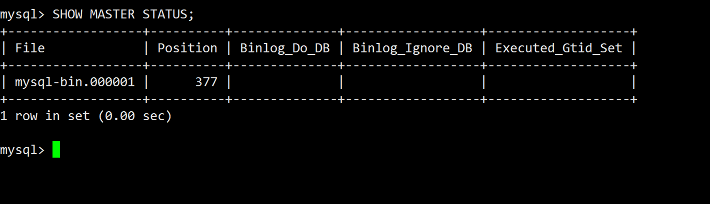

实现 MySQL 的**读写分离架构**，需要通过配置主从复制来实现读写的分离，即将**写操作**发送到主节点，将**读操作**发送到从节点。常用的工具包括 **MySQL 主从复制** 配置和 **MySQL Router** 或 **ProxySQL** 等中间层代理工具来实现负载均衡和路由。

下面是配置读写分离架构的步骤，分为主从复制的配置和使用代理工具实现读写分离。

### **1. MySQL 主从复制配置**

#### **1.1 设置主节点 (Master)**
1. **修改主节点的配置文件** `my.cnf`，启用二进制日志并设置服务器 ID（每个节点的 `server-id` 必须唯一）。

```ini
[mysqld]
log-bin=mysql-bin      # 启用二进制日志
server-id=1            # 主节点的唯一ID
```

2. **重启 MySQL 服务** 以应用配置。

```bash
sudo systemctl restart mysql
```

3. **创建复制用户**，在主节点上设置，为从节点提供复制权限。

```sql
CREATE USER 'repl_user'@'%' IDENTIFIED BY 'password';
GRANT REPLICATION SLAVE ON *.* TO 'repl_user'@'%';
FLUSH PRIVILEGES;
```

4. **锁定主节点表**以进行一致性备份。

```sql
FLUSH TABLES WITH READ LOCK;
```

5. **导出主节点的数据库**。你可以使用 `mysqldump` 备份所有数据库：

```bash
mysqldump -u root -p --all-databases --master-data > /path/to/backup.sql
```

6. **获取二进制日志文件名和位置**，以便从节点进行复制。

```sql
SHOW MASTER STATUS;
```
记下 `File` 和 `Position` 的值。



#### **1.2 设置从节点 (Slave)**
1. **修改从节点的配置文件** `my.cnf`，设置 `server-id`（确保与主节点不同）并禁用二进制日志（除非你要做链式复制）。

```ini
[mysqld]
server-id=2            # 从节点的唯一ID
log-bin=mysql-bin      # 选项：如果需要从节点作为链式复制中的主节点
```

2. **重启从节点的 MySQL 服务**。

```bash
sudo systemctl restart mysql
```

3. **将主节点的备份文件恢复到从节点**。

```bash
mysql -u root -p < /path/to/backup.sql
```

4. **配置从节点指向主节点**，并使用在主节点创建的 `repl_user` 进行复制。

```sql
CHANGE MASTER TO
MASTER_HOST='主节点IP',
MASTER_USER='repl_user',
MASTER_PASSWORD='password',
MASTER_LOG_FILE='mysql-bin.000001',  # 主节点的二进制日志文件名
MASTER_LOG_POS=12345;                # 主节点的二进制日志位置
```

5. **启动复制**。

```sql
START SLAVE;
```

6. **检查复制状态**，确认从节点与主节点同步。

```sql
SHOW SLAVE STATUS\G;
```

在 `Slave_IO_Running` 和 `Slave_SQL_Running` 都显示为 `Yes` 时，说明复制已经成功。

### **2. 使用 ProxySQL 实现读写分离**

ProxySQL 是一个高性能的 MySQL 代理，可以实现读写分离和负载均衡。

#### **2.1 安装 ProxySQL**
在 Linux 上安装 ProxySQL：

```bash
sudo apt install proxysql  # Ubuntu/Debian
sudo yum install proxysql  # CentOS/RHEL
```

#### **2.2 配置 ProxySQL**

1. **登录 ProxySQL 的管理界面**：

```bash
mysql -u admin -padmin -h 127.0.0.1 -P6032
```

2. **添加主节点和从节点信息**到 `mysql_servers` 表中。

```sql
-- 添加主节点
INSERT INTO mysql_servers (hostgroup_id, hostname, port, weight, max_connections) 
VALUES (10, '主节点IP', 3306, 1000, 100);

-- 添加从节点
INSERT INTO mysql_servers (hostgroup_id, hostname, port, weight, max_connections) 
VALUES (20, '从节点IP', 3306, 1000, 100);

-- 保存更改
LOAD MYSQL SERVERS TO RUNTIME;
SAVE MYSQL SERVERS TO DISK;
```

3. **创建读写分离规则**：
   - 将写操作路由到主节点（hostgroup 10）。
   - 将读操作路由到从节点（hostgroup 20）。

```sql
-- 默认所有查询发送到主节点
INSERT INTO mysql_query_rules (rule_id, active, match_pattern, destination_hostgroup, apply) 
VALUES (1, 1, '^SELECT.*', 20, 1);   -- 匹配 SELECT 语句，将读请求发送到从节点

-- 其他操作（如 INSERT、UPDATE 等）发送到主节点
INSERT INTO mysql_query_rules (rule_id, active, match_pattern, destination_hostgroup, apply) 
VALUES (2, 1, '^INSERT.*|^UPDATE.*|^DELETE.*', 10, 1);

-- 保存更改
LOAD MYSQL QUERY RULES TO RUNTIME;
SAVE MYSQL QUERY RULES TO DISK;
```

4. **配置 MySQL 用户和密码**，以便 ProxySQL 能够与 MySQL 服务器通信。

```sql
-- 设置用户和密码
INSERT INTO mysql_users (username, password, default_hostgroup, transaction_persistent) 
VALUES ('app_user', 'password', 10, 1);

-- 保存更改
LOAD MYSQL USERS TO RUNTIME;
SAVE MYSQL USERS TO DISK;
```

5. **测试连接**，确保读写分离生效。

使用 `app_user` 登录 MySQL 客户端：

```bash
mysql -u app_user -p -h 127.0.0.1 -P6033
```

测试读操作是否路由到从节点，写操作是否路由到主节点。

### **3. 使用 MySQL Router 实现读写分离**
MySQL Router 是 MySQL 官方提供的路由工具，支持自动读写分离。

#### **3.1 安装 MySQL Router**

```bash
sudo apt install mysql-router  # Ubuntu/Debian
sudo yum install mysql-router  # CentOS/RHEL
```

#### **3.2 配置 MySQL Router**
1. **初始化 MySQL Router**，并指向主从复制的主节点。

```bash
mysqlrouter --bootstrap user@主节点IP:3306 --user=root --directory /path/to/router-directory
```

2. **配置文件中会自动生成读写分离的端口**：
   - **读写端口**：3306（默认用于写操作）
   - **只读端口**：3307（默认用于读操作）

3. **启动 MySQL Router**。

```bash
mysqlrouter --config /path/to/router-directory/mysqlrouter.conf
```

### **总结**
通过配置 MySQL 主从复制并使用代理工具如 ProxySQL 或 MySQL Router，你可以轻松实现 MySQL 的读写分离架构。此方案能够提升数据库的性能，减少主节点的压力，并提高系统的容错性。

---

要确保两台一主一备的 MySQL 服务持续可靠运行，日常检查非常重要。通过定期检查 MySQL 复制的状态、性能和数据一致性，可以及时发现和解决问题。下面是两台服务器（主库与从库）的日常检查步骤，确保主备复制正常工作。

### 1. 检查主从复制状态

#### 在从库上检查 MySQL 复制状态

在从库上，通过运行以下命令，可以检查从库的复制状态：

```sql
SHOW SLAVE STATUS\G;
```

重点关注以下字段：

- **Slave_IO_Running** 和 **Slave_SQL_Running**：这两个字段的值应该是 `Yes`。如果为 `No`，表示复制出现问题，可能需要进行进一步检查。
- **Seconds_Behind_Master**：这个值表示从库落后主库的时间，正常情况下应该接近于 `0`。如果这个值持续增大，说明从库无法及时从主库获取和应用日志，可能需要优化网络、检查主库负载或检查从库性能。
- **Last_IO_Error** 和 **Last_SQL_Error**：如果有任何错误信息，需立即处理。

#### 检查主库日志

在主库上检查是否有任何与复制相关的错误，运行以下命令查看日志：

```bash
tail -f /var/log/mysql/mysql-error.log
```

观察日志是否有关于主从复制的异常信息，如网络问题或数据一致性问题。

### 2. 测试从库的只读模式

为了确保从库处于只读模式，可以通过以下命令在从库上检查是否设置为只读：

```sql
SHOW VARIABLES LIKE 'super_read_only';
```

应返回 `ON`。如果返回 `OFF`，可以通过以下命令将从库设置为只读，以防止意外写入：

```sql
SET GLOBAL super_read_only = ON;
```

### 3. 检查主库与从库的同步情况

#### 数据一致性检查

定期对主库和从库的数据进行一致性检查是维护主从复制的关键步骤。可以使用 `pt-table-checksum` 来检查主库和从库的表是否一致：

1. 安装 Percona Toolkit。
2. 使用以下命令进行一致性检查：

```bash
pt-table-checksum --execute --host=主库IP --user=用户名 --password=密码 --databases=要检查的数据库名
```

如果发现不一致，需要使用 `pt-table-sync` 来修复：

```bash
pt-table-sync --execute --sync-to-master h=从库IP,D=数据库名,t=表名 --user=用户名 --password=密码
```

### 4. 网络和性能监控

#### 检查主备之间的网络延迟

定期检查主备之间的网络延迟可以确保数据传输的效率。使用 `ping` 或 `mtr` 工具：

```bash
ping 主库IP
```

如果网络延迟较大，可能需要检查网络配置或提升带宽。

#### 性能监控

可以使用 `SHOW PROCESSLIST` 命令来监控 MySQL 当前的活动查询和线程，确保没有长时间阻塞的查询：

```sql
SHOW PROCESSLIST;
```

定期查看主库和从库的性能负载，检查 CPU 和内存的使用情况，确保数据库服务不出现性能瓶颈。

### 5. 日志与备份管理

#### 定期清理二进制日志

MySQL 主库的二进制日志会持续增加，定期清理可以节省磁盘空间。可以使用以下命令自动删除超过指定天数的日志：

```sql
PURGE BINARY LOGS BEFORE NOW() - INTERVAL 7 DAY;
```

#### 定期备份

确保主库和从库都有定期备份策略，使用 `mysqldump` 或者 XtraBackup 工具进行定时备份。

```bash
mysqldump -u root -p --all-databases > backup.sql
```

使用 `cron` 任务调度工具来自动化备份。

### 6. 监控和报警

#### 设置自动化监控

为了简化日常检查，可以使用监控工具（如 Zabbix、Prometheus、Nagios）来监控 MySQL 的健康状态。重点监控以下指标：

- 主从复制状态（`Slave_IO_Running`，`Slave_SQL_Running`）
- `Seconds_Behind_Master`
- 服务器的性能指标（CPU、内存、磁盘 I/O）
- 数据库查询的执行效率

#### 设置报警机制

为 MySQL 复制状态、网络延迟、性能负载等设置报警机制，确保在发现问题时能够及时通知到相关运维人员。

### 总结

- **定期检查复制状态**：确保从库的 `Slave_IO_Running` 和 `Slave_SQL_Running` 状态为 `Yes`，并监控复制延迟（`Seconds_Behind_Master`）。
- **检查数据一致性**：使用工具进行一致性检查，确保主库与从库的数据同步。
- **监控和报警**：使用自动化监控工具监控主从复制状态、性能和网络，并配置报警机制及时处理问题。
- **维护只读模式**：确保从库处于只读模式，防止误操作。