# Rocket.Chat vs ChatSystem 架构对比分析

## 📋 项目概览

### Rocket.Chat
- **技术栈**: TypeScript (前后端统一)
- **前端框架**: React + Meteor
- **后端框架**: Meteor + Moleculer (微服务框架)
- **数据库**: MongoDB
- **实时通信**: DDP (Distributed Data Protocol) + WebSocket
- **架构模式**: Monorepo + 微服务

### ChatSystem
- **技术栈**: C++ (后端) + Qt (前端)
- **前端框架**: Qt Widgets + Qt Network
- **后端框架**: 自研 RPC + gRPC
- **数据库**: MySQL + Redis + Elasticsearch
- **实时通信**: WebSocket + HTTP
- **架构模式**: 多仓库 + 微服务

## 🏗️ 整体架构对比

### Rocket.Chat 架构

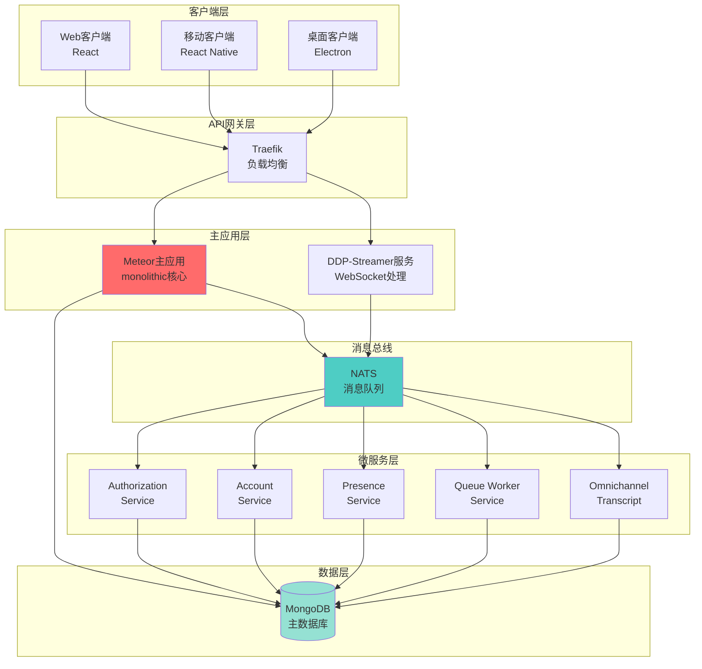

### ChatSystem 架构

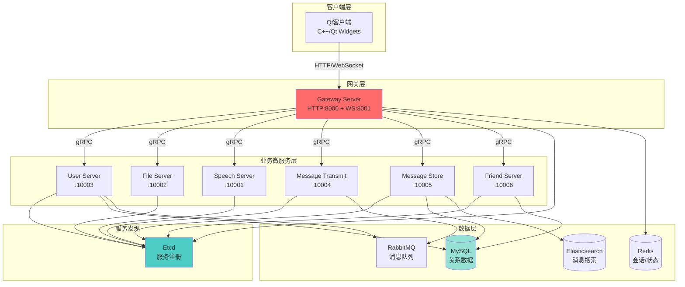

## 🔄 微服务架构对比

### Rocket.Chat：混合架构

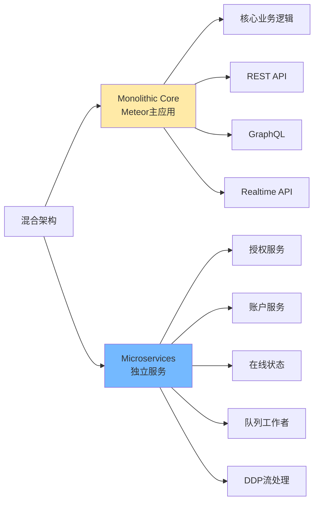

**特点：**
- ✅ **渐进式微服务**：保留 Meteor 单体核心，逐步拆分服务
- ✅ **Moleculer框架**：统一的微服务治理
- ✅ **NATS消息总线**：服务间通信
- ⚠️ **混合复杂度**：既有单体又有微服务

### ChatSystem：纯微服务架构

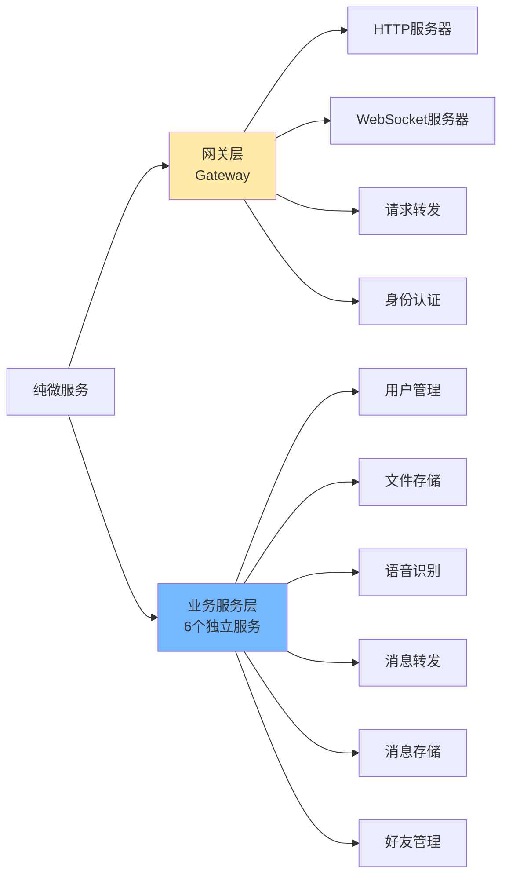

**特点：**
- ✅ **完全解耦**：所有服务独立部署
- ✅ **gRPC通信**：高性能 RPC
- ✅ **Etcd注册**：动态服务发现
- ✅ **职责单一**：每个服务功能明确

## 📡 实时通信机制对比

### Rocket.Chat：DDP协议

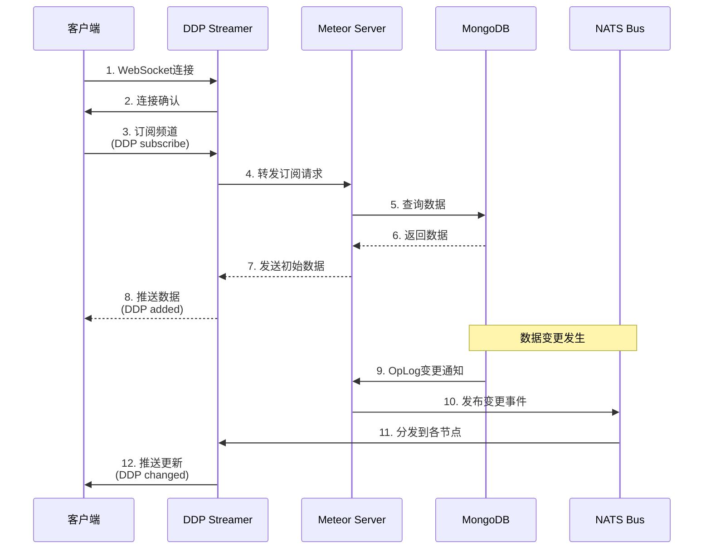

**DDP (Distributed Data Protocol) 特点：**
- 📊 **发布-订阅模式**：客户端订阅数据集合
- 🔄 **自动同步**：MongoDB OpLog 实时监听
- 📦 **数据版本管理**：支持乐观更新
- 🎯 **RPC调用**：Method calls
- ⚡ **延迟补偿**：客户端立即更新，服务器确认

### ChatSystem：传统WebSocket

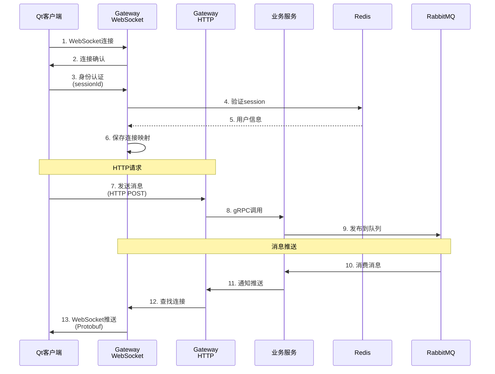

**传统WebSocket特点：**
- 🔌 **长连接维护**：手动管理连接生命周期
- 📨 **单向推送**：服务器主动推送通知
- 🔐 **手动认证**：需要显式身份验证
- 📦 **Protobuf序列化**：二进制传输
- ⚠️ **无自动重连**：需客户端实现

## 💾 数据持久化对比

### Rocket.Chat：MongoDB为中心

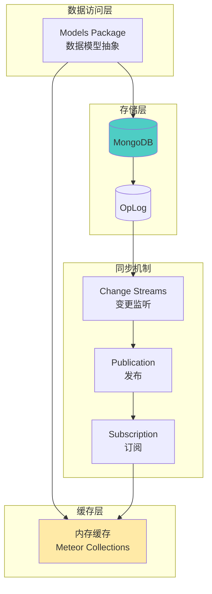

**特点：**
- 📄 **文档数据库**：灵活的Schema
- 🔄 **OpLog同步**：自动数据同步
- 💾 **Minimongo**：客户端本地数据库镜像
- 📊 **集合发布**：细粒度数据订阅
- ⚡ **无需ORM**：直接操作文档

**主要集合：**
```typescript
// 用户
users
// 房间/频道
rooms
// 消息
rocketchat_message
// 订阅关系
rocketchat_subscription
// 上传文件
rocketchat_uploads
```

### ChatSystem：多数据库组合

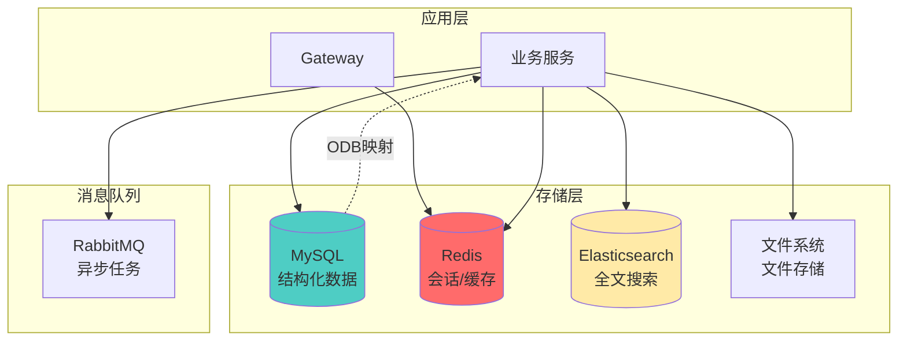

**特点：**
- 🗃️ **关系数据库**：强一致性，事务支持
- 🚀 **Redis缓存**：会话、状态、热数据
- 🔍 **ES搜索**：消息全文检索
- 📁 **文件系统**：多媒体存储
- 🔄 **ODB映射**：对象关系映射

**数据分布：**
```cpp
// MySQL - 结构化数据
tb_user          // 用户表
tb_friend        // 好友关系
tb_chat_session  // 会话表
tb_message       // 消息表

// Redis - 临时数据
session:{id} -> user_id    // 登录会话
status:{id} -> online/offline  // 在线状态
connection:{id} -> ws_handle   // WebSocket连接

// Elasticsearch - 搜索索引
message_index    // 消息搜索
```

## 🌐 前端架构对比

### Rocket.Chat：Web优先

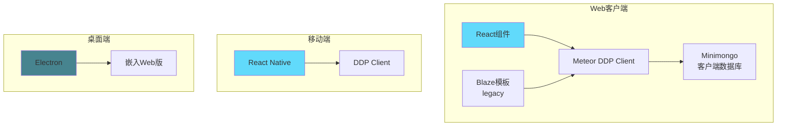

**技术栈：**
- ⚛️ **React**: 现代UI组件
- 🔥 **Blaze**: 遗留模板（正在迁移）
- 📱 **React Native**: 移动端代码共享
- 💻 **Electron**: 桌面端Web包装
- 🗄️ **Minimongo**: 本地数据缓存

### ChatSystem：原生桌面

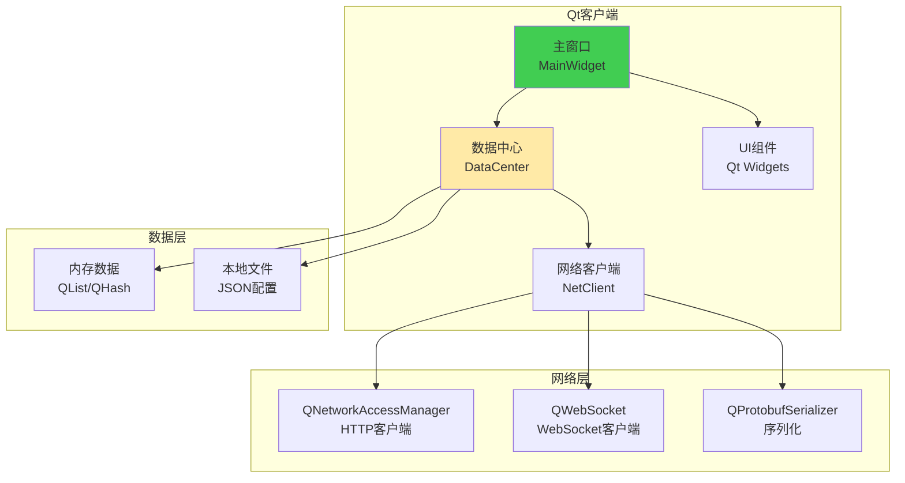

**技术栈：**
- 🖥️ **Qt Widgets**: 原生UI控件
- 🌐 **Qt Network**: HTTP/WebSocket
- 📦 **Protobuf**: 数据序列化
- 💾 **JSON**: 配置持久化
- 🎨 **QSS**: 样式定制

## 📊 服务拆分策略对比

### Rocket.Chat：按功能域拆分

| 服务名称 | 职责 | 独立性 |
|---------|------|--------|
| **Meteor主应用** | 核心业务逻辑、API、UI渲染 | ⭐⭐ |
| **Authorization Service** | 权限验证、角色管理 | ⭐⭐⭐⭐ |
| **Account Service** | 账户管理 | ⭐⭐⭐⭐ |
| **Presence Service** | 在线状态管理 | ⭐⭐⭐⭐⭐ |
| **DDP Streamer** | WebSocket连接管理 | ⭐⭐⭐⭐⭐ |
| **Queue Worker** | 异步任务处理 | ⭐⭐⭐⭐ |
| **Omnichannel Service** | 全渠道客服 | ⭐⭐⭐⭐ |

### ChatSystem：按业务能力拆分

| 服务名称 | 职责 | 独立性 |
|---------|------|--------|
| **Gateway Server** | 统一网关、路由转发 | ⭐⭐ |
| **User Server** | 用户注册、登录、信息管理 | ⭐⭐⭐⭐⭐ |
| **Friend Server** | 好友关系、会话管理 | ⭐⭐⭐⭐⭐ |
| **Message Transmit** | 消息转发、实时推送 | ⭐⭐⭐⭐⭐ |
| **Message Store** | 消息持久化、搜索 | ⭐⭐⭐⭐⭐ |
| **File Server** | 文件上传、下载、存储 | ⭐⭐⭐⭐⭐ |
| **Speech Server** | 语音识别 | ⭐⭐⭐⭐⭐ |

## 🔐 认证与鉴权对比

### Rocket.Chat

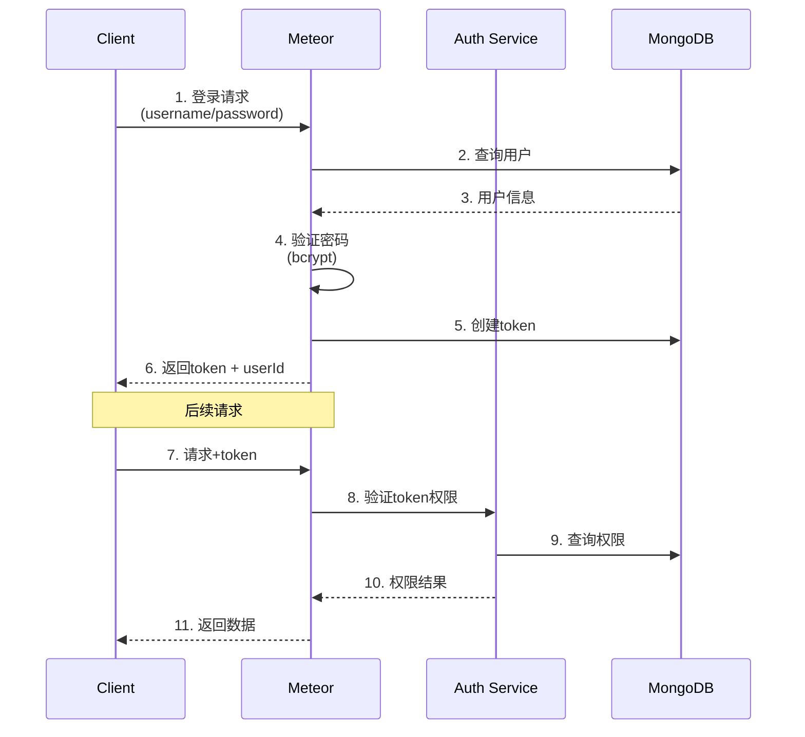

### ChatSystem

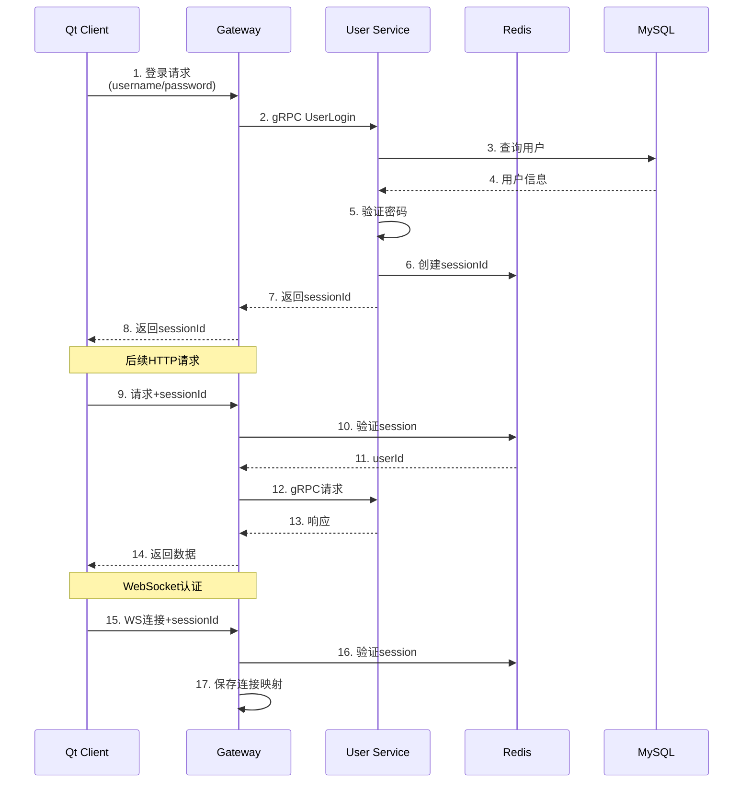

## 🎯 核心差异总结

### 架构理念

| 维度 | Rocket.Chat | ChatSystem |
|------|------------|-----------|
| **架构模式** | 混合式（Monolith + Microservices） | 纯微服务 |
| **技术选型** | TypeScript统一栈 | C++后端 + Qt前端 |
| **框架依赖** | Meteor + Moleculer | 自研 + gRPC |
| **服务治理** | NATS消息总线 | Etcd服务发现 |
| **数据存储** | MongoDB单一数据源 | 多数据库组合 |

### 实时通信

| 维度 | Rocket.Chat (DDP) | ChatSystem (WebSocket) |
|------|------------------|----------------------|
| **协议** | DDP over WebSocket | 原始WebSocket + Protobuf |
| **数据同步** | 自动同步（OpLog） | 手动推送 |
| **客户端缓存** | Minimongo镜像 | 内存临时缓存 |
| **重连策略** | 自动重连 + 断线补偿 | 需手动实现 |
| **复杂度** | 高（框架封装） | 低（直接控制） |

### 数据持久化

| 维度 | Rocket.Chat | ChatSystem |
|------|------------|-----------|
| **主数据库** | MongoDB（文档） | MySQL（关系） |
| **缓存** | 内存（Meteor） | Redis |
| **搜索** | MongoDB索引 | Elasticsearch |
| **一致性** | 最终一致 | 强一致（事务） |
| **Schema** | 灵活Schema | 严格Schema |

### 开发体验

| 维度 | Rocket.Chat | ChatSystem |
|------|------------|-----------|
| **代码组织** | Monorepo统一管理 | 多仓库分离 |
| **类型安全** | TypeScript | C++强类型 |
| **热更新** | 支持（Meteor HMR） | 不支持 |
| **调试难度** | 中等 | 较高 |
| **学习曲线** | 中等（Meteor生态） | 陡峭（C++/Qt） |

## 🚀 性能与扩展性

### Rocket.Chat

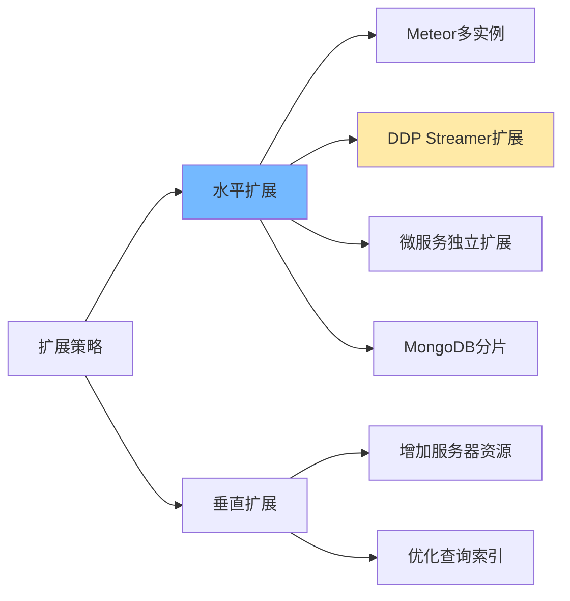

**优势：**
- ✅ 微服务可独立扩展
- ✅ DDP Streamer分担WebSocket连接
- ✅ MongoDB水平分片
- ⚠️ Meteor主应用仍是瓶颈

### ChatSystem

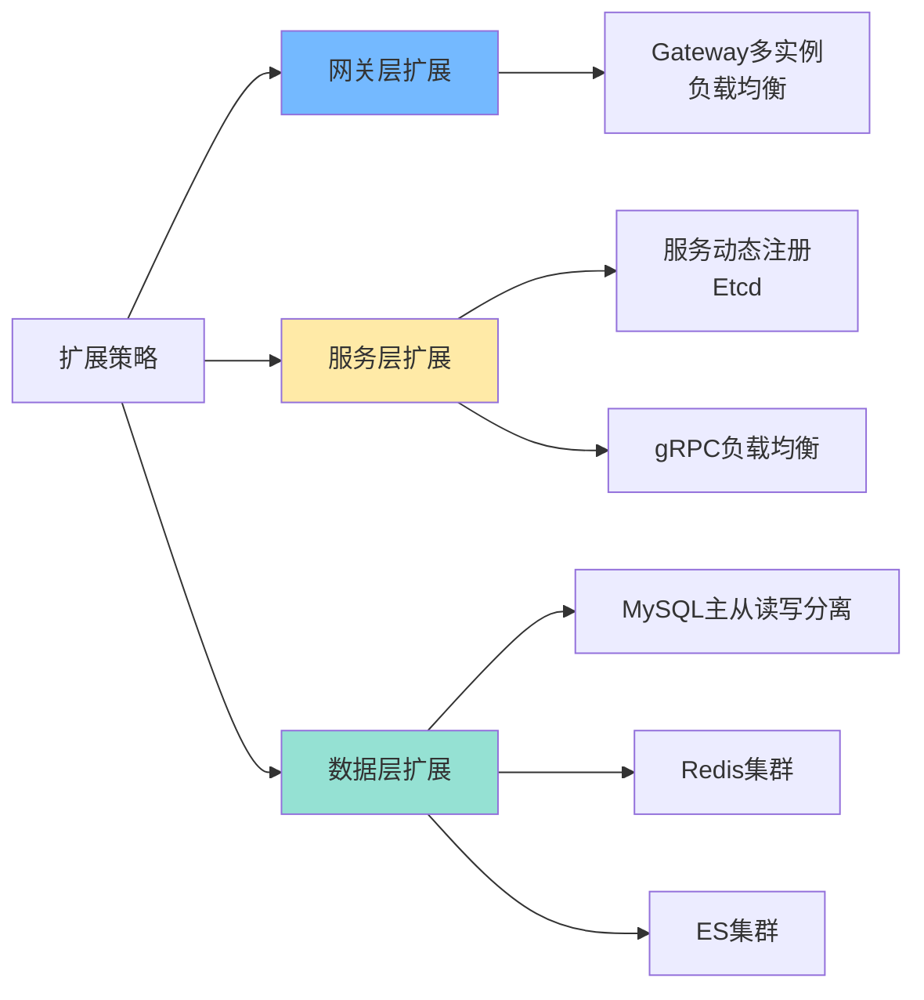

**优势：**
- ✅ 完全无状态，易扩展
- ✅ 每个服务可独立伸缩
- ✅ 数据库层面读写分离
- ✅ C++高性能

## 💡 最佳实践建议

### 适合使用Rocket.Chat架构的场景

✅ **Web优先**：主要面向浏览器用户  
✅ **快速开发**：需要快速迭代和上线  
✅ **团队熟悉JS/TS**：前后端统一技术栈  
✅ **实时协作**：需要复杂的实时数据同步  
✅ **文档数据**：数据结构灵活多变

### 适合使用ChatSystem架构的场景

✅ **性能要求高**：需要极致性能  
✅ **桌面应用**：主要面向原生客户端  
✅ **C++技术栈**：团队有C++经验  
✅ **数据一致性**：需要事务支持  
✅ **精细控制**：需要底层控制能力

## 🔮 架构演进建议

### 对于 ChatSystem 项目

1. **考虑添加 API 网关增强功能**
   - 统一认证、限流、监控
   - 推荐：Kong、APISIX

2. **服务间通信可考虑消息队列**
   - 已有 RabbitMQ，可加强使用
   - 解耦服务依赖

3. **前端可考虑Web版本**
   - 使用 WebAssembly 编译 C++ 核心逻辑
   - 或开发独立的 Web 客户端

4. **监控和追踪**
   - 添加 Prometheus + Grafana
   - 分布式追踪（OpenTelemetry）

5. **客户端数据持久化增强**
   - 当前只保存 sessionId 和未读计数
   - 可考虑使用 SQLite 缓存更多数据
   - 实现离线消息浏览功能

### 对于学习 Rocket.Chat 的开发者

1. **理解 DDP 协议**
   - 深入学习发布-订阅模式
   - 了解 OpLog 变更监听

2. **掌握 Moleculer 框架**
   - 微服务编排
   - 服务发现和负载均衡

3. **Monorepo 管理**
   - Turborepo 构建优化
   - Yarn Workspaces 依赖管理

4. **从 Meteor 迁移**
   - Rocket.Chat 正在逐步减少对 Meteor 的依赖
   - 学习如何渐进式重构单体应用

## 📈 技术栈对比图

### Rocket.Chat 技术栈

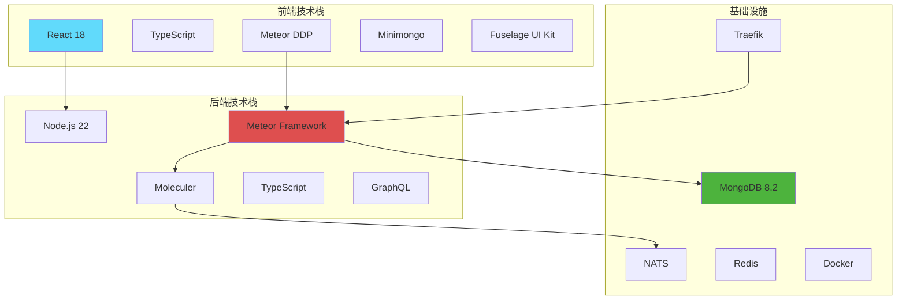

### ChatSystem 技术栈

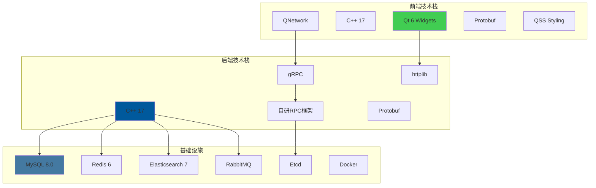

## 🔍 代码组织对比

### Rocket.Chat：Monorepo结构

```
Rocket.Chat/
├── apps/
│   ├── meteor/              # 主应用（单体核心）
│   │   ├── app/            # 业务逻辑模块
│   │   ├── client/         # 客户端代码
│   │   ├── server/         # 服务端代码
│   │   └── ee/             # 企业版功能
│   └── uikit-playground/   # UI组件测试
├── packages/                # 共享包
│   ├── core-services/      # 核心服务接口
│   ├── models/             # 数据模型
│   ├── api-client/         # API客户端
│   ├── ui-kit/             # UI组件库
│   └── ...                 # 50+ 共享包
├── ee/                      # 企业版
│   ├── apps/
│   │   ├── authorization-service/
│   │   ├── account-service/
│   │   ├── presence-service/
│   │   ├── ddp-streamer/
│   │   └── queue-worker/
│   └── packages/
└── docker-compose.yml       # 服务编排
```

### ChatSystem：多仓库结构

```
cpp_chatsystem/
├── ChatSystem-Backend/      # 后端仓库
│   ├── 1.Speech_Server/    # 语音服务
│   ├── 2.File_Server/      # 文件服务
│   ├── 3.User_Server/      # 用户服务
│   ├── 4.Message_Transmit_Server/
│   ├── 5.Message_Store_Server/
│   ├── 6.Friend_Server/    # 好友服务
│   ├── 7.Gateway_Server/   # 网关服务
│   ├── Common/             # 共享代码
│   ├── APIs/               # API定义
│   ├── ODB/                # ORM映射
│   └── docker-compose.yaml
├── ChatSystem-Frontend-QtProj/  # 前端仓库
│   ├── ChatClient_Qt/      # Qt客户端
│   │   ├── network/        # 网络层
│   │   ├── model/          # 数据模型
│   │   └── *.cpp/*.h       # UI组件
│   └── ChatServerMock_Qt/  # 测试服务器
└── Docs-and-demos/          # 文档仓库
```

## 🎓 学习路径建议

### 想学习 Rocket.Chat 架构

1. **基础知识** (2-3周)
   - JavaScript/TypeScript 基础
   - Node.js 运行时
   - MongoDB 数据库

2. **框架学习** (3-4周)
   - Meteor 框架核心概念
   - React 组件开发
   - DDP 协议理解

3. **微服务实践** (2-3周)
   - Moleculer 微服务框架
   - NATS 消息队列
   - 服务编排与部署

4. **深入源码** (持续)
   - 阅读 Rocket.Chat 核心模块
   - 理解实时同步机制
   - 学习大型 Monorepo 管理

### 想学习 ChatSystem 架构

1. **基础知识** (4-6周)
   - C++ 现代特性（C++17）
   - Qt 框架基础
   - 网络编程基础

2. **框架学习** (3-4周)
   - Qt Widgets UI开发
   - Qt Network 网络编程
   - gRPC 和 Protobuf

3. **微服务实践** (2-3周)
   - 微服务设计模式
   - Etcd 服务发现
   - Docker 容器化

4. **数据库技术** (2-3周)
   - MySQL 设计与优化
   - Redis 缓存策略
   - Elasticsearch 搜索引擎

5. **深入源码** (持续)
   - 阅读 ChatSystem 各服务实现
   - 理解 RPC 调用链路
   - 学习 C++ 服务端开发

## 📚 参考资源

### Rocket.Chat 相关
- [Rocket.Chat 官方文档](https://docs.rocket.chat/)
- [Rocket.Chat GitHub](https://github.com/RocketChat/Rocket.Chat)
- [Meteor 文档](https://docs.meteor.com/)
- [Moleculer 框架](https://moleculer.services/)
- [DDP 协议规范](https://github.com/meteor/meteor/blob/devel/packages/ddp/DDP.md)

### ChatSystem 相关
- [Qt 官方文档](https://doc.qt.io/)
- [gRPC 官方文档](https://grpc.io/)
- [Protobuf 文档](https://protobuf.dev/)
- [Etcd 文档](https://etcd.io/docs/)

### 微服务架构
- [Martin Fowler - Microservices](https://martinfowler.com/articles/microservices.html)
- [The Twelve-Factor App](https://12factor.net/)
- [Building Microservices by Sam Newman](https://samnewman.io/books/building_microservices_2nd_edition/)

---

**文档创建时间**: 2026-01-12  
**ChatSystem 版本**: v1.0  
**Rocket.Chat 版本**: v8.1.0-develop  
**作者**: AI Assistant  
**更新记录**: 
- 2026-01-12: 初始版本，完成架构对比分析
