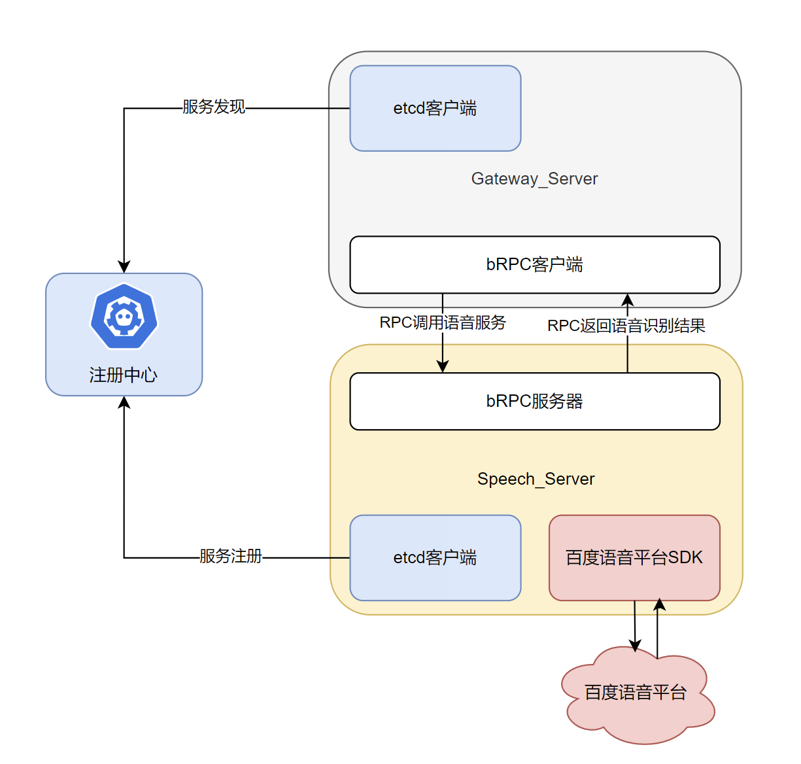

# 一、聊天室后端服务器摘要

项目流程：
1. 功能需求确定阶段：
    - 要做什么，实现什么项目
    - 实现这个项目，需要内部拥有哪些功能

2. 设计阶段
    - 概要框架设计
    - 功能模块接口设计

3. 技术调研，搭建开发环境阶段
    - 确定使用哪些技术框架/库，了解它们的基础使用
    - 将开发环境搭建起来

4. 具体实现阶段
5. 单元测试阶段：确定每一个模块实现的没有问题
6. 系统联调阶段


# 二、功能需求确定阶段
## 功能演示与介绍

在聊天室项目的功能设计中，包含了以下功能：
1. 用户注册：用户输入用户名(昵称)，以及密码进行用户名的注册
2. 用户登录：用户通过用户名和密码进行登录
3. 短信验证码获取：当用户通过手机号注册或登录的时候，需要获取短信验证码
4. 手机号注册：用户输入手机号和短信验证码进行手机号的用户注册
5. 手机号登录：用户输入手机号和短信验证码进行手机号的用户登录
6. 用户信息获取：当用户登录之后，获取个人信息进行展示
7. 头像修改：设置用户头像
8. 昵称修改：设置用户昵称
9. 签名修改：设置用户签名
10. 手机号修改：修改用户的绑定手机号
11. 好友列表的获取：当用户登录成功之后，获取自己好友列表进行展示
12. 申请好友：搜索用户之后，点击申请好友，向对方发送好友申请
13. 待处理申请的获取：当用户登录成功之后，会获取离线的好友申请请求以待处理
14. 好友申请的处理：针对收到的好友申请进行同意/拒绝的处理
15. 删除好友：删除当前好友列表中的好友
16. 用户搜索：可以进行用户的搜索用于申请好友
17. 聊天会话列表的获取：每个单人/多人聊天都有一个聊天会话，在登录成功后可以获取聊天会话，查看历史的消息以及对方的各项信息
18. 多人聊天会话的创建：单人聊天会话在对方同意好友时创建，而多人会话需要调用该接口进行手动创建
19. 聊天成员列表的获取：多人聊天会话中，可以点击查看群成员按钮，查看群成员信息
20. 发送聊天消息：在聊天框输入内容后点击发送，则向服务器发送消息聊天请求
21. 获取历史消息：
    - 获取最近N条消息：用于登录成功后，点击对方头像打开聊天框时显示最近
    的消息
    - 获取指定时间段内的消息：用户可以进行聊天消息的按时间搜索
22. 消息搜索：用户可以进行聊天消息的关键字搜索
23. 文件的上传
    - 单个文件的上传：这个接口基本用于后台部分，收到文件消息后将文件数据转发给文件子服务进行存储
    - 多个文件的上传：这个接口基本用于后台部分，收到文件消息后将文件数据转发给文件子服务进行存储
24. 文件的下载
    - 单个文件的下载：在后台用于获取用户头像文件数据，以及客户端用于获取文件/语音/图片消息的文件数据
    - 多个文件的下载：在后台用于大批量获取用户头像数据（比如获取用户列表的时候），以及前端的批量文件下载
25. 语音消息的文字转换：客户端进行语音消息的文字转换。
除了以上的与客户端之间交互的功能之外，还包含一些服务器后台内部所需的功能：
    1. 消息的存储：用于将文本消息进行存储起来，以便于进行消息的搜索，以及离线消息的存储。
    2. 文件的存储：用于存储用户的头像文件，以及消息中的文件/图片/语音文件数据。
    3. 各项用户，好友，会话数据的存储管理

## 框架与微服务拆分设计

该项目在设计的时候采用**微服务**框架设计，微服务指将一个大的业务拆分称为多个子业务，分别在多台不同的机器节点上提供对应的服务，由网关服务统一接收多个客户端的各种不同请求，然后将请求分发到不同的子服务节点上进行处理，获取响应后，再转发给客户端。


微服务架构设计的思想主要包括以下几个方面：
1. 服务拆分：将应用程序拆分成多个小型服务，每个服务负责一部分业务功能，具有独立的生命周期和部署。
2. 独立部署：每个微服务可以独立于其他服务进行部署、更新和扩展。
3. 语言和数据的多样性：不同的服务可以使用不同的编程语言和数据库，根据服务的特定需求进行技术选型。
4. 轻量级通信：服务之间通过定义良好的API进行通信，通常使用HTTP/REST、
gRPC
等协议。
5. 去中心化治理：每个服务可以有自己的开发团队，拥有自己的技术栈和开发流程。
6. 弹性和可扩展性：微服务架构支持服务的动态扩展和收缩，以适应负载的变化。
7. 容错性：设计时考虑到服务可能会失败，通过断路器、重试机制等手段提高系统的容错性。
8. 去中心化数据管理：每个服务管理自己的数据库，数据在服务之间是私有的，这有助于保持服务的独立性。
9. 自动化部署：通过持续集成和持续部署（CI/CD）流程自动化服务的构建、测试和部署。
10. 监控和日志：对每个服务进行监控和日志记录，以便于跟踪问题和性能瓶颈。
11. 服务发现：服务实例可能动态变化，需要服务发现机制来动态地找到服务实例。
12. 安全：每个服务需要考虑安全问题，包括认证、授权和数据传输的安全性。


基于微服务的思想，以及聊天室项目的业务功能，将聊天室项目进行服务拆分为以下几个子服务：

### ① 网关服务
网关服务，提供与客户端进行直接交互的作用，用于接收客户端的各项不同的请求，进行用户鉴权通过后，将请求分发到各个不同的子服务进行处理，接收到响应后，发送给客户端。

用户鉴权：客户端在登录成功后，后台会为客户端创建登录会话，并向客户端返回一个登录会话ID，往后，客户端发送的所有请求中都必须带有对应的会话ID进行身份识别，否则视为未登录，不予提供除注册/登录/验证码获取以外的所有服务。

在网关服务中，基于不同的使用目的，向客户端提供两种不同的通信：

#### HTTP通信：
在项目的设计中客户端的大部分业务都是基于请求-响应模式进行的，因此基于便于扩展，设计简单的目的，采用HTTP协议作为与客户端进行基础的业务请求的通信协议，在HTTP通信中涵盖了上述所有的功能接口请求。
#### WEBSOCKET通信：
在聊天室项目中，不仅仅包含客户端主动请求的业务，还包含了一些需要服务器主动推送的通知，因为HTTP不支持服务器主动推送数据，因此采用Websocket协议进行长连接的通信，向客户端发送通知类型的数据，包括：
- 好友申请的通知
- 好友申请处理结果的通知
- 好友删除的通知
- 聊天会话建立的通知
- 聊天新消息的通知

### ② 用户管理子服务
用户管理子服务，主要用于管理用户的数据，以及关于用户信息的各项操作，因此在上述项目功能中，用户子服务需要提供以下接口：
1. 用户注册：用户输入用户名(昵称)，以及密码进行用户名的注册
2. 用户登录：用户通过用户名和密码进行登录
3. 短信验证码获取：当用户通过手机号注册或登录的时候，需要获取短信验证码
4. 手机号注册：用户输入手机号和短信验证码进行手机号的用户注册
5. 手机号登录：用户输入手机号和短信验证码进行手机号的用户登录
6. 用户信息获取：当用户登录之后，获取个人信息进行展示
7. 头像修改：设置用户头像
8. 昵称修改：设置用户昵称
9. 签名修改：设置用户签名
10. 手机号修改：修改用户的绑定手机号

### ③ 好友管理子服务
好友管理子服务，主要用于管理好友相关的数据与操作，因此主要负责以下接口：
1. 好友列表的获取：当用户登录成功之后，获取自己好友列表进行展示
2. 申请好友：搜索用户之后，点击申请好友，向对方发送好友申请
3. 待处理申请的获取：当用户登录成功之后，会获取离线的好友申请请求以待处理
4. 好友申请的处理：针对收到的好友申请进行同意/拒绝的处理
5. 删除好友：删除当前好友列表中的好友
6. 用户搜索：可以进行用户的搜索用于申请好友
7. 聊天会话列表的获取：每个单人/多人聊天都有一个聊天会话，在登录成功后可以获取聊天会话，查看历史的消息以及对方的各项信息
8. 多人聊天会话的创建：单人聊天会话在对方同意好友时创建，而多人会话需要调用该接口进行手动创建
9. 聊天成员列表的获取：多人聊天会话中，可以点击查看群成员按钮，查看群成员信息

### ④ 消息转发子服务
消息转发子服务，主要用于针对一条消息内容，组织消息的ID以及各项所需要素，然后告诉网关服务器一条消息应该发给谁。

该服务并不是提供消息的转发功能，而是告诉网关服务器这条消息应该发给谁。

通常消息都是以聊天会话为基础进行发送的，根据会话找到它的所有成员，这就是转发的目标。

除此之外，消息转发子服务将收到的消息，放入消息队列中，由文件子服务/消息存储子服务进行消费存储。

因此转发管理子服务只提供一个接口：
- 获取消息转发目标：针对消息内容，根据其中的会话信息，告知网关转发目标。

### ⑤ 消息存储子服务
消息存储子服务，主要用于持久化存储消息、查询消息，因此需要提供以下接口：
1. 获取消息：
    - 获取最近N条消息：用于登录成功后，点击对方头像打开聊天框时显示最近的消息
    - 获取指定时间段内的消息：用户可以进行聊天消息的按时间搜索
2. 消息的关键字搜索：用户可以进行聊天消息的关键字搜索


### ⑥ 文件管理子服务
文件管理子服务，主要用于管理用户的头像，以及消息中的文件存储，因此需要提供以下接口：
1. 文件的上传
    - 单个文件的上传：这个接口基本用于后台部分，收到文件消息后将文件数据转发给文件子服务进行存储
    - 多个文件的上传：这个接口基本用于后台部分，收到文件消息后将文件数据转发给文件子服务进行存储
2. 文件的下载
    - 单个文件的下载：在后台用于获取用户头像文件数据，以及客户端用于获取文件/语音/图片消息的文件数据
    - 多个文件的下载：在后台用于大批量获取用户头像数据（比如获取用户列表的时候），以及前端的批量文件下载

### ⑦ 语音转文字子服务
语音转文字子服务，用于调用语音识别SDK，进行语音识别，将语音转为文字后返回给网关。语音转文字子服务只提供一个接口：
- 语音消息的文字转换：客户端进行语音消息的文字转换。


## 项目所使用到的框架/库
- _**gflags**_：针对程序运行所需的运行参数解析/配置文件解析框架。
- _**gtest**_：针对程序编写到一定阶段后，进行的单元测试框架。
- _**spdlog**_：针对项目中进行日志输出的框架。
- _**protobuf**_：针对项目中的网络通信数据所采用的序列化和反序列化框架。
- _**brpc**_：项目中的rpc调用使用的框架。
- _**redis**_：高性能键值存储系统，用于项目中进行用户登录会话信息的存储管理。
- _**mysql**_：关系型数据库系统，用于项目中的业务数据的存储管理。
- _**ODB**_：项目中mysql数据库操作的ORM框架（Object-Relational Mapping，对象关系映射）
- _**Etcd**_：分布式、高可用的一致性键值存储系统，用于项目中实现服务注册与发现功能的框架。
- _**cpp-httplib**_：用于搭建简单轻量HTTP服务器的框架。
- _**websocketpp**_：用于搭建Websocket服务器的框架。
- _**rabbitMQ**_：用于搭建消息队列服务器，用于项目中持久化消息的转发消费。
- _**elasticsearch**_：用于搭建文档存储/搜索服务器，用于项目中历史消息的存储管理
- _**语音云平台**_：采用百度语音识别技术云平台实现语音转文字功能。
- _**短信云平台**_：采用阿里云短信云平台实现手机短信验证码通知功能。
- _**cmake**_：项目工程的构建工具。
- _**docker**_：项目工程的一键式部署工具。

## 后台服务技术框架图


# 三、开发环境的快速搭建

开发环境的搭建是一个非常重要的步骤，它确保了开发过程中可以顺利进行编译、调试以及最终的部署。下面将详细介绍如何在Linux系统中搭建一个完整的C++开发环境。所有组件的用法，详见[组件教程](./Playground/Kit_Tutorial.md)

## 1. 基础工具安装

首先，我们需要安装一些基础的开发工具。这些工具包括编辑器、编译器、调试器、构建工具、传输工具和版本管理工具。

### 1.1 编辑器安装

```bash
sudo apt-get install vim
```

Vim 是一个功能强大的文本编辑器，在C++开发中非常常用。

### 1.2 编译器安装

```bash
sudo apt-get install gcc g++
```

GCC 和 G++ 是 GNU 的编译器集合，分别用于C和C++语言的编译。

### 1.3 调试器安装

```bash
sudo apt-get install gdb
```

GDB 是GNU的调试器，用于调试C/C++程序。

### 1.4 项目构建工具安装

```bash
sudo apt-get install make cmake
```

Make 和 CMake 是常用的构建工具，用于自动化构建过程。

### 1.5 传输工具安装

```bash
sudo apt-get install lrzsz
```

Lrzsz 是一组文件传输工具，支持X/Y/ZMODEM协议。

### 1.6 版本管理工具安装

```bash
sudo apt-get install git
```

Git 是目前最流行的分布式版本控制系统，用于跟踪源代码的变化。

## 2. 常用框架安装

在开发C++应用程序时，通常会使用一些第三方框架来简化开发工作。以下是一些常用框架的安装步骤。
**
### 2.1 gflags 框架**安装

```bash
sudo apt-get install libgflags-dev
```

Gflags 是一个命令行标志解析库。

### 2.2 gtest 框架安装

```bash
sudo apt-get install libgtest-dev
```

GTest 是一个Google发布的C++测试框架。

### 2.3 spdlog 框架安装

```bash
sudo apt-get install libspdlog-dev
```

Spdlog 是一个非常快速且易用的C++日志库。

### 2.4 brpc 框架安装

首先，安装brpc的依赖项：

```bash
sudo apt-get install -y git g++ make libssl-dev libprotobuf-dev libprotoc-dev protobuf-compiler libleveldb-dev
```

然后，安装brpc：

```bash
git clone https://github.com/apache/brpc.git
cd brpc/
mkdir build && cd build
cmake -DCMAKE_INSTALL_PREFIX=/usr .. && cmake --build . -j6
make && sudo make install
```

### 2.5 etcd 框架安装

首先，安装etcd：

```bash
sudo apt-get install etcd
sudo systemctl start etcd
sudo systemctl enable etcd
```

然后，安装etcd的C++客户端API：

```bash
sudo apt-get install libboost-all-dev protobuf-compiler-grpc
sudo apt-get install libgrpc-dev libgrpc++-dev libcpprest-dev
git clone https://github.com/etcd-cpp-apiv3/etcd-cpp-apiv3.git
cd etcd-cpp-apiv3
mkdir build && cd build
cmake .. -DCMAKE_INSTALL_PREFIX=/usr
make -j$(nproc) && sudo make install
```

### 2.6 Elasticsearch 框架安装

安装 Elasticsearch：

```bash
curl -s https://artifacts.elastic.co/GPG-KEY-elasticsearch | sudo gpg --no-default-keyring --keyring gnupg-ring:/etc/apt/trusted.gpg.d/icsearch.gpg --import
echo "deb https://artifacts.elastic.co/packages/7.x/apt stable main" | sudo tee /etc/apt/sources.list.d/elasticsearch.list
sudo apt update
sudo apt-get install elasticsearch=7.17.21
```

安装中文分词插件：

```bash
sudo /usr/share/elasticsearch/bin/elasticsearch-plugin install https://get.infini.cloud/elasticsearch/analysis-ik/7.17.21
```

修改 Elasticsearch 配置以启用外部访问：

```bash
sudo vim /etc/elasticsearch/elasticsearch.yml
```

添加或修改以下配置项：

```bash
network.host: 0.0.0.0
http.port: 9200
```

启动 Elasticsearch 并设置开机启动：

```bash
sudo systemctl restart elasticsearch
sudo systemctl enable elasticsearch
```

### 2.7 ODB 框架安装

首先，安装 ODB 编译器：

```bash
curl -sSfO https://download.build2.org/0.17.0/build2-install-0.17.0.sh
sh build2-install-0.17.0.sh
sudo apt-get install gcc-11-plugin-dev
mkdir odb-build && cd odb-build
bpkg create -d odb-gcc-N cc config.cxx=g++ config.cc.coptions=-O3 config.bin.rpath=/usr/lib config.install.root=/usr/ config.install.sudo=sudo
cd odb-gcc-N
bpkg build odb@https://pkg.cppget.org/1/beta
bpkg test odb
bpkg install odb
```

然后，安装 ODB 运行时库：

```bash
cd .. 
bpkg create -d libodb-gcc-N cc config.cxx=g++ config.cc.coptions=-O3 config.install.root=/usr/ config.install.sudo=sudo
cd libodb-gcc-N
bpkg add https://pkg.cppget.org/1/beta
bpkg fetch
bpkg build libodb
bpkg build libodb-mysql
```

### 2.8 Redis 安装

```bash
sudo apt install redis -y
```

修改 `/etc/redis/redis.conf` 文件以支持远程连接：

```bash
sudo vim /etc/redis/redis.conf
```

修改以下配置项：

```bash
# bind 127.0.0.1   # 注释掉这行 
bind 0.0.0.0       # 添加这行
protected-mode no  # 把 yes 改成 no
```

启动 Redis 并设置开机启动：

```bash
sudo systemctl start redis-server
sudo systemctl enable redis-server
```

### 2.9 RabbitMQ 安装

```bash
sudo apt install rabbitmq-server
```

启动 RabbitMQ 服务并检查状态：

```bash
sudo systemctl start rabbitmq-server
sudo systemctl status rabbitmq-server
```

添加一个 `administrator` 用户：

```bash
sudo rabbitmqctl add_user root 123456
sudo rabbitmqctl set_user_tags root administrator
sudo rabbitmqctl set_permissions -p / root "." "." ".*"
```

启用 RabbitMQ 的 Web 管理界面：

```bash
sudo rabbitmq-plugins enable rabbitmq_management
```

访问 Web UI 界面，默认端口为 `15672`。


# 四、后台服务的通信流程图
## 入口网关子服务业务接口
## 用户管理子服务业务接口
## 好友管理子服务业务接口
## 转发管理子服务业务接口
## 消息存储子服务业务接口
## 文件存储子服务业务接口
## 语音识别子服务业务接口


# 五、微服务通信接口设计
因为微服务框架的思想是将业务拆分到不同的节点主机上提供服务，因此主机节点之间的通信就尤为重要，而在进行开发之前，首先要做的就是将通信接口定义出来（用protobuf），这样只要双方遵循约定，即可实现业务往来。


## 网关服务(`gateway.proto`、`base.proto`、`notify.proto`)
网关负责直接与客户端进行通信，其基础业务请求使用HTTP协议进行通信，通知类业务使用Websocket协议进行通信，接口定义如下：


### 网关的HTTP接口
HTTP通信，分为首行，头部和正文三部分，首行中的URI明确了业务请求目标，头部进行正文或连接描述，正文中包含请求或响应的内容，在约定的内容中，首先需要定义出来的就是URI：
```proto
syntax = "proto3";
package bite_im;
option cc_generic_services = true;
/*
    消息推送使用websocket长连接进行
    websocket长连接转换请求：ws://host:ip/ws
    长连建立以后，需要客户端给服务器发送一个身份验证信息
*/
message ClientAuthenticationReq {
    string request_id = 1;
    string session_id = 2;
}
message ClientAuthenticationRsp {
    string request_id = 1;
    bool success = 2;
    string errmsg = 3;
}

//通信接口统一采用POST请求实现,正文采用protobuf协议进行组织
/*  
    HTTP HEADER：
    POST /service/xxxxx
    Content-Type: application/x-protobuf
    Content-Length: 123

    xxxxxx

    -------------------------------------------------------

    HTTP/1.1 200 OK 
    Content-Type: application/x-protobuf
    Content-Length: 123

    xxxxxxxxxx
*/

```


在客户端与网关服务器的通信中，使用HTTP协议进行通信，通信时采用POST请求作为请求方法，正文采用protobuf作为正文协议格式，具体内容字段以前边各个文件中定义的字段格式为准


  以下是HTTP请求的功能与接口路径对应关系：

| 功能描述                           | HTTP路径                                    |
|-----------------------------------|--------------------------------------------|
| 获取随机验证码                     | /service/user/get_random_verify_code        |
| 获取短信验证码                     | /service/user/get_phone_verify_code         |
| 用户名密码注册                     | /service/user/username_register             |
| 用户名密码登录                     | /service/user/username_login                |
| 手机号码注册                       | /service/user/phone_register                |
| 手机号码登录                       | /service/user/phone_login                   |
| 获取个人信息                       | /service/user/get_user_info                 |
| 修改头像                           | /service/user/set_avatar                    |
| 修改昵称                           | /service/user/set_nickname                  |
| 修改签名                           | /service/user/set_description               |
| 修改绑定手机                       | /service/user/set_phone                     |
| 获取好友列表                       | /service/friend/get_friend_list             |
| 获取好友信息                       | /service/friend/get_friend_info             |
| 发送好友申请                       | /service/friend/add_friend_apply            |
| 好友申请处理                       | /service/friend/add_friend_process          |
| 删除好友                           | /service/friend/remove_friend               |
| 搜索用户                           | /service/friend/search_friend               |
| 获取指定用户的消息会话列表           | /service/friend/get_chat_session_list       |
| 创建消息会话                       | /service/friend/create_chat_session         |
| 获取消息会话成员列表                 | /service/friend/get_chat_session_member     |
| 获取待处理好友申请事件列表           | /service/friend/get_pending_friend_events   |
| 获取历史消息/离线消息列表            | /service/message_storage/get_history        |
| 获取最近N条消息列表                 | /service/message_storage/get_recent         |
| 搜索历史消息                       | /service/message_storage/search_history     |
| 发送消息                           | /service/message_transmit/new_message       |
| 获取单个文件数据                    | /service/file/get_single_file               |
| 获取多个文件数据                    | /service/file/get_multi_file                |
| 发送单个文件                       | /service/file/put_single_file               |
| 发送多个文件                       | /service/file/put_multi_file                |
| 语音转文字                         | /service/speech/recognition                 |


### 网关的Websocket接口
websocket通信接口中，包含两方面内容：
- 连接的身份识别：

    当用户登录成功后，向服务器发起websocket长连接请求，建立长连接。
    长连接建立成功后，向服务器发送身份鉴权请求，请求内容为protobuf结构数据，主要内容为：
    - 请求ID
    - 登录会话ID： 用于进行身份识别

    该请求不需要服务端进行回复，鉴权成功则长连接保持，鉴权失败则断开长连接即可。

    gateway.proto:
    ```proto
    syntax = "proto3";
    package chen_im;
    option cc_generic_services = true;

    message ClientAuthenticationReq {
        string request_id = 1;
        string session_id = 2;
    }

    ```


- 事件通知的内容

    因为事件通知在websocket长连接通信中进行，因此只需要定义出消息结构即可：先将一些公共结构给提取出来进行定义，定义到一个base.proto文件中。

    base.proto:
    ```proto
    syntax = "proto3";
    package chen_im;

    option cc_generic_services = true;

    //用户信息结构
    message UserInfo {
        string user_id = 1;//用户ID
        string nickname = 2;//昵称
        string description = 3;//个人签名/描述
        string phone = 4; //绑定手机号
        bytes  avatar = 5;//头像照片，文件内容使用二进制
    }

    //聊天会话信息
    message ChatSessionInfo {
        optional string single_chat_friend_id = 1;//群聊会话不需要设置，单聊会话设置为对方ID
        string chat_session_id = 2; //会话ID
        string chat_session_name = 3;//会话名称
        optional MessageInfo prev_message = 4;//会话上一条消息，新建的会话没有最新消息
        optional bytes avatar = 5;//会话头像 --群聊会话不需要，直接由前端固定渲染，单聊就是对方的头像
    }

    //消息类型
    enum MessageType {
        STRING = 0;
        IMAGE = 1;
        FILE = 2;
        SPEECH = 3;
    }
    message StringMessageInfo {
        string content = 1;//文字聊天内容
    }
    message ImageMessageInfo {
        optional string file_id = 1;//图片文件id,客户端发送的时候不用设置，由transmit服务器进行设置后交给storage的时候设置
        optional bytes image_content = 2;//图片数据，在ES中存储消息的时候只要id不要文件数据, 服务端转发的时候需要原样转发
    }
    message FileMessageInfo {
        optional string file_id = 1;//文件id,客户端发送的时候不用设置
        int64 file_size = 2;//文件大小
        string file_name = 3;//文件名称
        optional bytes file_contents = 4;//文件数据，在ES中存储消息的时候只要id和元信息，不要文件数据, 服务端转发的时候也不需要填充
    }
    message SpeechMessageInfo {
        optional string file_id = 1;//语音文件id,客户端发送的时候不用设置
        optional bytes file_contents = 2;//文件数据，在ES中存储消息的时候只要id不要文件数据, 服务端转发的时候也不需要填充
    }
    message MessageContent {
        MessageType message_type = 1; //消息类型
        oneof msg_content {
            StringMessageInfo string_message = 2;//文字消息
            FileMessageInfo file_message = 3;//文件消息
            SpeechMessageInfo speech_message = 4;//语音消息
            ImageMessageInfo image_message = 5;//图片消息
        };
    }
    //消息结构
    message MessageInfo {
        string message_id = 1;//消息ID
        string chat_session_id = 2;//消息所属聊天会话ID
        int64 timestamp = 3;//消息产生时间
        UserInfo sender = 4;//消息发送者信息
        MessageContent message = 5;
    }

    message Message {
        string request_id = 1;
        MessageInfo message = 2;
    }

    message FileDownloadData {
        string file_id = 1;
        bytes file_content = 2;
    }

    message FileUploadData {
        string file_name = 1;
        int64 file_size = 2;
        bytes file_content = 3;
    }
    ```

    然后，开始定义通知内容结构，notify.proto：
    ```proto
    syntax = "proto3";
    package chen_im;
    import "base.proto";

    option cc_generic_services = true;

    enum NotifyType {
        FRIEND_ADD_APPLY_NOTIFY = 0;
        FRIEND_ADD_PROCESS_NOTIFY = 1;
        CHAT_SESSION_CREATE_NOTIFY = 2;
        CHAT_MESSAGE_NOTIFY = 3;
        FRIEND_REMOVE_NOTIFY = 4;
    }

    message NotifyFriendAddApply {
        UserInfo user_info = 1;  //申请人信息
    }
    message NotifyFriendAddProcess {
        bool agree = 1;
        UserInfo user_info = 2;  //处理人信息
    }
    message NotifyFriendRemove {
        string user_id = 1; //删除自己的用户ID
    }
    message NotifyNewChatSession {
        ChatSessionInfo chat_session_info = 1; //新建会话信息
    }
    message NotifyNewMessage {
        MessageInfo message_info = 1; //新消息
    }


    message NotifyMessage {
        optional string notify_event_id = 1;//通知事件操作id（有则填无则忽略）
        NotifyType notify_type = 2;//通知事件类型
        oneof notify_remarks {      //事件备注信息
            NotifyFriendAddApply friend_add_apply = 3;
            NotifyFriendAddProcess friend_process_result = 4;
            NotifyFriendRemove friend_remove = 7;
            NotifyNewChatSession new_chat_session_info = 5;//会话信息
            NotifyNewMessage new_message_info = 6;//消息信息
        }
    }
    ```


## 用户管理子服务(`user.proto`)

```proto
syntax = "proto3";
package chen_im;
import "base.proto";

option cc_generic_services = true;

//----------------------------
//用户名注册   
message UserRegisterReq {
    string request_id = 1;
    string nickname = 2;
    string password = 3;
    string verify_code_id = 4;
    string verify_code = 5;
}
message UserRegisterRsp {
    string request_id = 1;
    bool success = 2;
    string errmsg = 3;
}
//----------------------------
//用户名登录 
message UserLoginReq {
    string request_id = 1;
    string nickname = 2;
    string password = 3;
    string verify_code_id = 4;
    string verify_code = 5;
}
message UserLoginRsp {
    string request_id = 1;
    bool success = 2;
    string errmsg = 3;
    string login_session_id = 4;
}
//----------------------------
//手机号验证码获取
message PhoneVerifyCodeReq {
    string request_id = 1;
    string phone_number = 2;
}
message PhoneVerifyCodeRsp {
    string request_id = 1;
    bool success = 2;
    string errmsg = 3;
    string verify_code_id = 4;
}
//----------------------------
//手机号注册
message PhoneRegisterReq {
    string request_id = 1;
    string phone_number = 2;
    string verify_code_id = 3;
    string verify_code = 4;
}
message PhoneRegisterRsp {
    string request_id = 1;
    bool success = 2;
    string errmsg = 3;
}
//----------------------------
//手机号登录
message PhoneLoginReq {
    string request_id = 1;
    string phone_number = 2;
    string verify_code_id = 3;
    string verify_code = 4;
}
message PhoneLoginRsp {
    string request_id = 1;
    bool success = 2;
    string errmsg = 3; 
    string login_session_id = 4;
}
//个人信息获取-这个只用于获取当前登录用户的信息
//  客户端传递的时候只需要填充session_id即可
//其他个人/好友信息的获取在好友操作中完成
message GetUserInfoReq {
    string request_id = 1;
    optional string user_id = 2;
    optional string session_id = 3;
}
message GetUserInfoRsp {
    string request_id = 1;
    bool success = 2;
    string errmsg = 3; 
    UserInfo user_info = 4;
}
//----------------------------
//用户头像修改 
message SetUserAvatarReq {
    string request_id = 1;
    optional string user_id = 2;
    optional string session_id = 3;
    bytes avatar = 4;
}
message SetUserAvatarRsp {
    string request_id = 1;
    bool success = 2;
    string errmsg = 3; 
}
//----------------------------
//用户昵称修改 
message SetUserNicknameReq {
    string request_id = 1;
    optional string user_id = 2;
    optional string session_id = 3;
    string nickname = 4;
}
message SetUserNicknameRsp {
    string request_id = 1;
    bool success = 2;
    string errmsg = 3; 
}
//----------------------------
//用户签名修改 
message SetUserDescriptionReq {
    string request_id = 1;
    optional string user_id = 2;
    optional string session_id = 3;
    string description = 4;
}
message SetUserDescriptionRsp {
    string request_id = 1;
    bool success = 2;
    string errmsg = 3; 
}
//----------------------------
//用户手机修改 
message SetUserPhoneNumberReq {
    string request_id = 1;
    optional string user_id = 2;
    optional string session_id = 3;
    string phone_number = 4;
    string phone_verify_code_id = 5;
    string phone_verify_code = 6;
}
message SetUserPhoneNumberRsp {
    string request_id = 1;
    bool success = 2;
    string errmsg = 3; 
}

service UserService {
    rpc UserRegister(UserRegisterReq) returns (UserRegisterRsp);
    rpc UserLogin(UserLoginReq) returns (UserLoginRsp);
    rpc GetPhoneVerifyCode(PhoneVerifyCodeReq) returns (PhoneVerifyCodeRsp);
    rpc PhoneRegister(PhoneRegisterReq) returns (PhoneRegisterRsp);
    rpc PhoneLogin(PhoneLoginReq) returns (PhoneLoginRsp);
    rpc GetUserInfo(GetUserInfoReq) returns (GetUserInfoRsp);
    rpc SetUserAvatar(SetUserAvatarReq) returns (SetUserAvatarRsp);
    rpc SetUserNickname(SetUserNicknameReq) returns (SetUserNicknameRsp);
    rpc SetUserDescription(SetUserDescriptionReq) returns (SetUserDescriptionRsp);
    rpc SetUserPhoneNumber(SetUserPhoneNumberReq) returns (SetUserPhoneNumberRsp);
}
```


## 好友管理子服务(`friend.proto`)

```proto
syntax = "proto3";
package chen_im;
import "base.proto";

option cc_generic_services = true;


//--------------------------------------
//好友列表获取
message GetFriendListReq {
    string request_id = 1;
    optional string user_id = 2;
    optional string session_id = 3;
}
message GetFriendListRsp {
    string request_id = 1;
    bool success = 2;
    string errmsg = 3; 
    repeated UserInfo friend_list = 4;
}

//--------------------------------------
//好友删除
message FriendRemoveReq {
    string request_id = 1;
    optional string user_id = 2;
    optional string session_id = 3;
    string peer_id = 4;
}
message FriendRemoveRsp {
    string request_id = 1;
    bool success = 2;
    string errmsg = 3; 
}
//--------------------------------------
//添加好友--发送好友申请
message FriendAddReq {
    string request_id = 1;
    optional string session_id = 2;
    optional string user_id = 3;//申请人id
    string respondent_id = 4;//被申请人id
}
message FriendAddRsp {
    string request_id = 1;
    bool success = 2;
    string errmsg = 3; 
    string notify_event_id = 4;//通知事件id
}
//--------------------------------------
//好友申请的处理
message FriendAddProcessReq {
    string request_id = 1;
    string notify_event_id = 2;//通知事件id
    bool agree = 3;//是否同意好友申请
    string apply_user_id = 4; //申请人的用户id
    optional string session_id = 5;
    optional string user_id = 6;
}
//   +++++++++++++++++++++++++++++++++
message FriendAddProcessRsp {
    string request_id = 1;
    bool success = 2;
    string errmsg = 3; 
    optional string new_session_id = 4; // 同意后会创建会话，向网关返回会话信息，用于通知双方会话的建立，这个字段客户端不需要关注
}
//--------------------------------------
//获取待处理的，申请自己好友的信息列表
message GetPendingFriendEventListReq {
    string request_id = 1;
    optional string session_id = 2;
    optional string user_id = 3;
}

message FriendEvent {
    string event_id = 1;
    UserInfo sender = 3;
}
message GetPendingFriendEventListRsp {
    string request_id = 1;
    bool success = 2;
    string errmsg = 3; 
    repeated FriendEvent event = 4;
}

//--------------------------------------
//好友搜索
message FriendSearchReq {
    string request_id = 1;
    string search_key = 2;//就是名称模糊匹配关键字
    optional string session_id = 3;
    optional string user_id = 4;
}
message FriendSearchRsp {
    string request_id = 1;
    bool success = 2;
    string errmsg = 3; 
    repeated UserInfo user_info = 4;
}

//--------------------------------------
//会话列表获取
message GetChatSessionListReq {
    string request_id = 1;
    optional string session_id = 2;
    optional string user_id = 3;
}
message GetChatSessionListRsp {
    string request_id = 1;
    bool success = 2;
    string errmsg = 3; 
    repeated ChatSessionInfo chat_session_info_list = 4;
}
//--------------------------------------
//创建会话
message ChatSessionCreateReq {
    string request_id = 1;
    optional string session_id = 2;
    optional string user_id = 3;
    string chat_session_name = 4;
    //需要注意的是，这个列表中也必须包含创建者自己的用户ID
    repeated string member_id_list = 5;
}
message ChatSessionCreateRsp {
    string request_id = 1;
    bool success = 2;
    string errmsg = 3; 
    //这个字段属于后台之间的数据，给前端回复的时候不需要这个字段，会话信息通过通知进行发送
    optional ChatSessionInfo chat_session_info = 4; 
}
//--------------------------------------
//获取会话成员列表
message GetChatSessionMemberReq {
    string request_id = 1;
    optional string session_id = 2;
    optional string user_id = 3;
    string chat_session_id = 4;
}
message GetChatSessionMemberRsp {
    string request_id = 1;
    bool success = 2;
    string errmsg = 3; 
    repeated UserInfo member_info_list = 4;
}

service FriendService {
    rpc GetFriendList(GetFriendListReq) returns (GetFriendListRsp);
    rpc FriendRemove(FriendRemoveReq) returns (FriendRemoveRsp);
    rpc FriendAdd(FriendAddReq) returns (FriendAddRsp);
    rpc FriendAddProcess(FriendAddProcessReq) returns (FriendAddProcessRsp);
    rpc FriendSearch(FriendSearchReq) returns (FriendSearchRsp);
    rpc GetChatSessionList(GetChatSessionListReq) returns (GetChatSessionListRsp);
    rpc ChatSessionCreate(ChatSessionCreateReq) returns (ChatSessionCreateRsp);
    rpc GetChatSessionMember(GetChatSessionMemberReq) returns (GetChatSessionMemberRsp);
    rpc GetPendingFriendEventList(GetPendingFriendEventListReq) returns (GetPendingFriendEventListRsp);
}
```


## 文件管理子服务(`file.proto`)
```proto
syntax = "proto3";
package chen_im;
import "base.proto";

option cc_generic_services = true;


message GetSingleFileReq {
    string request_id = 1;
    string file_id = 2;
    optional string user_id = 3;
    optional string session_id = 4;
}
message GetSingleFileRsp {
    string request_id = 1;
    bool success = 2;
    string errmsg = 3; 
    FileDownloadData file_data = 4;
}

message GetMultiFileReq {
    string request_id = 1;
    optional string user_id = 2;
    optional string session_id = 3;
    repeated string file_id_list = 4;
}
message GetMultiFileRsp {
    string request_id = 1;
    bool success = 2;
    string errmsg = 3; 
    repeated FileDownloadData file_data = 4;
}

message PutSingleFileReq {
    string request_id = 1;
    optional string user_id = 2;
    optional string session_id = 3;
    FileUploadData file_data = 4;
}
message PutSingleFileRsp {
    string request_id = 1;
    bool success = 2;
    string errmsg = 3;
    FileMessageInfo file_info = 4;
}

message PutMultiFileReq {
    string request_id = 1;
    optional string user_id = 2;
    optional string session_id = 3;
    repeated FileUploadData file_data = 4;
}
message PutMultiFileRsp {
    string request_id = 1;
    bool success = 2;
    string errmsg = 3; 
    repeated FileMessageInfo file_info = 4;
}

service FileService {
    rpc GetSingleFile(GetSingleFileReq) returns (GetSingleFileRsp);
    rpc GetMultiFile(GetMultiFileReq) returns (GetMultiFileRsp);
    rpc PutSingleFile(PutSingleFileReq) returns (PutSingleFileRsp);
    rpc PutMultiFile(PutMultiFileReq) returns (PutMultiFileRsp);
}

```


## 消息管理子服务(`message_storage.proto`)

```proto
/*
    消息存储服务器的子服务注册信息： /service/message_storage/instance_id
        服务名称：/service/message_storage
        实例ID: instance_id     每个能够提供用户操作服务的子服务器唯一ID
    当服务发现的时候，通过 /service/message_storage 进行服务发现，就可以发现所有的能够提供用户操作的实例信息了
*/
syntax = "proto3";
package chen_im;
import "base.proto";

option cc_generic_services = true;

message GetHistoryMsgReq {
    string request_id = 1;
    string chat_session_id = 2;
    int64 start_time = 3;
    int64 over_time = 4;
    optional string user_id = 5;
    optional string session_id = 6;
}
message GetHistoryMsgRsp {
    string request_id = 1;
    bool success = 2;
    string errmsg = 3; 
    repeated MessageInfo msg_list = 4;
}

message GetRecentMsgReq {
    string request_id = 1;
    string chat_session_id = 2;
    int64 msg_count = 3;
    optional int64 cur_time = 4;//用于扩展获取指定时间前的n条消息
    optional string user_id = 5;
    optional string session_id = 6;
}
message GetRecentMsgRsp {
    string request_id = 1;
    bool success = 2;
    string errmsg = 3; 
    repeated MessageInfo msg_list = 4;
}

message MsgSearchReq {
    string request_id = 1;
    optional string user_id = 2;
    optional string session_id = 3;
    string chat_session_id = 4;
    string search_key = 5;
}
message MsgSearchRsp {
    string request_id = 1;
    bool success = 2;
    string errmsg = 3; 
    repeated MessageInfo msg_list = 4;
}

service MsgStorageService {
    rpc GetHistoryMsg(GetHistoryMsgReq) returns (GetHistoryMsgRsp);
    rpc GetRecentMsg(GetRecentMsgReq) returns (GetRecentMsgRsp);
    rpc MsgSearch(MsgSearchReq) returns (MsgSearchRsp);
    
}

```

## 转发管理子服务(`message_transmit.proto`)

```proto
/*
    消息转发服务器的子服务注册信息： /service/message_transmit/instance_id
        服务名称：/service/message_transmit
        实例ID: instance_id     每个能够提供用户操作服务的子服务器唯一ID
    当服务发现的时候，通过 /service/message_transmit 进行服务发现，就可以发现所有的能够提供用户操作的实例信息了
*/
//消息转发服务器接口
syntax = "proto3";
package chen_im;
import "base.proto";

option cc_generic_services = true;

//这个用于和网关进行通信
message NewMessageReq {
    string request_id = 1;
    optional string user_id = 2;
    optional string session_id = 3;
    string chat_session_id = 4;
    MessageContent message = 5;
}
message NewMessageRsp {
    string request_id = 1;
    bool success = 2;
    string errmsg = 3; 
}

//这个用于内部的通信,生成完整的消息信息，并获取消息的转发人员列表
message GetTransmitTargetRsp {
    string request_id = 1;
    bool success = 2;
    string errmsg = 3; 
    MessageInfo message = 4;
    repeated string target_id_list = 5;
}

service MsgTransmitService {
    rpc GetTransmitTarget(NewMessageReq) returns (GetTransmitTargetRsp);
}
```

## 语音转换子服务(`speach_recognition.proto`)
```proto
/*
    语音识别服务器的子服务注册信息： /service/speech/instance_id
        服务名称：/service/speech
        实例ID: instance_id     每个能够提供用户操作服务的子服务器唯一ID
    当服务发现的时候，通过 /service/speech 进行服务发现，就可以发现所有的能够提供用户操作的实例信息了
*/
syntax = "proto3";
package chen_im;

option cc_generic_services = true;

message SpeechRecognitionReq {
    string request_id = 1;
    bytes speech_content = 2;
    optional string user_id = 3;
    optional string session_id = 4;
}

message SpeechRecognitionRsp {
    string request_id = 1;
    bool success = 2;
    string errmsg = 3; 
    string recognition_result = 4;
}

service SpeechService {
    rpc SpeechRecognition(SpeechRecognitionReq) returns (SpeechRecognitionRsp);
}
```


# Speech_Server 设计与实现

## 1. 功能设计

**语音转换子服务：**

- 用于调用语音识别 SDK，进行语音识别，将语音转为文字后返回给网关。
- 提供的功能性接口只有一个：语音消息的文字转换，供客户端进行语音消息的文字转换。

## 2. 模块划分

1. **参数/配置文件解析模块：** 需要设置如下参数
    - rpc所需信息：
      - rpc服务器的地址和端口号
    - 服务注册所需要的信息：
      - 注册中心的地址和端口号：便于向注册中心发起服务注册
      - 实际提供rpc服务的地址和端口号信息：这就是etcd中存放的键值对中的value
    - 语音识别平台所需信息：
      - app_id
      - api_key
      - secret_key
    - 日志模块所需信息：
      - 运行模式
      - 日志文件名称
      - 日志输出级别

2. **日志模块：**
   - 直接使用基于 `spdlog` 框架封装的模块进行日志输出。

3. **服务注册模块：**
   - 直接使用基于 `etcd` 框架封装的注册模块，进行**语音识别子服务**的服务注册。

4. **RPC 服务模块：**
   - 基于 `brpc` 框架搭建 RPC 服务器。

5. **语音识别 SDK 模块：**
   - 基于语音识别平台提供的 SDK 直接使用，完成语音的识别转文字。

## 3. 模块功能示意图



## 4. 接口实现流程

- 参数解析
- 初始化日志器
- 搭建rpc服务器
- 服务注册
- 语音识别：
  1. 接收请求，从请求中取出语音数据。
  2. 基于语音识别 SDK 进行语音识别，获取识别后的文本内容。
  3. 组织响应进行返回。


# File_Server 设计与实现

## 1. 功能设计

1. **文件的上传：**
   - **单个文件的上传：** 这个接口基本用于后台部分，收到文件消息后将文件数据转发给文件子服务进行存储。
   - **多个文件的上传：** 这个接口基本用于后台部分，收到文件消息后将文件数据转发给文件子服务进行存储。

2. **文件的下载：**
   - **单个文件的下载：** 在后台用于获取用户头像文件数据，以及客户端用于获取文件/语音/图片消息的文件数据。
   - **多个文件的下载：** 在后台用于大批量获取用户头像数据（比如获取用户列表的时候），以及前端的批量文件下载。

## 2. 模块划分

1. **参数/配置文件解析模块：**
   - 基于 `gflags` 框架直接使用进行参数/配置文件解析。

2. **日志模块：**
   - 基于 `spdlog` 框架封装的模块直接使用进行日志输出。

3. **服务注册模块：**
   - 基于 `etcd` 框架封装的注册模块直接使用进行文件存储管理子服务的服务注册。

4. **RPC 服务模块：**
   - 基于 `brpc` 框架搭建 RPC 服务器。

5. **文件操作模块：**
   - 基于标准库的文件流操作实现文件读写的封装。

## 3. 模块功能示意图

（此处插入模块功能示意图）

## 4. 接口实现流程

### 4.1 单个文件的上传

1. 获取文件元数据（大小、文件名、文件内容）。
2. 为文件分配文件 ID。
3. 以文件 ID 为文件名打开文件，并写入数据。
4. 组织响应进行返回。

### 4.2 多个文件的上传

>多文件上传相较于单文件上传，就是将处理过程循环进行。

1. 从请求中获取文件元数据。
2. 为文件分配文件 ID。
3. 以文件 ID 为文件名打开文件，并写入数据。
4. 回到第一步进行下一个文件的处理。
5. 当所有文件数据存储完毕，组织响应进行返回。

### 4.3 单个文件的下载

1. 从请求中获取文件 ID。
2. 以文件 ID 作为文件名打开文件，获取文件大小，并从中读取文件数据。
3. 组织响应进行返回。

### 4.4 多个文件的下载

>多文件下载相较于单文件下载，就是将处理过程循环进行。

1. 从请求中获取文件 ID。
2. 以文件 ID 作为文件名打开文件，获取文件大小，并从中读取文件数据。
3. 回到第一步进行下一个文件的处理。
4. 当所有文件数据获取完毕，组织响应进行返回。


# User_Server 设计与开发

## 1. 功能设计

**用户管理子服务：**

>主要用于管理用户的数据，以及关于用户信息的各项操作。用户子服务需要提供以下接口：
  1. 用户注册：用户输入用户名（昵称）以及密码进行用户名的注册。
  2. 用户登录：用户通过用户名和密码进行登录。
  3. 短信验证码获取：当用户通过手机号注册或登录时，需要获取短信验证码。
  4. 手机号注册：用户输入手机号和短信验证码进行手机号的用户注册。
  5. 手机号登录：用户输入手机号和短信验证码进行手机号的用户登录。
  6. 用户信息获取：用户登录后，获取个人信息进行展示。
  7. 头像修改：设置用户头像。
  8. 昵称修改：设置用户昵称。
  9. 签名修改：设置用户签名。
  10. 手机号修改：修改用户的绑定手机号。

## 2. 模块划分

1. **参数/配置文件解析模块：**
   - 基于 `gflags` 框架直接使用进行参数/配置文件解析。

2. **日志模块：**
   - 基于 `spdlog` 框架封装的模块直接使用进行日志输出。

3. **服务注册模块：**
   - 基于 `etcd` 框架封装的注册模块直接使用，进行聊天消息存储子服务的注册。

4. **数据库数据操作模块：**
   - 基于 `odb-mysql` 数据管理封装的模块，实现关系型数据库中的数据操作。
     - 用户进行用户名/手机号注册时在数据库中进行新增信息。
     - 用户修改个人信息时修改数据库中的记录。
     - 用户登录时，在数据库中进行用户名密码的验证。

5. **Redis 客户端模块：**
   - 基于 `redis++` 封装的客户端进行内存数据库数据操作。
     - 用户登录时需要为用户创建登录会话，会话信息保存在 Redis 服务器中。
     - 用户手机号进行获取/验证验证码时，验证码与对应信息保存在 Redis 服务器中。

6. **RPC 服务模块：**
   - 基于 `brpc` 框架搭建 RPC 服务器。

7. **RPC 服务发现与调用模块：**
   - 基于 `etcd` 框架与 `brpc` 框架封装的服务发现与调用模块。
     - 连接文件管理子服务：获取用户信息时，用户头像通过文件形式存储在文件子服务中。
     - 连接消息管理子服务：打开聊天会话时，需要获取最近的一条消息进行展示。

8. **ES 客户端模块：**
   - 基于 `elasticsearch` 框架实现访问客户端，向 ES 服务器中存储用户信息，以便于用户搜索。

9. **短信平台客户端模块：**
   - 基于短信平台 SDK 封装使用，用于向用户手机号发送指定验证码。

## 3. 功能模块示意图

（此处插入功能模块示意图）

## 4. 数据管理

对用户数据的管理：
1. mysql：存储用户元信息，以便用于登录验证以及用户信息获取
2. elasticserarch：存储用户元信息，以便通过关键字搜索用户
3. redis：存储登录会话（session）信息、验证码校验

### 4.1 关系数据库数据管理

**用户数据表：**

- 包含字段：
  1. 主键 ID：自动生成。
  2. 用户 ID：用户唯一标识。
  3. 用户昵称：用户的昵称，也可用作登录用户名。
  4. 用户签名：用户对自己的描述。
  5. 登录密码：登录验证。
  6. 绑定手机号：用户可以绑定手机号，绑定后可以通过手机号登录。
  7. 用户头像文件 ID：头像文件存储的唯一标识，具体头像数据存储在文件子服务器中。

- 提供的操作：
  1. 通过昵称获取用户信息。
  2. 通过手机号获取用户信息。
  3. 通过用户 ID 获取用户信息。
  4. 新增用户。
  5. 更新用户信息。

**ODB 映射数据结构：**

```cpp
#pragma once
#include <string>
#include <cstddef> // std::size_t
#include <boost/date_time/posix_time/posix_time.hpp>
#include <odb/nullable.hxx>
#include <odb/core.hxx>

/* 在 C++ 中，要使用 ODB 将类声明为持久化类，
需要包含 ODB 的核心头文件，并使用 #pragma db object 指令 #pragma db object
指示 ODB 编译器将 person 类视为一个持久化类。 */

typedef boost::posix_time::ptime ptime;

#pragma db object table("user")
class User
{
    friend class odb::access;

private:
#pragma db id auto
    unsigned long _id;
#pragma db type("varchar(64)") index unique
    std::string _user_id;
#pragma db type("varchar(64)") index unique
    odb::nullable<std::string> _nickname;    // 用户昵称-不一定存在
    odb::nullable<std::string> _description; // 用户签名 - 不一定存在
#pragma db type("varchar(64)")
    odb::nullable<std::string> _password;    // 用户密码 - 不一定存在
#pragma db type("varchar(64)") index unique
    odb::nullable<std::string> _phone;       // 用户手机号 - 不一定存在
#pragma db type("varchar(64)")
    odb::nullable<std::string> _avatar_id;   // 用户头像文件ID - 不一定存在

public:
    // 用户名+密码注册
    User(const std::string &uid, const std::string &nickname, const std::string &password) : _user_id(uid), _nickname(nickname), _password(password) {}

    // 手机号+密码注册
    User(const std::string &uid, const std::string &phone) : _user_id(uid), _nickname(uid), _phone(phone) {}

    void user_id(const std::string &val)
    {
        _user_id = val;
    }
    std::string user_id() { return _user_id; }

    std::string nickname()
    {
        if (_nickname)
            return *_nickname;
        return std::string();
    }
    void nickname(const std::string &val) { _nickname = val; }

    std::string description()
    {
        if (!_description)
            return std::string();
        return *_description;
    }
    void description(const std::string &val) { _description = val; }

    std::string password()
    {
        if (!_password)
            return std::string();
        return *_password;
    }
    void password(const std::string &val) { _password = val; }

    std::string phone()
    {
        if (!_phone)
            return std::string();
        return *_phone;
    }
    void phone(const std::string &val) { _phone = val; }

    std::string avatar_id()
    {
        if (!_avatar_id)
            return std::string();
        return *_avatar_id;
    }
    void avatar_id(const std::string &val) { _avatar_id = val; }

    User() {}
    ~User() {}
};

// odb -d mysql --std c++17 --generate-query --generate-schema --profile boost/date-time user.hxx
```


ODB自动生成的SQL代码:
```sql
DROP TABLE IF EXISTS `user`;

CREATE TABLE `user` (
  `id` BIGINT UNSIGNED NOT NULL PRIMARY KEY AUTO_INCREMENT,
  `user_id` varchar(64) NOT NULL,
  `nickname` varchar(64) NULL,
  `description` TEXT NULL,
  `password` varchar(64) NULL,
  `phone` varchar(64) NULL,
  `avatar_id` varchar(64) NULL)
 ENGINE=InnoDB;

CREATE UNIQUE INDEX `user_id_i`
  ON `user` (`user_id`);

CREATE UNIQUE INDEX `nickname_i`
  ON `user` (`nickname`);

CREATE UNIQUE INDEX `phone_i`
  ON `user` (`phone`);
```


### 4.2 内存数据库数据管理

**会话信息映射键值对：**

- 映射类型：字符串键值对映射。
- 映射字段：
  1. 会话 ID (key) - 用户 ID (val)：便于通过会话 ID 查找用户 ID，进行后续操作时的连接身份识别鉴权。
     - 在用户登录时新增数据。
     - 在用户登录后的操作时进行验证及查询。
     - 该映射数据在用户退出登录时删除（目前未实现）。
  2. 用户 ID (key) - 空 (val)：这是一个用户登录状态的标记，用于避免重复登录。
     - 在用户登录时新增数据。
     - 在用户连接断开时删除数据。

**验证码信息映射键值对：**

- 映射类型：字符串键值对映射。
- 映射字段：
  1. 验证码 ID (key) - 验证码 (val)：用于生成一个验证码 ID 和验证码。
     - 用户获取短信验证码时新增数据。
     - 验证码通过短信平台发送给用户手机。
     - 验证码 ID 直接响应发送给用户，用户登录时通过这两个信息进行验证。
     - 该映射字段需要设置一个 60s 过期自动删除的时间，并在验证完毕后删除。

### 4.3 文档数据库数据管理

**用户信息的用户 ID、手机号、昵称字段需要在 ES 服务器额外存储一份。**

- 目的：用户搜索通常是一种字符串的模糊匹配方式，用传统的关系型数据库进行模糊匹配效率低，因此采用 ES 服务对索引字段进行分词后构建倒排索引，根据关键词进行搜索，提升效率。

**创建用户索引：**

```json
POST /user/_doc
{
    "settings" : {
        "analysis" : {
            "analyzer" : {
                "ik" : {
                    "tokenizer" : "ik_max_word"
                }
            }
        }
    },
    "mappings" : {
        "dynamic" : true,
        "properties" : {
            "nickname" : {
                "type" : "text",
                "analyzer" : "ik_max_word"
            },
            "user_id" : {
                "type" : "keyword",
                "analyzer" : "standard"
            },
            "phone" : {
                "type" : "keyword",
                "analyzer" : "standard"
            },
            "description" : {
                "type" : "text",
                "index": "not_analyzed"
            },
            "avatar_id" : {
                "type" : "text",
                "index": "not_analyzed"
            }
        }
    }
}
```

**新增测试数据：**

```json
POST /user/_doc/_bulk
{"index":{"_id":"1"}}
{"user_id" : "USER4b862aaa-2df8654a-7eb4bb65-e3507f66","nickname" : "昵称 1","phone" : "手机号 1","description" : "签名 1","avatar_id" : "头像 1"}
{"index":{"_id":"2"}}
{"user_id" : "USER14eeeaa5-442771b9-0262e455-e4663d1d","nickname" : "昵称 2","phone" : "手机号 2","description" : "签名 2","avatar_id" : "头像 2"}
{"index":{"_id":"3"}}
{"user_id" : "USER484a6734-03a124f0-996c169d-d05c1869","nickname" : "昵称 3","phone" : "手机号 3","description" : "签名 3","avatar_id" : "头像 3"}
{"index":{"_id":"4"}}
{"user_id" : "USER186ade83-4460d4a6-8c08068f-83127b5d","nickname" : "昵称 4","phone" : "手机号 4","description" : "签名 4","avatar_id" : "头像 4"}
{"index":{"_id":"5"}}
{"user_id" : "USER6f19d074-c33891cf-23bf5a83-57189a19","nickname" : "

昵称 5","phone" : "手机号 5","description" : "签名 5","avatar_id" : "头像 5"}
{"index":{"_id":"6"}}
{"user_id" : "USER97605c64-9833ebb7-d0455353-35a59195","nickname" : "昵称 6","phone" : "手机号 6","description" : "签名 6","avatar_id" : "头像 6"}
```

**进行搜索测试：**

```json
GET /user/_doc/_search?pretty
{
    "query": {
        "match_all": {}
    }
}
```

```json
GET /user/_doc/_search?pretty
{
    "query" : {
        "bool" : {
            "must_not" : [
                {
                    "terms" : {
                        "user_id.keyword" : [
                            "USER4b862aaa-2df8654a-7eb4bb65-e3507f66",
                            "USER14eeeaa5-442771b9-0262e455-e4663d1d",
                            "USER484a6734-03a124f0-996c169d-d05c1869"
                        ]
                    }
                }
            ],
            "should" : [
                {
                    "match" : {
                        "user_id" : "昵称"
                    }
                },
                {
                    "match" : {
                        "nickname" : "昵称"
                    }
                },
                {
                    "match" : {
                        "phone" : "昵称"
                    }
                }
            ]
        }
    }
}
```

**删除用户索引：**

```json
DELETE /user
```

## 5. 接口实现流程

### 5.1 用户注册

1. 从请求中取出昵称和密码。
2. 检查昵称是否合法（只能包含字母，数字，连字符-，下划线_，长度限制 3~15 之间）。
3. 检查密码是否合法（只能包含字母，数字，长度限制 6~15 之间）。
4. 根据昵称在数据库中判断是否昵称已存在。
5. 向数据库新增数据。
6. 向 ES 服务器中新增用户信息。
7. 组织响应，返回成功与否。

### 5.2 用户登录

1. 从请求中取出昵称和密码。
2. 通过昵称获取用户信息，进行密码是否一致的判断。
3. 根据 Redis 中的登录标记信息判断用户是否已经登录。
4. 构造会话 ID，生成会话键值对，向 Redis 中添加会话信息以及登录标记信息。
5. 组织响应，返回生成的会话 ID。

### 5.3 获取短信验证码

1. 从请求中取出手机号码。
2. 验证手机号码格式是否正确（必须以 1 开始，第二位 3~9 之间，后边 9 个数字字符）。
3. 生成 4 位随机验证码。
4. 基于短信平台 SDK 发送验证码。
5. 构造验证码 ID，添加到 Redis 验证码映射键值索引中。
6. 组织响应，返回生成的验证码 ID。

### 5.4 手机号注册

1. 从请求中取出手机号码和验证码。
2. 检查注册手机号码是否合法。
3. 从 Redis 数据库中进行验证码 ID-验证码一致性匹配。
4. 通过数据库查询判断手机号是否已注册。
5. 向数据库新增用户信息。
6. 向 ES 服务器中新增用户信息。
7. 组织响应，返回注册成功与否。

### 5.5 手机号登录

1. 从请求中取出手机号码和验证码 ID，以及验证码。
2. 检查注册手机号码是否合法。
3. 从 Redis 数据库中进行验证码 ID-验证码一致性匹配。
4. 根据手机号从数据库查询用户信息，判断用户是否存在。
5. 根据 Redis 中的登录标记信息判断用户是否已经登录。
6. 构造会话 ID，生成会话键值对，向 Redis 中添加会话信息以及登录标记信息。
7. 组织响应，返回生成的会话 ID。

### 5.6 获取用户信息

1. 从请求中取出用户 ID。
2. 通过用户 ID 从数据库中查询用户信息。
3. 根据用户信息中的头像 ID，从文件服务器获取头像文件数据，组织完整用户信息。
4. 组织响应，返回用户信息。

### 5.7 设置头像

1. 从请求中取出用户 ID 与头像数据。
2. 从数据库通过用户 ID 进行用户信息查询，判断用户是否存在。
3. 上传头像文件到文件子服务。
4. 将返回的头像文件 ID 更新到数据库中。
5. 更新 ES 服务器中用户信息。
6. 组织响应，返回更新成功与否。

### 5.8 设置昵称

1. 从请求中取出用户 ID 与新的昵称。
2. 判断昵称格式是否正确。
3. 从数据库通过用户 ID 进行用户信息查询，判断用户是否存在。
4. 将新的昵称更新到数据库中。
5. 更新 ES 服务器中用户信息。
6. 组织响应，返回更新成功与否。

### 5.9 设置签名

1. 从请求中取出用户 ID 与新的签名。
2. 从数据库通过用户 ID 进行用户信息查询，判断用户是否存在。
3. 将新的签名更新到数据库中。
4. 更新 ES 服务器中用户信息。
5. 组织响应，返回更新成功与否。

### 5.10 设置绑定手机号

1. 从请求中取出手机号码和验证码 ID，以及验证码。
2. 检查注册手机号码是否合法。
3. 从 Redis 数据库中进行验证码 ID-验证码一致性匹配。
4. 根据手机号从数据库查询用户信息，判断用户是否存在。
5. 将新的手机号更新到数据库中。
6. 更新 ES 服务器中用户信息。
7. 组织响应，返回更新成功与否。

### 5.10 设置密码


# MessageTransmitServer 设计与实现

## 1. 功能设计

**转发子服务：**

- 主要用于针对一条消息内容，组织消息的 ID 以及各项所需元素，然后告知网关服务器一条消息应该发给谁。
- 通常消息都是以聊天会话为基础进行发送的，根据会话找到它的所有成员，这就是转发的目标。
- 转发子服务将收到的消息放入消息队列中，由消息存储管理子服务进行消费存储。

**核心功能：**

1. 获取消息转发目标：针对消息内容，组织消息，并告知网关转发目标。

## 2. 模块划分

1. **参数/配置文件解析模块：**
   - 基于 `gflags` 框架直接使用进行参数/配置文件解析。

2. **日志模块：**
   - 基于 `spdlog` 框架封装的模块直接使用进行日志输出。

3. **服务注册模块：**
   - 基于 `etcd` 框架封装的注册模块直接使用进行消息转发服务的服务注册。

4. **数据库数据操作模块：**
   - 基于 `odb-mysql` 数据管理封装的模块，从数据库获取会话成员。

5. **服务发现与调用模块：**
   - 基于 `etcd` 框架与 `brpc` 框架封装的服务发现与调用模块，从用户子服务获取消息发送者的用户信息。

6. **RPC 服务模块：**
   - 基于 `brpc` 框架搭建 RPC 服务器。

7. **MQ 发布模块：**
   - 基于 `rabbitmq-client` 封装的模块将消息发布到消息队列，让消息存储子服务进行消费，对消息进行存储。

## 3. 功能模块示意图

（此处插入功能模块示意图）

## 4. 接口实现流程

**获取消息转发目标与消息处理：**

1. 从请求中取出消息内容、会话 ID、用户 ID。
2. 根据用户 ID 从用户子服务获取当前发送者用户信息。
3. 根据消息内容构造完整的消息结构（分配消息 ID，填充发送者信息，填充消息产生时间）。
4. 将消息序列化后发布到 MQ 消息队列中，让消息存储子服务对消息进行持久化存储。
5. 从数据库获取目标会话所有成员 ID。
6. 组织响应（完整消息 + 目标用户 ID），发送给网关，告知网关该将消息发送给谁。


