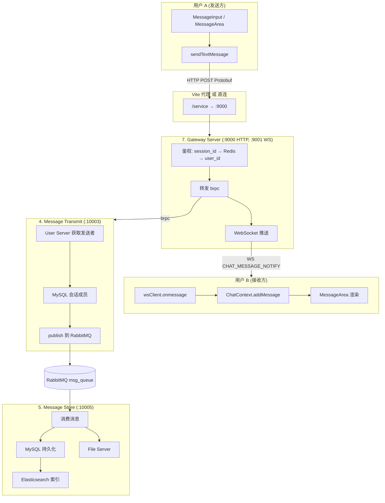
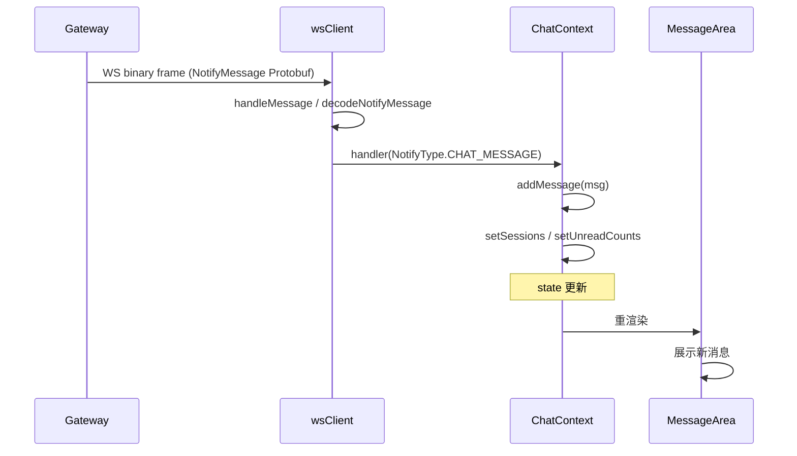
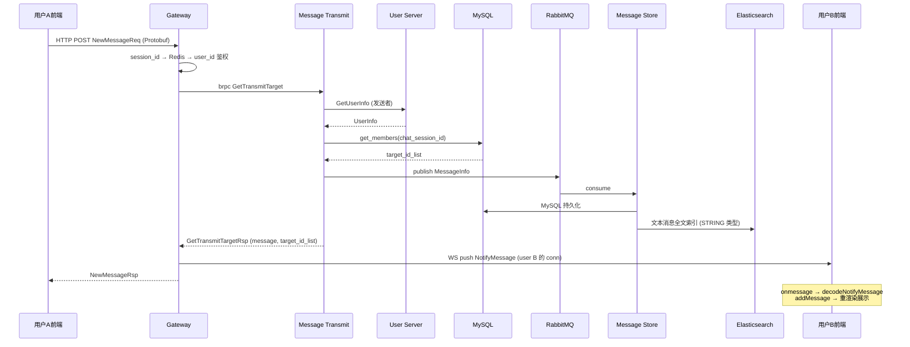

# 用户 A 与用户 B 即时通讯 —— 消息流转详解

本文档基于当前 `ChatSystem-Backend` 与 `ChatSystem-Frontend-React` 代码库，描述一条即时消息从**用户 A 发送**到**用户 B 收到**的完整流转过程。

---

## 一、整体架构概览



---

## 二、阶段一：用户 A 前端发送消息

### 2.1 用户操作入口

1. **MessageInputAntd.jsx**  
   用户输入文字并点击发送 → `handleSubmit` → 调用 `onSend(text)` 或 `onAgentMention(...)`。

2. **MessageArea.jsx**  
   接收 `onSend` 的 `handleSendMessage(content)`：
   - 构造本地乐观更新消息 `localMessage`（含 `_pending: true`）
   - 调用 `addMessage()` 立即在 UI 中展示
   - 调用 `sendTextMessage(sessionId, userId, chatSessionId, content)` 发往后端

### 2.2 API 层

**messageApi.js** 中 `sendTextMessage`：

```javascript
return httpPostWithSession(API.NEW_MESSAGE, {
    chat_session_id: chatSessionId,
    message: {
        message_type: MessageType.STRING,
        string_message: { content },
    },
}, sessionId, userId);
```

- `API.NEW_MESSAGE` = `/service/message_transmit/new_message`
- `httpPostWithSession` 会把 `session_id`、`user_id` 一并加入请求体

### 2.3 HTTP 请求编码与发送

**httpClient.js**：

- 根据 `path` 选择 Protobuf 编码器：`encodeNewMessageReq`
- 请求体序列化为 Protobuf，`Content-Type: application/x-protobuf`
- URL：
  - **开发模式**：`/service/...`，由 Vite 代理到 `http://127.0.0.1:9000`
  - **生产模式**：`http://{host}:9000/service/...`

**NewMessageReq 结构**（来自 `message_transmit.proto`）：

```
request_id, user_id, session_id, chat_session_id, message (MessageContent)
```

---

## 三、阶段二：Gateway 接收与鉴权

### 3.1 HTTP 路由

**gateway_server.hpp** 注册：

```cpp
_http_server.Post(NEW_MESSAGE, ...);  // NEW_MESSAGE = "/service/message_transmit/new_message"
```

请求到达后由 `GatewayServer::NewMessage` 处理。

### 3.2 鉴权

1. 解析 `NewMessageReq`（Protobuf）
2. 从 `session_id` 查 `_redis_session->get_uid(ssid)` 得到 `user_id`
3. 若不存在 → 返回错误（如“获取登录会话关联用户信息失败”）
4. 成功则将 `req.set_user_id(*uid)`，完成身份绑定

### 3.3 转发到 Message Transmit Service

1. 通过 etcd 服务发现获取 `_message_transmit_service_name` 的一个实例
2. 使用 brpc 调用：`stub.GetTransmitTarget(&cntl, &req, &target_rsp, nullptr)`
3. 同步等待 RPC 返回

---

## 四、阶段三：Message Transmit Server 业务处理

### 4.1 获取发送者信息（User Server）

- 调用 User Server 的 `GetUserInfo`，根据 `user_id` 获取 `UserInfo`（昵称、头像等）
- 用于构造最终发送给接收方的 `MessageInfo.sender`

### 4.2 构造 MessageInfo

- `message_id`：`generate_uuid()`
- `chat_session_id`、`timestamp`、`sender`、`message`（来自请求）组装成 `MessageInfo`

### 4.3 获取转发目标列表（MySQL）

- 使用 `ChatSessionMemeberTable::get_members(chat_session_id)`
- 查询 `chat_session_member` 表，返回该会话下**所有成员** `user_id` 列表（含发送者 A）

### 4.4 发布到 RabbitMQ

- 将 `MessageInfo` 序列化后 `publish_message` 到 `msg_exchange` / `msg_queue`
- 供 Message Store Server 异步消费并持久化

### 4.5 返回 GetTransmitTargetRsp

- `success = true`
- `message`：完整 `MessageInfo`
- `target_id_list`：会话所有成员 ID 列表（含 A 和 B）

---

## 五、阶段四：Gateway 实时推送与 HTTP 响应

### 5.1 可选：@Agent 检测

若 `message_type == STRING`，对 `content` 做正则匹配 `@[name]{agent-xxx}`：
- 匹配到则异步向 Agent Server 发起 webhook 请求
- 不影响普通消息的投递与推送

### 5.2 WebSocket 推送给目标用户

对 `target_id_list` 中的每个 `notify_uid`：

1. `if (notify_uid == *uid) continue;` —— 不给自己推送
2. `_connections->get_connection(notify_uid)` —— 查该用户的 WebSocket 连接
3. 构造 `NotifyMessage`：
   - `notify_type = CHAT_MESSAGE_NOTIFY`
   - `new_message_info.message_info` = 完整消息
4. `conn->send(notify.SerializeAsString(), binary)` —— 二进制 Protobuf 推送

**WebSocket 连接与用户映射**：

- 客户端建立 WS 后发送 `ClientAuthenticationReq`（含 `session_id`）
- Gateway 根据 `session_id` 查 Redis 得到 `user_id`，调用 `_connections->insert(conn, uid, ssid)`
- 之后可通过 `user_id` 找到对应 WebSocket 连接

### 5.3 HTTP 响应

- 返回 `NewMessageRsp`（`success`, `errmsg`, `request_id`）给用户 A 的 HTTP 请求

---

## 六、阶段五：Message Store Server 持久化（异步）

### 6.1 消费 RabbitMQ

- Message Store Server 订阅 `msg_queue`
- 收到消息后触发 `when_get_an_message` 回调

### 6.2 解析与按类型处理

- 反序列化为 `MessageInfo`
- 根据 `message_type`：
  - **STRING**：提取 `content`
  - **IMAGE / FILE / SPEECH**：调用 File Server 上传，得到 `file_id` 等

### 6.3 MySQL 写入

- 构造 ODB 实体 `Message`，调用 `_write_to_mysql_with_retry`
- 写入 `message` 表（`message_id`, `chat_session_id`, `user_id`, `message_type`, `create_time` 等）

### 6.4 Elasticsearch 索引

- 仅 **STRING** 类型写入 ES，用于搜索
- 失败时写入 ES 同步队列，异步重试

---

## 七、阶段六：用户 B 客户端收消息完整流程

用户 B 的收消息链路与用户 A 的发送链路在** Gateway WebSocket 推送**处交汇。下面分步说明用户 B 客户端如何从建立连接到在界面看到消息。

### 7.1 前置：用户 B 的 WebSocket 连接建立

| 步骤 | 组件 | 说明 |
|------|------|------|
| 1 | AuthContext | 用户 B 登录成功或恢复会话后，得到 `sessionId` |
| 2 | AuthContext | 调用 `wsClient.connect(sessionId)` |
| 3 | wsClient.js | `new WebSocket(getWebSocketUrl())`，连接 `ws://host/ws`（开发模式经 Vite 代理到 `ws://127.0.0.1:9001`） |
| 4 | wsClient.js | 设置 `ws.binaryType = 'arraybuffer'`，接收二进制 Protobuf |
| 5 | wsClient.js | `ws.onopen` 时调用 `sendAuth()`，发送 `ClientAuthenticationReq`（含 `session_id`） |
| 6 | Gateway | 收到第一条 WS 消息，解析 `ClientAuthenticationReq`，用 `session_id` 查 Redis 得到 `user_id` |
| 7 | Gateway | `_connections->insert(conn, user_id, session_id)`，建立「用户 B 的 WebSocket 连接 ↔ user_id」映射 |
| 8 | 用户 B 前端 | 此后 Gateway 可通过 `get_connection(user_id_B)` 找到用户 B 的连接，向其推送消息 |

**相关代码**：`AuthContext.jsx`（登录后 `wsClient.connect`）、`wsClient.js`（`connect`、`sendAuth`）、`gateway_server.hpp`（`when_websocket_get_message` → `_connections->insert`）。

### 7.2 从 Gateway 推送到用户 B 浏览器

当用户 A 发送消息后，Gateway 的 `NewMessage` 会执行：

```cpp
// 遍历 target_id_list，排除发送者 A
for (notify_uid in target_id_list) {
    if (notify_uid == user_id_A) continue;
    conn = _connections->get_connection(notify_uid);  // 获取用户 B 的 WebSocket 连接
    conn->send(NotifyMessage.SerializeAsString(), binary);
}
```

- **数据**：`NotifyMessage`，其中 `notify_type = CHAT_MESSAGE_NOTIFY (3)`，`new_message_info.message_info` 为完整的 `MessageInfo`
- **传输**：TCP WebSocket 二进制帧，从 Gateway (`:9001`) 推送到用户 B 浏览器

### 7.3 用户 B 浏览器收到 WebSocket 数据

| 步骤 | 组件 | 说明 |
|------|------|------|
| 1 | 浏览器 | WebSocket `onmessage` 触发，`event.data` 为 `ArrayBuffer`（二进制 Protobuf） |
| 2 | wsClient.js | `handleMessage(event.data)` 被调用 |
| 3 | wsClient.js | 判断 `data instanceof ArrayBuffer`，调用 `decodeNotifyMessage(data)` |
| 4 | wsClient.js | 解析出 `notify_type`、`field_6_data`（`new_message_info` 的 length-delimited 字段） |
| 5 | wsClient.js | `messageHandlers.get(notifyType)` 取出对应 handler（`NotifyType.CHAT_MESSAGE = 3`） |
| 6 | wsClient.js | 调用 `handler(message)`，即 ChatContext 注册的 `onMessage(CHAT_MESSAGE, ...)` 回调 |

**相关代码**：`wsClient.js` 中 `ws.onmessage` → `handleMessage` → `decodeNotifyMessage` → `handler(message)`。

### 7.4 ChatContext 解析消息并更新状态

ChatContext 在 `useEffect` 中注册了 `wsClient.onMessage(NotifyType.CHAT_MESSAGE, handler)`，handler 内逻辑如下：

| 步骤 | 操作 | 说明 |
|------|------|------|
| 1 | 解析 `msg` | 优先从 `data.new_message_info?.message_info` 取；若无则从 `data.field_6_data` 手动解码 Protobuf 得到 `MessageInfo` |
| 2 | `addMessage(msg.chat_session_id, msg)` | 将消息加入 `messages` 状态：`messages[chat_session_id].push(msg)` |
| 3 | 图片消息 | 若 `message_type === 1` 且有 `file_id`，调用 `fetchImage(fileId)` 异步拉取图片 |
| 4 | 更新会话列表 | `setSessions`：更新对应会话的 `prev_message`，按最新消息时间排序 |
| 5 | 未读与通知 | 若 `chat_session_id !== currentSessionId`：增加 `unreadCounts`、写入 `recentNotifications` |
| 6 | 浏览器通知 | 若当前不在该会话且已授权，调用 `new Notification(...)` 弹出系统通知 |

**相关代码**：`ChatContext.jsx` 中 `wsClient.onMessage(NotifyType.CHAT_MESSAGE, ...)` 的回调函数。

### 7.5 用户 B 在界面上看到消息

| 步骤 | 组件 | 说明 |
|------|------|------|
| 1 | MessageArea | 通过 `useChat()` 获取 `messages`、`currentSession` |
| 2 | MessageArea | 当前会话的消息列表：`messages[currentSession.chat_session_id]` |
| 3 | React 渲染 | `addMessage` 更新了 `messages` 状态 → ChatContext 触发重渲染 → MessageArea 拿到最新列表 |
| 4 | MessageArea | 遍历消息列表，根据 `message_type` 渲染文本、图片、文件等；`sender.user_id` 判断左右对齐（自己/他人） |
| 5 | 用户 B | 在聊天窗口看到用户 A 发来的新消息 |

**相关代码**：`MessageArea.jsx` 使用 `messages` 渲染消息气泡；`ChatContext.jsx` 提供 `messages`、`addMessage` 等。

### 7.6 用户 B 收消息流程简要时序



### 7.7 用户 B 离线时的行为

- 若用户 B 未建立 WebSocket 连接（未登录或连接断开）：`_connections->get_connection(user_id_B)` 返回空，Gateway 不会推送，消息不会实时到达
- 用户 B 再次登录后，可通过「拉取最近消息」接口（`get_recent`）从 Message Store 获取历史消息，实现离线消息补偿

---

## 八、中间件与数据流汇总

| 组件 | 角色 |
|------|------|
| **Redis (Session)** | session_id → user_id 鉴权 |
| **Redis (Status)** | 用户在线状态，WS 断开时清理 |
| **etcd** | 服务发现，Gateway 获取 Message Transmit / User 等实例 |
| **MySQL** | 会话成员、消息持久化 |
| **RabbitMQ** | 消息 Transmit → Store 的可靠异步传递 |
| **Elasticsearch** | 文本消息全文索引与检索 |
| **File Server** | 图片、文件、语音二进制存储 |

---

## 九、时序简图



---

## 十、CHAT_MESSAGE_NOTIFY 说明

### 10.1 是什么

`CHAT_MESSAGE_NOTIFY` 是 WebSocket 通知类型枚举值，数值为 **3**，表示「新聊天消息」通知。Gateway 在收到用户 A 发来的消息并处理完成后，通过 WebSocket 向会话内其他在线用户（如用户 B）推送该通知，携带完整 `MessageInfo`。

### 10.2 定义位置

| 位置 | 定义 |
|------|------|
| **Proto（后端）** | `ChatSystem-Backend/APIs/notify.proto` |
| **Proto（前端）** | `ChatSystem-Frontend-React/src/proto/notify.proto` |

```protobuf
enum NotifyType {
    FRIEND_ADD_APPLY_NOTIFY = 0;
    FRIEND_ADD_PROCESS_NOTIFY = 1;
    CHAT_SESSION_CREATE_NOTIFY = 2;
    CHAT_MESSAGE_NOTIFY = 3;   // 新聊天消息
    FRIEND_REMOVE_NOTIFY = 4;
}
```

前端业务层使用数值常量（因 React 未使用 protobuf 生成代码）：

```javascript
// ChatContext.jsx
const NotifyType = {
    FRIEND_ADD_APPLY: 0,
    FRIEND_ADD_PROCESS: 1,
    CHAT_SESSION_CREATE: 2,
    CHAT_MESSAGE: 3,   // 对应 CHAT_MESSAGE_NOTIFY
    FRIEND_REMOVE: 4,
};
```

### 10.3 发送逻辑

**文件**：`ChatSystem-Backend/7.Gateway_Server/source/gateway_server.hpp`，`NewMessage` 中：

```cpp
for (int i = 0; i < target_rsp.target_id_list_size(); i++) {
    std::string notify_uid = target_rsp.target_id_list(i);
    if (notify_uid == *uid) continue;
    auto conn = _connections->get_connection(notify_uid);
    if (!conn) continue;
    NotifyMessage notify;
    notify.set_notify_type(NotifyType::CHAT_MESSAGE_NOTIFY);
    auto msg_info = notify.mutable_new_message_info();
    msg_info->mutable_message_info()->CopyFrom(target_rsp.message());
    conn->send(notify.SerializeAsString(), websocketpp::frame::opcode::value::binary);
}
```

### 10.4 接收逻辑

| 步骤 | 文件 | 逻辑 |
|------|------|------|
| 1 | `wsClient.js` | `ws.onmessage` → `handleMessage(event.data)`，`data` 为 `ArrayBuffer` |
| 2 | `wsClient.js` | `decodeNotifyMessage(buffer)` 手动解析 Protobuf：取 `field 2` 得 `notify_type`，取 `field 6` 得 `field_6_data`（`NotifyNewMessage` 的 length-delimited 数据） |
| 3 | `wsClient.js` | `messageHandlers.get(notifyType)` 取 handler，`handler(message)` |
| 4 | `ChatContext.jsx` | `wsClient.onMessage(NotifyType.CHAT_MESSAGE, handler)` 注册的 handler 被调用 |
| 5 | `ChatContext.jsx` | 从 `data.new_message_info?.message_info` 或 `data.field_6_data` 解析出 `MessageInfo`，调用 `decodeMessageInfo`（`httpClient.js`） |
| 6 | `ChatContext.jsx` | `addMessage(msg.chat_session_id, msg)` 更新状态，触发 MessageArea 重渲染 |

### 10.5 约定的通信格式

**传输层**：WebSocket 二进制帧（`opcode = binary`）

**载荷**：Protobuf 序列化的 `NotifyMessage`：

```protobuf
message NotifyMessage {
    string notify_event_id = 1;
    NotifyType notify_type = 2;   // 此处为 3 (CHAT_MESSAGE_NOTIFY)
    oneof notify_remarks {
        NotifyNewMessage new_message_info = 6;  // 仅此项有值
        // ... 其他 oneof 成员
    }
}

message NotifyNewMessage {
    MessageInfo message_info = 1;
}

message MessageInfo {
    string message_id = 1;
    string chat_session_id = 2;
    int64 timestamp = 3;
    UserInfo sender = 4;
    MessageContent message = 5;
}
```

**Protobuf 编码对应关系**（前端 `decodeNotifyMessage` 依据）：

- `field 2`（wire type 0）：`notify_type` = 3
- `field 6`（wire type 2，length-delimited）：`NotifyNewMessage`，内部 `field 1` 为 `MessageInfo`

`MessageInfo` 的详细结构见 `APIs/base.proto`。

---

## 十一、相关文件索引

| 模块 | 路径 |
|------|------|
| 用户 A 发送 | `ChatSystem-Frontend-React/src/components/MessageArea.jsx`, `messageApi.js` |
| 用户 B 收消息 | `ChatSystem-Frontend-React/src/contexts/ChatContext.jsx`, `api/wsClient.js` |
| 用户 B 连接建立 | `ChatSystem-Frontend-React/src/contexts/AuthContext.jsx`（登录后 `wsClient.connect`） |
| 消息展示 | `ChatSystem-Frontend-React/src/components/MessageArea.jsx`（读取 `messages` 渲染） |
| HTTP/Protobuf | `ChatSystem-Frontend-React/src/api/httpClient.js` |
| Gateway 新消息与 WS 推送 | `ChatSystem-Backend/7.Gateway_Server/source/gateway_server.hpp` (NewMessage, Connection) |
| 消息转发 | `ChatSystem-Backend/4.Message_Transmit_Server/source/message_transmit_server.hpp` |
| 消息存储 | `ChatSystem-Backend/5.Message_Store_Server/source/message_store_server.hpp` |
| Proto | `APIs/message_transmit.proto`, `APIs/notify.proto`, `base.proto` |
